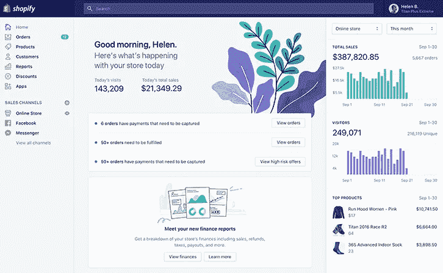
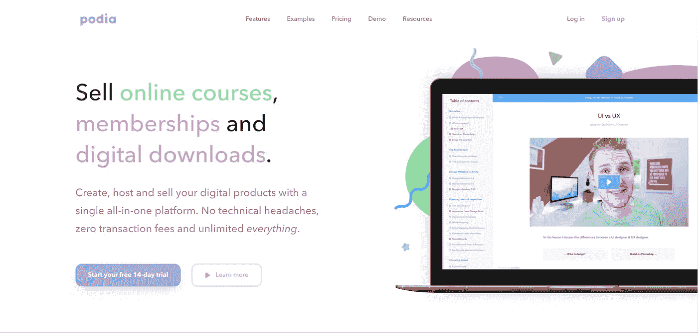

# 2018 年作为全栈营销人不可或缺的 60 个营销工具

> 原文：<https://medium.com/swlh/60-marketing-tools-i-cant-live-without-as-a-full-stack-marketer-in-2018-e4ae995001b8>

## 根据 HubSpot 的入境状态报告，26%的团队表示他们最大的营销挑战是为他们的需求找到合适的工具。

我很惊讶这个数字没有更高。

作为一名**的连续自由职业者**，我与许多不同的团队合作过(并经历了许多不同的营销堆栈)，我必须说，大多数人要么在错误的用例中使用工具，只是一起拼凑东西，和/或对营销工具领域一无所知。

我明白为什么会这样。

每个用例都有一百万种工具，所以你怎么知道哪一种才是最好的呢？你不可能停下来，放下来，测试每一个工具。

那很费时间。

另一个问题是你不知道该相信谁的评论，因为很多有影响力的人(尤其是“评论”网站，如 Capterra 和 G2Crowd)会推荐一个工具，甚至没有使用过它，只是为了获得代销费或广告收入。

好消息是:我的网站上没有广告，我使用过很多不同的营销工具，所以我在这里帮助你更容易地做出营销工具的决定——希望如此。

在这篇文章中，我将列出所有我喜欢、需要和热爱的营销工具，作为一个全栈营销人员，并详细说明我在每一个背后的推理。

# 内容管理系统

如果你不用写代码就能在仪表板上编辑你的网站，那么你就是在用 CMS 来管理你的网站。

CMS 在特性、功能、易用性、价格等方面有很大的不同。

我在 Wix 做了我的第一个网站。我测试过 SquareSpace。我经历了 Weebly，Joomla 和 Drupal。

毫无疑问，在 CMS 类别中有一个确定的赢家，并且我不是唯一这样认为的人…

# WordPress.org

了解我的人都知道我极其 [**亲 WordPress**](/@laurenholliday_/squarespace-or-wordpress-heres-the-definitive-answer-quiz-included-4e09ec208e36) 。

我喜欢 WordPress，因为它将网站——你最大的外向营销资产——交给了你的营销人员，他们应该首先管理你的网站。

> *(如果你需要说服力，* [*阅读 TechCrunch*](https://techcrunch.com/2016/05/05/the-most-common-marketing-mistake-startups-make/) *)上这篇引人注目的文章*

WordPress 不仅非常用户友好，而且可以无限定制，并且有一个庞大的支持社区。

需要 WordPress 帮助吗？像网络天才一样，加入成千上万个松散群组中的一个；访问数以百万计的 WordPress 博客或官方法典；和/或雇佣各种自由职业市场上数百万专家中的一个。

WordPress 也是一个开源项目，这意味着它不会被企业集团收购而消失。

今天，它为所有网站的近 32%提供支持，它的市场份额超过了所有其他内容管理系统的总和(T2 为 59%。

这些不仅仅是自我托管的妈妈博客。使用 WordPress 的知名网站有很多，比如 TechCrunch、纽约时报、碧昂斯、石英、彭博、迪士尼和 Target——仅举几个例子。

最后但同样重要的是，当你[雇佣合适的设计师](http://laurenholliday.com/website-design)时，WordPress 网站看起来也是非凡的。

# WordPress 主机

如果你拥有一个网站，那么你需要网站托管，这需要月费或年费。根据您选择的提供商，费用可能会有很大差异。

在过去的七年里，我使用/测试了:

*   GoDaddy
*   蓝色主机
*   宿主
*   媒体模板
*   WP 引擎
*   飞轮

获胜者是谁？

[GoDaddy](http://godaddy.com/) 和 [MediaTemple](http://mdtm.pl/1VH873a) 。

## GoDaddy 管理 WordPress 主机

如果你刚刚起步，没有很多流量或大预算，我强烈推荐 [GoDaddy 的托管 WordPress 托管](https://www.godaddy.com/hosting/wordpress-hosting?isc=gdbb2228f)。

原因如下:

*   全天候支持(聊天和电话)
*   非常实惠
*   非常容易安装和设置
*   简单、用户友好的仪表板

我在刚入门的时候用过 GoDaddy，有过非凡的体验。

我记得在开始的时候，我的网站崩溃过几次，每次，一个讲英语的，超级好的支持代表很快就解决了我当时遇到的任何问题。

虽然我今天仍然使用它们来购买我的域名，但我不再使用它们来托管，因为我想要一个更大的托管计划。

## 媒体模板

输入 [MediaTemple](http://mdtm.pl/1VH873a) 。

我现在已经使用 MediaTemple 两年左右了，我非常高兴。原因如下:

*   非凡、简单、轻松的支持(聊天、电话)
*   价值/价格(我以 60 美元/月的价格获得了 10 次现场安装)
*   用户友好的后端

## 我不喜欢的

我不喜欢 WP 引擎，因为后端是一个集群他妈的，它的客户支持不符合我的期望，这两个导致我偏头痛，因此，暴躁。

我确实认为你可以通过 WP 引擎获得一个免费的 SSL 证书，这可以为你节省 80-100 美元的年费，但我宁愿为 SSL 付费，也不愿在 reg 上处理它的仪表板。它也有点贵。

飞轮似乎是一个非常小的团队，当我使用它时，它的支持非常糟糕。(如你所见，支持对我来说非常重要，因为你需要支持，相信我)。

至于 host gator——别让我开始。我讨厌它的原因太多了——其中两个是:支持几个星期都没有回应，而且用户界面很糟糕，令人困惑。

最后，Bluehost 对我来说是不可记忆的。

> **另一个资源:**我上个月第一次体验了 Kinsta，它的页面速度给我留下了深刻的印象，但它的价格较高，我不知道它的后端是什么样的。支持看起来不错，但是我自己没有直接使用的经验。

# WordPress 主题

我强烈推荐为你的网站购买一个[高级主题](https://themeforest.net/?ref=Lauren2802)。

一个好的主题会让你的网站看起来更精致、更专业，也能让营销人员对其进行更新，而不用每次想改变什么就雇佣开发人员。

选择一个好的 WordPress 主题是压倒性的，也是困难的，因为有太多的选择，你不知道后台会是什么样子，直到你买了它。

我每次建网站都用同样的四个主题。

## 木星

[Artbees 的木星主题](https://themeforest.net/item/jupiter-multipurpose-responsive-theme/5177775?ref=Lauren2802)是我快速设计漂亮网站的法宝。

聪明的做法是找到一个你喜欢的主题，并坚持下去，因为每个主题都有一点学习曲线。所以如果你每次都使用相同的主题，你每次都会变得更快。

我喜欢木星是因为:

*   它获得了惊人的支持。
*   它允许我创建所有不同类型的视觉上吸引人的网站。
*   很好用。
*   不断更新。
*   它很有名，意味着它不会消失。

你可以花 59 美元在森林上购买木星。

## JNews

对于博客，我喜欢三个不同的主题，其中之一是 JNews。

JNews 适用于更多的企业型博客，尽管我确信你可以对它进行定制，使其看起来不那么企业化。

我发现主题很容易学习，但我不确定支持是什么样的，因为当我为客户使用这个主题时，我不需要它。

你可以花 49 美元在 Themeforest 上购买 JNews。

## 15 锌

15Zine 是一个时髦的博客主题。我刚刚用它建立了这个网站。我以前也用它来写博客。

主题作者很棒——对张贴在他的 Themeforest 页面上的问题和评论非常敏感。

我不喜欢这个主题的一点是，我发现自己需要做大量的自定义 CSS 来使它看起来像我想要的那样。

你可以花 59 美元在主题森林 **上** [**购买 15 份杂志。**](https://themeforest.net/item/15zine-hd-magazine-newspaper-wordpress-theme/10802918?ref=Lauren2802)

## 车库

Garage 是另一个很酷，很容易使用的博客主题，我很确定它是由 15Zine 的同一个作者写的。

我发现 Garage 更容易使用，更具可定制性，无需使用大量自定义 CSS，这很好。这个主题有更多的特点。

你可以花 59 美元在 Themeforest 上购买车库。

## 主题森林

主题森林不是一个主题，但它是寻找主题的最佳市场。如果你不喜欢我上面的建议，或者需要不同类型的主题，可以看看主题森林。

# WordPress 插件

WordPress 插件为你的网站增加功能。有几个我经常用的钉钉插件。他们来了。

## Yoast SEO

Yoast SEO 是一个免费插件，它在每个页面/帖子的后端添加一个部分，在那里您可以添加元标题、元描述、自定义 slug 和用于 SEO 目的的焦点关键字。

这个插件是免费的。

## 简易目录

Easy 目录是一个免费的，定期更新的 WordPress 插件，它为长博客文章添加了一个简单的目录。

虽然不是最具视觉吸引力的，但它绝对是我为此目的使用的最实用的插件。您可以定制它，使它看起来比开箱即用时更漂亮。

## 添加这个

我用 [AddThis](http://www.addthis.com/) 给我的博客添加浮动的社交分享按钮。

这个插件也很聪明，因为它显示了与每个访问者最相关的社交媒体网站，而不是向每个访问者显示相同的按钮。

这个插件是免费的…不管怎样，这个特性是免费的。

## 转换加号

[Convert 加](https://www.convertplug.com/plus/)是最好的弹出插件。它允许你添加漂亮的自定义 CTA 到你的页眉、页脚、内嵌以及页面/文章底部的幻灯片。

它不再是每月一次的费用，而是一次性的 24 美元。你不能打败它！

## WP 外部链接

这个免费插件强制所有外部链接在新标签中打开，而不需要你为每个链接手动打开。非常好的博客功能！

## 免费实验

这个免费插件允许你测试博客文章的多个标题。

## 代码峡谷

Codecanyon 是 Themeforest 的姐妹网站。这是高级插件市场。

# 电子商务网站

## 购物化

对于那些希望建立电子商务网站的人，我强烈推荐 **Shopify** ，因为它是这个领域的领导者，它整合了一切。

例如，如果你想开一家**直运**店，你可以一键整合 **Oberlo** 。

Oberlo 为你提供了大量的产品，你可以从阿里巴巴发货，因为它与你的商店相连，你永远不必更新库存。

Shopify 的一个小缺点是它的月费，但无论如何你都必须支付托管费。

## 网络商务

如果你只是做一个代销商网站，我会用 WooCommerce，这是我为这个正在玩的代销店所做的。

# 支付网关

## 种类

感觉[条纹](https://stripe.com/)不需要介绍。

# 在线课程/会员网站

## 指挥台

Podia 是迄今为止创建在线课程或会员网站的最佳软件。

它有最好的界面，最好的支持和最好的价格。

# 登录页面

如果你正在使用 WordPress 和 Jupiter，就像我上面推荐的，那么你可能不需要登陆页面软件。

这是因为您可以在 Jupiter 中创建一个登录页面模板，并在每次想要创建新的登录页面时使用它。

## 前导页

如果你没有使用 Jupiter，或者很难用你当前的网站制作登陆页面，我强烈推荐 [LeadPages](https://www.leadpages.net/) 。

到目前为止，LeadPages 是最容易用来创建好看的登录页面的工具。

它也有一个强大的模板库和一个学院，在那里你可以学到你需要知道的关于构建高转化率登录页面的一切。

# 分析学

## 谷歌分析

[Google Analytics](https://analytics.google.com/analytics/web/) 是免费的网站跟踪软件，我想在这一点上每个人都很熟悉。

## 热罐

[Hotjar](https://www.hotjar.com/r/r2bae) 允许你在你的网站上记录网站访问者的体验；向特定帖子和页面添加调查和投票；并查看热图。

# 个性化

## 右消息

我还没有亲自使用过 RightMessage，但是这个由 Brennan Dunn 开发的软件无疑激起了我的兴趣。

它允许您根据不同受众的位置、推荐来源、行为等，轻松个性化您的网站。

# 社交媒体管理

## 缓冲器

我尝试了很多不同的社交媒体管理工具——从 CoSchedule、Sprout Social 到 Hootsuite——我总是发现自己回到了 [Buffer](https://buffer.com/) 。

你就是无法击败 Buffer 的价格和它的易用性。我唯一的抱怨是，我通常不能从 Buffer 中安排脸书的帖子，因为 Buffer 通常会弄乱它的外观。

我觉得这个领域的其他工具试图做的太多了，这使得它们的界面很笨拙。

# 脸书广告

## AdEspresso

[AdEspresso](https://adespresso.com/) 简化了脸书的广告制作流程，允许你上传所有图片并复制一次版本，然后 A/B 测试所有不同的版本。

随着活动的进行，它会根据最受目标受众欢迎的标题、文字描述和图片进行自动优化。

# 油管（国外视频网站）

## 管道伙伴

TubeBuddy 是一个浏览器扩展，为 YouTube 增加了额外的功能。你可以进行关键词研究，查看其他视频和频道的统计数据等等。

# 营销自动化/电子邮件营销

## 充满

[滴滴](https://mbsy.co/92NH9)是我邮件营销/营销自动化的№1 选择，如果你能负担得起的话。

我认为电子邮件营销应该是个性化的，一对一的信息传递，而滴滴正是这么做的。

每次发送邮件时，您可以标记您的订户，然后基于这些标记创建一个新的“列表”，而不是创建列表。

我也喜欢它对纯文本邮件的关注，我认为纯文本邮件的转化率更高，因为它们看起来像普通邮件，而不是 HTML 邮件。

## Mailchimp

[Mailchimp](http://eepurl.com/p463b) 是我在 2011 年发送我的第一个广告以来使用的电子邮件营销软件。

自 2011 年以来，它已经走过了漫长的道路。

现在，我可以创建自动回复序列和 A/B 测试主题行。

对我来说，这是最容易使用的电子邮件营销软件，也是最便宜的。

## 讽刺时事的滑稽剧

Revue 非常适合发送“编辑简讯”或策划简讯。

安装镀铬加长件。保存一周的文章。然后将这些链接拖到你的电子邮件中，每周发送你的列表。

你甚至可以向用户收取会员费或赞助费。

# 内容营销研究

# 关键词研究

## 蚊子

[Moz](https://moz.com/) 非常适合关键词研究。

输入一个关键字，就会弹出:

*   关键词建议
*   SERP 分析
*   给定关键字的搜索量
*   给定关键字的排序难度

虽然不便宜！

## 关键词无处不在

[Keywords Everywhere](https://keywordseverywhere.com/) 是一个免费的 Chrome 扩展，它会告诉你你谷歌搜索的任何关键词的搜索量，它还会在你搜索页面的右边栏给你关键词建议以及它们的搜索量。

## Ahrefs

[Ahrefs](https://ahrefs.com/) 比 Moz 更健壮，这很好，如果你在寻找 Moz 所不能提供的更多特性的话。

# 内容研究

## Buzzsumo

Buzzsumo 非常适合寻找好的内容创意以及你所在领域的影响者。本指南由布莱恩·迪恩帮助你使用它。

# 外展服务；扩大服务范围

## Yesware

Yesware 是我最喜欢的电子邮件跟踪软件。每月只需 15 美元，包括模板(固定信息)和 CRM(高级功能)。

## Reply.io

[Reply.io](https://reply.io/) 非常适合大规模外联。当我在为一个奖学金页面做一个大的链接建设活动时，我使用了它。

## 克里斯托知道

[Crystal Knows](https://www.crystalknows.com/) 是一个网络应用/Chrome 扩展，它非常详细地告诉你一个你不知道(或者可能不知道)的人。

它通过搜集一个人的博客帖子和在线状态来收集这个人的所有可用信息，并向你提供这个人的个性信息；你们的关系在一起工作会是什么样子；以及根据你发邮件的目的，你应该如何发邮件的模板。

## 联系方式

ContactOut 是一个免费的 Chrome 扩展，当你查看他们的 LinkedIn 个人资料时，它会告诉你他们的电子邮件。

## 清除位

Clearbit 是一个 Chrome 扩展，它也可以帮助你找到人们的电子邮件地址。您可以在您的 Gmail 帐户中使用它。

## 倾向

Streak 是一款免费的 Gmail CRM。我喜欢它，因为它就在你的收件箱里。

# 设计

## Adobe 创意云

我经常使用 Adobe Illustrator 和 Photoshop 来编辑照片和定制从 DepositPhotos 和 Creative Market 购买的矢量。

## 素描

我喜欢用 Sketch 来编辑截图和其他简单的任务。超级好用。

## 坎瓦

Canva 是一个免费的，超级易用的设计工具。

# 库存照片/矢量

## 沉积照片

[DepositPhotos](http://depositphotos.com/?ref=4043653) 类似于 Shutterstock，但我认为它更便宜——这是我使用它的原因之一。你通常也可以偶尔赶上大宗交易。

## 创意市场

我喜欢从[创意市集](https://creativemarket.com/?u=hollaur)购买酷炫的背景和定制图标。

## 不溅

Unsplash 是一个免费的、漂亮的、免版税的图片资源。

# 实体模型

## UI8

[UI8](https://ui8.net/) 非常适合草图、PSD 模型和线框等。

## 草图应用程序源

[Sketch App Sources](https://www.sketchappsources.com/) 提供免费的实体模型、线框、ui 等。素描用的。是 UI8 的姐妹站。

# 品牌宣传

## 99 设计

每次我需要一个标志的时候，我都会使用 99 种设计，只有一次例外(因为我的朋友托尼给我做了一个)。

只要 299 美元就能买到一个你保证会喜欢或者不会付钱的商标。你会从不同的设计师那里得到大约 30 个选项，他们会编辑它直到你满意为止。

# 客户支持

# 闲谈

## 斯拉斯克

[slask](https://get.slaask.com/)是我选择的客户支持工具，因为它集成了 Slack。

# 知识库

## Elev.io

[Elev.io](https://elev.io/) 是知识库软件。我喜欢它，因为我认为它有很好的 UX，并生活在你的网站有用的地方。

# 打电话

## 空中呼叫

[Aircall](https://aircall.io/) 就像谷歌语音一样，但更专业。

# 自由软件

# 支付

## 发票生成器

这个免费工具很容易为你创建发票。

## 盆栽

你有很多自由客户需要管理吗？看看[盆景](https://www.hellobonsai.com/invite?fp_ref=lauren61)。这是迄今为止管理您所有提案、报价、合同、发票等的最佳方式。客户甚至可以支付你的发票以及盆景。

# 项目管理

## 特雷罗

我用 [Trello](https://trello.com/laurenholliday/recommend) 做项目管理和编辑日历，但是你可以用它做几乎任何事情。

# 沟通

## 谷歌企业应用套件

[谷歌企业应用套件](https://goo.gl/27DXW5)就是你如何用 gmail 设置你的专业电子邮件。我用它来写我的专业邮件。你还会有自己的谷歌硬盘。

以下是我免费试用的几个推荐代码:

*   AWWAHA9L9EJHLJ
*   4DLLCJ96CFQLPX

# 生产力

# 书签

## 口袋

口袋是我最喜欢的过会儿再看的应用。

# 时间管理

## 时机

[计时](https://timingapp.com/?lang=en)是另一款 Mac app。就像是改期，但更好。

## Zonebox

如果你喜欢番茄工作法，可以考虑为 Mac 用户提供这两个工具。

# 笔记

## 尤利塞斯探测器

当我不在谷歌文档中写作的时候，我就在[尤利西斯](https://ulysses.app/)中写作。对于 Mac 用户来说，这是一款非常棒的 Markdown 写作应用。

# 你使用什么工具？

在下面的评论里告诉我。=)

PS:我会继续更新这个列表，因为我使用了更多很酷的工具。

***原载于 2018 年 9 月 11 日***[***thenewandthenext.com***](http://thenewandthenext.com/marketing-tools/)***。***

## 这篇文章发表在 [The Startup](https://medium.com/swlh) 上，这是 Medium 最大的创业刊物，拥有+368，366 名读者。

## 在这里订阅接收[我们的头条新闻](http://growthsupply.com/the-startup-newsletter/)。

