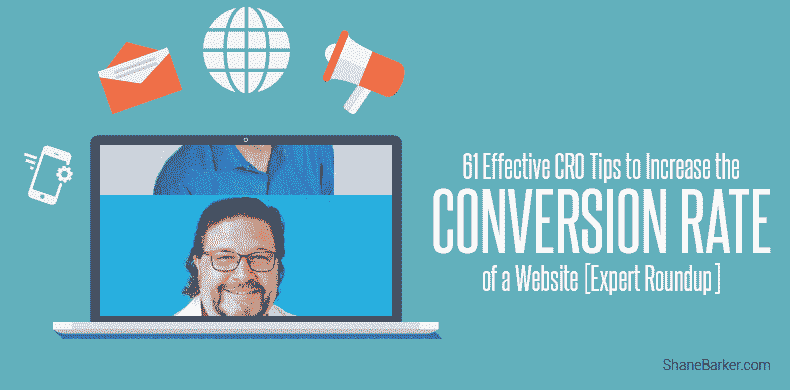

# 提高网站转化率的 61 个有效 CRO 技巧[专家综述]

> 原文：<https://medium.com/swlh/61-effective-cro-tips-to-increase-the-conversion-rate-of-a-website-expert-roundup-44409a19e2c>

如果购物者走进一家商店，看着货架上整齐排列的产品，然后一步也不停顿地走出去，这将对生意不利。

你希望顾客在货架前停下来，看看并挑选不同的产品，把它们放进购物车，然后结账。

访问者访问你的网站，离开时并没有真正接触你的网站，这对你的业务没有帮助。他们增加你的跳出率。

但是你想如何提高转化率呢？你希望来到你网站的访问者参与到你的网站中，并采取期望的行动。

你希望他们[关注你的内容](https://shanebarker.com/blog/how-to-write-content-that-people-will-love-read-and-share/)或者购买你的产品。你希望你的访客改变信仰。

精选的相关内容:

*   [发展在线业务的 7 个重要现场再定位活动创意](https://shanebarker.com/blog/onsite-retargeting-campaign-ideas/)
*   [提高电子商务销售额的 8 种最有效方法](https://shanebarker.com/blog/increase-ecommerce-sales/)

# 什么是转化？

我说的皈依是什么意思？

一般来说，当一个访问者完成了一个网站目标，这是一个转换。目标可以是微观的也可以是宏观的。

如果你销售产品，你的宏观目标将是确保游客购买。但是在访问者达到那个宏观目标之前，他还需要完成几个其他的微观目标。

# 什么是转化率优化？

CRO，转化率优化，有助于确保游客实现你的微观目标，使他们留在实现你的宏观目标的道路上。

让我告诉你更多关于 CRO 的事情。

为了降低跳出率，提高网站的转化率，营销人员使用分析和用户反馈。

转换率优化的目的是改善你的网站上的任何指标，这是有益于你的业务。它可能包括吸引新客户或增加注册、下载和销售。

CRO 将被动浏览器转化为有价值的转换，并提高转化率。

# 你为什么要关心 CRO？

CRO 对你的投资回报率很重要。你在做生意。你提供产品或服务。

以这样或那样的方式，你为你网站的流量付费。当你转化流量，当你优化这些转化，你就有更好的机会增加你的投资回报。

获得网站流量是第一步。转换流量是最后一步。这是更具成本效益的转换谁来你的网站的游客比吸引更多的游客。

转化率有助于你理解访问者的意图。它可以帮助你发现访问者在你的网站上寻找什么，这样你就可以为他们提供更好的解决方案，这也会提高转化率。

精选的相关内容:

*   [如何利用 SEO 提高转化率优化](https://shanebarker.com/blog/seo-improve-conversion-rate-optimization/)

# 提高转化率的 61 个技巧

制定和实施提高转化率的策略需要大量的数据和时间。

我们让你的工作变得更容易。我们进行了研究，阅读了案例研究，联系了 CRO 的专家，筛选了大量的数据，找到了提高转化率的最佳 CRO 技巧。

请继续阅读，探索我们的爱的劳动，61 个提高转化率的技巧。这并不容易，但是值得。

**请注意:这篇综述是按照升序编排的，而不是根据专业知识。**

# #1.[轨道媒体](https://medium.com/u/c5899a0309a0#2.<a class=)

一个高转化率的服务页面是有助于提高转化率的三件事的组合:

1.对访问者最关心的问题(他们想要什么)的回答

2.支持这些答案的证据(你希望他们拥有的)

3.清晰、具体的行动要求

将这些材料混合在一个页面上，根据需要尽可能多的空间来构建你的案例。回答每一个问题，解决每一个异议，用支持性的证据(证明、统计数据等)填满页面。)的最佳格式(图像、视频等)。)

不要忘记让行动号召与访问者的目标具体相关(联系我们不是一个令人信服的 CTA ),你已经做好了提高网站转化率的一切准备。

以下是显示所有部分如何组合在一起的细目分类:

# #5.安吉尔·鲍曼— [勒克约兰奇](https://www.luckyorange.com/)

转化率优化不仅仅是使用绿色的行动号召而不是蓝色的，或者仅仅因为互联网上的一个博主这么说就让你的登陆页面变得更短。

当然，你可以用这个建议来考虑改变你的网站，但是你必须做的不仅仅是盲目的更新。

我提高转化率的建议:测试而不是猜测。

停止单独使用传统的分析来了解访问者对你的网站的看法。监测你的转换率或其他指标不足以评估成功。

相反，将动态热图和访客记录等转换工具与 A/B 测试和传统分析结合起来，以真正衡量访客是否更关注更新，他们在哪里点击，或者在此过程中是否有任何事情让他们困惑。

精选的相关内容:

*   [你现在需要知道的 11 件事，以增加销售和潜在客户](https://shanebarker.com/blog/sales-and-lead-generation/)

例如，一个幸运的 Orange 用户在他的网站上添加了一个横幅，宣传闪购，但转化率很低。

是横幅颜色的问题，还是横幅总体上失败了？因为他查看了动态热图和访问者记录，他很快发现，由于横幅没有链接，访问者会愤怒地点击横幅，然后在什么也没有发生的情况下离开网站。

在这种情况下，修复就像链接一个横幅一样简单，几乎在一夜之间显著提高了转化率。

记住:你的网站可能看起来很棒，并且包含了所有被“证明”可以提高转化率的最新的最佳实践，但是如果你不知道访问者在你的网站上点击了(或者没有点击)什么，你的网站可能仍然很难获得这些转化率。

# #6.安娜·塔勒里科——[信标 9](http://www.beacon9.com/)

我会选择一个显而易见但被忽视的答案。随处可见的行动号召。令我惊讶的是，有这么多网站仍然隐藏着行动号召。每一页都应该有一个行动号召，导致一个简单、清晰的转化页面(概述提高转化率的原因，并提供一些有价值的东西)。

# #7.布拉德·格迪斯— [分析](https://adalysis.com/)

为你的客户定制你的广告，增加转化率。

通过受众定位、人口统计、收入、地理和其他目标层，您可以定制您的广告，以便在潜在客户与您的公司(即您的广告)进行第一次互动时，用他们自己的语言与他们交流。

这种定制可以是年龄范围不同的形容词，性别完全不同的副本，或基于以前与您的网站互动的特殊优惠。

通过为用户定制广告，你可以吸引更多的总用户，同时诱使他们在你的网站上转换，也将增加转化率。

# #8.[康弗西](https://medium.com/u/a5a6205b3df0#9.布莱恩·梅西— <a class=)

让我们看看是什么降低了商业网站的转换率，无论是潜在客户还是电子商务网站:

1.根据意见而非数据做出决策的直升机高管

2.接受过直升机管理人员设计培训的机构

3.从其他网站窃取坏主意

4.胆小的想法是由日益增长的风险厌恶推动的

5.由于缺乏投资回报数据，预算不足

没有关于按钮颜色或表单长度的提示可以解决这些问题。但是，数据可以提高转化率。

可以便宜快速地收集设计决策的数据，如文案、图像、布局和整体效果。当你有了这些数据作为安全网，你就可以勇敢地面对直升机公司的高管，并保持机构的诚实。

你可以验证一些疯狂的想法，这些想法可以从根本上改变你的品牌和声音，这些想法会因为风险太大而被抛弃。

提高网站转化率的最有效的 CRO 技巧是善于实验。

也会改善你的爱情生活，帮助你减肥。

# #10.[颠覆性广告](https://medium.com/u/e389d810a1fd#11.克里斯·戴利— <a class=)

在你开始在你的网站上测试新东西之前(例如，“嘿，让我们试着增加一个聊天功能！”)，你需要确定什么在你的网站上运行良好，以提高转化率，以及是否有什么阻碍人们转化。

我经常看到人们浪费时间在一个伟大的新想法或一个巨大的网站重新设计上，而他们甚至不知道人们在他们当前的网站上做了什么或没有很好地回应。

测试什么工作/不工作的最简单的方法之一是存在测试。在这里，您只需从您的网站中删除元素(英雄横幅、产品部分、定价、其他内容)，并查看转换率是增加还是减少。我接触过的 10 个网站中有 9 个在他们网站的每一页上都至少有一件事影响了转化率。

在你真正了解人们想要什么和不想要什么之前，不要浪费时间去尝试一个新奇的想法。

精选的相关内容:

*   [2018 年你需要知道的 37 个 CRO 工具，以增加你的影响力](https://shanebarker.com/blog/cro-tools-2018/)

# #12.[大商业](https://medium.com/u/a065dea1d7cf#13.克里斯·诺兰— <a class=)

构建移动优先，测试时承担风险，衡量一切。

# #14.[适合小型企业](https://medium.com/u/94a9838df286#15.<a class=)

锁定特定的受众，这也有助于提高转化率。

作为一家面向小企业主的数字出版物的联合创始人，FitSmallBusiness.com，我需要确保我们的读者发现我们的文章引人入胜，内容丰富，并且符合他们的需求。虽然按钮、文本颜色、广告在页面上的位置以及其他因素都很重要，但它们不是我们的核心 CRO 战略。

提高转化率的关键是确保我们网站上的任何内容直接回答特定的小型企业问题。当我们用这种策略在文章中为公司做广告时，读者更有可能点击进入该公司的网站，并转化为付费客户。

精选的相关内容:

*   [83 位专家分享 2018 年最佳电商转化率优化策略](https://shanebarker.com/blog/ecommerce-conversion-rate-optimization-expert-roundup/)

# #17.[Optmyzr](https://medium.com/u/8fb01a6ba25c#18.<a class=)

提高登陆页面转换率的最好方法是在 AdWords 等广告平台上提高针对性。除了购买更多相关关键词的老派策略之外，一种新的技术是通过受众定位选项来细分用户。

例如，使用生活事件定位在展示网络上向刚毕业、即将生孩子或刚搬进新家的人介绍你的品牌。

将市场内受众与关键词结合使用，以锁定各行业中处于最终购买考虑阶段的用户。

或者在用户访问了某些类型的网站(比如你的竞争对手的网站)并搜索了与你的产品或服务相关的关键词后，使用定制的意向受众来锁定展示网络上的用户。

通过更具体地说明你向谁展示你的广告，你会让更合格的用户访问你的登陆页面，这应该有助于提高转化率。

精选的相关内容:

*   [终极转化率优化清单](https://shanebarker.com/blog/ultimate-conversion-rate-optimization-checklist/)

# #20.加雷思·奥沙利文——[奥比斯探索者](https://orbisexplorer.com/)

有很多有效的 CRO 技巧可以帮助你提高网站的转化率。

我认为最重要的事情之一是确保你的网站是移动友好的，加载速度快。使用移动设备时，所有的小部件/表单和其他转换工具都需要正常工作。

每当我对网站进行改进时，我总是利用 GTMextrix 来检查页面速度和其他推荐的优化。

我推荐的对我自己和我管理的网站有用的其他 CRO 技巧是黄框法，优化 CTA 按钮，使它们更大，更具指导性，这样有助于提高转化率和改善网站。

# #21.贾尔斯·亚当·托马斯——[收购转化](http://acquireconvert.com/)

收集和分析定性数据，为测试提供信息。没有什么比向客户学习更好的了。投票，调查，还有很多。

我们在 7-8 年的经验中发现，最重要的 qual 数据来源是客户开发访谈。由史蒂夫·布兰克和精益创业运动推广开来。

# #22.格雷厄姆·查尔顿— [销售周期](http://blog.salecycle.com/)

找出人们在使用你的网站时遇到的问题并解决它们。减少购买过程中的摩擦会让顾客更开心，更有可能购买，并提高我们网站的转化率。

用你的数据。看看你的分析中的转化漏斗和退出点，看看什么对你的转化率有负面影响。询问您的客户——向已经放弃购买的客户发送简单的调查可以帮助您确定需要改进的地方，并且通常可以指出可以解决的关键问题。

精选的相关内容:

*   [让你惊喜的 22 个转化率优化案例](https://shanebarker.com/blog/conversion-rate-optimization-case-studies/)

# #23.[来自未来](https://medium.com/u/9e491919a845#24.<a class=)

衡量转化率有三个要素:流量产生、登陆页移动到转化、从行动到完成转化。

这些领域中的每一个都可以决定你转化产品或服务的能力，也可以降低或提高转化率。在流量生成中，它可能是你的目标受众，可能是你的创意或文案，这些都需要经过深思熟虑和测试。

在登录页面上，有许多元素，但一些基本的是 C2A 位置，社交证明，与流量生成所做的承诺保持一致…一切下至按钮的颜色和大小。

最后，转换本身需要简单。如果你制造了太多的摩擦、不确定性或混乱，你可能会失去一笔生意，降低转化率。没有一个领域比另一个更重要…这三个领域对于提高转化率都是必不可少的。

精选的相关内容:

*   [现在你需要知道的关于增长黑客的 7 件事](https://shanebarker.com/blog/growth-hacking-weekly-roundup/)

# #26.[约翰·博伊特诺](https://medium.com/u/13247b19fa3f#27.<a class=)

在我的咨询工作中，我帮助创建针对忙碌人群的内容。

我认为对网站所有者来说，重要的是要认识到，即使你有很多访问者，他们喜欢你的内容，他们最终也没有足够的时间去仔细阅读所有内容。

因此，您必须修改内容，使其对这些读者来说是最佳的。使用引人注目的图片，讲述引人入胜的故事，格式化你的内容，使其更容易浏览(项目符号列表效果很好)，在阐述观点时不要拐弯抹角。

精选的相关内容:

*   【2018 年最佳转化率优化实践之五

# #29.[信条互动](https://medium.com/u/a105ad36881b#30.<a class=)

我们提高转化率的最佳技巧是创建易于交流和理解的内容片段。

有了各种团队成员的照片和报价，潜在客户会更加自由地将对话反馈给我们，并认为在我们的第一次互动中，他们已经与我们建立了关系。

在过去的一年中，我们的集客销售线索增加了 68%。

精选的相关内容:

*   [如何优化您的内容以获得更好的转化率](https://shanebarker.com/blog/optimize-content-better-conversions/)

# #32.[整体电子邮件营销](https://medium.com/u/9d708047305e#33.<a class=)

我的第一条建议是使用电子邮件来测试你最初的假设，然后在你的网站上继续完善/改进/测试。

你的电子邮件数据库由你的目标市场组成——潜在客户、试用用户、首次用户、回头客、忠实用户和流失客户。

显然，电子邮件不能用于测试一切，即特定的旅程，如结账之旅和一些特定的布局。但它可以用来确定你的观众的动机，即利益驱动与损失厌恶；图像，即哪个布局表现更好——穿着 t 恤衫的人还是展示的 t 恤衫？…还有更多。

通过非常战略性地制定测试计划，确定可以通过电子邮件测试的内容并测试您的假设(多次)，您节省了大量时间，并可以从更好的地方开始优化您网站的因素，从而获得更好的结果，并比仅通过网站更快地提高转化率。

精选的相关内容:

*   [现在你需要知道的关于转化率优化的 9 件事](https://shanebarker.com/blog/conversion-rate-optimization-guides-weekly-roundup/)

# #35.基冈·布朗— [梅格塞斯](http://megethosdigital.com/)

有大量的案例研究表明，所有不同的页面布局，情感副本，紧迫感，页面速度等，你可以做的，以提高转化率。所以我不想重复你在每篇博文中看到的相同观点(包括我以前的一些技巧)。

在 Megethos，我们发现，基于优先级的 CRO 战略的实施极大地提高了我们客户的转化率。

任何没有战略的机构或营销人员都可能因为一个好主意而幸运一两次，但是你真的能扩大这种增长吗？

号码

因此，在考虑为你的网站启动 CRO 时，我能给出的最好建议是:

1.  分析数据
2.  再次分析数据
3.  创建一个要测试的想法列表(尝试至少 10 个)
4.  优先考虑
5.  试验
6.  措施
7.  重复

这个过程已经结束了吗？

下面是另一个可能适用的提示。由于我们在 Megethos 的大多数客户都是 SaaS 公司，我们不断遇到同样的问题。我们经常看到一个设计良好的网站已经试用了 CRO，但当用户注册了免费试用体验后，他们发现——说得好听点——它糟透了。

提高转化率的技巧:调整你的营销和产品团队，从最初访问你的网站到注册免费试用，再到真正成为客户，提供一致的体验。这不就是一切的意义吗？？

# #36.凯瑞·奥谢·戈尔戈内— [营销利润](https://www.marketingprofs.com/)

为 lead gen 提供高质量的资产，如门控视频(门控 20%左右)，购买指南等。

除非有令人信服的理由让人们成为你系统中的领导者，否则他们不会，所以你必须在提供他们的信息这一等式中进行平衡。

我在这里说的是有趣的内容，而不是虚假的内容:有价值的提示和见解、行业知识、人们做出明智选择所需的信息(无论他们最终是否选择你)…给他们商品，他们就会给你信息！

那些通过漏斗继续前进的销售线索将会得到更好的确认(因为他们更有见识)，从而带来更好的结果并提高转化率。

# #37.劳拉·彭斯·阿坦西奥— [社交达人](https://socialsavvygeek.com/)

我提前计划，创造直接表达我的理想客户的强烈愿望的精彩内容，持续跟进，跟踪一切。

如果这看起来过于简单，也许，然而，这些步骤很少被遵循，它们一起创建了一个强大的，可重复的系统。通常，当我被叫去咨询时，这些步骤中的一个或多个被忽视或完全忽略了。

围绕你的理想客户的战略规划和营销自动化的正确使用是关键。

回到基础，深入了解你的角色到底需要什么是关键的一步。当你提供一个问题的解决方案，而不是滔滔不绝地谈论你的服务的好处时，更容易获得更高的转化率。

没有人关心服务；他们想要结果。如果你没有把基本的东西处理好，就没有必要去幻想。一旦建立了基线，实现可靠的 A/B 测试和调整以最大化正确的转化率就变得容易多了。

精选的相关内容:

*   [49 位 CRO 专家提出的提高转化率的最佳转化率优化技巧](https://shanebarker.com/blog/conversion-rate-optimization-tips-expert-roundup/)

# #38.[曼迪·麦克尤恩](https://medium.com/u/b1f05c2331ff#39.<a class=)——[Mod 少女营销](http://www.modgirlmarketing.com/)

为了提高转换率，你必须在登录页面上与他们的目标客户交谈。

解决他们的具体痛点，使用他们的语言，并描述您的产品为他们的具体需求带来的好处。

我看到企业经常犯的一个错误是，他们的登录页面过于笼统，针对所有人。如果你想确保尽可能高的转换率，请与你的特定终端用户交谈，告诉他们你希望他们采取什么行动。

总结一下:

1.  围绕特定的目标市场精心制作你的内容和媒体。
2.  在整个页面中包含非常具体和吸引人的行动号召短语，确切地告诉他们你希望他们下一步做什么。

# #40.马库斯·米勒— [圆顶礼帽](https://www.bowlerhat.co.uk/)

专注于大事。

1.确保你有一个伟大的提议。

2.确保清楚地传达了报价。

3.清楚地说明你的可信度，以及你以前是如何提供这种服务的。

4.让访问者更容易采取行动。

5.确保您的网站可以在各种设备上运行——手机、平板电脑、台式机。

6.确保你的网站快如闪电。

大事情。

同样，不要专注于微小的细节。我想是“拉里·金说的，不要在泰坦尼克号上不停地移动躺椅。”把重要的事情做好，不要把时间浪费在其他事情上。

精选的相关内容:

*   [放弃购物车的 4 个原因(以及如何防止它们提高转化率)](https://shanebarker.com/blog/reasons-for-shopping-cart-abandonment-solutions/)

# #41.[大商业](https://medium.com/u/9cc3c9e6157e#42.<a class=)

尽可能消除摩擦，努力改善用户的体验。

在 Google Analytics 中查看你的行为流分析，并使用热图来查看访问者在查看特定产品或品牌后，下一步倾向于去什么产品或品牌。

大多数访问者在访问了你网站上的各种关键页面后都去了哪里？这在不同的访问者群体中有什么不同？

使用这些数据在您的网站中创建自定义路径，使人们更容易找到他们想要的内容。

例如，在客户的“X”品牌类别页面上，我包含了一个包含“Y”品牌产品的“您可能也会喜欢”部分。

我这样做是为了排名前 5 的品牌分类页面，每个页面指向不同的品牌。我这样做是因为特定品牌的访问者经常会去另一个品牌，并从他们那里购买产品，所以我想让旅程变得更容易，我们看到了收入和转化率的大幅提升。

# #44.[营销实验室](https://medium.com/u/d8e36a96fd50#45.迈克·麦克马纳斯— <a class=)

你需要告诉访问者如何在你的网站上表现。

网络访问者很容易迷路。

事实上，如果你有一个线下商店，我要说你的网站流量在你的网站上比在你的实体店损失的更多！

这是因为，在商店里，顾客可以看到其他人在做什么，并简单地复制其他人，而在网上，他们可以自行漫游，如果没有正确的指导和明确的指示，很容易进入你网站的错误页面或部分。

为了帮助提高网站的转换率，你需要首先发现访问者可能会感到困惑的地方。

需要关注和改进的领域:

1.  **按钮文字** —是否清晰，是否描述了动作？
2.  **表单文本** —文本框文本是否描述了客户应该写的内容？
3.  **下载流程** —你的说明清楚吗，你能提供一个演示吗？
4.  **订购流程** —顾客能否清楚地看到他们所处的位置，即步骤 1 和 2
5.  **联系方式** —是否醒目且易于查看/获取？

由于大多数企业主离他们的网站太近，很难发现[可能需要改进的地方](https://www.smartinsights.com/conversion-optimisation/checkout-optimisation/ecommerceconversion/)。

找到客户可能陷入困境的领域的一个非常简单和廉价的方法是雇用一群自由职业者一小时来完成一系列任务，即购买产品、查找号码或填写联系表格，这些将有助于提高网站的转换率。

确保你根据给他们的任务要求反馈，看看你的网站在哪里会失去转化率。

# #46.[零售意识](https://medium.com/u/a987be4c8bb6#47.<a class=)

清晰而简洁的沟通是吸引在线客户注意力和提高转化率的关键。

要做到这一点，请确保你在电子商务设计和布局中加入的标题足够醒目，能够吸引眼球，同时也有助于推动在线用户采取行动。本质上，你的标题——或者你使用的文案——应该以文案的形式呈现一个推销词。

你的用词应该激起你的访问者的好奇心，甚至在他们被问及问题之前潜在地回答他们的问题，或者提供有价值的见解。正确的用词可以让你的访问者产生行动，最终推动他们增加 CRO。

精选的相关内容:

*   [如何利用社交媒体提高电子商务转化率](https://shanebarker.com/blog/improve-ecommerce-conversions-social-media/)

# #49.雷切尔·彼得森——[雷切尔·彼得森](http://www.rachelpedersen.com/)

我实施的一个最好的 CRO 建议是以多种形式在我的渠道和网站上添加社交证明。我依靠 3 种主要的方法来建立对社会证据的信任。

**1。Proof** —该软件实时显示你的购买者/转换情况(并注明日期)，以表明你是一个合法的、受欢迎的产品。仅这个提示就让我在几个漏斗上的转化率翻倍了！

**2。客户/顾客对脸书的评价截图。与静态图形和文本(很容易伪造)相比，脸书的截屏让客户感觉更合法。**

**3。来自客户的评价视频**——分享他们对你的产品或服务的实际结果也能提高转化率。

# #50.罗比·理查兹——[罗比·理查兹](https://www.robbierichards.com/)

这是一个很大的话题。但是，如果让我指出几个具体的 CRO 地区，它们会是:

**1。针对移动设备进行优化。**

这是显而易见的。

超过一半的搜索发生在移动设备上，如果你不在所有移动设备上进行优化，你就失去了底线。

具体重点应放在响应布局，网站速度和整体 UX。Aberdeen Group 的一项研究发现，页面加载速度每延迟一秒，转化率就会下降 7%。从最低的挂着的水果开始。不管你的文案和 CTA 有多好，如果网站运行缓慢且难以浏览，你就是在搬起石头砸自己的脚。

**2。优先考虑社会证明。**

这是我们关注客户的另一大领域。事实上，我们构建了一个内部工具来帮助客户自动收集客户反馈。

我最近阅读了 VWO 的一项研究，研究表明，仅仅通过添加个性化的客户评价，他们就看到了高达 22%的转化率增长。

人们和他们认识、喜欢和信任的人做生意。而且，没有什么比拥有大量正面评价和推荐的企业更值得信赖了。

开始积极收集客户的评论和评价，这是一个优先事项。把它们放在任何地方。如果你是一个电子商务网站，在所有产品页面上展示它们，并在页面上做标记，以生成丰富的片段，并在 SERPs 中提高点击率。

如果你是一家本地企业，积极收集客户评价，并教育客户如何将它们留在主要网站上——谷歌商务、Yelp、脸书、律师专用网站 Avvo 等小众网站。

**3。重定目标。**

大多数访问你网站的人都希望第一次。所以，你需要确保你能把它们拿回来。这是一群热情的观众，如果你能恰当地再次吸引他们，他们更有可能购买。确保你预算的很大一部分被分配到那里。

你可以在大多数平台上重新定位，但我建议从 AdWords 和脸书开始。最简单的目标受众是访问特定产品或服务页面但没有购买的任何人。

向这些人提供更多中间漏斗内容，如 B2B 的推荐或案例研究视频(建立信任)，甚至是电子商务的折扣。

提示:建立一个目标受众群可能需要一段时间，尤其是在预算较少的情况下。因此，我建议开展一些低成本的定向脸书广告活动，以推动你的登录页面的流量，从而以较低的价格快速建立你的受众，这样将提高转化率。

# #51.[似乎是一个明显的优化，它应该这样做。我们在 2018 年！人们不会一直等着你的页面加载。这是到目前为止，我认为是(最初)最重要的元素转换和 CX。](https://medium.com/u/de4dee17150f#52.<a class=)

[【谷歌也会奖励你更大的知名度——](https://medium.com/u/de4dee17150f#52.<a class=)[速度很快就会正式成为排名因素](https://searchengineland.com/google-speed-update-page-speed-will-become-ranking-factor-mobile-search-289904)。]

你可以测试你的网站速度和分析粒度细节，[这里](https://gtmetrix.com/)。

**#2:心理学！**

这篇技巧值得写一整本书，但我将把它缩短 53，499 个字左右；心理学在商业中至关重要。“错误”的措辞会让你损失销售额。“正确”的信息可以为你赢得数千英镑。颜色、图形、时机、情感、信任以及包括定价在内的许多东西都是如此

也就是说，你知道吗，仅仅因为价格标签上使用了数字“9 ”,同样的产品标价更高，销量却更高。你可以在这里阅读更多相关内容。

**#3:测试！**

忘记你的竞争对手似乎在做什么。忽略你最好的朋友建议的可能看起来很棒的东西。将这篇综述中的所有技巧带上船，进行实验——* *同时确保你测量、分析、调整和重复！**

没有一个网站是通过事后批评和观点而成功的。只有心中有明确目标的验证和重复行动…

使用 Hotjar、Visual Website Optimizer、CrazyEgg、Optimizely 或 ClickTale 等工具在一体化中心录制和优化您的 CRO 程序。

今年，我还从 5 位受人尊敬的 SaaS 创始人那里收集了坚如磐石的转化见解，他们每天都在测试不同的方法——足以让你的销售销声匿迹的行之有效的建议！

# #54.[获得隆起](https://medium.com/u/acac0d162e6e#55.<a class=)

忘记最佳实践，它们只对博客帖子有效。如果你想创建一个高转化率的登陆页面，围绕你的受众的目标和需求来构建。

超越转化:在转化之前，在转化的过程中会发生什么？

1.他们卷了多少？

2.他们看到了多少页？

3.他们看什么文章？

4.他们去过工地多少次了？

5.他们停在哪个表单字段？

6.他们分享了什么？

关注整个顾客旅程中的行为，以便优化整体体验。

登陆你的页面的潜在客户必须能够在登陆你的页面的前 3 秒钟内理解并准确地感受到对他们有什么好处。

人们希望从理解他们的痛苦和需求的人那里购买，你的低成本定价、令人惊叹的功能或出色的产品不是他们想要的，至少不是他们想要的。

如果你想让人们停止从一个标签跳到下一个标签(从你的网站跳到你的竞争对手的网站)，向潜在客户展示你了解他们的痛苦，他们想要的结果，以及你如何帮助他们轻松解决这些问题。

理解人们真正试图解决的挑战，以及人们为什么从你这里购买，并使用正确的图片、有说服力的文案甚至色彩心理学来解决页面上的情感驱动因素。

精选的相关内容:

*   [CRO 的 3 个要素以及如何优化它们以提高转化率](https://shanebarker.com/blog/improve-conversion-rate-cro-essentials/)

# #58.[威廉·哈里斯](https://medium.com/u/5cb78a414c66#59.<a class=)——[艾鲁米恩](http://elumynt.com/)

很容易陷入“A/B 测试世界”，看数据和数字等等。但是最好的学习来源之一仍然是与你的客户和理想的联系人进行真正的对话。这也增加了转化率。

他们喜欢什么，不喜欢什么——与你的销售代理、客户服务团队交谈——他们发现他们总是必须回答什么问题，什么答案会让这些联系人恍然大悟。

真诚的对话无可替代。

***原载于***[***Shanebarker.com***](https://shanebarker.com/blog/cro-tips-to-increase-conversion-rate/)***。***

**关于作者**

谢恩·巴克是[内容解决方案](https://contentsolutions.io/)和[礼品公司](http://gifographics.co/)的创始人兼首席执行官。你可以在[推特](https://twitter.com/shane_barker)、[脸书](https://www.facebook.com/ShaneBarkerConsultant/)、 [LinkedIn](https://www.linkedin.com/in/shanebarker/) 、 [Instagram](https://www.instagram.com/shanebarker/) 上和他联系。

## 这篇文章发表在 [The Startup](https://medium.com/swlh) 上，这是 Medium 最大的创业刊物，拥有 338，320 多名读者。

## 在这里订阅接收[我们的头条新闻](http://growthsupply.com/the-startup-newsletter/)。

