# 2022 年你应该知道的 63 个最佳数字营销工具

> 原文：<https://medium.com/swlh/63-best-digital-marketing-tools-you-should-know-about-in-2018-f010a4e3db4b>

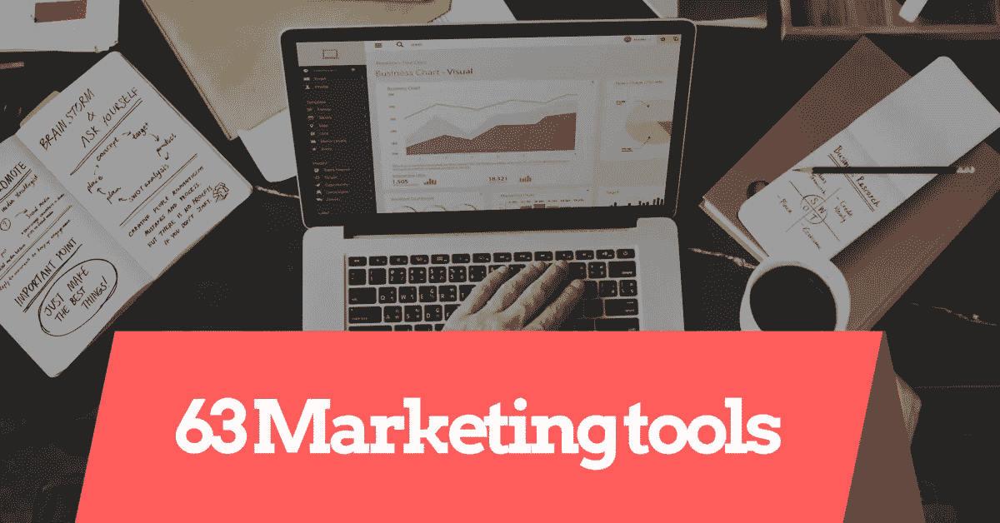

2017 年 1 月，我写了第一篇也是最长的营销文章。

[2017 年你应该掌握的 53 种数字营销工具](https://blog.markgrowth.com/53-digital-marketing-tools-you-should-master-in-2017-b0e21b698f91)

我没有任何期望，只是想向人们展示一些我用来扩展我的数字营销工作和创建教育和隐蔽人们的活动的工具。

现在回想起来，这是一个巨大的成功！

这是数字视图:将近 101，000

阅读(完整):近 10，000

掌声:1200 次

评论意见:41

关于这篇文章的电子邮件和信息:120 多封

脸书股票:451

Linkedin 股票:782

推特分享数:310

谷歌+股票:5

在谷歌“数字营销工具”一词中排名第一(目前排名第三)。感谢你们每一个花时间观看、阅读或分享的人。

我叫伊万·季米特洛夫，是一名自学成才的数字营销人员。

Me on a mountain :)

我曾在我的国家保加利亚最好的数字营销机构之一工作过——保加利亚[互动分享](http://interactive-share.com/en)——为客户服务，比如

固特异、杜蕾斯、斯米尔诺夫、绍尔、雷索纳、大众等等。

**我**还与 EnforceDigital 合作并咨询了许多项目，包括社交媒体上世界上最著名的健身模型——[**拉扎尔·安格洛夫**](https://www.facebook.com/LazarAngelovFitness/?fref=ts) 。

目前，我主要关注的是 [**pCloud**](https://www.pcloud.com/) 的数字营销，这是一个云存储平台**，在两年半的时间里从 200 万(我加入时)增长到近 800 万**。

从中获得了几个奖项。

福布斯电子进化奖，BAAWARDS，Bgsite，WebIT 等。

这并不重要，但我真的很自豪。

我和很多人一起工作，从他们身上我学到了很多，包括尼尔·帕特尔。

如果你觉得这有帮助，请与朋友分享，如果你学到了新东西，请留下“掌声”。我会超级感激的！

**以下是 2018 年你应该知道的顶级数字营销工具。**

1.  谷歌趋势
2.  谷歌关键词规划器
3.  Ahrefs
4.  AppAnnie
5.  Serpstat
6.  相似网络
7.  Buzzsumo
8.  脸书观众洞察
9.  脸书广告
10.  Google Adwords
11.  必应广告
12.  Appstore 搜索广告
13.  许多聊天
14.  按压接合
15.  Leanplum
16.  谷歌分析
17.  脸书分析公司
18.  Yandex Metrica
19.  谷歌数据工作室
20.  Webris SEO 报告工具
21.  颜色选择器
22.  谷歌分析 URL 生成器
23.  标签助手
24.  FB 像素助手
25.  谷歌标签管理器
26.  数据刮刀
27.  谷歌分析调试器
28.  口袋
29.  p 云保存
30.  自举工作室
31.  坎瓦
32.  平板包装
33.  Marvellapp
34.  冰屋
35.  Adespresso 广告
36.  Lapa .忍者
37.  贝纳奇
38.  滴水不漏
39.  不溅
40.  正车惰性滑距
41.  Buzzstream
42.  投币箱
43.  积极的活动
44.  pCloud
45.  Todoist
46.  吉拉
47.  汇合
48.  Evernote
49.  松弛的
50.  Sumo.com 博客
51.  数字营销人员
52.  Webris
53.  尼尔·帕特尔博客
54.  中等
55.  搜索引擎领域
56.  Ahrefs 博客
57.  乔恩·卢默博客
58.  Hubspot 博客
59.  内容营销学院博客
60.  缓冲博客
61.  GrooveHQ 博客
62.  MOZ 博客
63.  Adespresso 博客

希望你对此感兴趣。

***免责声明:这些不是付费评论或赞助名单。这些都是我用过喜欢的工具！***

# 数字营销研究工具

研究对任何营销活动的成功都是至关重要的。

没有适当的计划和研究，你在开始一项活动时会使你的任务变得更加困难。总是做你的研究和计划，这不仅会使你的工作更容易，而且你会在这个过程中学到更多的东西。

# [1。谷歌趋势](https://www.google.com/trends/)

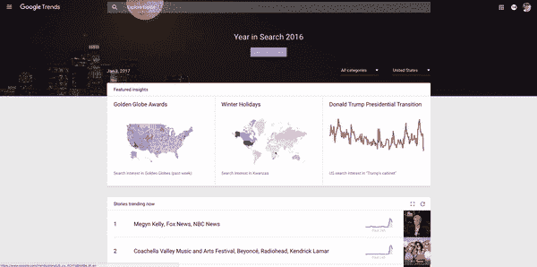

谷歌趋势让你看到最新的**趋势**、数据和来自**谷歌**的可视化，并找出你身边现在的趋势。

它可以让你很快地确认一个想法，而且非常容易使用。

只需进入网站，输入你感兴趣的关键词或行业名称，点击“回车”即可。

您还可以添加其他术语，以便比较数据。

它们还可以在地图上显示你对某个地区的兴趣，以及相关的查询

你也可以按国家、时间段、类别和包括 Youtube 搜索在内的搜索类型进行搜索。

你可能知道，Youtube 是世界上第二大搜索引擎。

因此，如果你打算创业，研究竞争对手，创建一个新的运动或只是好奇某些词谷歌趋势是一个可怕的工具，你可以使用！

# 2.谷歌关键词规划器

所以对谷歌关键词工具有两种意见，一种是喜欢它的人，另一种是讨厌它的人，认为它的数据是误导性的。

我不会告诉你我的想法，我只会告诉你如何以最好的方式使用它。

谷歌关键词工具是什么？

这是 Google Adwords 中的一个特性，我将在本文后面谈到。它位于“工具”选项卡中。

它类似于谷歌趋势，但它给你实际的数字，你可以工作。

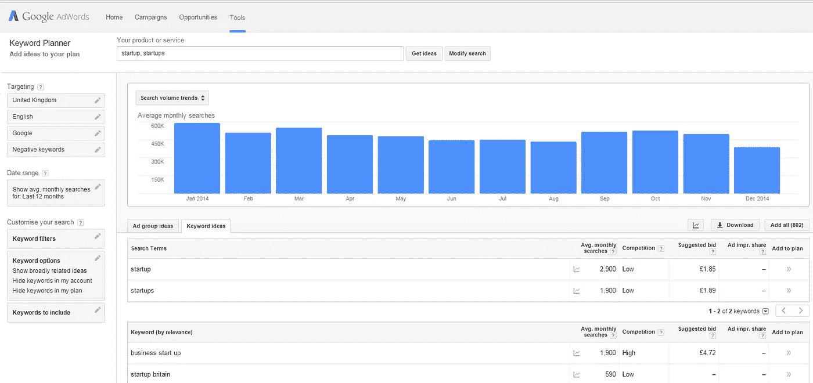

Google Keyword Planner

您可以选择一个或多个关键字，选择您想要的国家和语言，并查看您的单词大约被搜索了多少次。

你可以看到，如果竞争是“高”，“中”或“低”，以及该关键字的建议出价是多少。

我不建议只使用谷歌关键词工具来研究你的关键词，但它是一个很好的工具，首先，它可以让你对数量有所了解。

keyword 工具的一个很酷的地方是，你可以导出数据并导入到其他地方。

此外，你可以在搜索关键词的时候直接发起一个谷歌广告词活动，我也不建议你这么做。

我推荐的是你去看看，看看是否符合你的需求。

附言

[**2017**](https://trends.google.com/trends/yis/2017/GLOBAL/)热门搜索列表

# [3。Ahrefs](https://ahrefs.com/)

可能是市场上最好的 SEO 和 SEM 工具之一。

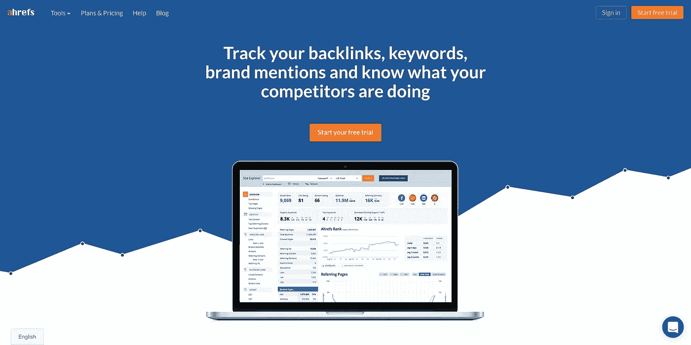

Ahrefs Home Page

为什么？

主要是因为你可以通过 Ahrefs 网站浏览器了解竞争对手的几乎所有信息。

它让你有机会了解你的竞争对手从哪里获得流量，他们在谷歌搜索中特定关键词的排名，有多少反向链接，谁链接到他们的网站等等。

例如，你可以设置“提醒”,这样每当一个网站对一个关键词进行排名或者在网上某个地方收到一个提及。

还有他们的“内容浏览器”，让你有机会在网上找到最共享的内容。

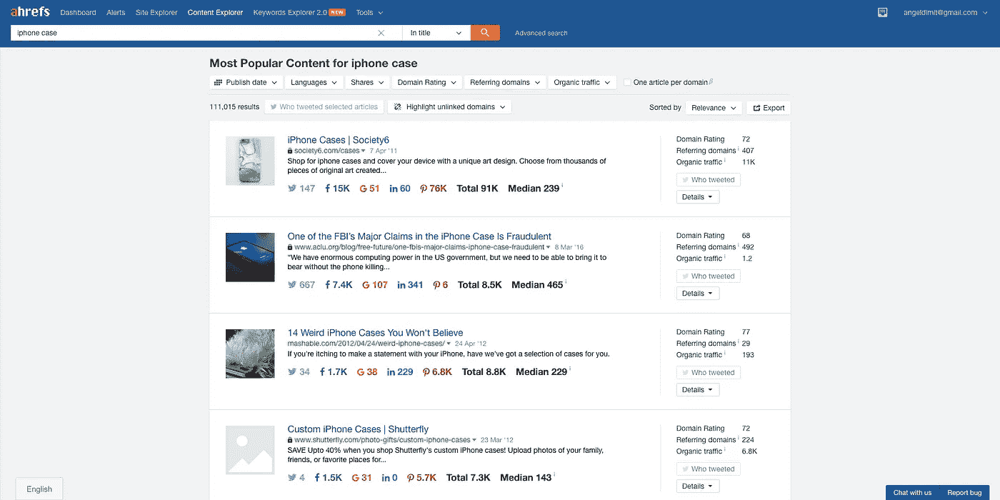

在这里可以看到关于 iPhone 保护套的分享最多的文章，共有 91k 次分享。

当然，你可以用很多方法过滤它。

另一个很棒的特性也是我最喜欢的是关键词浏览器 2.0

Ahrefs Keywords Explorer 2.0

它有一个巨大的关键词数据库，你可以研究 170 个国家的关键词。

它向你显示准确的搜索量数据，有多少搜索点击和有多少搜索没有点击。

关键字工具的另一个很棒的地方是，它向你展示了其他单词的关键字难度。特定单词的排序有多难。

它有一个排名历史图表，一个非常详细的 SERP 分析所有你需要的数据，以便制定计划和营销策略。

最后但并非最不重要的是，数以千计的关键字想法与所有你需要知道的指标，以使你的决定更容易。

因为我根据数据做决定，所以我可以说我真的很喜欢 Ahrefs 的工作方式。

这是他们最近做的一些更新。

他们提高了 AhrefsBot 的抓取速度和数据库的大小(链接和关键词)。

为了用数字证明这一点，他们推出了这个定期更新的页面[https://ahrefs.com/big-data](https://ahrefs.com/big-data)这些数字让 Ahrefs 在竞争分析(包括反向链接分析)和关键词研究方面如此出色。

此外，他们推出了一个全新的网站审计工具。他们仍在润色它，但它已经得到了一些热情的评论。不像其他工具，它不只是向你显示网站错误和搜索引擎优化问题和相关的建议。它允许您为站点审计创建自己的问题和配置。我觉得在当今 SEO 不断变化的环境下真的很棒。

他们还推出了排名跟踪功能，通过非常漂亮的图表帮助你跟踪特定关键词的表现。

# [4。App Annie](https://www.appannie.com/)

Appannie Homepage

如果你是一名应用程序开发人员或一家拥有应用程序的初创公司的营销经理，你需要 Appannie。

它是几乎所有应用商店中追踪竞争对手的最佳工具。

这里有一个你如何使用它的截图。

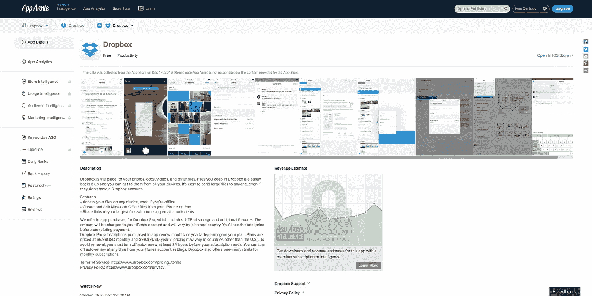

在我看来，最酷的功能是 ASO(应用搜索优化)。

它的作用是向你展示你的应用在 Google Play 和 Apple Store 中特定关键词的排名。

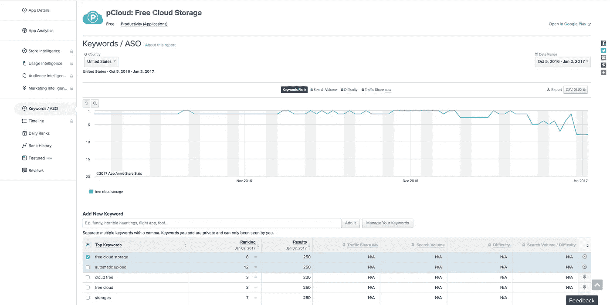

Keywords for pCloud App

在此基础上，当你上传新版本的应用程序时，你可以编辑你的标题和描述。

这是非常实时的，所以你可以在几天内测试不同的文本，看看哪种更适合你。

# [5。Serpstat](https://serpstat.com/?ref=23461)

Serpstat 也是一个令人惊叹的关键字工具，我很喜欢。

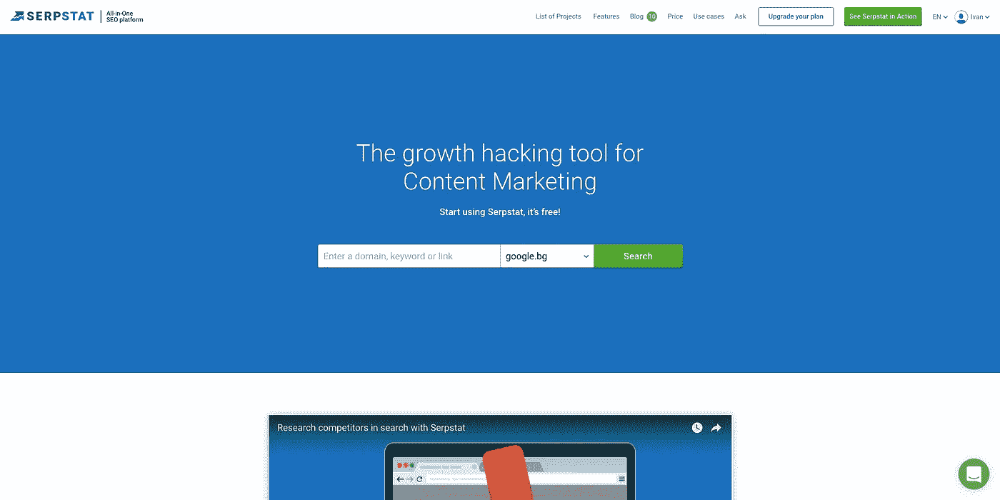

类似于 Ahrefs。我主要用它来比较数据，因为一些国家的数据比其他工具更准确。

最近，伙计们重新设计了仪表盘，现在看起来棒极了。

这是关键词追踪工具的截图

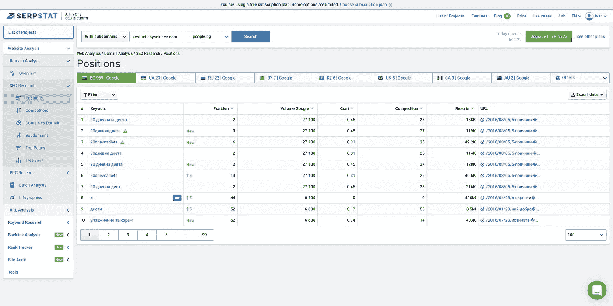

Aesthetic by science keywords tracking

你也可以跟踪竞争对手的关键词，反向链接等等。

这是一个超级容易使用，你应该检查出来。

# [6。相似网](https://www.similarweb.com/)

SimilarWeb 是我用来获得网站创意的第一个工具。

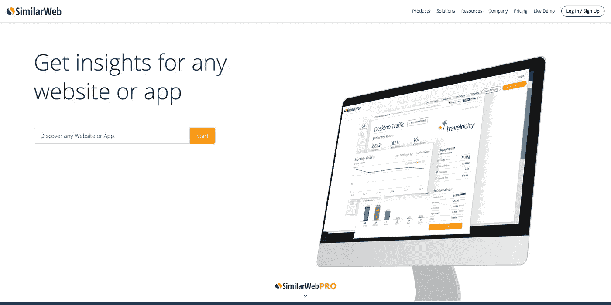

它的作用是给你一个网站的估计流量，流量的来源是什么，国家是什么，网站排名的关键词的基本概念以及其他一些很酷的东西。

我主要使用他们的 Chrome 扩展，因为正如我所说，它给了我需要的信息，让我决定是否要进一步研究。

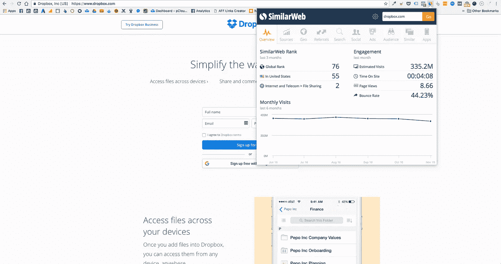

Similarweb Chrome Extension

例如，当有人联系我，提出一个评论或类似的问题时，我会打开网站，看看这个网站有什么流量，流量来自哪里。

# [7。Buzzsumo](http://buzzsumo.com/)

Buzzsumo 是一款内容发现工具。它会分析你给它的某个话题或者竞争对手，告诉你表现最好的内容。

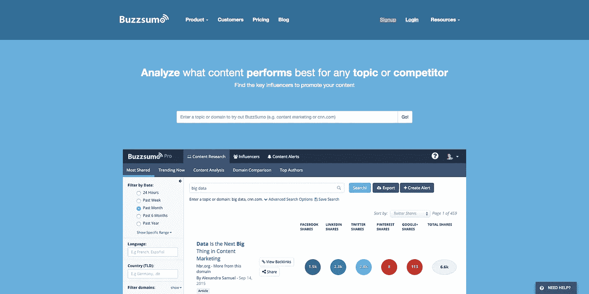

如果你有写作障碍，或者想看看什么是关于某件事的最好的帖子，只要输入它，你就会得到你的答案。

你甚至可以看到谁在 twitter 上分享了内容，并在你准备好自己的内容后联系他们。

Buzzsumo 推出了问题分析器，它可以帮助你在成千上万的论坛、亚马逊、Reddit、Quora 和问答网站上找到任何关键词最受欢迎的问题。

只需输入一个话题或品牌名称，就能立即看到真实的人在问的问题。结果会自动过滤，首先清楚地显示最常问的问题。

这样你就可以为那些搜索你的产品或者需要更多信息的人提供答案。你也可以用它来进行市场研究和发现利基。

# 8.脸书观众洞察

目前存在的最强大但被低估的工具之一。众所周知，脸书拥有有史以来最好的定向广告系统之一，因为它为我们所有人提供了大量的数据。

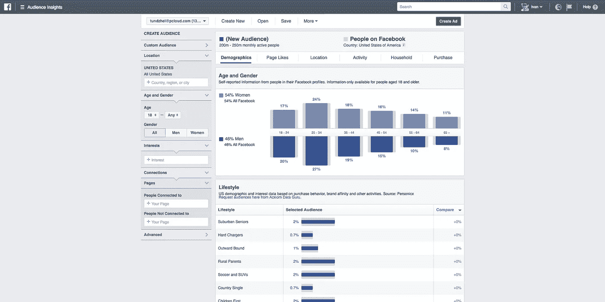

如果你学会使用这个工具，你会让你作为营销人员的工作变得容易得多。

酷的是，它非常容易使用，你不会浪费几天时间去弄清楚它是如何工作的。

它可以帮助您以最佳方式制定脸书广告活动计划。

你可以根据国家、兴趣、他们使用的设备、行为、习惯甚至生活事件来查看你能联系到多少人。

它显示了一些国家的人口统计数据，你甚至可以根据家庭收入进行搜索。

还有，你可以看看你想锁定的人还有什么其他的兴趣，以及锁定他们的最佳方式是什么。

你可以在那里为广告活动创造受众，并立即开始使用它，而不必从头再来。

# 广告平台

与大量受众分享信息的最简单快捷的方式就是广告。

今天，广告网络已经变得聪明了几千倍，有一百万种方法可以让你的信息到达正确的人手中。

这里只是最好的广告网络如何工作以及你如何使用它们的一小部分。

# [1。脸书广告](https://www.facebook.com/business/)

如你所知，脸书是世界上最大的社交网络，平均每月有 255 亿次访问，平均会话持续时间为 16 分 5 秒，每次访问估计有 14.36 个滚动。

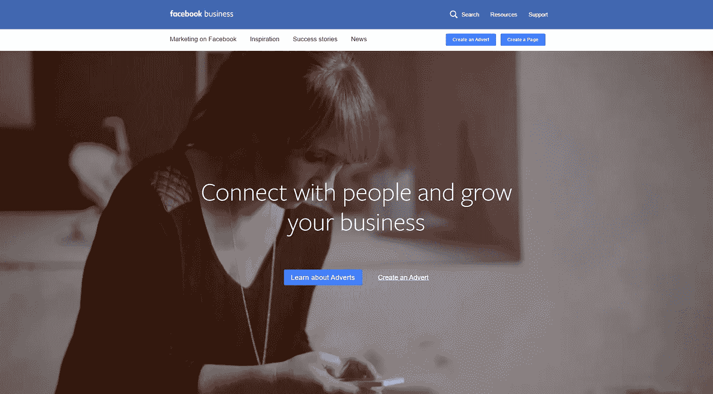

正是因为这些数字和收集数据的能力，在我看来，脸书广告是目前最强大的广告网络。因此，如果你不把它用于营销目的，你应该学会如何使用它，并立即开始使用！

根据你营销漏斗中的目标用户，你可以在脸书上投放多种类型的广告。

广告类型不言自明，但我会试着用几句话来更好地解释它们。

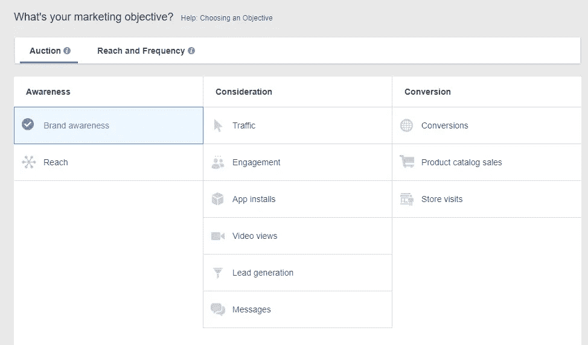

Ad Types

# 意识

*   **提高品牌认知度**——这种类型的广告适用于你想接触多少人就接触多少人，让他们了解你的品牌
*   **Reach -** 经过优化，您可以获得最大的投资回报。

# 考虑

*   **流量** —脸书营销人员最常用的广告类型之一。它所做的是，它发送流量到你的网站，默认情况下，它是针对更有可能点击你的广告的人。
*   **参与度** —这种类型的目标是为您所支付的费用获得最大的广告参与度而使用和优化的。参与度包括赞(反应)、评论、分享、点击(链接、按钮或页面名称，基本上是任何点击)和视频观看。
*   **应用安装**——如果你想让用户安装你的应用，这是你应该投放的广告类型。
*   **获得视频浏览量**——在我看来，这是最强大的广告类型之一，不仅因为脸书的视频呈爆炸式增长，而且你可以根据人们观看某个视频的时长来创造观众群！这很棒，因为你可以根据人们如何与你的内容互动来创造惊人的自动化渠道！
*   为企业收集线索——另一种被企业低估的超级强大的广告类型。你可以看到登录页面的转换率有很多可变因素，其中之一就是页面的速度。有了这种类型的脸书广告，你甚至不用用户离开就可以直接在脸书上收集线索。当然，大多数情况下，用户必须得到一些回报，所以你可以把他发送到脸书的感谢页面。当你有了他的电子邮件后，你可以通过集成一些最大的电子邮件 CRM 来使用它，或者只是下载它，然后想怎么用就怎么用。当然没有垃圾邮件！
*   **寄语—** 2017 年是向企业引入聊天机器人的一年。脸书真的在努力成为这方面的先锋，到目前为止，他们取得了成功。这种类型的广告鼓励人们向你的企业发送信息。有了 Facebook Messenger SDK，你就可以创建一个机器人，根据用户给你发的消息向用户显示内容。例如，你可以给他们某种折扣，给他们展示一系列产品，给他们播放一段视频等等。如果你没有聊天机器人，你必须自己和用户聊天。对于许多广告商来说，这已经被证明是一种非常有利可图的广告类型。

# 转换

*   **增加你网站的转化率(主要是销售额)**——这是我最喜欢的广告类型。为了让它正常工作，你需要正确设置你的脸书像素。这意味着你必须把它放在你网站的每一页上，并根据用户的行为报告不同的事件

例如，如果用户正在您的网站上查看产品，您必须发送 ViewContent 事件。

如果他在购物车中，您必须发送 AddtoCart 事件。

购买事件中您必须记录的最重要的事件。您必须在您的感谢页面上记录购买包含的所有参数。

这里有一个[链接](https://developers.facebook.com/docs/ads-for-websites/pixel-events/v2.11)与每个事件及其所有参数。把它交给你的开发者。

这一点非常重要，因为正如我所说，脸书拥有我们每个人的海量数据，基于这些事件，它可以创建一个完美买家的档案，这样你就可以获得最佳的广告投资回报率。此外，你可以创建与你的完美买家相似的人的列表，这些人被称为长相相似的观众。

*   **推销产品目录** —这类广告主要面向拥有大型商店的人。这是一个基本上动态的再销售广告。这些类型的广告对营销人员来说是最有利可图的，因为它们向用户展示了他正在看的确切产品。有了这些类型的广告，你可以向用户展示，现在只有对他来说，这个产品有折扣，大多数时候他会购买。动态广告增加点击率，降低每次购买的成本！现在，您可以通过添加颜色和折扣来创建定制的产品目录广告。

脸书广告最好的地方是像素

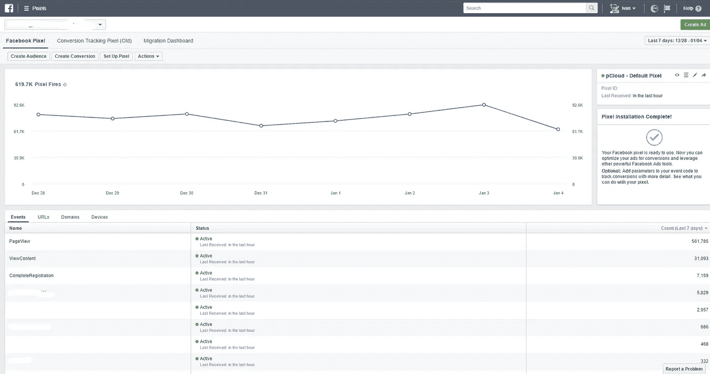

pixel 是一段代码，可以帮助你追踪用户在你的网站上做了什么。

在此基础上，你可以为他们制作个性化的广告。

但这还不是全部。

脸书非常善于锁定目标，它能让你创造出与你所追踪的人相似的受众。他们被称为**“长相相似的观众”。**

你可以为已经在你的网站或应用上转化的人创造这种受众。

在此基础上，脸书创建了一个个人资料，并帮助你展示你的广告给那些有可能改变信仰的人。

为了实现这一点，脸书需要收集信息，这样它就不会马上发生。

另一件事是，你必须以某种方式放置跟踪像素，以便它可以在用户转换之前跟踪他的确切步骤。

**这在一些网站上可能有点难，但迄今为止，这是给我带来最高广告投资回报率的东西。**

# [2。Google Adwords](https://adwords.google.com/home/#?modal_active=none)

根据 statista.com[的数据](https://www.statista.com/)，仅在 2015 年，谷歌 Adwords 就为谷歌创造了 673.9 亿美元的收入

**这是有史以来使用最多、最复杂的广告平台之一。**

最近它得到了重新设计。有些人喜欢它，有些人讨厌它。

事实是，在功能方面没有太大的变化。

因此，如果你是一名营销人员，你肯定需要学习如何使用它。至少是最基本的，因为人们仅仅因为做 Google Adwords 而被雇佣并不是巧合。

它的能力是巨大的，你需要相当多的时间来学习它能做的所有事情。

我推荐 [**谷歌合作伙伴认证项目**](https://www.google.com/partners/about/index.html)

Google Adwords 非常重要，因为你可以使用许多通过 Adsense 连接到 Google 的渠道，并进入 Google 搜索。

没有什么能打败谷歌搜索。你有能力立刻向人们展示他们正在寻找的东西。当用户看到关于他实际搜索的东西的广告时，转化率会高得多。

我相信每个人都看到了这一点

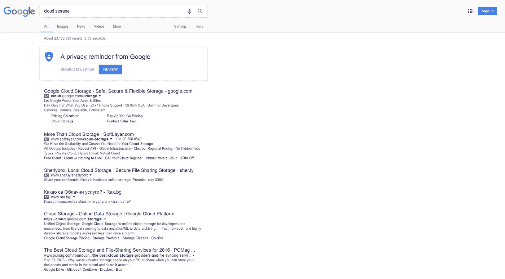

Google Ads Screenshot

这张截图是在 1920x1080 的显示器上拍摄的，你可以看到页面搜索结果中 70%的可见部分是广告。

有了 Google Adwords，你就可以去那里了。这很重要，因为接下来你会看到这张图。36%的美国人通过搜索引擎搜索过该商品。

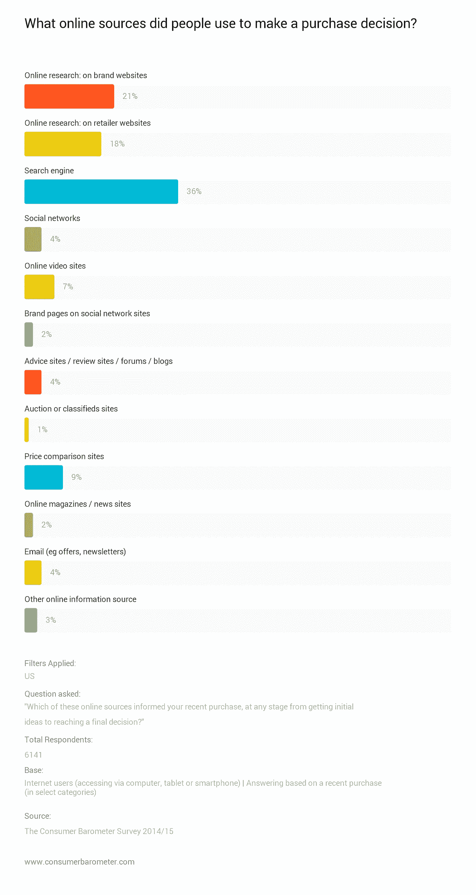

搜索广告现在更长了。

2016 年，谷歌开始在 Q2 测试扩展文本广告。

扩展文本广告比旧文本广告大两倍。新广告旨在通过更大的标题和超长的描述，最大化你在移动搜索结果中的存在和表现。(本着移动优先的思想，任何在移动设备上有效的东西都将被应用到桌面上。)

扩展文本广告将显示在所有设备上，包括桌面和移动设备，并将根据设备大小自动换行。

现在总共有 140 个字符的广告文案空间可供使用，标志着旧的 25-35-35 限制的结束。

Image: Wordstream

截至目前，所有广告商都可以使用扩展文本广告。谷歌宣布**将于 2017 年 1 月 31 日逐步淘汰旧的标准广告形式。**您必须在该日期之前将所有广告转换为 ETA 格式。

此外，你在网站上看到的大多数横幅广告都是通过 Google AdSense 提供的。使用 Google Adwords，您可以在使用 Google AdSense 的网站上做广告。你可以用非常不同的方式瞄准他们。

**关键词**-这意味着你可以锁定那些与你想要的关键词相匹配的网站或应用，或者在它们的内容中包含特定关键词的网站或应用。例如，我想针对正在做 Wordpress 主题评论的网站中的文章。然后我会选择只在网站内容中“最佳 Wordpress 主题”的地方显示我的广告

**主题**-在这里你可以针对特定主题的网站。例如，你可以瞄准那些经常写 SEO 和联盟营销的网站

**兴趣&再营销**——这种定位方式意味着你可以根据人们可能对谷歌感兴趣的内容来定位他们。酷的是，这里你有几个选择。你可以选择“亲和受众”——基于长期兴趣的大量目标人群，“市场内受众”——接触积极搜索和比较像你一样的产品的人，“再营销”——目标人群是已经与你的网站或应用程序互动的人，“客户电子邮件列表”——你可以在 Gmail 中向那些向你提供了 Gmail 电子邮件地址的人显示广告。

Adwords 还开始自动创建与你的转售名单相似的人员名单。因此，如果你有一个客户的再销售名单，Adwords 将自动创建一个具有类似档案和意向的人的名单，这样你就可以找到更多的新客户。

**位置** —选择这个你可以锁定访问特定网站的人。假设你销售 Macbook Pro 配件，并且知道你的潜在客户阅读 Macworld.com。您可以告诉 Adwords 仅在此网站上显示广告。为了更好地确定目标，您可以组合目标首选项。这意味着我可以向阅读 Macworld.com 和包含关键词“Macbook Pro 配件”的文章的人展示广告。

**人口统计**——当然，你也可以根据人口统计资料来锁定目标人群。

现在有**通用应用安装广告**没有优化选项。基本上，你给谷歌你的预算和你的应用程序安装的最高出价，他们决定在哪里和如何显示它来实现你的目标。

当然，这只是 Google Adwords 能做的很小一部分，就像我说的。

在我看来，对于一个现代营销人员来说，了解它是如何运作的是至关重要的。

# [3。必应广告](https://secure.azure.bingads.microsoft.com/Login.aspx)

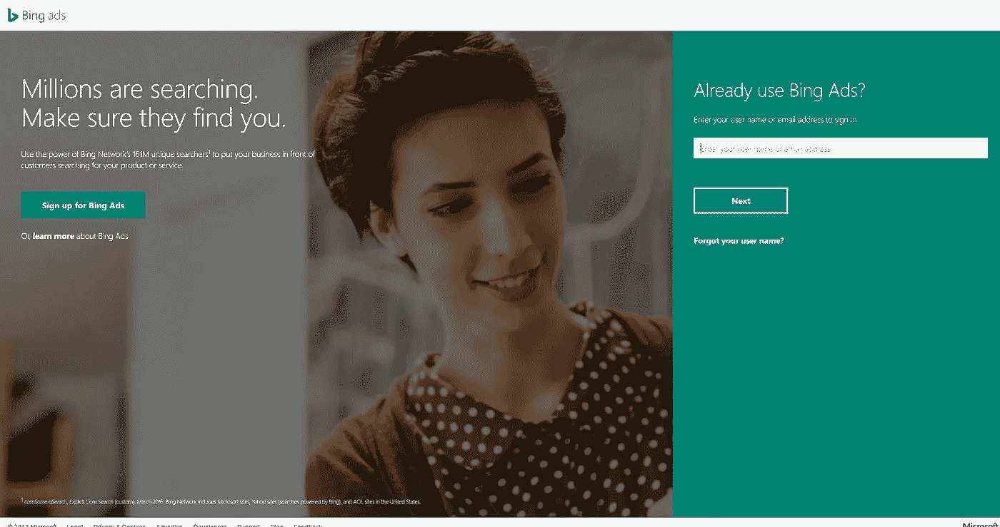

Bing 广告类似于 Google Adwords，在我看来是一个被极度低估和利用不足的广告渠道。我看到了巨大的成果。

# **4。Appstore 搜索广告**

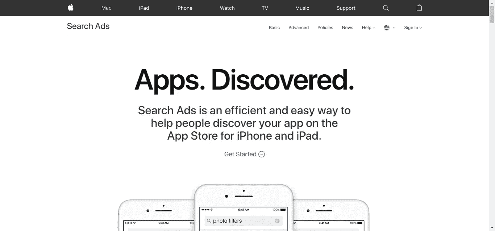

我得到的最便宜的应用安装是来自苹果应用商店的搜索广告。

目前功能非常有限，但我用不到 1 美元就能获得非常有针对性的应用安装，所以我没什么可抱怨的。

基本上他们如何工作就像谷歌广告词，但他们的应用商店。

你输入你想让你的广告出现的关键词，设定预算，就这样。

目前，你可以用来优化广告的选项并不多，但我认为它们会随后出现。

最酷的是，到目前为止几乎没有人使用它，所以市场根本没有饱和。

# 即时消息营销

许多专家认为数字营销的未来。

从今年开始，脸书开始通过其信使平台 SDK 推动真正的硬消息营销。并非所有事情都发生在 messenger 中，浏览器通知和推送通知与前几年相比有了巨大的飞跃。在这个帖子里，我将向你展示我在这两个部门所做的尝试以及它们是如何为我工作的。

# [**1。many chat**](https://manychat.com/)

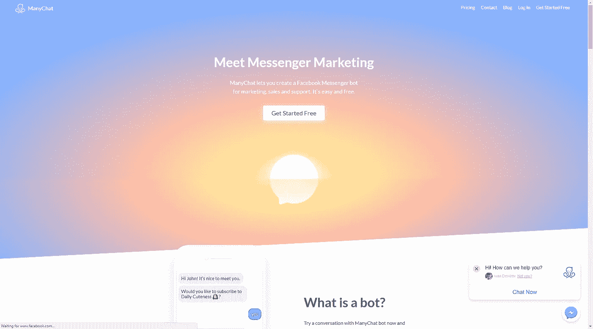

每天都有很多聊天机器人建设者出来。可能有比这更好的，但这是我第一次开始使用，到目前为止，我喜欢它。

ManyChat 允许您创建一个 Facebook Messenger bot，用于营销、销售和支持。这很容易而且免费。

首先，让我们从什么是机器人开始？

聊天机器人是使用人工智能模仿与人对话的计算机程序。它们可以将你与互联网互动的方式从一系列自发的任务转变为一种准对话。

我喜欢 Manychat 主要是因为它非常容易使用。他们有一个可视化的拖放生成器，让设置 Facebook Messenger bot 变得简单而有趣。无需编程——只需将你的脸书页面连接到 ManyChat，你马上就能上线。

有很多方法可以让你的聊天机器人“订阅”。

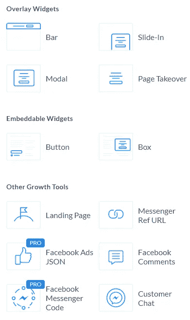

Manychat Growth Tools

*   栏—显示在网站顶部的选择加入栏。
*   滑入—从屏幕边缘滑入视图的选择性加入窗口。
*   模态—出现在屏幕中央的弹出窗口。
*   页面接管——覆盖整个网站。
*   按钮—基本的小部件类型，可以放在网站上的任何地方，甚至可以嵌入到第三方小部件中。
*   框—一个选择框，可以嵌入到您网站的任何地方。
*   登陆页面——由 ManyChat 托管的登陆页面。非常适合没有自己网站的情况。
*   Messenger 参考 URL —带有参考代码的 URL，用于在 Messenger 中打开您的 bot 页面。当您想要跟踪流量来源或为不同的受众创建单独的欢迎流程时，这非常有用。
*   脸书广告 JSON——脸书广告 JSON 允许你将点击 Facebook Messenger 广告的用户转化为机器人用户。
*   脸书评论——脸书评论增长工具允许你将评论特定帖子的用户转化为机器人用户。
*   信使代码-信使代码可以被扫描，立即链接用户到你的机器人，不需要打字。它们非常适合贴在传单、广告或现实世界中任何你想让人们尝试你的机器人的地方。
*   客户聊天—在您的网站上嵌入脸书客户聊天，直接通过 Messenger 支持和吸引访问者。

**到目前为止，在我的实验中，我的大多数信息都有 80%的打开率。**谁在邮件中获得 80%的打开率。很少人和更少的营销人员。

我最喜欢 Manychat 的一点是自动化

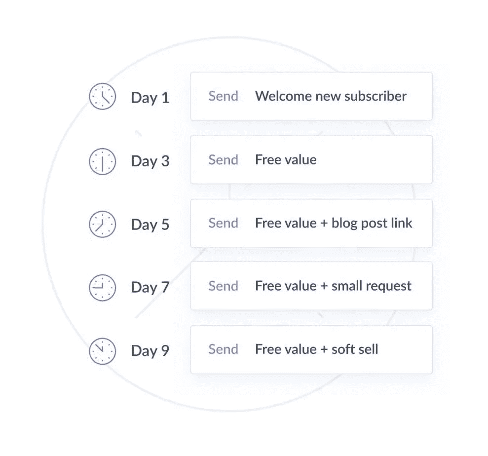

基本上，它就像电子邮件自动化，但即时消息更有利于与客户互动和留住客户。

如果您还没有开始使用某种消息传递自动化，我强烈建议您尽快使用。

# [2。按压接合](https://www.pushengage.com/)

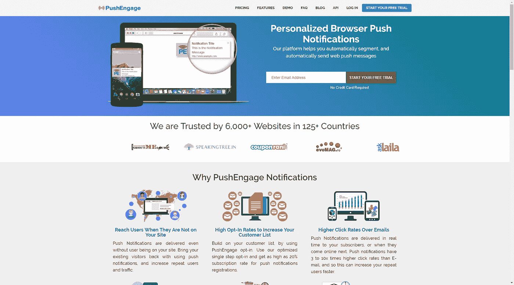

这是我用过的第一个也是唯一一个浏览器通知服务。(不再使用它，因为随着订阅者和我们发送的通知量的增加，我们最好建立自己的网站。)

如果你不熟悉浏览器通知，这里有一个简短的解释。

网络推送通知是来自网站的消息。即使相关网页没有在浏览器中打开，您也可以在桌面或设备上看到它们。他们是一个全新的/新生的营销渠道，在不知道你的访客的电子邮件或其他联系方式的情况下重新吸引他们。

当然，为了收到这些通知，人们必须选择接收它们。营销人员已经找到了一种方法，通过提供免费赠品、电子书和折扣代码来尽可能简单地做到这一点。

Pushengage 很容易实现，也很容易使用。

我们在使用它的时候取得了很好的效果。对于我们发送的第一批通知，我们的点击率高达 60%(虽然有所下降，但始终在 20%左右，与展示和脸书再营销活动相比，这已经很不错了)。

如果你还没有使用浏览器通知，我鼓励你开始使用它们，即使在大多数领域你已经迟到了一会儿，它们仍然会给出很好的结果。

# [3。Leanplum](https://www.leanplum.com/)

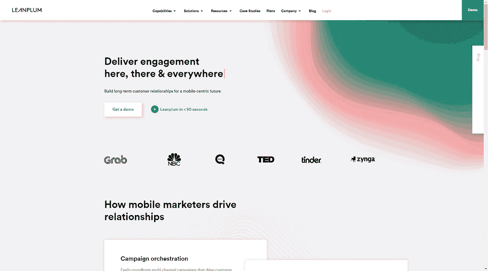

移动设备是一种独特的个人媒体，它改变了客户的旅程。手机的普及性和接近性使其成为营销人员理解和预测客户行为的有力工具。因此，营销人员现在有机会通过定制化的体验来响应用户的需求、目标、感受和期望——无论是在移动应用内外。

Leanplum 的新营销活动编辑器帮助营销人员绘制每个接触点的客户旅程，并在个人层面构建行为驱动的多渠道营销活动。现在，您可以通过涵盖推送通知、应用内消息、电子邮件、网络推送、应用收件箱和应用内体验的活动来响应行为触发。这是业内首个也是唯一一个支持端到端用户体验的解决方案，有助于加深客户关系。

从确定最佳受众规模到正确的渠道选择，营销人员在活动创建的每一步都会收到即时的指导和反馈。Campaign Composer 使营销人员能够主动了解其营销活动的未来影响，并对其进行优化以获得最高参与度。简而言之，这消除了活动创建中的猜测，并提高了营销资金的投资回报率。

# 分析和报告工具

一个人要想长期成功，就必须学会如何分析。

可以跟踪和优化成功的活动或错误。

这里有一些最好的分析工具。

# [1。谷歌分析](https://www.google.com/analytics/#?modal_active=none)

关于有多少网站使用谷歌分析，有许多数据来源。

在 2015 年[的一篇文章中，Marketing land](http://marketingland.com/as-google-analytics-turns-10-we-ask-how-many-websites-use-it-151892) 称有 3000 万到 5000 万网站使用谷歌分析。

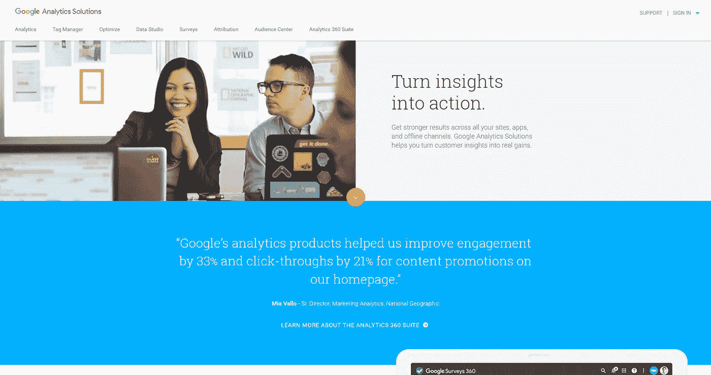

其他数据来源如 [W3Techs](https://w3techs.com/technologies/overview/traffic_analysis/all) 称，54.9%的网站使用谷歌分析，这是一个 83.5%的流量分析工具市场份额。

不管有多少网站使用它，它都是世界上最受欢迎的分析工具之一，如果你是数字营销人员、增长黑客、营销经理甚至是首席执行官，你必须学会如何使用它。

有了谷歌分析，你可以跟踪用户的一切，甚至他们使用的屏幕分辨率。

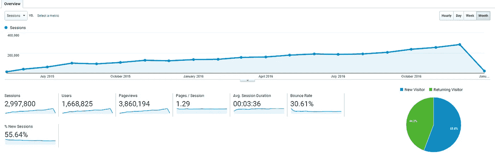

您可以创建各种报告，从而了解更多关于使用您服务的人的信息。

他们来自哪里，哪个渠道提供了最多的线索、销售、下载等。

你甚至可以用新的谷歌优化平台进行 A/B 测试。这非常简单，而且它与谷歌分析集成，所以你可以马上看到你的结果，并采取基于数据的最佳决策。

非常重要的一点是，保持测试至少 7-14 天，不要在 2-3 天后停止。这样，谷歌分析将帮助你以最好的方式和更准确的。

如果你知道如何使用它，它是非常强大的，如果你投入更多的时间去理解它，你就能赢。

这里有一个[谷歌分析学院](https://analyticsacademy.withgoogle.com/)的链接

# [2。脸书分析](https://analytics.facebook.com/)

脸书最近正朝着整合一个营销平台的方向发展。

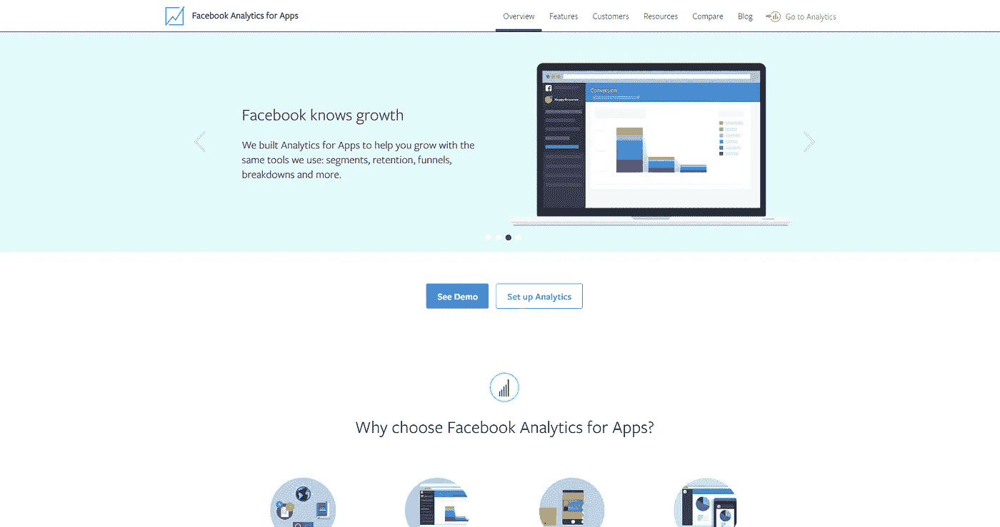

Facebook Analytics for Apps Homepage

脸书应用分析软件最近刚刚结束测试，它是目前最强大的应用分析工具之一。

我为什么这么说？

在这个平台上，你可以了解关于用户的任何信息。

这是迄今为止最准确的人口统计细分之一。

这还不是全部。如果你不知道脸书应用程序有很多权限，你授予当你安装它。

但是，当您按照他们的要求进行设置时，它的真正威力才会显现出来。

有事件。

你可以看到，通过脸书应用分析，你可以跟踪用户在你的应用中采取的具体行动，并创建一个针对他们的细分市场。

是的。

您可以根据特定事件向人们展示广告。

例如，你可以向没有完成你的游戏等级的人展示个性化广告，或者给那些离订阅你的服务只有一步之遥的人打折。

此外，你可以为这些细分市场创造相似的受众，但是当我们使用脸书广告工具时，我会谈到为什么这是惊人的。

最后还有“ [**推战役**](https://developers.facebook.com/docs/analytics/push-campaigns) ”。

推送活动功能是脸书应用分析软件开发工具包的一部分，它让您有机会向您的用户发送推送通知，完全免费！

**推送通知**有两种类型

*   **应用内通知** —当用户在你的应用中时弹出的屏幕
*   **推送通知** —用户不使用您的应用程序时的通知

最好的部分是，你可以在活动中使用推送活动，而不是为广告付费，你可以免费获得用户。

2017 年的另一件很酷的事情是，脸书分析不再只是关于应用程序。

你可以用它作为你的脸书像素。

通过这种方式，你可以深入了解访问你网站的人的脸书资料，以及成为潜在客户和顾客的人。这是一个很大的进步，因为你可以真正了解谁是你的客户，也可以了解如何更精确地锁定他们。

就像这里的应用程序分析一样，你也可以基于特定的动作创建受众，并在广告管理器或 Power Editor 中使用它们来确定目标。

它的设计非常直观，并具有“自动化见解”，这些见解由脸书分析人工智能拾取，并显示在概览页面的顶部。这项功能仍处于测试阶段，但到目前为止运行良好。

您现在还可以看到用户来自哪里。

洞察力不像谷歌分析那样详细，但它们可以给你一个很好的概述。例如，您可以看到哪些是推动流量的主要来源。主要有推荐、直接、社交网络(脸书、Instagram 等。)、自我推荐(你拥有的子域)、搜索引擎等。

保留图越来越精确了。

总而言之，应用程序和像素的脸书分析变得越来越准确和有用。

# 3.Yandex Metrica

Yandex 是俄罗斯的谷歌，所以当然，他们有自己的分析。

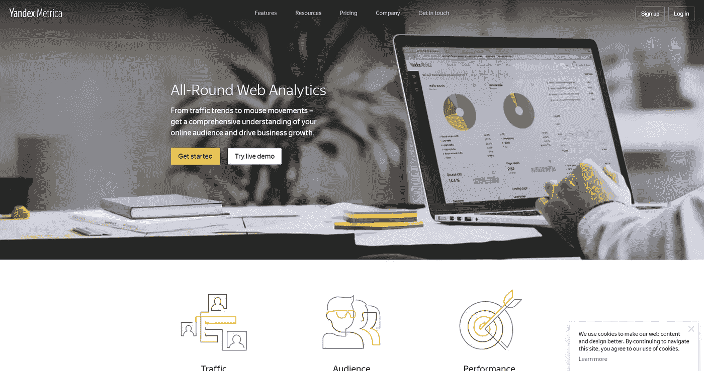

Yandex Metrika 最擅长两件事。

*   免费热图——热图基本上显示了人们点击你网站的位置。大多数热图工具都是付费的，但这种工具是免费的，而且相当不错
*   **视频录制** —当你启用它时，Yandex 让你有机会观察用户在你的网站上做什么。是的视频。你看不到用户的密码，但你可以看到其他一切，所以要小心使用，并确保在你的服务条款中提到它

# [4。谷歌数据工作室](https://datastudio.google.com/)

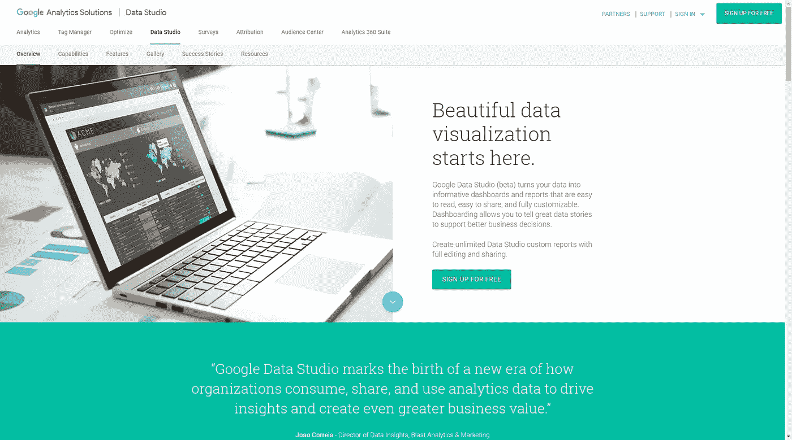

Google Data Studio (beta)将您的数据转化为信息丰富的仪表盘和报告，易于阅读、易于共享，并且完全可定制。仪表板允许您讲述伟大的数据故事，以支持更好的决策。

报告和数据分析的最大挑战之一是访问和整合所有数据。Data Studio 通过提供您需要的预建数据连接器简化了这个过程。

一旦有了原始数据，通常需要将其转化为更完整、更有意义的信息。Data Studio 将数据的维度和指标转化为图表和图形的强大构建模块。

不需要任何编码技能，也许它最酷的功能是共享选项。无论是通过电子邮件还是向某人或一群人发送链接，您只需点击两次就可以共享报告。

# [5。免费的 WEBRIS SEO 报告 Too](https://webris.org/tools/seo-reporting-tool/) l(有更深入的付费版本)

每个月每个人都会做一些报告。这里有一个非常好的关于搜索引擎优化的 WEBRIS。

我和 Ryan 谈过，他告诉我他们在决定使用 Google Data Studio 建立自己的报告模板之前，已经使用了几十种工具。

以下是他们使用 Google Data Studio 的原因以及您可以对报告做些什么。

## 连接到 Google 属性

内置从您需要的所有数据源中提取数据，以构建适当的报告。只需按照您希望的方式构建可视化仪表板，并浏览关键数据。

## 连接到非 Google 属性

您可以从 Google Sheets 中的其他工具导出数据(即[关键字排名跟踪](https://webris.org/keyword-tracking/)、[项目管理](https://webris.org/tool/agency-project-management/)信息、CRM 数据等)并推送到 Data Studio 中。换句话说，您可以从任何地方提取数据，并将其格式化为一个品牌化的自动化 SEO 报告模板。

一旦你掌握了窍门，它很容易使用。

# 附加工具

这里有一个最好的工具列表，可以让你作为一个全栈营销人员的工作变得更容易，更快地完成工作。

# [1。颜色选择器](https://chrome.google.com/webstore/detail/colorzilla/bhlhnicpbhignbdhedgjhgdocnmhomnp)

有了这个，你可以从任何网页上选择任何颜色。当创建设计或登录页面时，它是令人敬畏的。

 [## 色彩奇拉

### 先进的滴管，颜色选择器，梯度发生器和其他丰富多彩的好东西

chrome.google.com](https://chrome.google.com/webstore/detail/colorzilla/bhlhnicpbhignbdhedgjhgdocnmhomnp) 

# 2.谷歌分析 URL 生成器

当你做广告或做某种公关活动时，为了了解你的用户到底来自哪里，给他们做标记是很好的，这样你就可以在谷歌分析中获得数据。

这个 Chrome 扩展是我迄今为止发现的最好的一个。

 [## 谷歌分析 URL 生成器

### 这个扩展是一个超级版本的谷歌分析网址建设者和标签网址的跟踪在谷歌分析…

chrome.google.com](https://chrome.google.com/webstore/detail/google-analytics-url-buil/gaidpiakchgkapdgbnoglpnbccdepnpk) 

# 3.标签助手

有了谷歌标签助手，你可以很容易地检查你所有的谷歌标签是否安装正确

 [## 标签助手(由谷歌提供)

### 标签助理有助于解决各种谷歌标签的安装问题，包括谷歌分析，谷歌标签管理器…

chrome.google.com](https://chrome.google.com/webstore/detail/tag-assistant-by-google/kejbdjndbnbjgmefkgdddjlbokphdefk) 

# 4.FB 像素助手

与谷歌标签助手一样，你可以检查你的脸书像素是否安装正确，以及它发送什么事件。

 [## 脸书像素助手

### 脸书像素助手是一个故障诊断工具，帮助您验证您的像素实施。

chrome.google.com](https://chrome.google.com/webstore/detail/facebook-pixel-helper/fdgfkebogiimcoedlicjlajpkdmockpc) 

# [5。谷歌标签管理器](https://www.google.com/analytics/tag-manager/)

因此，如果你有一个网站，你想跟踪很多东西，你必须有很多代码放在网站的各个地方。一个必须在另一个之前加载，我向你保证，你不会想做的所有事情。

谷歌标签管理器负责这一切。

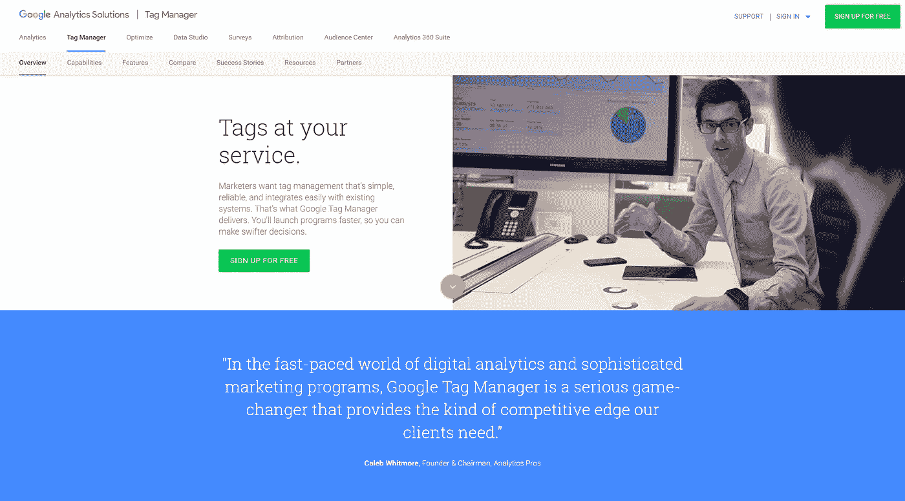

基本上，你可以把你所有的代码放在 GTM 中，只把一个代码放在你的网站上。

如果你不熟悉基本的 HTML、事件跟踪和网站实际运作的概念，这可能有点难以理解，但有大量的教程可以让一切变得清晰。

看看瑞安·斯图尔特做的这个播放列表。

希望它有所帮助，你开始使用 GTM。不要再打电话给开发人员，让他们做一些事情，因为你想跟踪页脚的按钮。

我保证它会改变你的生活。

# 6.数据刮刀

有了这个工具，你可以从网站上抓取和下载任何类型的数据。您只需定义过滤器并下载电子表格。

当我在 Google Adwords 上展示广告时，我会很有男子气概地使用它。

我所做的是，当我做某个查询并下载它们时，我告诉 Google 通过在链接的末尾添加%var%来显示给定查询的前 100 个结果。

然后我把链接放在 Google Adwords 中，这样我就可以在那些特定的文章中显示特定的广告。

你也可以这样做刮网站的外联。

 [## 数据刮刀

### 数据刮刀提取 HTML 网页中的数据，并将其导入 Microsoft Excel 电子表格

chrome.google.com](https://chrome.google.com/webstore/detail/data-scraper/nndknepjnldbdbepjfgmncbggmopgden) 

# 7.谷歌分析调试器

有了这个工具，你可以检查你所有的谷歌分析事件是否像应该的那样被激发，而不用进入谷歌分析实时视图。

 [## 谷歌分析调试器

### 通过启用 Google Analytics Javascript 的调试版本，将有用的信息打印到 JavaScript 控制台。

chrome.google.com](https://chrome.google.com/webstore/detail/google-analytics-debugger/jnkmfdileelhofjcijamephohjechhna) 

# [8。口袋](https://getpocket.com/)

我把所有以后需要阅读的东西都放在口袋里。

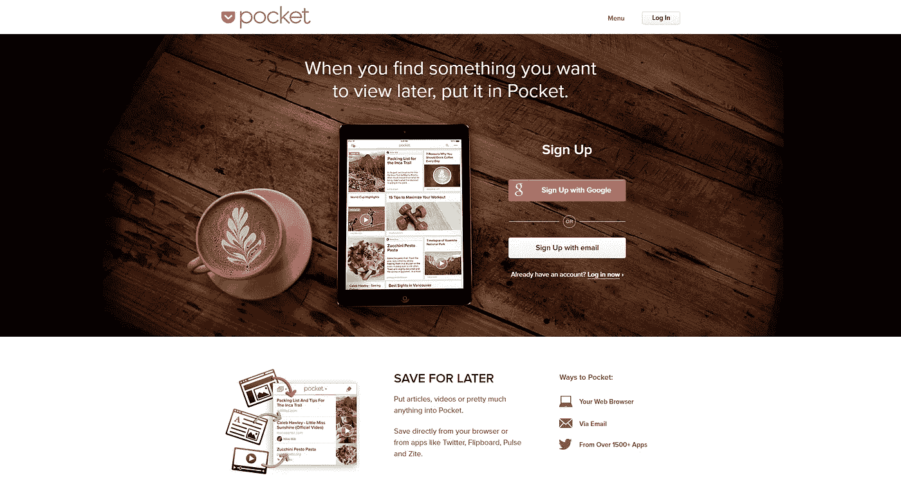

它的一个很酷的功能是，通过 iOS 应用程序，它可以给你读文章，所以你可以在跑步、锻炼、开车或通勤时听。

您可以创建带有标签的类别，以便更快地找到您的链接。

基本上，你可以存储你以后需要的每一个链接。

# [9**。pCloud 保存**](https://chrome.google.com/webstore/detail/pcloud-save/npamdkabjncnnoaofdjcaipmnccofeem?hl=en)

pCloud Save 允许您从上下文菜单中将网页图像、视频、有声读物等直接保存到您的 pCloud 帐户中。轻松获得您最喜爱的网络内容的副本，并从您的手机、笔记本电脑和网络上访问它。

右键单击要保存的文件，从上下文菜单中选择“保存到 pCloud”。想要一次保存多个图像吗？每次选择图像时，按住键盘上的 Alt 键。然后点击屏幕底部的保存到 pCloud 按钮确认您的上传。

每次保存到 pCloud，你都会收到一个通知，详细说明文件在 pCloud 中的位置和快捷访问。

 [## p 云保存

### 将您喜爱的网络图像、视频、文本等保存到 pCloud -高达 20 GB 的免费存储空间。

chrome.google.com](https://chrome.google.com/webstore/detail/pcloud-save/npamdkabjncnnoaofdjcaipmnccofeem?hl=en) 

# 设计工具

当我需要概念证明时，我用来建立登录页面和制作广告创意的工具列表。

# [1。自举工作室](https://bootstrapstudio.io)

Bootstrap studio 是什么，我喜欢称之为“登陆页面的 Photoshop”。

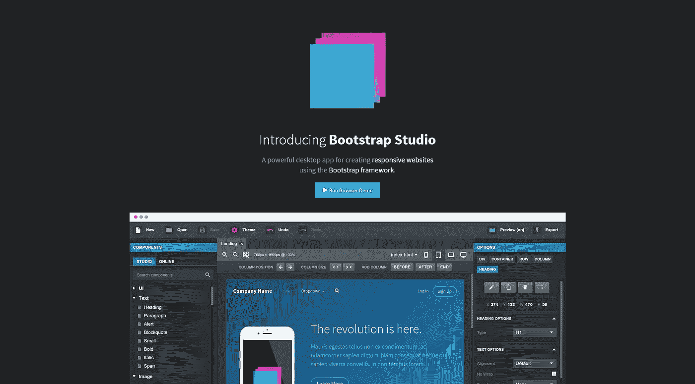

Bootstrap studio homepage

这是一个用[电子框架](http://electron.atom.io/)构建的令人惊奇的工具，它使你能够创建令人惊奇的响应登陆页面和整个网站的前端。

它有两个选择。

您可以通过拖放来构建页面，或者如果您愿意，也可以编写代码。

令人惊叹的是，它有大量预定义的部分，如果你碰巧不喜欢其中的一个，你可以很容易地用 HTML，CSS，Javascript 编辑器编辑它，或者你可以使用特殊的部分，使你只需输入你想要的文本，改变元素的颜色或宽度。

你所做的一切都在你面前实时更新，你可以看到你的页面在不同设备上的样子。

它非常容易使用，但是如果你是一个 HTML 和 CSS 的新手，你可能需要更多的时间来学习如何充分发挥它的潜力。

下面是它的功能的一个短片。

# [2。Canva](https://www.canva.com/)

如果你不是一个设计师，你需要为一个网站的广告制作一些图片，Canva 是你的救星。

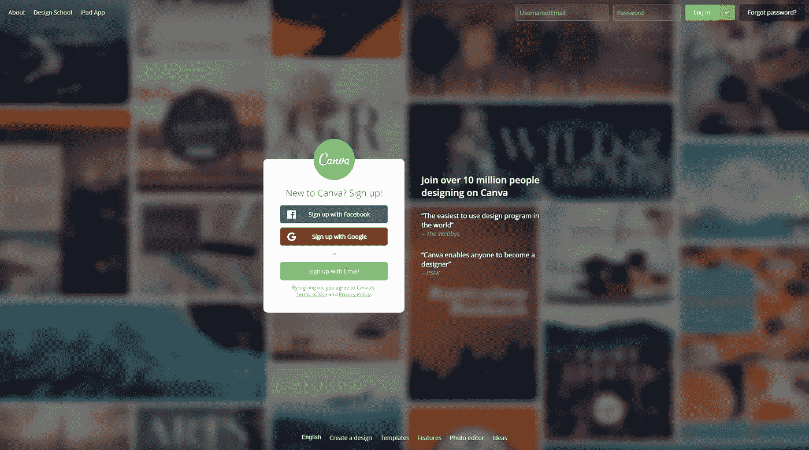

它所做的就是为你提供工具，让你在几分钟内轻松地创造出一个伟大的设计。

当然，你必须知道你想做什么，否则你可能会花更多的时间去做，而不仅仅是付钱给专业人士。

它有如此多的选项，你几乎可以创建任何东西。

我个人先用 Canva 的测试来证明我对设计师的同意。

只是要说明一点，它不是专业设计师 tho 的替代品，但如果你想做一些高质量的东西，Canva 是可以使用的工具。

# [3。平板包装](https://themeforest.net/item/flatpack-landing-pages-pack-with-page-builder/10591107?ref=proffi1)

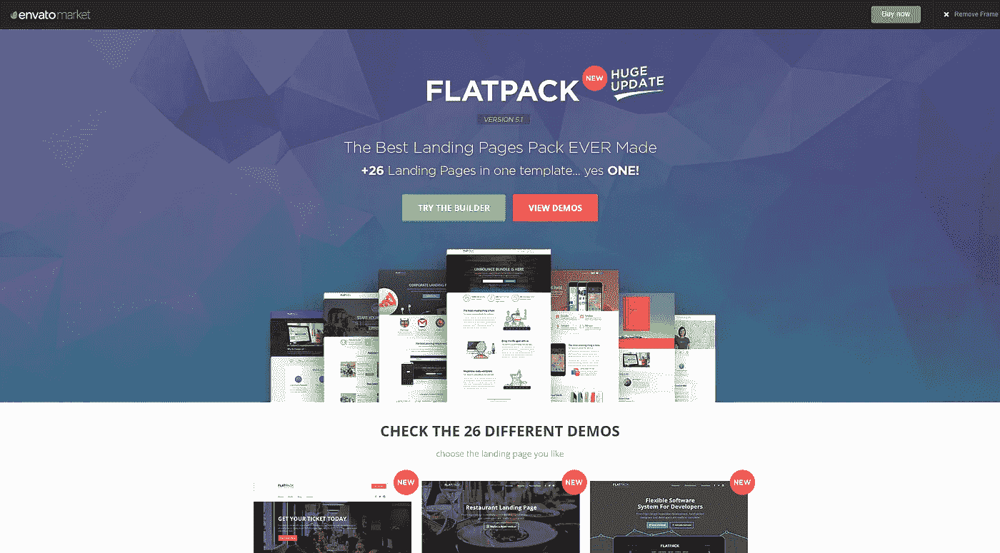

Flatpack 是一个拖放式登录页面设计器。同样，我并不是说这些工具是设计师或前端开发人员的替代品。有了 Flatpack tho，你可以非常快速地创建一个登陆页面。

它非常容易使用，而且一目了然。

你选择一个元素，把它放在你想要的地方，然后进行设置。

对某样东西做一个快速测试是很棒的。这是 18 美元，这是一个惊人的价格，它能做什么！

强烈推荐！

# [4。Marvellapp](https://marvelapp.com/)

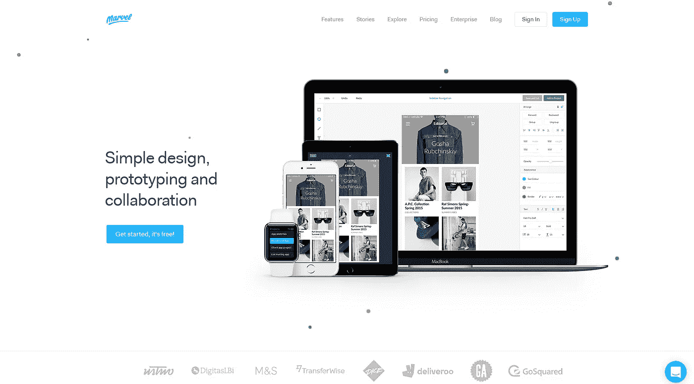

一个伟大的工具，原型和合作的应用程序和网站模型。

它与设计师使用的大多数流行工具集成在一起，并且有许多很酷的功能，让您在解释事物如何工作时更加轻松！

# 5.冰屋

# 灵感网站

每个人都需要灵感。这里有几个我用来查看最佳实践和有趣想法的工具。

# [1。Adespresso 广告](https://adespresso.com/academy/ads-examples/)

据我所知，这是作为 AdEspresso 的一个附带项目开始的，我认为它很棒。

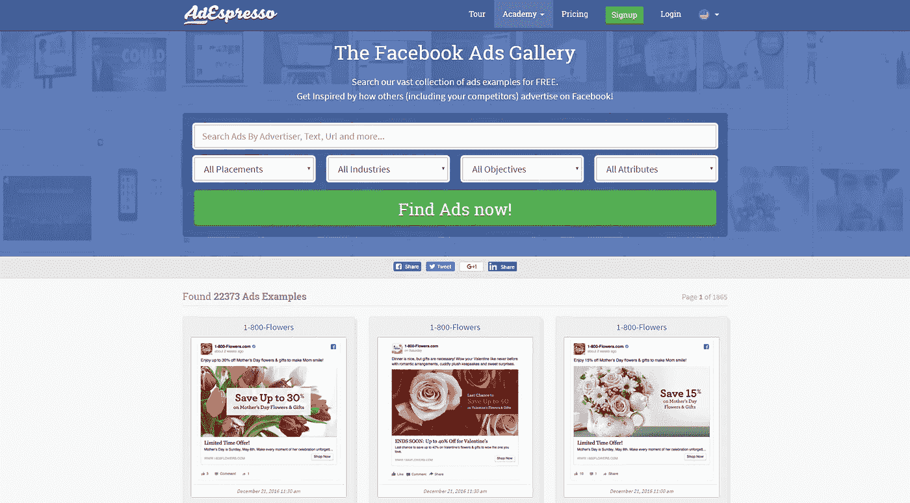

有了这个工具，你可以输入一个关键词或一个公司名称，它会告诉你他们曾经/正在运行什么样的 facebook 广告。

下面是 Dropbox 的一个例子。

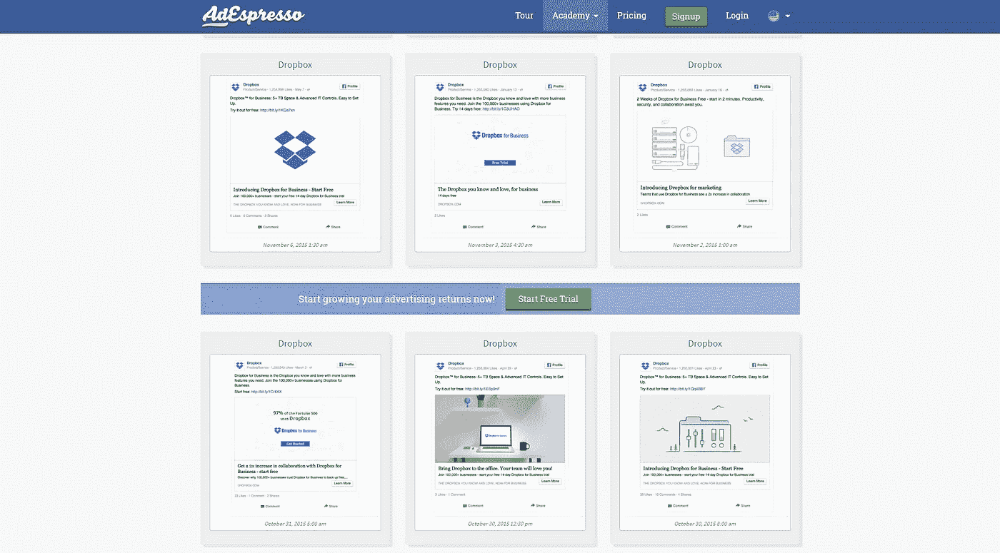

# [2。Lapa.ninja](http://lapa.ninja/)

这是我最喜欢的登陆页面灵感的网站。

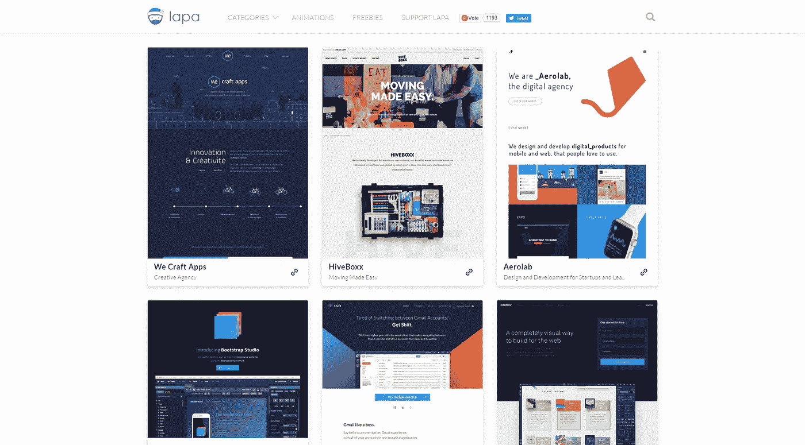

它在一个地方有很多网站和登陆页面的截图。如果你觉得需要从网站设计中得到灵感，就浏览一会儿。

# [3。行为](https://www.behance.net/)

也许是世界上最著名和最大的设计师作品集网站。

如果你需要任何方式的灵感，不仅仅是网页设计，还有建筑、印刷、动画或任何与设计师相关的东西，这是一个值得一试的地方。

如果你想找一个好的设计师为你做点什么，那真是太棒了。

# [4。滴水](https://dribbble.com/)

我最喜欢的设计师作品集网站。在这里，你可以看到案例研究，动画，标志设计和基本上所有来自大公司或非常非常好的自由职业者的设计师相关的东西。

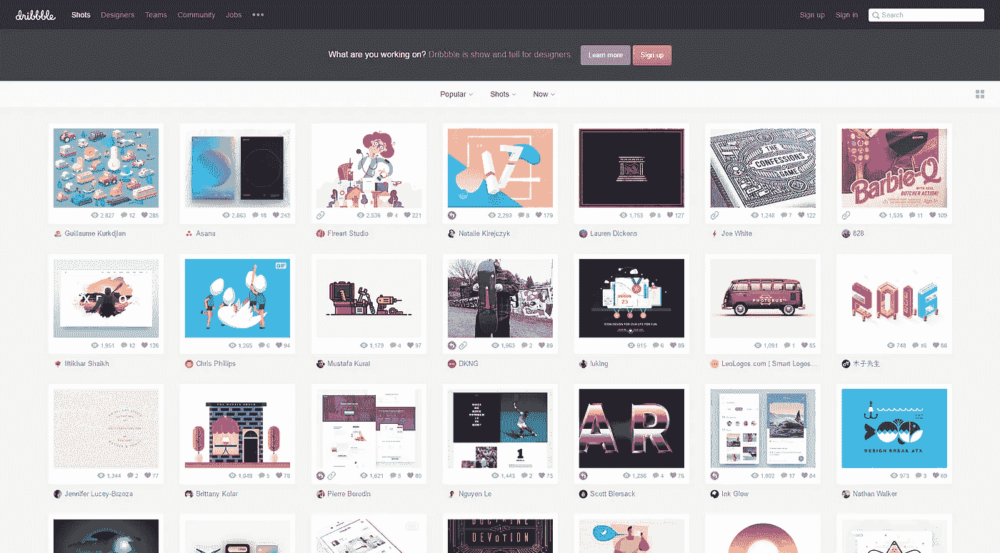

你可以紧跟现代潮流，真正学到很多东西。再加上大部分贴出来的东西真的很牛逼！

# [5。Unsplash](https://unsplash.com/)

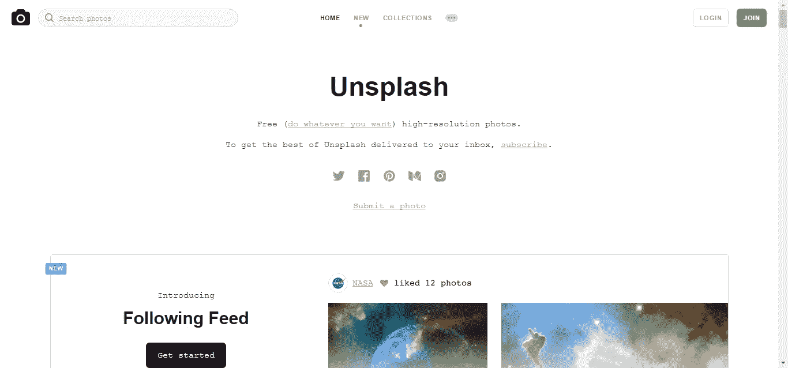

这是我找到的最好的免费照片网站。每当我需要一些很酷的东西作为登陆页面、广告或电子邮件，或者只是想浏览一下想法，我都会去这个很棒的地方。

另一件事是，我真的很喜欢这个了不起的项目背后的人的文化！

一定要检查出来，你不会失望！

# 电子邮件工具

电子邮件仍然是每次转化成本最低的渠道。

以下是我用来查找某人的电子邮件或完全自动化客户或外联流程的一些工具。

# [1。头部伸展](https://headreach.com/)

HeadReach 是营销人员和销售人员的一个简单的潜在客户创造工具。

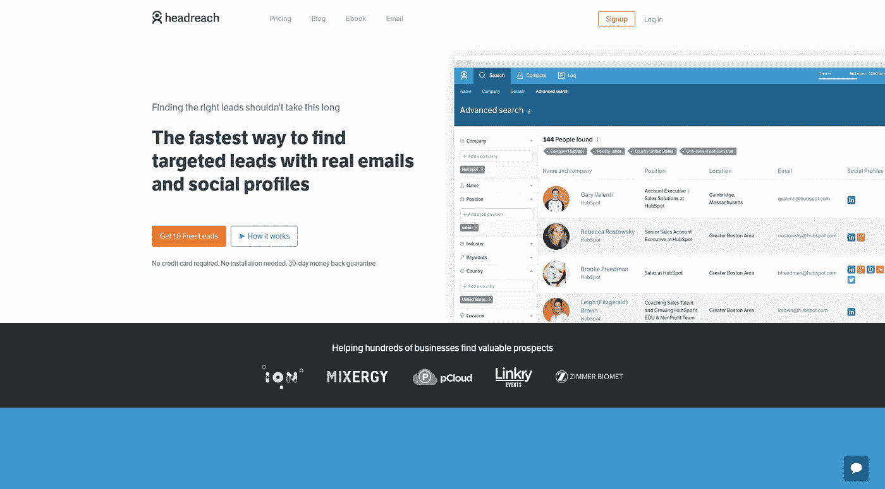

它可以帮助你找到正确的决策者和他们的电子邮件，而无需支付 LinkedIn 高级帐户或花费数小时使用过多不同的电子邮件查找工具。你只需简单地输入公司名称、域名或人名，工具就会找到合适的人。你可以使用 HeadReach 寻找你所在领域的专业人士来撰写综述文章，进行内容推广，或者寻找合适的人来负责一家受欢迎的商店。例如，您可以通过一次搜索来搜索 TechCrunch、福布斯和企业家杂志的所有编辑。

这里有一个简短的演示如何工作

# [2。Buzzstream](http://www.buzzstream.com/)

这是以个性化和高效的方式研究有影响力的人、联系他们并拓展他们，以及管理您与他们的关系的最佳工具之一。

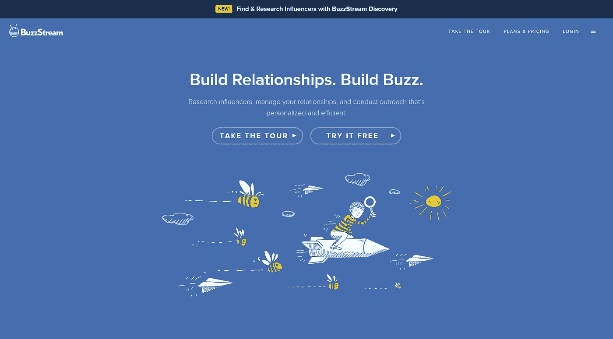

你可以发现关于在各种利基市场中被认为有影响力的人的各种信息。跟踪对话非常容易，你也可以为后续邮件设置提醒。

# [3。投币箱](http://pitchbox.com/)

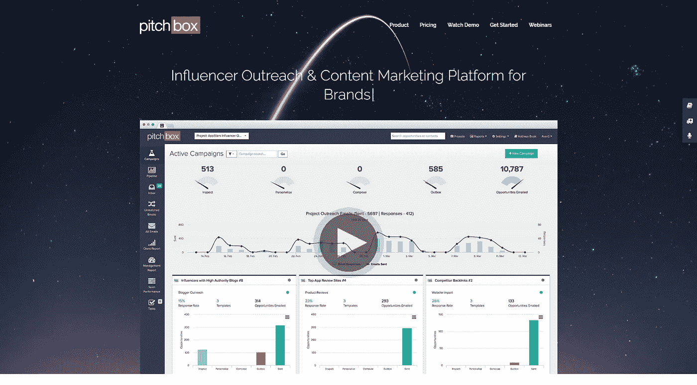

我使用 Pitchbox 主要是为了推广，因为如果你按照预期的方式自动化它，你可以很快扩大推广，因为它只需要你投入很少的时间。

# [4。活动活动](http://www.activecampaign.com/)

最好的电子邮件自动化工具之一。

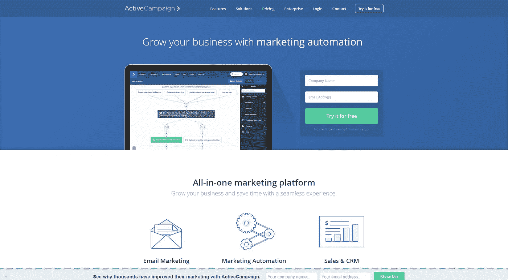

玩几个小时，你就可以建立一个完整的客户之旅，从用户注册开始，到根据他的行为向他发送个性化的电子邮件。

它不便宜，但它超级容易使用，如果你设置正确，它是非常强大的。

# 项目管理工具

也许一个成功项目最难的部分是它的管理。

团队合作至关重要。

这里有一些工具可以帮助你更快地与地球另一端的人协作。

# [1。pCloud](https://www.pcloud.com/)

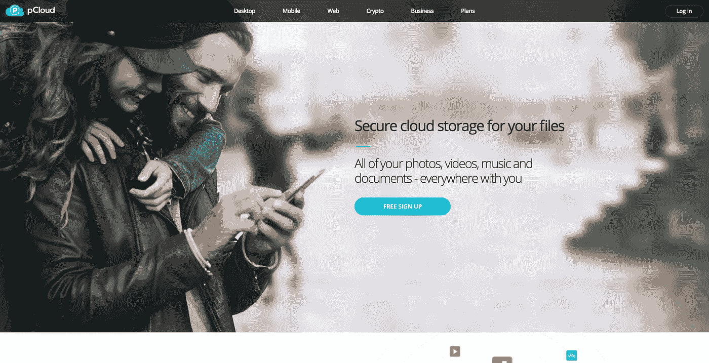

如你所见，我是 pCloud 团队的一员

**pCloud 是一种云存储。**对于那些不知道云存储是什么的人来说，它基本上是一个可以存储所有文件并随时在任何设备上访问它们的地方。它有点像 Dropbox，只是好得多，我会在下面告诉你为什么。

从我发现云存储的第一天起，它就成了我的必需品。以下是我喜欢它的几个原因。

*   组织——我喜欢一切井然有序且容易找到的东西，所以这对我来说再好不过了。你可以随意组织你的文件和文件夹。
*   访问——正如我说过的，因为它是云存储，所以你可以在任何你想要的设备上访问你的所有文件
*   协作——你需要马上开始使用这种服务的主要原因之一。您可以邀请其他人访问您拥有的文件夹，这样您就可以一起处理您的项目。当然你可以给用户特定的权限。您还可以创建下载链接，以便人们可以下载您要发送给他们的内容或文件。这很容易。你也可以创建一个上传链接。这意味着您允许人们在没有服务帐户的情况下上传您文件夹中的文件。

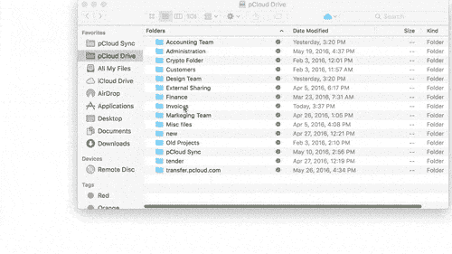

*   备份-您可以使用云存储作为您最想保留的文件的备份服务。
*   流媒体音乐和视频——使用 pCloud，您可以在您想要的任何设备上以全质量(只要我们的互联网足够好)流媒体播放任何音乐或视频文件，只要它在您的帐户中。当然，只要您将文件标记为脱机使用，您也可以脱机访问它。

因此，所有这些功能对于云存储都是必不可少的，并且大多数服务都具备这些功能。我来告诉你为什么要选择 pCloud，为什么比其他的都好。

因此，除了每个云存储都有的所有东西之外，pCloud 还有一些非常酷的东西，使它成为一项令人惊叹的服务。

1.  pCloud Drive — pCloud Drive 是 pCloud 的桌面应用程序。它实际上是在你的电脑上创建一个虚拟驱动器，而**并不像 Dropbox 和 Google Drive 那样使用它的存储来保存你的文件。**这意味着您可以访问和使用所有文件，就像它们在您的计算机上一样，但不会占用任何存储空间。这对 Mac 用户来说尤其令人惊讶，因为新版本的硬盘是不可升级的。这里有一个视频，我告诉我如何在我的 512 GB Macbook Pro Retina 上获得 2.7 TB。

当然，要做到这一点，你需要连接到互联网，但没有什么可担心的，因为如果你知道你不会有互联网，你可以随时使用 pCloud 的同步功能离线访问你的文件。通过这种方式，您可以从 pCloud 帐户同步一个文件夹或将一个文件夹同步到 p cloud 帐户，并且您可以离线使用您的文件，当您再次在线时，您所做的所有更改都将自动上传到云中。

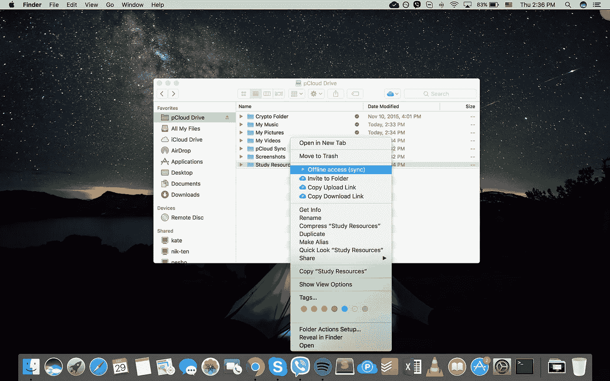

2.速度——我只看下一个视频

3.安全性——p cloud 有一项功能可以确保只有您可以访问某些文件。它叫做 pCloud Crypto。当您选择加入 pCloud Crypto 时，您可以创建一个加密文件夹。它提供客户端加密，即加密过程在您的设备上执行。文件的加密版本被上传到服务器。就算是 pCloud，作为服务商，也不会知道你的账户里存了什么样的数据。您的文件只能用您的加密通行证加密和解密。请小心，因为如果您丢失或忘记了您的加密通行证，您的文件将无法返回，因为即使是 pCloud 的系统管理员也无法解密该文件夹。

4.受密码保护的下载链接—您可以在下载链接上设置密码和到期日期(高级功能)

5.远程下载——这是我最喜欢的功能之一。基本上，你可以从一个直接链接下载任何文件。pdf、. mp3、. mp4、.pptx，。mov 等。基本上是任何文件)通过服务器到服务器的互联网连接(非常非常快)下载到你的 pCloud 账户

6.移动应用 iOS 和 Android 的应用功能齐全，这意味着你可以做你在其他平台上能做的一切(共享链接和文件夹、加密文件、流媒体视频和音乐等)。).

7.pCloud Rewind — pCloud Rewind 允许您将帐户中的所有内容恢复到过去 30 天内的先前版本。你可以自由浏览你所有的非加密文件，恢复或下载它们。如果您决定恢复您的文件，它们将被复制到您当前文件夹结构的主目录下的文件夹 Rewind 中。例如，如果您在下午 1:30 从 01/02/2017 恢复 5 个文件，您将在文件夹“Rewind”中找到名为“5 files restored from Feb 01，2017 13:30”的子文件夹。之后，您可以将文件移动到您帐户中的任意位置。

8.公共文件夹——公共文件夹是 pCloud 文件结构中的一个特殊文件夹，允许您创建指向文件和文件夹的直接链接。它的工作方式类似于静态内容的文件服务器，但不需要在您的家庭计算机上运行文件服务器。默认情况下，您的帐户中没有公共文件夹。相反，您需要在左侧菜单的“文件”部分的“公共”子部分中启用它。作为一项高级功能，公共文件夹包含在所有高级和商业计划中。免费用户可以免费试用公共文件夹 7 天。

这些应用程序还有一个特点。它们可以释放你手机上的空间。基本上，当你使用 pCloud 获得 500GB 的 2 TB 存储空间并安装应用程序时，你需要打开自动上传功能，将所有照片和视频上传到云中。文件上传后，你只需点击一下就可以自动从手机中删除它们，并且仍然可以在 pCloud 应用程序中访问它们。下面是它在 iPhone 上的工作原理

还有许多其他功能，我希望你会发现这很有帮助，因为我们做了很多工作来与 Dropbox 和 Google Drive 等服务竞争，并做出比它们更好的东西。

 [## pCloud —文件安全变得简单| pCloud

### pCloud 为任何规模的企业提供云存储解决方案！pCloud 会照顾你所有的生意…

www.pcloud.com](https://www.pcloud.com/) 

# [2。Todoist](https://todoist.com/)

我试过很多待办事项清单，目前为止这是最适合我的一个。

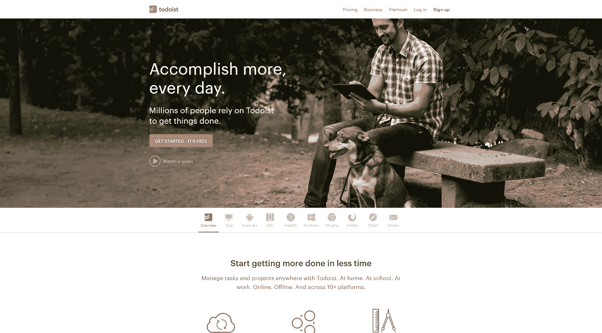

我喜欢它，因为它的设计超级干净。我最喜欢的一点是管理项目非常简单。

首先，你可以为每个项目选择不同的颜色，如果你能做 2-3 件以上的事情，那就很好了。

其次，您可以创建子项目。举例来说，如果你是一个像项目经理一样管理很多事情的人，这对你很有好处。

最后但同样重要的是。你可以用拖放的方式移动你的项目，这样你就可以在几秒钟内按照你想要的方式排列它们。

另一件很酷的事情是你可以在 Todoist 中合作项目。

您可以给同事分配任务。

这不是最复杂的待办事项列表，我想这就是我喜欢它的原因。

# [3。吉拉](https://www.atlassian.com/software/jira)

因此，如果你不习惯使用待办事项列表，你可能会发现吉拉有点让人不知所措。

它非常适合软件开发和从事更大的项目。你想怎么定制都可以。

因为它一开始有点复杂，你可能很难使用，但是一旦你掌握了它，它会非常有用。

# [4。合流](https://www.atlassian.com/software/confluence)

Confluence 是一个项目组织工具。它所做的基本上是给你一个地方来组织你在管理一个项目时需要的所有东西。

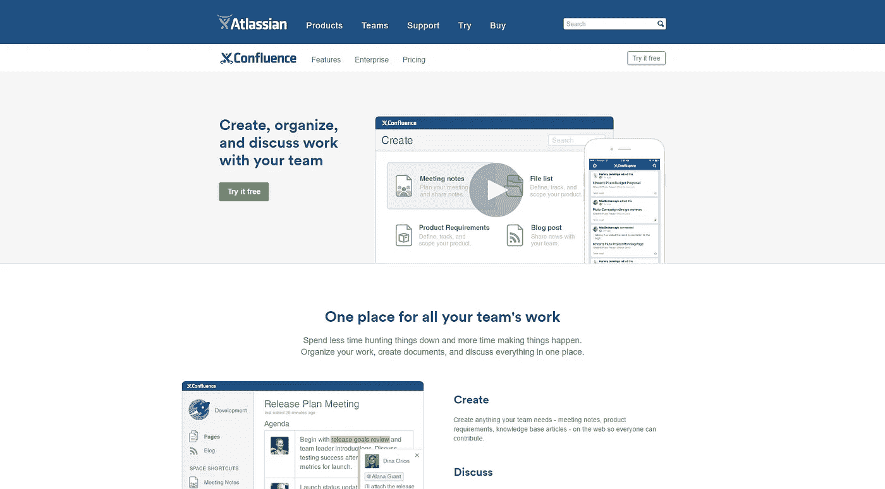

你可以创建团队，你可以上传设计，你可以用评论讨论所有的事情。

这是一个伟大的工具，但它是为更大的项目。

# [5。Evernote](https://evernote.com/)

Evernote 是一个储存想法的好地方。最棒的是你可以把它同步到你所有的设备上。

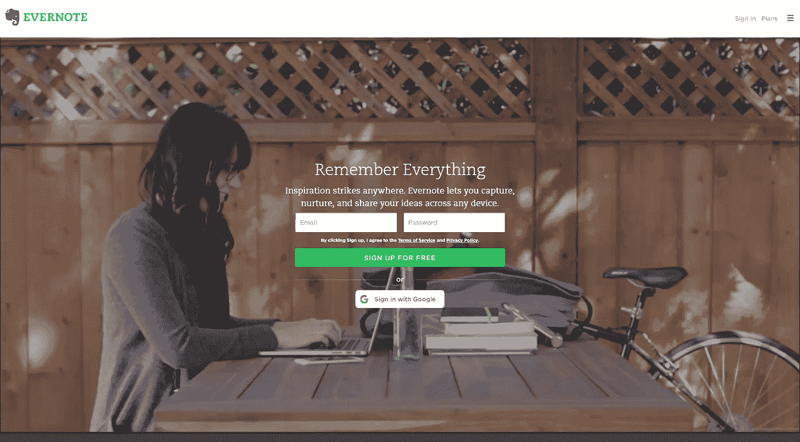

因此，当你想记住一些东西并写在手机上时，它会立即同步到你所有的设备上，你可以在桌面上继续工作。

另一件很酷的事情是，你可以与他人分享你创造的一切，并一起工作。

而且不仅仅是为了记笔记。可以扫描文档，附加 pdf 和图像，保存重要邮件。好处:它可以在你所有的设备上同步。

# [6。松弛度](https://slack.com/)

你可能已经用过 Slack 了。这可能是几年来最受关注的团队聊天平台。

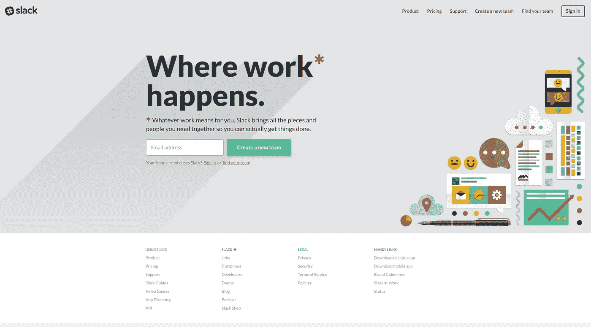

事物都有两面性。

认为它会破坏生产力的人和认为它会提高生产力的人。

一方面，它与团队使用的最流行的工作工具有很多集成。

它还有可以做很多不同事情的机器人。

因此，在某种程度上，当你发送大量电子邮件时，这真的很有帮助。

这里有一篇很酷的文章，有 [**和**](https://blog.pcloud.com/22-slack-hacks-tips-tricks/)22 个漏洞，你可以更好地使用它。

另一方面，对于一些团队来说，松弛已经成为阻碍生产力的工具。

我这么说是因为在很多情况下，人们发现自己在聊一些与他们必须做的事情无关的事情。

聊天真的会上瘾，有些人甚至认为懈怠会破坏工作和生活的平衡，因为当你不看的时候，你会不断地感觉你错过了一些东西。

# 数字营销博客

对营销人员来说，最有价值的工具是知识和实践。这就是为什么我认为好的博客是工具。我知道的大部分东西都是通过看书和看视频学来的。

以下是我认为最好的营销博客列表。

# [**0。Sumo.com 博客**](https://sumo.com/stories/category/sumo-growth-studies)

今年营销创意灵感的最佳来源之一是 sumo.com 的博客，特别是克里斯·冯·威尔伯特的成长研究。

这些基本上是世界上一些最成功的公司的营销策略，被分解成非常简单的步骤。

这些研究有数据支持，这也是我最喜欢它们的地方。

我认为它们是必读之作，不仅因为它们有多深入，还因为读完之后你会得到一些想法。

# [1。数字营销人员](http://www.digitalmarketer.com/blog/)

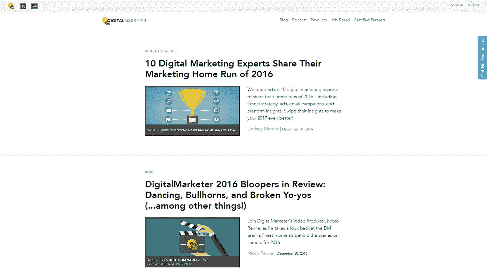

这是最好的营销博客之一。因为像这样的博客，我不会花 1000-2000 美元去学习在线营销课程。你需要知道的成为一个好的在线营销者的一切都可以在那里找到。有数百篇文章提供了有用的提示和专家建议。

有案例研究和分步指南、示例电子表格和一些“技巧”，可以让你更上一层楼。

绝对是必须遵循的！

# [2。瑞安·斯图尔特的 webris](http://webris.org/blog/)

这是我最喜欢的营销博客。我喜欢像瑞安这样在工作中超级透明和诚实的人。

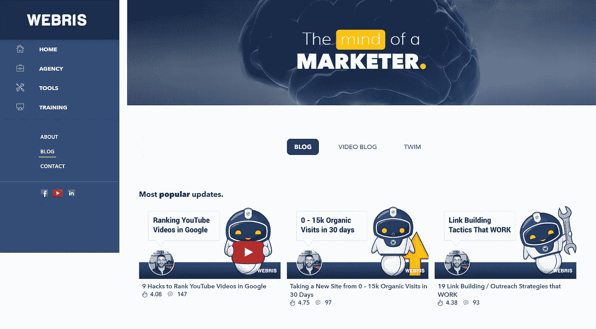

他分享超级有用的东西，老实说，我很高兴没有多少人知道他和他的博客。他分享的东西太好了。

一定要看看他在 youtube 上的视频，它们有点长，但非常值得。

如果你是初级营销人员，你需要阅读上面的所有内容。

# [3。尼尔·帕特尔、Quicksprout、Kissmetrics](http://neilpatel.com/blog/)

尼尔·帕特尔是成长型黑客的真正定义。他的文章超级长，但是很有价值。

他是一个连续成功的企业家，令人惊讶的是，他分享了他用来发展业务的技巧和诀窍。

一定要看看他的 10 万美元挑战赛。

# [4。中等](/)

在我看来，Medium 在某种程度上是一个阅读社交网络，在我看来，它是找到有趣的东西来阅读和学习的最佳场所。

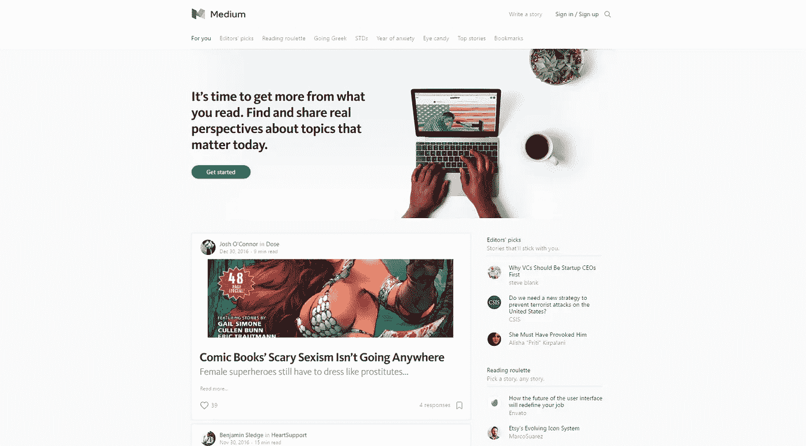

如果你管理好你的“新闻源”,你可能会被困在那里几个小时。

顺便说一下，如果你想学习，但你不喜欢阅读或没有时间阅读一篇 2-3-4k 字的文章，这是你需要的 Chrome Exstension:

 [## 玩

### 听你最喜欢的 Meduim.com 文章，播放允许你直接从浏览器听任何媒体文章。

chrome.google.com](https://chrome.google.com/webstore/detail/play/gklfcaofjmilchcphdgbhjeoopdaejje) 

当你处于媒体状态时，它会自动在屏幕底部显示一个播放按钮，当你点击它时，它就会开始阅读文章。我经常使用它，我真的很重视它。

一定要跟着我。

[https://medium.com/@Proffi](/@Proffi)

# [5。搜索引擎世界](http://searchengineland.com/)

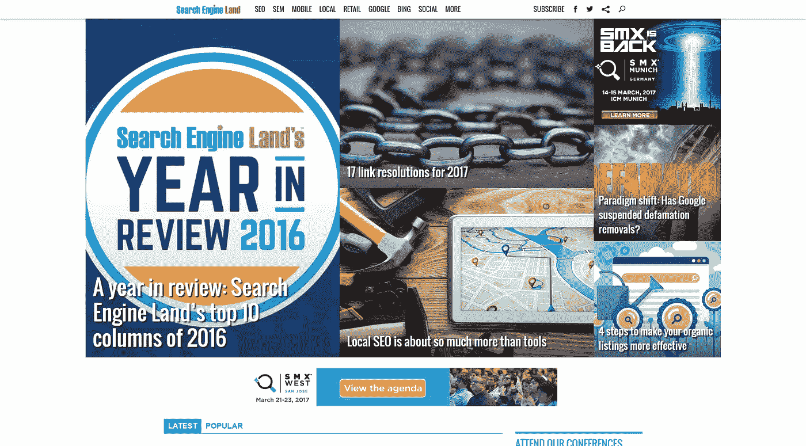

如果你是一个专门从事 SEO，SEM 和 PPC 的数字营销人员，你需要将这个网站加入书签。与这三个类别相关的所有内容通常首先在那里发布。

# [6。Ahrefs](https://ahrefs.com/blog/)

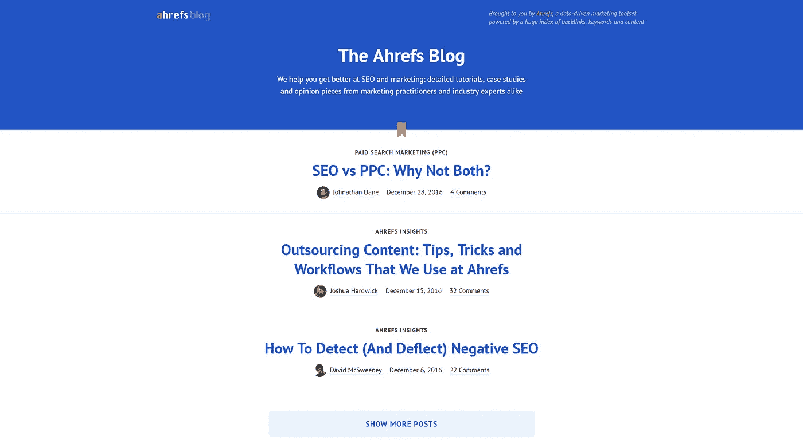

我喜欢 Ahrefs 的博客，因为他们分享了令人惊叹的案例研究，他们写的每一件事都有强大的数据支持，正如我所说，我是根据数据做出决定的。

数字从不说谎。

# [7。乔恩·卢默](http://www.jonloomer.com/)

在我看来，乔恩是与脸书营销相关的最优秀、最实用的博客作者之一。

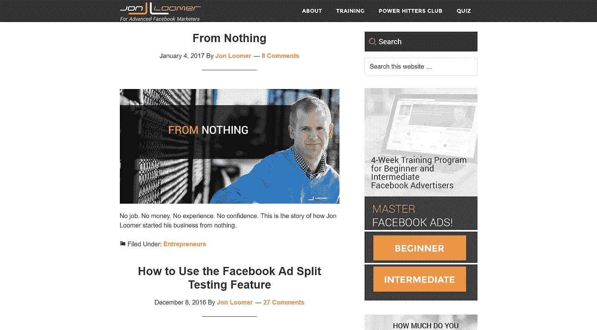

或者，如果你是一位资深脸书广告人的下级，你总能从他的文章中学到一些新东西。

他的一步一步的指导非常容易理解，每件事都以一种非常容易理解的方式解释。

他经常发布实验结果，这是我从他那里读到最多的东西，但如果你刚刚开始接触脸书广告，乔恩的博客是最好的学习场所之一。

# [8。轮毂位置](https://blog.hubspot.com/)

Hubspot 的博客是另一颗宝石。在那里你可以找到各种关于如何基于数据获取更多流量的文章。

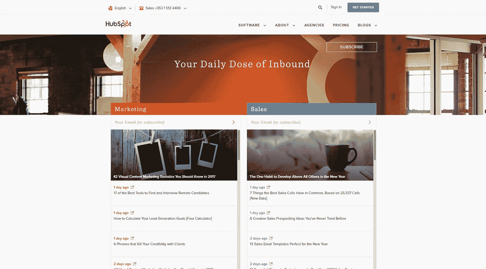

他们有很多免费的工具可以帮助你关注博客，因为他们经常在大量的文章中包含这些工具。

# [9。内容营销学院](http://contentmarketinginstitute.com/)

令人敬畏的内容营销博客。

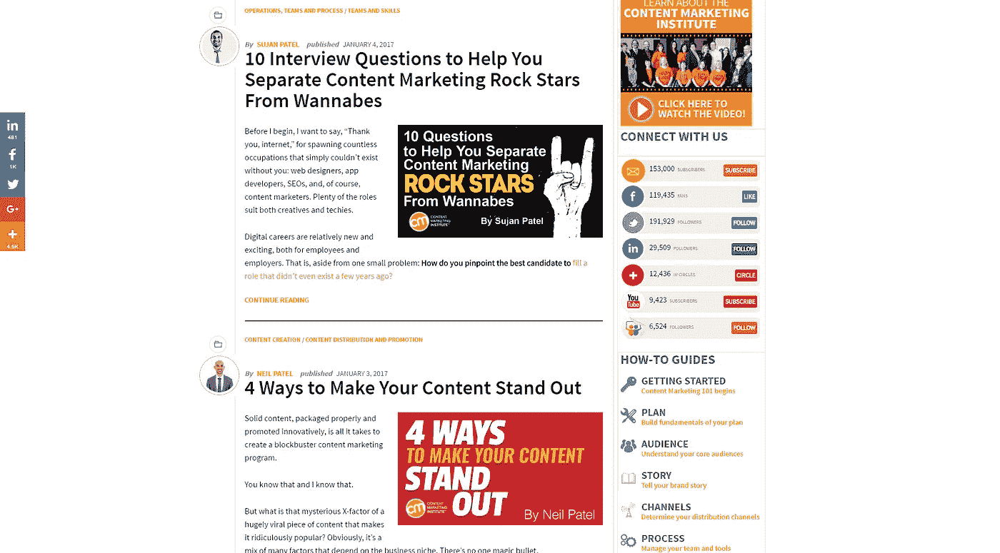

# [10。缓冲器](https://blog.bufferapp.com/)

我喜欢缓冲博客，因为它们超级透明。

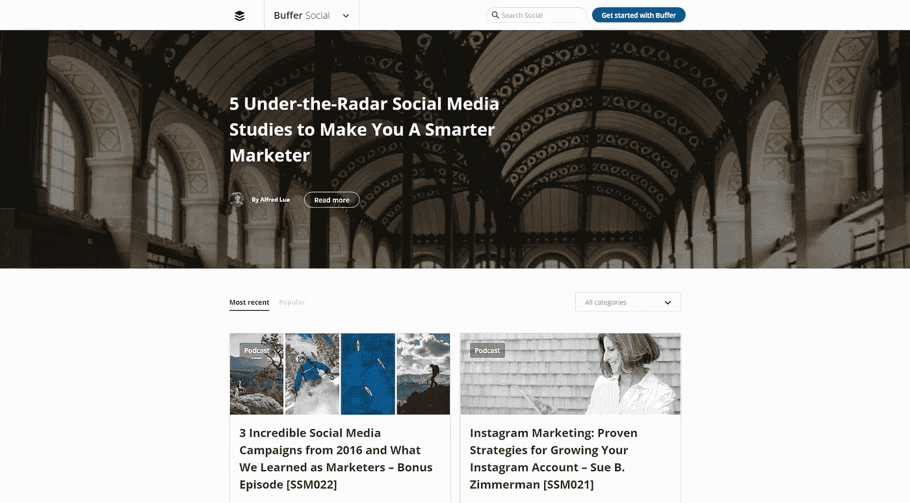

他们分享旅途中的一切。

# 11。凹槽

和 Buffer blog 一样，我喜欢 Groove，因为他们带我们走过他们的旅程。他们的内容充满了好的建议，尤其是对创业公司。

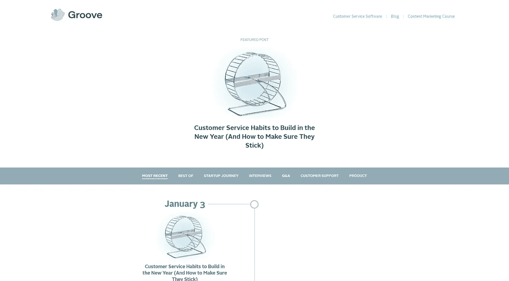

可以学到很多东西。从营销策略到领导力和团队建设。

一定要检查一下。

# [12。MOZ](https://moz.com/blog)

另一个数据丰富的博客。

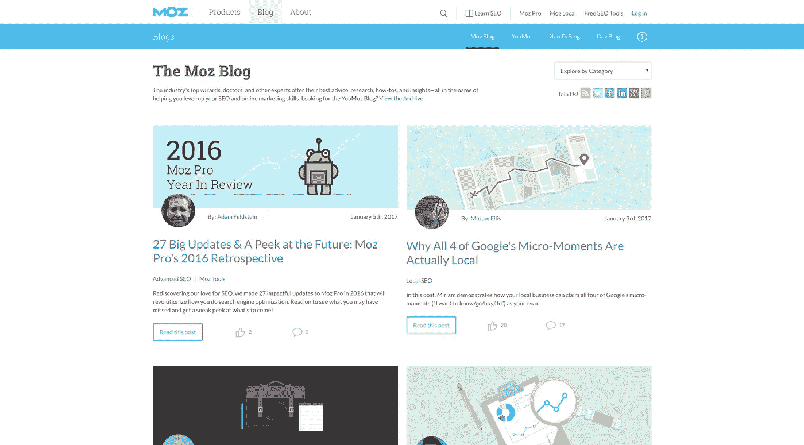

我喜欢周五白板日。说实话。兰德·菲什金很擅长解释事情。最复杂最难的事情，他能以一种你马上就能理解的方式来解释。

他的例子总是很好，你真的可以从他身上学到很多。

MOZ 博客对初级和有经验的营销人员都有好处。

那里有些东西会让你大吃一惊。

# [13。Adespresso](https://adespresso.com/academy/blog/)

最后但同样重要的是 Adespresso 博客。Adespresso 是一款帮助您以最佳方式优化脸书广告的工具。

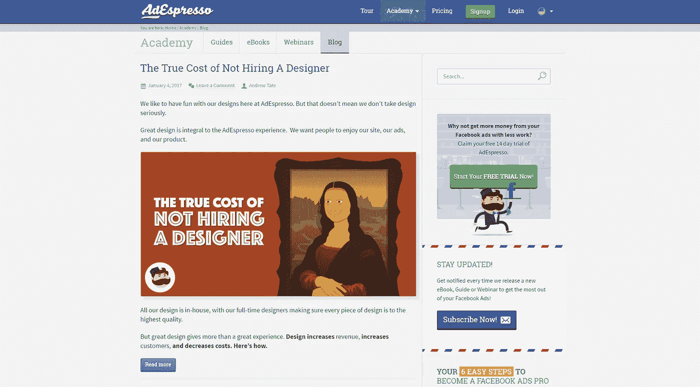

他们的博客充满了案例研究和有趣的实验。如果你想了解关于脸书营销的有趣事实，确保你遵循它们。

# 奖金

[最佳 Shopify 替代品——cloud cart](https://cloudcart.com/)

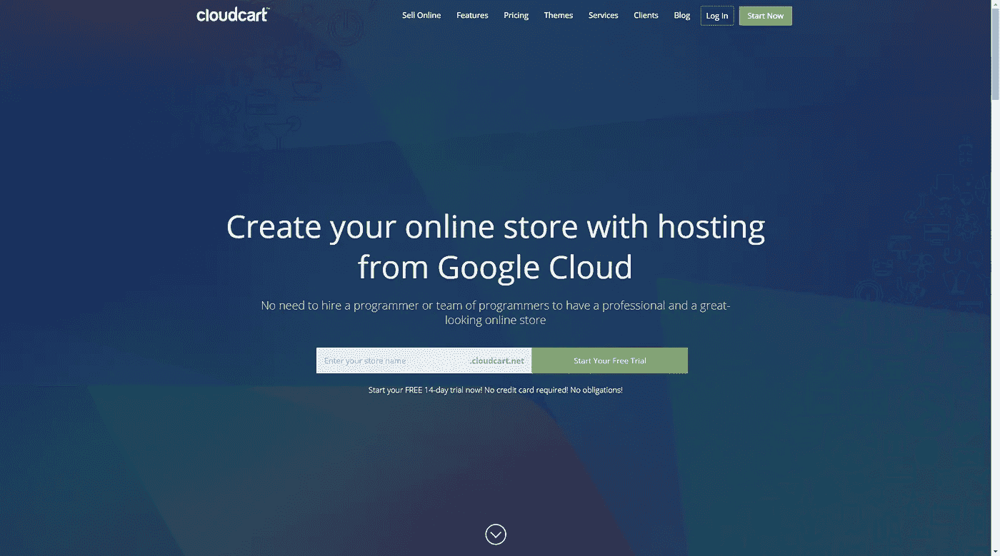

所以就像我说的，我在工作的时候会遇到很多人。

当我遇到 Cloudcart 的创始人时，他们告诉我，他们将与 Shopify 和其他大型电子商务商店开发商竞争，我很喜欢这一点，因为在 pCloud 中，我们正在对 Dropbox、box 等进行同样的操作。

我尝试了这个平台，并对他们所做的事情感到非常惊讶。

他们有你需要的一切，以便在几分钟内创建一个美丽的网上商店。

我最喜欢的是他们提供的绝大多数免费主题和计划中包含的插件，你不必为使用它们支付额外的费用。与脸书广告和谷歌 Adwords 等广告平台的整合非常出色，你只需点击几下就可以创建动态广告。

最近，他们重新设计了收银台的流程，使其更加快捷和智能。例如，你不需要他们输入地址就可以得到这个人的地址，这**增加了 4 倍的转化率**,因为用户不需要自己写下来，整个结账过程也快了很多。

此外，他们最近建立了自己的拖放页面生成器，使您可以在不知道如何编码的情况下在商店中创建页面。

这不是一个真正的营销工具，但由于该平台是如此以营销为导向，我想我应该在这里给他们喊出来。另外，你们中的许多人要求我推荐一个电子商务商店构建平台。

给你！

# **结论**

这些是我曾经使用过的大部分工具，并且仍然在使用，试图在我所做的事情上做到最好。**希望你学到了一些你不知道的东西。**如果您看到此处未列出的工具，请务必评论。

另外，如果你有任何问题，请提出来。我会确保回答每一个问题。

更多类似的文章，请关注我:)

附言

感谢鼓掌:)

## 这篇文章发表在 [The Startup](https://medium.com/swlh) 上，这是 Medium 最大的创业刊物，有 282，454+人关注。

## 订阅接收[我们的头条新闻](http://growthsupply.com/the-startup-newsletter/)。

