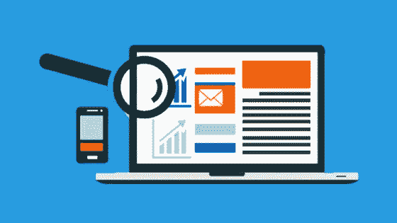
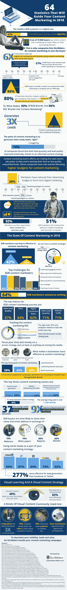

# 64 个令人兴奋的 2018 年内容营销统计

> 原文：<https://medium.com/swlh/64-mind-blowing-content-marketing-stats-2018-763fbf7b0d90>

据说现代 B2B 客户是数字化客户。

为什么会有人这么说？

原因是 67%的 B2B 买家的旅程是数字化的。

10 个 B2B 购买者中有 9 个说在线内容对他们的购买决定有中度到重大的影响。

这正是内容营销扮演英雄的地方。

内容营销是指[创建和分发相关的有价值的内容](https://sarv.com/resource/post/how-being-different-pays-in-content-marketing)(如博客、视频和社交媒体帖子)，这些内容并不一定是为了推广品牌，而是旨在促使受众购买其产品或服务。

以一种增值的方式沟通来获得顾客的信任，可以被称为内容营销的本质。

那么你有没有想过是什么让 93%的 B2B 品牌和 86%的 B2C 品牌使用内容营销呢？

内容营销通过及时、一致地创建高质量、有见地的内容来确保提供思想领导力，这有助于与客户建立长期关系，进而有助于降低您的营销支出。

你想知道一些惊人的内容营销统计数据吗？这是一张由内容营销机构 iScribblers 制作的[信息图。看看这个，你会喜欢的。](http://www.iscribblers.com/infographics/64-statistics-that-will-guide-your-content-marketing-in-2018/)

【sarv.com】最初发表于**。**

**

## *这篇文章发表在 [The Startup](https://medium.com/swlh) 上，这是 Medium 最大的创业刊物，拥有 339，876+的读者。*

## *在此订阅接收[我们的头条新闻](http://growthsupply.com/the-startup-newsletter/)。*

**