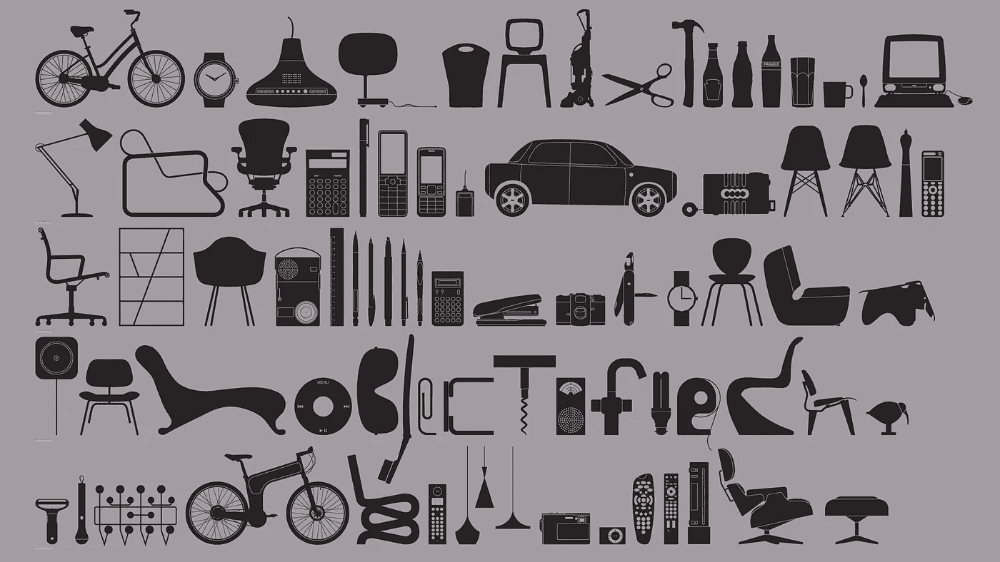

# 每个设计师都应该看的 69 个视频

> 原文：<https://medium.com/swlh/69-videos-every-designer-should-watch-8eafc86d06ab>

## 设计有历史；设计塑造文化；设计有创意；设计是一个过程；设计是有帮助的；而设计是人性的。不管你有两分钟还是两个小时，都有适合你的视频。

# 历史

设计的历史可以从许多角度来探讨。这些视频探究了历史上不同时期的设计。

## 包豪斯:20 世纪的面孔(预告片)

The 1994 documentary Bauhaus: The Face of the 20 the Century traces the development of the Bauhaus movement from its formation in Weimar by Walter Gropius to the establishment of the Bauhaus School in Dessau to its last stand in a derelict factory in Berlin.

## Helvetica

Gary Hustwit directs *Helvetica —* a film that celebrates this inescapable typeface’s history, the reasons for its pervasiveness and its universal appeal. It also explores how typography and graphic design impact our culture.

## 设计的天才 1/5(机器中的幽灵)

The series tells the story of design from the Industrial Revolution. The first episode shows the “appearance” of the design, alongside famous names such as Josiah Wedgwood and William Morris. It also explores the work of anonymous designers, responsible for classics and precursors projects.

## 设计天才 2/5(为生活而设计)

The series tells the story of design from the Industrial Revolution. The second episode highlights some events that occurred in the 1920s and 1930s. The kitchen, the tubular steel furniture, the beginnings of Bauhaus…there is a brief account of the “modern movement” and the ways of consumption.

## 设计的天才 3/5(战争蓝图)

The series tells the story of design from the Industrial Revolution. The third episode gives us a look at the rival war machines designed and built during World War II.

## 设计的天才 4/5(通过化学更好地生活)

The series tells the story of design from the Industrial Revolution. The fourth episode focuses on design as it enters the 50s and 60s, when a new material called plastic emerges.

## 设计的天才 5/5(欲望的对象)

The series tells the story of design from the Industrial Revolution. The fifth and final episode looks at the creativity that defined the “designer decades” of the 80s and early 90s.

# 文化

设计已经并将继续塑造我们的每一天。这些视频全面探索了设计的不同方面如何改变了文化景观。

## 物化(预告片)

*Objectified* is about personal expression, identity, consumerism, and sustainability. This film examines the complex relationships we have with manufactured objects and the designers who constantly reexamine, reevaluate and reinvent our manufactured environment.

## 艺术和文案

Directed by Doug Pray, *Art & Copy* is about advertising and inspiration focusing on some of the most influential advertising creatives of our time — behind-the-scenes artists and writers whose rebellious 1960s spirit profoundly impacted our culture.

## 设计与思考

What is ‘design thinking’? How is it applied in business models? How are creative minds changing the world? This documentary urges us to think about the changing business landscape and how more conventional minds can change and collaborate.

## 连接:制造商

*Connecting: Makers* is the second film in the Connecting series and it poses a big question: Why do we make? Our hyper-connected world is changing the nature of creativity to the point where everyone can be a maker. But with this change comes new responsibilities about digital transparency, cultural awareness and the role of the designer.

## 建筑和教育设计的未来

Evan Bronstein explores Concepts: Smarter Sketching, an app that makes design accessible to everyone. Bronstein uses this app to teach 6–13 year-olds the basics of design and architecture on iPads at the St. Louis Center of Creative Arts.

## 非正式的

In her documentary, Laura Sans interviews a range of creative professionals who work in motion, (graphic) design, and illustration. Organized in chapters, the film touches on technology, trends and artistic motivation in terms that are honest and inspiring.

## 为学习而设计

Now that non-designers understand the value of design, we see an increased demand for design talent. In this talk, Leslie Jensen Inman sheds light on the massive gap between what students learn and what industry needs. This skills gap leaves graduates unable to find jobs and hiring companies unable to find talent; how we approach this challenge will affect the continued relevance and value of design.

## 为人类而设计(考虑包容性和可及性)

Over the last century, technology has advanced, empowered and enabled massive changes in the way we design, create, and produce objects of every size and shape. This short video asks: What’s all of this stuff for?

## 设计师如何毁灭世界(迈克·蒙泰罗)

In this video, Mike Monteiro reminds us that we are directly responsible for what we put into the world. Yet every day designers all over the world work on projects without giving any thought or consideration to the impact that work has on the world around them. This needs to change.

## 平面设计师迈克尔·比鲁特

In this episode of The Creative Influence, graphic designer Michael Bierut discusses his mentor Massimo Vignelli, how the internet has changed the way we do design work in the 20th century and what makes a logo endure.

## 海盗、护士和其他反叛的设计师

In this ode to design renegades, Alice Rawsthorn highlights the work of unlikely heroes and draws a line from these bold thinkers to some early modern visionaries to show how the greatest designers are often the most rebellious.

## 为什么我把吃豆人带到现代艺术博物馆

When the Museum of Modern Art’s senior curator of architecture and design, Paola Antonelli, announced the acquisition of 14 video games in 2012, “all hell broke loose.” In this wide-ranging, entertaining and deeply insightful talk, Antonelli explains why she’s delighted to challenge preconceived ideas about art and galleries, and describes her desire to help establish a broader understanding of design.

## 将设计视为艺术

Paola Antonelli, design curator at New York’s Museum of Modern Art, wants to spread her appreciation of design — in all of its shapes and forms — around the world.

## 生活在复杂性中

Don Norman is the leader in the application of human-centered design, known as one of the world’s most influential designers. In this video, Norman explains that all design is ultimately aimed at satisfying very human and societal needs.

## 城市化(预告片)

Featuring some of the world’s best architects, planners, policymakers, builders, and thinkers, *Urbanized* explores the design of cities as well as the issues and strategies behind urban design.

## 设计是一体的:莱拉&马西莫·维格内利(预告片)

Directed by Kathy Brew and Roberto Guerra, *Design is One* brings us into the Vignellis’ world, capturing their intelligence, creativity, warmth, humor, and humanity.

# 创作过程

从个人旅行到与他人一起旅行，创作过程总是各不相同。这些视频探索了设计师进行创作过程的无数方式，以及你可以融入到自己作品中的东西。

## 设计的第一个秘密是…注意

Human beings tend to become complacent, quickly. Creeping complacency for designers, however, is an opportunity…one to make things better, but how? This funny and lighthearted talk with the man behind the iPod and the Nest thermostat shares some of his tips for noticing — and driving — change.

## 平面设计中的有用无用

Harry Pearce of Pentagram talks about useful uselessness in Graphic Design. He excels in the creative process that leads to beautiful graphic design and, here, he shares how he owes it to more then just pen and paper.

## 约翰·杰伊论创造力

John Jay — former Global Chief Creative Director of Wieden+Kennedy and current CD of W+K Garage — discusses creativity.

## 简单设计

The MIT Media Lab’s John Maeda lives at the intersection of technology and art, a place that can get very complicated. Here he talks about paring down to basics.

## 用情感数据打造更好的产品

Data isn’t just for beautiful visualizations, proving points or validating designs. For Sarah Henry, data can help us better understand our users and audiences which, in turn, can help us become more creative designers — think of data as a…brainstorming tool.

## 设计和发现

For sociologist and surfer-turned-designer David Carson, great design is a never-ending journey of discovery that is best accompanied by a healthy sense of humor. In this video, Carson walks through a gorgeous (and often quite funny) slide deck of his work and found images.

## 有棘手的问题吗？首先，告诉我你如何做烤面包

Making toast doesn’t sound very complicated — until someone asks you to draw the process, step by step. Tom Wujec loves asking people and teams to draw how they make toast, because the process reveals unexpected truths about how we can solve our biggest, most complicated problems at work. In this video, Wujec teaches us how to run this exercise and shares the surprising insights he has gleaned from watching thousands of people draw toast.

## 利用设计让创意变得新颖

Filmed in 1998, legendary graphic designer Milton Glaser dives deep into a new painting inspired by Piero della Francesca. From here, he muses on what makes a convincing poster by breaking down an idea and making it new.

## 查理斯和雷·伊姆斯的设计天才

The legendary design team Charles and Ray Eames made films, houses and classic midcentury modern furniture. Eames Demetrios, their grandson, shows rarely seen films and archival footage in a lively, loving tribute to their creative process.

## 生活处于测试阶段

Erik Spiekermann treats everything as a work in progress and believes that what we do defines who we are. Because everything is always in beta, we should constantly be thinking of rethinking design and redesigning thinking. In this video, Spiekermann proposes a series of strategies from his daily life.

# 提示和资源

从工作室空间到舞台，这一部分涵盖了广泛的设计相关主题，你可以记下来，从中学习，付诸行动，并与其他设计师分享。

## 实时设计

This talk suggests it is not enough to understand Meteor, React or Angular and emphasizes the importance of realtime design. In it, you’ll find 3 UX principles to help you master realtime and reactive systems.

## 好的设计让你快乐的三种方式

Do you know what a well-designed product must hit to succeed? Design critic Don Norman names 3 emotional cues that you need to consider. In this video, he turns his incisive eye toward beauty, fun, pleasure and emotion as he looks at design that makes people happy.

## 建立优秀的设计团队

Want to make great products? Ask anyone and you’ll likely get the same answer: First, you’ll need to build a great team. Aarron Walter has the wisdom and know-how to build and nurture great teams after leading many of his own at MailChimp. In this talk, he tackles the skill seeking, personality sussing, and crystal ball gazing that are part and parcel of building a killer design team.

## 用基于证据的创新和设计建立成功的团队

What can design teach us about building a collaborative culture? How do you structure a successful product design team? How should that team work? How will that team measure success? Jeff Gothelf offers practical, step-by-step, guidance on how to build and support successful product design innovation in your business through team makeup, process steps, structure, and corporate infrastructure.

## 认知科学与设计

Alex Faaborg provides an in-depth look at human perception and cognition, and its implications for interactive and visual design. The human brain is purely treated as an information processing machine, and this video teaches us its attributes, its advantages, its limitations, and generally how to hack it.

## 大型网站如何为你设计(以及其他十亿人)

Facebook’s “like” and “share” buttons are seen 22 billion times a day, making them some of the most-viewed design elements ever created. Margaret Gould Stewart, Facebook’s director of product design, outlines three rules for design at such a massive scale — one so big that the tiniest of tweaks can cause global outrage, but also so large that the subtlest of improvements can positively impact the lives of many.

## 为所有五种感官设计

Good design looks great, yes — but why shouldn’t it also feel great, smell great and sound great? Designer Jinsop Lee (a TED Talent Search winner) shares his theory of 5-sense design, with a handy graph and a few examples. His hope: to inspire you to notice great multisensory experiences.

## 第一印象的艺术——在设计和生活中

We’re told not to judge books by their covers, but book designer Chip Kidd knows firsthand how often we do. In this hilarious, fast-paced talk, Kidd explains the two techniques designers use to communicate instantly — clarity and mystery — and when, why and how they work.

## 失去品牌控制权的 3 种方法

Online chatter and spin mean that if you’re relevant, there’s a constant, free-form conversation happening about you that you have no control over. No longer can we control reputation. In this video, Tim Leberecht offers three big ideas about accepting that loss of control — even designing for it — and using it as an impetus to recommit to your values.

## 如何建立你的创作信心

Are people in your school or workplace divided into “creatives” and “practicals”? David Kelley suggests that creativity is not the domain of only a chosen few. In this video, Kelley shares stories from his legendary design career and personal life, and offers ways to build the confidence to create.

## 如何克服每个创意者面临的三种恐惧

There are three primary fears creatives face, according to artist, illustrator and author Christoph Niemann: not being good enough, our work being irrelevant, and running out of ideas. Niemann explains how these fears are very real, but that there are solutions we can apply to each.

## 你需要知道的所有设计知识都不是在学校里学的

Indeed, you learned a lot in school and probably even more when you started working. However, in today’s ever-changing world where new programming languages come out and old ones evolve, there is more to mastering your craft than just reporting for work everyday and trying your best. In this video, Firstborn’s Chief Creative Officer Joon Park shares things that designers and developers need to know beyond pixels and code in order to standout in the digital world.

## 设计师搞砸客户演示的 13 种方式

The hardest part of design is presenting work. Mike Monteiro maintains that — because presenting is a core design skill — work that can’t be sold is as useless as the designer who can’t sell it. In this talk, Monteiro goes over the most common mistakes designers make when presenting their work and, more significantly, how to avoid them.

## 像艺术家一样偷窃

Writer and artist Austin Kleon’s talk is a creative manifesto of ten things he wish he’d heard when he was starting out as a creator.

## 表格很无聊

Many people will agree that there is nothing worse than a form design project. Joe Leech, however, believes this perception of forms doesn’t have to be so dreary and intimidating. Leech shows us how to add a little magic to our forms with psychology, craft and a little sparkle to be able to design forms that are both fun to create and a pleasure to use.

# 聚光灯和采访

这些视频提供了对设计的人性的看法，以及设计带着这些有创造力的个人走的非线性道路。

## 埃姆斯:建筑师和画家(预告片)

From 1941–68, the Eames powerhouse brought unique talents to their partnership; Charles was an architect, Ray was a painter and sculptor. Together their work in modern architecture and furniture helped shape the second half of the 20th century and remains culturally vital today.

## 梅顿·戈拉瑟:告知和愉悦(介绍)

Directed by Wendy Keys, *Milton Glaser: To Inform and Delight* introduces us to the legendary creator and if you don’t recognize him, you’ll likely recognize his work which is integral to American iconography. It gives us a glimpse of the graphic designer’s exhaustive portfolio and includes candid discussions revealing his intelligence, insight, sense of humor, and boundless creative spirit.

## 斯特凡·萨格梅斯特:快乐源于设计

Graphic designer Stefan Sagmeister takes the audience on a whimsical journey through moments of his life that made him happy — and notes how many of these moments are rooted in good design.

## 大师彭曼杰克魏德曼

Storied art forms like penmanship seem to be dying out in our increasingly digital world. However, the youngest “Master Penman” in the United States by three generations, Jake Weidmann proves otherwise. Jake’s work shows an attention to minute detail that only comes through years and years of practice and reminds us that handwriting can be beautiful.

## 字体男

You may be unfamiliar with the names Jonathan Hoefler or Tobias Frere-Jones but you’ve seen their work. Before their recent split, they collectively ran the most successful and well respected type design studio in the world, creating fonts used by everyone from the Wall Street Journal to the President of the United States.

## 进入页面

Glen Keane spent nearly four decades at Disney animating some of the most compelling characters of our time: Ariel from The Little Mermaid, the titular beast in Beauty and the Beast, and Disney’s Tarzan, to name just a few. Join him as he steps into the page.

## 创意火花:詹姆斯·怀特，视觉艺术家和设计师

Designer James White founded Signalnoise, a one-man design studio in Nova Scotia, after a decade working for other agencies. He was determined to explore his own aesthetic: “Fascination, wonder, and imagination made visual.” And now he does.

## 根据记忆绘制——迈凯轮 F1 车主手册

Mark Roberts, McLaren’s Design Operations Manager, remembers his first job at McLaren — illustrating the McLaren F1 Owner’s Handbook.

## 德国运动员

Erik Spiekermann is a world-renowned typographer and graphic designer, representing German typeface and corporate design as well as founding companies such as MetaDesign, FontShop and EdenSpiekermann. In this short video, he shares some of his non-linear journey with design.

## 史蒂夫·弗里克霍姆的野餐海报

In 1970, a young Steve Frykholm arrived at the legendary Herman Miller Furniture Company, where Charles and Ray Eames, Alexander Girard and George Nelson built their reputations and created the canon of modern furniture design. It wasn’t long before Steve began making waves of his own with a series of screen printed posters for the annual company picnic.

## 克里斯托夫·尼曼谈视觉还原

According to illustrator, graphic designer and art director Christoph Niemann, the visualization of data is not only the graphic designer’s core business, but daily business.

## 精心设计的美丽

Marian Bantjes says that in graphic design, throwing your individuality into a project is heresy! However, she explains how she built her career doing exactly that — bringing her signature delicate illustrations to storefronts, valentines and even genetic diagrams.

## 我的字体生活

You’ll likely come across typography designed by Matthew Carter — Verdana, Georgia and Bell Centennial to name some — if you pick up a book, magazine or screen. Carter’s talk walks us through a career focused on the very last pixel of each letter of a font.

# 杂项

这些视频有些与设计直接相关，有些可能没有。所有这些视频*包含的是我们可以考虑的信息、观点和问题，并可能让我们塑造我们接近设计的方式。*

## *简单畅销*

*New York Times columnist David Pogue takes aim at technology’s worst interface-design offenders and provides encouraging examples of products that get it right.*

## *我们都是设计师*

*Journalist John Hockenberry tells a personal story inspired by a pair of flashy wheels in a wheelchair-parts catalogue and how they showed him the value of designing a life of intent.*

## *设计在于细节*

*Branding and design guru Paul Bennet explains that design doesn’t have to be about grand gestures. Rather, through a series of inspiring, unusual and playful products, Bennett shows us that design can solve small, universal and overlooked problems.*

## *数据可视化的美妙之处*

*David McCandless turns complex data sets into beautiful, simple diagrams that tease out unseen patterns and connections. Good design, he suggests, is the best way to navigate information glut and has potential to change the way we see the world.*

## *设计能讲故事的物品*

*Designer Yves Behar digs up his creative roots to discuss some of the iconic objects he’s created, then turns to the witty, surprising, elegant objects he’s working on now — including the “$100 laptop.”*

## *伟大的设计是严肃的，而不是庄严的*

*In this video, Paula Scher looks back at a life in design — album covers, books, the Citibank logo — and pinpoints the moment when she started really having fun.*

## *设计，解释。*

*In this video, writer, comedian and actor John Hodgman “explains” the design of three iconic modern objects.*

## *你被骗了*

*You were told that good design sells itself; that good things come to those who wait; that quality just naturally rises to the top; that the making was enough…In this video, Mike Monteiro debunk those statements and more in his honest response to the question: Does good design sell itself?*

## *我听颜色*

*Despite being born completely color blind, artist Neil Harbisson now has a device attached to his head that turns color into audible frequencies. Instead of seeing a world — including faces and paintings — in gray-scale, Harbisson hears symphonies of color.*

# *谢谢…*

*坚持到最后。还是就此结束？只要设计和它的所有方面继续变化，这个列表也可以。有没有你觉得不属于的视频？你想看看其他的吗？请告诉我们！*

> *如果你喜欢读这篇文章，请点击页脚的♥按钮，这样更多的人可以欣赏伟大的设计！*

**

*大家好，我是[丹尼尔](http://www.danieleckler.com)。我创办了一些公司，包括 Piccsy (acq。2014)和 EveryGuyed (acq。2011).我目前对新的职业和咨询机会持开放态度。通过[电子邮件](mailto:hi@danieleckler.com)联系。*

*本文由[乔丹·尼斯贝特](https://twitter.com/mrjordanmiles)合著。*

# *你可能也会喜欢:人性化设计*

*我写的一篇互动文章，探索了拟人化设计的过去、现在和未来。也可用作会议、活动等的演讲。*

* [## 人性化设计

### 1950 年，美国心理学家哈里·哈洛进行了一项实验，将幼猴从它们的…

medium.com](/swlh/the-future-of-design-is-emotional-5789ccde17aa)*