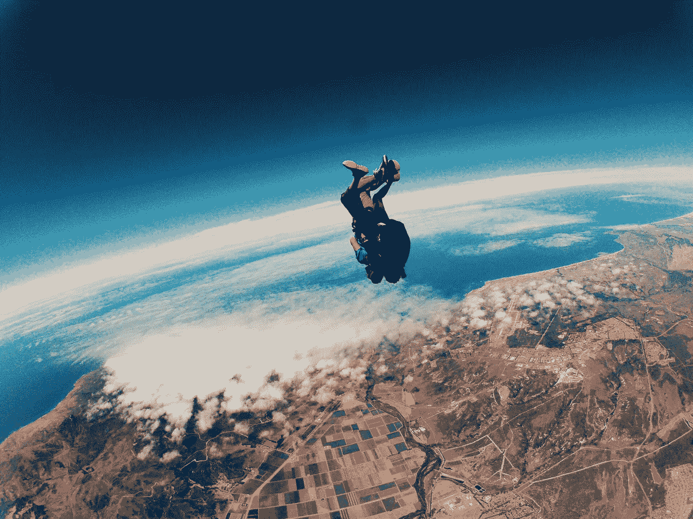

# 成功企业家的 7 个信念

> 原文：<https://medium.com/swlh/7-beliefs-of-successful-entrepreneurs-cc29f3097e14>

Photo by [Jake Ingle](https://unsplash.com/photos/EYfdLvVpEYQ?utm_source=unsplash&utm_medium=referral&utm_content=creditCopyText) on [Unsplash](https://unsplash.com/?utm_source=unsplash&utm_medium=referral&utm_content=creditCopyText)

想成功吗？你需要正确的信仰。

> 人类是他们信仰的集合。这些信念共同决定了我们如何思考、行动和感受。如果我们有错误的信仰，我们会以灾难告终。如果我们有正确的信仰，我们会兴旺发达。

很长一段时间以来，研究人员一直试图为企业家确定“正确”的信念。他们正在衡量企业家的信念，以及这些信念如何影响他们的业务成果。

哪些信念与企业家的成功相关？

哪些信念与失败有关？

我在这篇文章中的目标是让你看看你自己的[信仰体系](/intercultural-mindset/belief-systems-what-they-are-and-how-they-affect-you-1cd87aa775ff)，看看你是否有必要开始质疑你目前持有的一些信仰。

正如英国小说家和剧作家 T2·w·萨默塞特·毛姆所说:

> 如果你不改变你的信念，你的生活将永远是这样。这是好消息吗？

也许今天是你开始改变多年来阻碍你的信念的日子。但是要做到这一点，你需要迈出第一步——认识到你需要改变一些东西。

# 信念 1:

## “我的主要精力总是放在我能控制的因素上”

Photo by [Lucas Ludwig](https://unsplash.com/photos/BG2up1iaaKM?utm_source=unsplash&utm_medium=referral&utm_content=creditCopyText) on [Unsplash](https://unsplash.com/?utm_source=unsplash&utm_medium=referral&utm_content=creditCopyText)

想象一下，你正在驾驶一辆汽车，整个过程中你一直在想其他的汽车可能会撞上你，或者发动机可能会爆炸。

你不仅会紧张得崩溃，而且很可能会因为没有注意路况而撞上另一辆车。

思考你无法控制的事情只会做两件事:

1.  它让你焦虑

2.它会把你的注意力从真正重要的事情上移开

你不再关注下一步你可以采取的行动，而是关注所有可能出错的事情。

结果，你没有做任何有价值的事情。

是的，世界明天就会爆炸。股市可能会崩盘。你的工厂会被烧毁。你所有的顾客都可能决定转向你的竞争对手。

很多事情都有可能发生。

是的，这些事情甚至会迫使你改变计划。

但在大多数情况下，专注于你无法控制的因素是没有意义的。

你可以为一些现实中的问题场景准备一个应急计划，但是你的主要注意力应该始终放在下一步上，你可以将你的愿景变成现实。

# 信念 2:

## 不管情况有多糟，我都有能力找到解决办法

Photo by [Felix Russell-Saw](https://unsplash.com/photos/kbkyZAfSuFs?utm_source=unsplash&utm_medium=referral&utm_content=creditCopyText) on [Unsplas](https://unsplash.com/?utm_source=unsplash&utm_medium=referral&utm_content=creditCopyText)h

我们都知道，在创业过程中，很多事情都会出错。

一直都是。

全心全意相信自己能够应对任何突发状况的企业家将会胜出。他们有必要的自我效能感，在困难的情况下保持冷静，并专注于寻找解决方案。

他们将挑战视为学习和成长的机会。他们将失败视为暂时的挫折，并最终帮助他们让企业变得更强大。

没有什么能阻止他们前进。

当这些人设定目标时，他们会竭尽全力去实现这些目标。当这些人心中有了目标，他们不会让任何事情分散他们实现目标的注意力。

他们不断地在[前进](/swlh/daily-action-real-traction-7eff827b7d25)。一天一天来。

# 信念 3:

## “风险是这个过程中不可或缺的一部分。我尽量减少它们，但如果需要，我会处理它们”

Photo by [Muzammil Soorma](https://unsplash.com/photos/R11bppS4q8o?utm_source=unsplash&utm_medium=referral&utm_content=creditCopyText) on [Unspla](https://unsplash.com/search/photos/skydive?utm_source=unsplash&utm_medium=referral&utm_content=creditCopyText)sh

企业家不是极端的冒险者。他们对任何给定的风险和机会进行了非常清晰的分析。如果潜在回报远远大于风险，他们就会去尝试。

如果没有，那就随它去吧。

或者，他们找到了减轻风险的方法。

关于这一点，最著名的故事之一是理查德·布兰森如何着手创建维珍航空。他租赁了他的第一批飞机，如果他的商业计划失败了，他可以随时归还这些飞机，不需要额外的费用。

企业家不怕冒险。但是如果可以避免的话，他们也不会让自己暴露在不必要的风险中。他们并不特别喜欢冒险的情况，但他们接受这种情况，认为这是过程中必要的一部分。

对他们来说，风险总是计算的一部分。

对潜在收益的计算，以及承担该风险的后果可能导致的潜在损失。

# 信念 4:

## “我不会让压力控制自己。我用它来激励自己行动起来”

Photo by [Tim Gouw](https://unsplash.com/photos/1K9T5YiZ2WU?utm_source=unsplash&utm_medium=referral&utm_content=creditCopyText) on [Unsplash](https://unsplash.com/search/photos/stress?utm_source=unsplash&utm_medium=referral&utm_content=creditCopyText)

> 处在一个不确定的环境中。有很多钱和资源可以挥霍。被迫持续长时间工作。无时无刻不在经历变化。对他人负有责任。

企业家面临高度压力有很多原因。

然而，目前的研究得出了有趣的[结论](https://www.google.co.uk/search?q=Why+Entrepreneurs+Often+Experience+Low%2C+Not+High%2C+Levels+of+Stress%3A+The+Joint+Effects+of+Selection+and+Psychological+Capital&rlz=1C1CHBF_deDE788DE788&oq=Why+Entrepreneurs+Often+Experience+Low%2C+Not+High%2C+Levels+of+Stress%3A+The+Joint+Effects+of+Selection+and+Psychological+Capital&aqs=chrome..69i57j69i60.852j0j4&sourceid=chrome&ie=UTF-8)。与其他人相比，成功的企业家通常承受较少的压力。

请注意，我并没有说他们承受的压力更小。

相反，他们遭受的痛苦更少。

他们明白压力有积极的一面和消极的一面。积极的那种促使你行动，而消极的那种只会让你焦虑并产生消极的想法。

成功的企业家不会让压力战胜他们。相反，他们把压力作为一种能量来源，这使得他们更加努力地工作。

# 信念 5:

## “总有东西可以尝试，总有新东西可以探索”

Photo by [Jake Ingle](https://unsplash.com/photos/w_78KOJiih4?utm_source=unsplash&utm_medium=referral&utm_content=creditCopyText) on [Unsplash](https://unsplash.com/?utm_source=unsplash&utm_medium=referral&utm_content=creditCopyText)

好奇心和探索精神是企业家最重要的特质之一。总有更好的办法。总有改进的余地。总是有一些新的想法需要测试。

企业家相信不断实验的价值。

他们从不满足于现状。他们从不认为某样东西足够好。他们从未停止过寻找新问题和解决问题的新方法。

这并不意味着成功的企业家不致力于单一的行动方针。

探索很容易发生在他们经营的领域的边界内。

> 这意味着，对他们来说…
> 
> …总有增长的空间。
> 
> …总有价值可以创造。
> 
> …永远都有前进的潜力。

# 信念 6:

## “当情况不清楚或不明确时，我总有办法随机应变”

Photo by [Hailey Reed](https://unsplash.com/photos/2sgWX9pd8sI?utm_source=unsplash&utm_medium=referral&utm_content=creditCopyText) on [Unsplash](https://unsplash.com/search/photos/anxiety?utm_source=unsplash&utm_medium=referral&utm_content=creditCopyText)

企业家需要迅速果断地行动。当他们处于不明确的情况下(例如，由于许多未知因素)，他们会立即开始尝试寻找解决方案。

他们总是努力了解情况，并控制局面。他们专注于获取必要的信息，尽可能多地学习，一步一步地将光明带入未知。

企业家不怕高度复杂的挑战。

事实上，他们在其中茁壮成长。

他们相信，他们所面临的每一个挑战都让他们离目标更近了一步。

# 信念 7:

## “不管我被打倒得多惨，我都会爬起来”

Photo by [Katerina Radvanska](https://unsplash.com/photos/9OArB2hTrv0?utm_source=unsplash&utm_medium=referral&utm_content=creditCopyText) on [Unsplash](https://unsplash.com/search/photos/fight?utm_source=unsplash&utm_medium=referral&utm_content=creditCopyText)

无论有多少企业失败，成功的企业家都会再次尝试。不管他们的处境看起来有多糟糕，企业家总是会朝着他们的目标前进。

适应力是成功企业家的关键品质之一。

企业家知道，没有什么东西会在第一次尝试中奏效。他们知道，为了让困难的事情发生，他们必须一遍又一遍地坚持下去。

他们不允许自己因为一路上遇到的障碍而气馁。不管要经历多少次尝试，他们都会一次又一次地去尝试。

企业家完全靠意志力前进。

当其他人都认为没有办法做某事时，他们仍然坚持做下去。他们认为，无论形势看起来多么严峻，总是有可能找到解决办法的。

不管怎样，他们充分利用他们仅有的一点点资源。

# 结论:

为了成为成功的企业家，你需要建立一个企业家的信仰体系。在某些情况下，这可能需要你改变看待世界的方式。

以下是七个最重要的因素:

*   相信你能完全掌控自己的生活和事业
*   相信你能解决任何可能出现的问题
*   认为适度冒险是必要的信念
*   相信压力可以帮助你提高表现
*   探索和实验是商业永无止境的信念
*   相信你能处理高度复杂和模糊的情况
*   相信你总能从任何问题中恢复过来，你总能不断前进

**最后，你需要问自己的是:**

> 这些信念中哪一个不是你世界观的一部分？这些信念中，哪一个不是你日常生活的基础？
> 
> 你能采取什么步骤将这些信念融入到你的日常决策中？

**如果你觉得这篇文章有用请做👏并与你的朋友分享。记住，你最多可以鼓掌 50 次——这对我真的很重要。**

**您也可以通过** [**点击这里**](https://mailchi.mp/b0d1e1fba452/struggle-first-thrive-later) **订阅我的免费简讯。**

## 这篇文章发表在 [The Startup](https://medium.com/swlh) 上，这是 Medium 最大的创业刊物，拥有 318，120 多名读者。

## 在这里订阅接收[我们的头条新闻](http://growthsupply.com/the-startup-newsletter/)。

