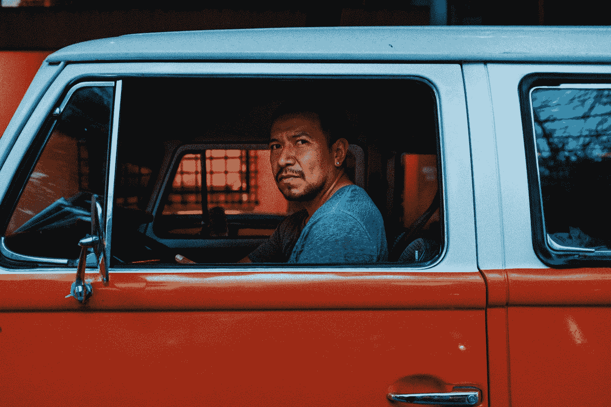

# 关于悲伤但真实的人，你需要了解的 7 件残酷的事情

> 原文：<https://medium.com/swlh/7-brutal-things-you-need-to-learn-about-people-that-are-sad-but-true-8dd079c09032>

Photo by [Frederik Trovatten](https://unsplash.com/@trovatten?utm_source=medium&utm_medium=referral) on [Unsplash](https://unsplash.com?utm_source=medium&utm_medium=referral)

我很少写这样的文章。不抱太大希望的人。那些我说出我心里想的话，而不在乎人们是否喜欢的话。

但是朋友们，我已经不想被人喜欢了。

> 如果你想了解我，没问题。如果你想评论下流的东西，没问题。如果你不同意我的观点，没问题。如果你不跟随我，很好。

我受够了关心。

我为什么这么在乎呢？

我的感情最近失败了。我在社交媒体上受到了很多讨厌的人的批评。我意识到很多人不在乎你。

> 我花了几个小时我没有的时间去帮助那些不在乎的人，有时，他们甚至在几个月后用一篇显然是为我写的文章来攻击我。

或者推特。

或者邮件。

事实是，在互联网上变得肮脏非常容易——随着我的平台不断发展壮大，我开始看到各种各样的人。

> 这让我心情很糟糕——主要是因为我相信人。这就是我的信息。但现在我开始不这么做了。我在质疑我是怎么打发时间的。

我想知道为什么我要花 4 个小时在 Twitter 上与某人来回交流，甚至花 15 分钟给某人写电子邮件，如果他不喜欢我关于 Medium 的免费电子邮件课程的一个微小的方面，我就试图赢回他们作为读者的心。

我是说，该死的，[是免费的](https://app.convertkit.com/landing_pages/290945?v=7)。

让我来解释一下你点击这篇文章的原因。准备好一些真相炸弹——我不在乎它们是否落在你的感受上。

# 1.人们真的没有安全感(即使他们说他们没有)

> 有趣的事实:当人们评论你的文章不同意你的观点时，你可以把这归因于不安全感。

比如，我知道你会说这是错的，人们只是想讨论一下，但你必须考虑一下人类心理学..

上帝禁止你送给别人不符合他们世界观的东西。

你知道在过去的两年里，我对一篇文章发表了多少次评论，说我不同意那个作者的观点吗？

> 0.

就像，我会让他们错了。否则我会认为我错了。

在很长一段时间里，我不明白为什么人们会有那样的反应。

比如说，你为什么要不厌其烦地告诉别人他们在某件事上“严重”错误呢？

> 一篇文章是如何影响一个人，让他在电脑前坐了两个小时并写下回应的？

不安全感。还有其他原因。

人们不在乎改变你的想法。他们关心的是让自己感觉更好。

你写了一些很多人都同意(因为掌声)但他们不同意的东西，他们想要“重新树立”他们想法的相关性，仅仅因为认为他们可能是错的会伤害他们。

> 所以他们给你写了本书。因为被人倾听的感觉很好。告诉自己“你很好，这很好”的感觉很好。你其实是对的，明白吗？很多人在为你的回应鼓掌，你现在可以去睡觉了。”

上帝保佑我们没有错。

不安全是大多数冲突的原因。

所以不要问自己“为什么我这么在乎这些人？”

提醒自己，这些人只是缺乏安全感。

# 2.人们不关心你，一接到通知就会对你发火

> 前几天，我和某人陷入了 5 个小时的推特风暴。这不是一场“特朗普级别”的推特风暴——嗯——实际上是。*😉*

那太好了。稍后我会谈谈我从推特风暴中学到的东西..但是让我吃惊的是，我几个月来来回回发邮件/聊天的人开始反对我。

从 2016 年末开始阅读我的人。

我被难倒了。

> 没有考虑到我的性格。没有考虑到我是一个怎样的人。他们刚刚转向了。像僵尸一样。这实际上是一个非常恰当的比较。

我甚至没有开始在 Twitter 上攻击任何人——我只是在为一个公开“不得不反对我”的人发布的视频的观点辩护。

就像该死的。我为这些人付出了太多。

> 但是人们忘记了。人们根本不在乎以前发生了什么。

人们转向了。人们不关心你。期待同样的事情发生在你身上。

还是那句话，我为什么这么在乎？

# 3.人们在你的生命中只是季节

我可以说你会保留你所有的朋友直到你死去的那一天，你的关系会像美酒一样陈年…

但我也可以说独角兽是存在的。

并不意味着这是真的。

我的大多数友谊都来了又去。有些人来了又走了几次——但他们并没有真正呆过。

人们会忘记。

# 4.给予，但不要给予太多

> 我可能浪费了 30%的工作日给那些永远不会再和我联系的人。

你可能会说这不是浪费，因为这有助于帮助别人/善业，但我会告诉你不要着急。

我想帮助正派的人——所以这完全是浪费。

我想帮助值得进步的人进步。

> 我不想帮助那些只想榨取我所有价值的人。是时候我开始表现得像我有 [50，000 名粉丝](https://findingtom.com/what-is-medium-com/)一样，不再回复任何想要我关注的人了。

我的注意力是有价值的。

我已经在这篇文章中说过两次了..

人们会忘记。

你付出这么多，是因为你关心他们，希望他们成功——而他们回报的却是讽刺、挖苦和忘恩负义。

> 这很痛。这让你不想再付出了。这让你觉得自己一开始付出就很愚蠢。

还是那句话，大多数人不在乎你，他们在乎的是你能为他们做什么。

我明白了大多数人只是追求第一(即使他们不知道)，他们不会太注意你为他们做了什么。

我也明白，我们应该给予而不期望回报..

但是该死的，不要把你的时间浪费在那些只索取不回报的人身上。你值得被欣赏。欣赏让我们快乐。所以去你被欣赏的地方吧。

# 5.人们不会说他们错了——所以不要试图“让他们有不同的看法”

妈的，你上次听到别人说他们错了是什么时候？

> 我曾经写过互联网是如何成为一个伟大的发展工具的，因为[你把你的想法放在那里](https://findingtom.com/guide-to-blogging-for-beginners/)，人们用他们的想法回应，因此你现在能够提高你最初的想法/自我。

这在现实世界中是行不通的。

上述信念假设双方都善待对方，并愿意改变对某件事的看法。

> 大多数情况下，这种情况是这样的:有人先骂你一堆名字，然后愤怒地表达自己的观点，然后又骂你一堆名字，最后才摔门出去。

喜欢，酷，我猜你对[我的自由职业文章](/swlh/why-ill-never-f-freelance-ever-again-4325889492df)有很强烈的感觉..

谢谢你。

为什么不去辩论一些重要的事情，比如枪支管制之类的？

见鬼，为什么要辩论？

> [我曾经生活在这个玫瑰色的乌托邦世界](/@tomkuegler/i-was-wrong-i-need-to-admit-this-publicly-3c3486b171e1)，在那里我认为互联网可以帮助我们克服公民辩论的分歧。

就像，该死，我是伴随着互联网长大的——我怎么会这么笨呢？

这里没有争论。大多数情况下，只有仇恨、辱骂、愤怒和争论，这些表面上看起来 100%正确，但实际上却非常荒谬。

但是我们把它框得很好，让我们的方式看起来是正确的，因为，上帝禁止我们犯错。

人们不会说他们错了。

接受吧。

# 6.大多数人和你交往是因为他们想从你身上得到什么

> 事实上，当你在互联网上走红时，这种情况会成倍增加。当你有影响力的时候。

有人评论你的作品，你认为它是 100%真实的，你很享受这种对话，但一个月后你收到他们的一封 19 分钟长的电子邮件，问你是否可以帮助他们推广他们的新电子书/课程。

就像，该死的伙计，你评论我的文章就为了这个？

有些人这样做，而且是真诚的(又名[马修·肯特](https://medium.com/u/5c8449e5d197?source=post_page-----8dd079c09032--------------------------------)——马特我想给你贴上标签，这样你就知道我不会这样看你)。但其他 99%的人只是想要些什么。偷偷的。

整个刺拳，刺拳，刺拳右勾拳对我不起作用。连右钩拳都不要出。事实上，如果你做得好，我可能会给你一个正确的钩子。我能有多体贴就有多体贴。

喊出[加里·维纳查克](https://medium.com/u/c4ec9163657c?source=post_page-----8dd079c09032--------------------------------)。

# 7.你不可能让每个人都满意，所以要表明立场

最近，我和某人就我制作的一部以菲律宾为主题的视频发生了争执。叫做“菲律宾不危险。”

这意味着在许多人的眼中拯救这个伟大的国家，这些人听到了关于 ISIS 和戒严令甚至杀害毒贩的消息，认为这个国家是一个无法无天的战区。

我制作这个视频是因为许多菲律宾人对媒体如何描绘他们的国家感到不安。

> 事实上，我是应一个跟踪我的菲律宾人的要求制作这个视频的。所以我做了。

> 这让美国人很受伤。实际上，有三个美国人受伤了。我不知道为什么，因为他们并不真正关心菲律宾(否则他们可能会像我一样去 30 天——或者在他们生命中的某个时候去过)。

或者，你知道，和一个菲律宾人聊过。

他们说我漏掉了几个部分。他们说这是不负责任的。他们说我不知道我在说什么。

> 讽刺的是，一群从未去过菲律宾的人告诉去过的人，他不知道自己在说什么，不是吗？

我跑题了。

这不是重点。关键是每个国家都很危险。每个国家都有衰落的时候。是的，我本可以把时间花在那个视频上来概括所有的 3950198304 个你可以死在菲律宾。

> 马尼拉某个街角的一家餐馆上方的松动玻璃。那棵喜欢把椰子砸到无辜路人头上的流氓椰子树(有时这是致命的)。别忘了！你可能会被三轮车撞倒！

我想我们都知道每个国家都有自己的危险。

见鬼，美国一直都有大规模枪击事件。

我的观点是，菲律宾(尤其是棉兰老岛)并不是一个无法无天的、野蛮的西方独裁国家，那里的人们随时都想杀了你。

总的来说是安全的。我会袖手旁观，直到我死的那一天(对一些可能发生在菲律宾)。我现在不开玩笑了。

> 有趣的是，我没有听到任何菲律宾人抱怨我的视频——事实上，在我写这篇文章的时候，它在脸书有超过 400 个[的分享和 11000+的浏览量。](https://www.facebook.com/FindingTom/videos/2096336487308788/?hc_ref=ARTHCpRb8gqBhy4bWzhl7ey2SXxJKQHWliypAvDRrd7r6lgPMvYzsjYEx7RHwq4Ah2U)

是菲律宾。这是一个美丽的国家。它有它的问题，但我们也有，对吗？

也许有一天，我会更详细地谈论他们的问题，但是对于那些因为我的视频而决定去菲律宾的 1-2 个美国人来说..我相信你不仅会过好你的生活(我不敢相信我真的要写这个)——而且你也会过得很愉快。

你不可能让每个人都满意。

表明立场。

> “你有敌人吗？很好。这意味着，在你生命中的某个时刻，你曾为某些事情挺身而出。”
> 
> ——温斯顿·丘吉尔

# 为什么人们对我这么刻薄？

整篇文章试图回答一个问题..

为什么人们对我这么刻薄？

为什么有人伤害我？

我们已经知道很多人都没有安全感。他们没有足够的安全感去评论一个素未谋面的人的帖子，因为他们宝贵的世界观被动摇了。

比尔·马厄最近说，美国人“将不得不学会彼此相处”

我们国家现在存在巨大的政治分歧。就像我指出的第六点，我们不可能改变任何人对任何事情的想法。

在过去的 5 年里，我一直在网上写博客，我发现在阅读我的文章之前同意我的人会支持我的文章，而在阅读我的文章之前不同意我的人会阻止我。

事情就是这样。

为什么人们对你我如此刻薄？

因为他们认为改变观点是一场他们能赢的游戏。他们赢不了那场比赛。

# 别太在意了，我在跟你说话

> “我为什么这么在乎？”

你问过自己这个问题吗？很好。这篇文章可能会帮助你。

我觉得被人伤害的核心源于在乎。

我们太在乎人了。我们关心他们的想法，我们是否伤害了他们，或者我们是否为他们做了足够的事情。

我给你的建议？

别在乎了。

大多数人都不关心你，所以不要再给那些坏苹果了。

接受人们会背叛你。

表明立场。有信念。反正你不同意又有什么关系？没有人真的会改变(让我们实际一点)。

注意:有些人确实会改变。一些好苹果。一些会伴随你直到你死去的那一天..

但这种情况极少发生。

过好自己的生活。不在乎。

这是我快乐的新秘诀。

到目前为止效果很好。

> 在这里获得我的免费 5 天中等写作课程。它会教你如何每周写五篇文章，并成为媒体上的顶级作家。:)