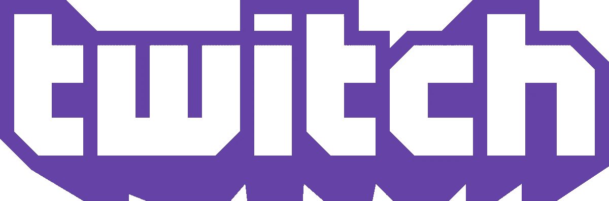
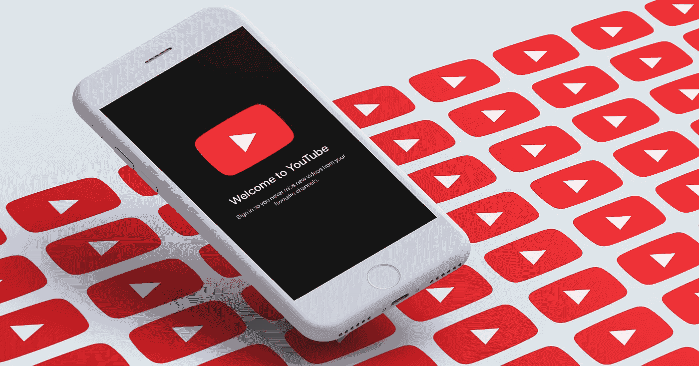
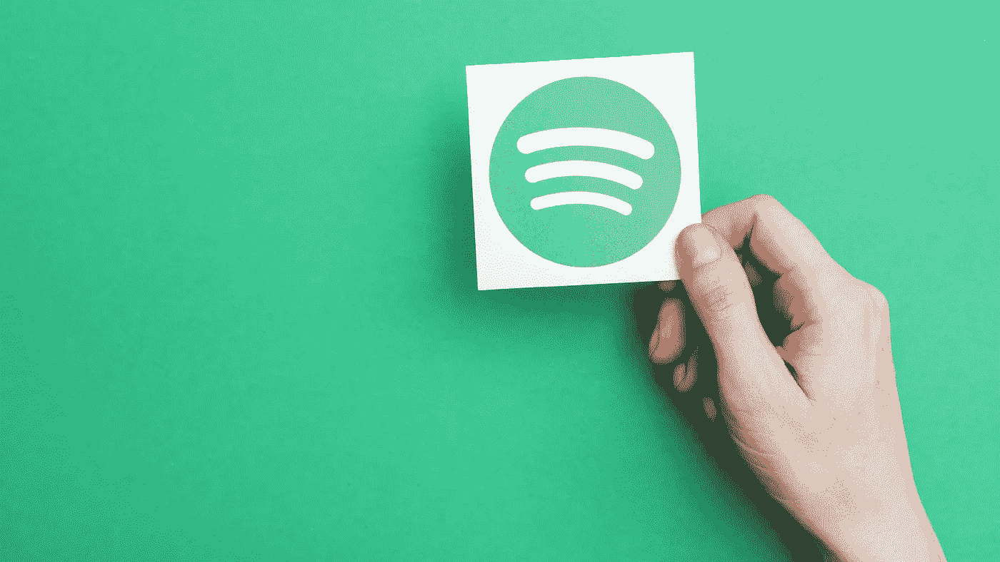

# 你可能还没有尝试过的 7 种新的、有创意的营销方式

> 原文：<https://medium.com/swlh/7-creative-ways-to-market-your-startup-you-probably-havent-tried-yet-3c44c358fe6f>

Credit: Salesforce

> 营销年年变。不要落后。这里有七个创意，可以在 2019 年有效地营销你的创业公司。

似乎随着时间的推移，新的创业营销策略很快就变成了老一套。当涉及到你的营销时，有理由坚持“可靠的和真实的”,通过定期试验新的策略，你可以获得比你的竞争对手更大的优势——即使在你尝试的无数技巧中只有一个是赢家。

随着 2019 年的快速临近，这里有七种新的营销策略，你的初创公司可能还没有尝试过。

# 1.雇佣一个有影响力的人加入你的内容团队

对于初创公司的创始人来说，特别是那些处于早期到中期发展阶段的人，任命一个有影响力的人(当然是有实际商业经验的人)成为你的内容团队的一部分是一种很少使用的营销策略。

临时雇佣一个有影响力的人来推广你的产品是一回事，但是雇佣一个人成为全职员工呢？对于创业公司来说，牵引很难。对于影响者来说，稳定的收入是不太可能的。这使得这个角色成为创业公司的潜在天作之合，这将从影响者那里获得巨大的品牌曝光，让他们的观众知道他们在哪里工作。如果没有 Casey Neistat 在 YouTube 上的大量关注，大多数人可能都不会听说过他的初创公司 Beme。

# 2.与 Twitch streamers 合作

凭借每月在 Twitch 上超过[460 亿分钟](https://twitchtracker.com/statistics)(比去年增长 56%)的观看时间，显然，游戏玩家的直播将会持续下去。更普遍的是，随着电子竞技现在在 ESPN 等主要网络上获得好评和播放时间，这个空间的轨迹和 Twitch 自己的轨迹看起来很有希望。

无论你的预算是否允许你与一流的流媒体公司或受众较少的公司合作，这些人与他们的追随者之间的密切联系都可以为你提供创业公司从零到无限所需的曝光率。

# 3.使用介质

在所有媒体上排名前 10 的出版物中(根据订户数量)，有 7 份与初创公司和技术相关。正因为如此，这个平台上的读者群明显倾向于技术人员，这为你的公司获得关注创造了一个绝好的机会。

至于*如何利用媒体来获得关注，你可以创建一个与你的品牌相关的媒体出版物，作为创始人通过发表相关主题的文章来发展个人品牌，以建立思想领导力，或者赞助一个已经建立的出版物。如果做得正确，这些策略中的任何一个都可以帮助你的公司吸引更多的眼球。*

***相关:点击这里*** ***查看我成为顶尖作家的可靠指南*** [***。***](/the-mission/an-infallible-guide-how-you-can-be-a-top-medium-writer-key-learnings-from-my-experience-f6647b237061)

# 4.试试 YouTube 前置广告

尽管许多前置广告可能令人讨厌，但随着比利·吉恩、泰·洛佩兹和萨姆·奥文斯等人的成功突围，很难否认这种媒体为买家提供的潜力。因为 YouTube 强迫用户观看至少五秒钟的这些广告，如果你决定投资 YouTube 前滚动广告，品牌知名度将是你的创业公司不可避免的。

# 5.和播客广告

老实说，在我过去三年尝试的十几个在线产品中，除了两个以外，都是因为喜剧演员比尔·伯尔给了他的播客听众一个促销代码来尝试产品或服务。我还购买了像 Four Sigmatic 这样的产品，这是蒂姆·菲利斯播客的结果，也是刘易斯·霍维斯播客的结果。

虽然我只是一个人，但这象征着播客的营销力量。因为音频为听众提供了这样一个亲密的环境，主持人和观众之间建立的信任和纽带非常强大，这使得为赞助节目的品牌销售产品变得容易得多。

# 6.赞助优步

你可能已经见过一些顶级的 YouTube 创作者推广品牌的产品和服务。然而，YouTube 最棒的地方之一是，无论是从观众规模还是题材来看，它都有各种各样的创作者。如果你的预算有限，试着联系一个受众较少的 YouTuber。因为广告支付给大多数创作者的报酬很少，所以他们很可能很乐意，甚至很兴奋，为他们通常出于热情免费做的事情获得补偿:创作视频。

# 7.试试 Spotify 的广告工作室

Spotify 最近推出了一个名为 Spotify Ad Studio 的自助广告平台。该平台每月有超过 1.09 亿的听众，可能是一种聪明、低价的方式来接触相关受众。花些时间细读各种可用的广告选项，看看是否有一个适合你的创业。

由于可供选择的方案非常多，对于初创公司的创始人来说，确定一个特定的营销策略可能会很快变得势不可挡。今年，在坚持已经对你有效的策略的同时，不要害怕尝试新的东西。本文列出的七个想法是一个很好的起点。祝你好运。

# 行动呼吁

如果你想让自己在社交媒体上尽可能处于成功的最佳位置，看看我的小册子:《成功社交媒体营销的 7 种心态转变》 ***】。***

*原载于 2018 年 11 月 15 日*[*www.inc.com*](https://www.inc.com/dakota-shane/7-creative-ways-to-market-your-startup-you-probably-havent-tried-yet.html)*。*

## 这篇文章发表在 [The Startup](https://medium.com/swlh) 上，这是 Medium 最大的创业刊物，拥有+391，714 名读者。

## 在这里订阅接收[我们的头条新闻](http://growthsupply.com/the-startup-newsletter/)。

