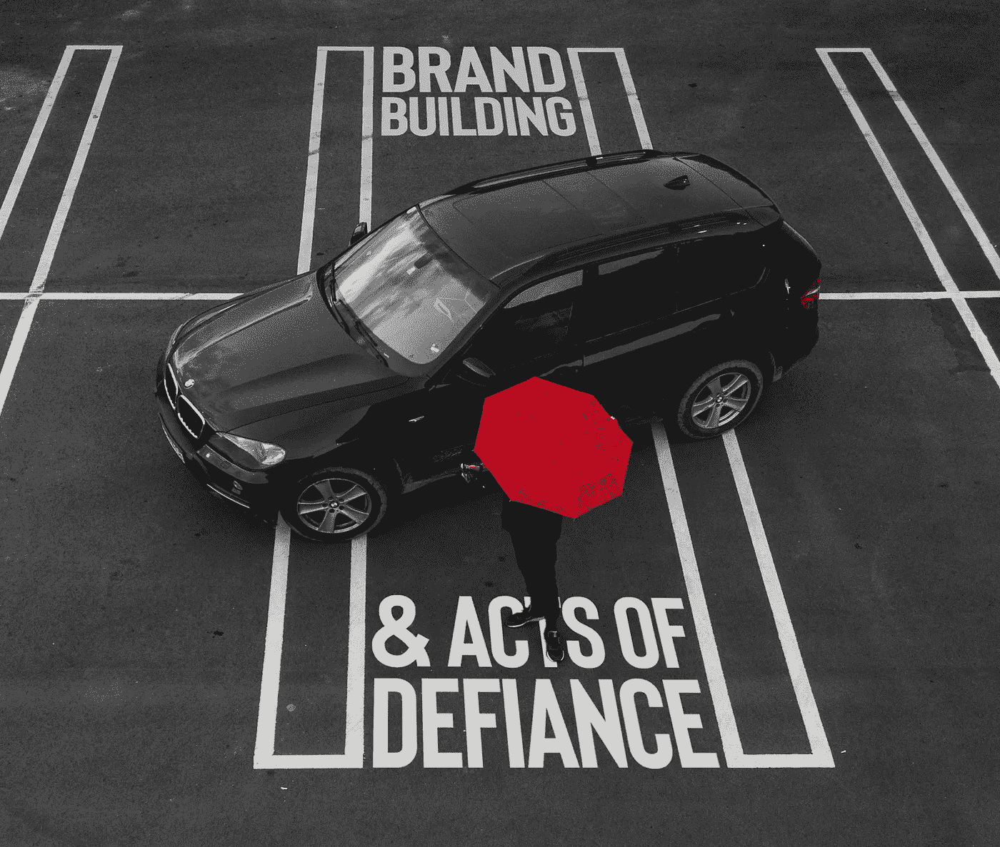
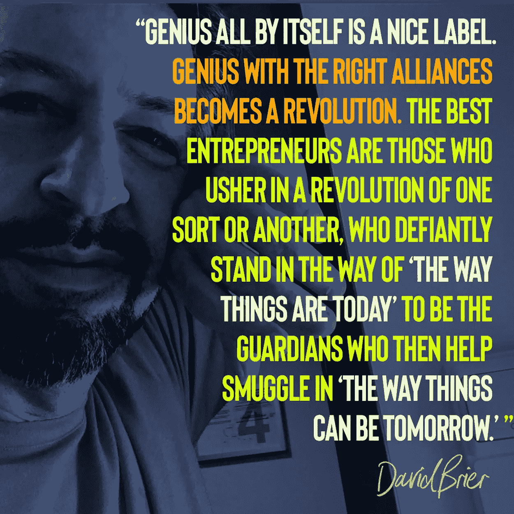

# 真正品牌建设的 7 个步骤

> 原文：<https://medium.com/swlh/7-defiant-steps-for-true-brand-building-8b47be0821b6>

品牌建设。

开始[一个动作](https://www.risingabovethenoise.com/brand-intervention-transform-brand-movement/)。

开始[一场革命。](https://www.risingabovethenoise.com/3-secrets-to-launching-a-brand-revolution/)

这些都是同一个基因库的表亲。每一个都是 ***一种(辉煌的)反抗行为。***

这是本周新的*周三一分钟的主题。*

# 品牌建设的历史

让我们看看历史(对于下面列出的这些创造者、运动和远见者，他们都在更大的事物计划中创造一个品牌):

*   毕加索挑战传统的艺术、解剖和形式。
*   ***立体主义*** 在透视中藐视“数学理性”。
*   甲壳虫乐队 蔑视“吉他音乐正在过时”的传统
*   梵高挑战传统的绘画技巧、色彩和我们看待世界的方式。
*   ***昆汀·塔伦蒂诺*** 违抗了*低俗小说中讲故事顺序的传统。*
*   马丁·路德·金挑战了人类历史必须决定未来潜力的基本原理。
*   安迪·沃霍尔 藐视一切规范，在汤罐的基础上建立了一个艺术帝国。
*   *摩城不顾任何音乐先例，引入了一种新的流行灵魂音乐，这种音乐定义了未来的几代人。*
*   *史蒂夫·乔布斯挑战了图形用户界面没有必要的观念。*
*   *米勒·戴维斯在爵士乐被认为是规则之前，就挑战了传统，打破了规则。*
*   *著名建筑师弗兰克·盖里为了给世界带来美，挑战可预测的建筑惯例。*

# *挑战、品牌建设和重塑品牌的 7 个步骤*

1.  *找到一些“必须这样做”的产品或服务*
2.  *发现是否有更好的方法。*
3.  *测试出更好的方法。*
4.  *确认或提炼你的怀疑*
5.  *与世界分享这一发现。*
6.  *和其他可疑的人联系。*
7.  *传播消息。*

*简而言之，这就是蔑视。它适用于[品牌](https://www.risingabovethenoise.com/new-video-teaches-magic-branding-2-minutes/)，适用于[品牌重塑](https://www.risingabovethenoise.com/how-to-rebrand-19-questions-ask-before-you-start/)，也适用于初创公司。*

*在 YouTube 上获得你的[每周剂量](https://www.youtube.com/watch?v=qSigyw5S4AM&list=PLpkEFqzZFOZ_aeEt44vIDEGWCO4mUW9Tp)的 ***品牌挑战和品牌建设(换句话说，现在就订阅)。****

*你好世界。我们来了。😉*

****

## *这篇文章发表在 [The Startup](https://medium.com/swlh) 上，这是 Medium 最大的创业刊物，有+ 370，107 人关注。*

## *在此订阅接收[我们的头条新闻](http://growthsupply.com/the-startup-newsletter/)。*

**