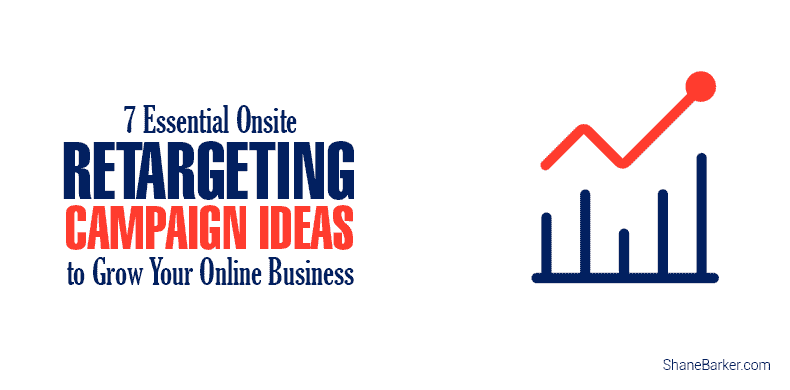

# 7 个重要的现场重新定位活动创意，以发展您的在线业务

> 原文：<https://medium.com/swlh/7-essential-onsite-retargeting-campaign-ideas-to-grow-your-online-business-fa4d1be8ff7d>

如果你想在网上发展业务，创造一个吸引人的在线网站体验是关键的一步。通常情况下，商业领袖会走之前会跑。分清轻重缓急，否则你将付出高昂的代价。

你怎么知道你是否错过了一个步骤？

你已经建立了一个电子商务杰作，并在时间、精力和金钱方面付出了相当大的代价。也许你考虑过或者已经尝试过 Adwords 或脸书广告？如果是这样，请停止。

如果我在做广告前阻止了你，那你就省了一大笔钱。对于那些尝试过谷歌 Adwords 或脸书的人来说，很明显，这并不令人印象深刻。

精选的相关内容:

*   [增加电子商务销售额的 8 种最有效方法](https://shanebarker.com/blog/increase-ecommerce-sales/)
*   [如何利用 SEO 提高转化率优化](https://shanebarker.com/blog/seo-improve-conversion-rate-optimization/)

当你的广告活动的管理和资金成本超过你的回报时，这是错过的一步的常见症状。

如果以上任何一种情况描述了你的情况，那么这篇文章就适合你。

在你踏上谷歌 AdWords 过山车之前，你确保你有很大的转化率了吗？

在你准备好之前驱动网站流量就像在学会开车之前把车开上高速公路。你的电子商务网站正走向崩溃！

在购买网站流量之前，确保你了解你的访问者的访问原因。

你可以通过设置谷歌分析和仔细分析你的访问者行为来做到这一点。这将使您能够将您的访问者划分为不同的类型，以便更好地确定目标。

此外，它还将为您提供创建销售漏斗所需的信息。销售漏斗确定了每位顾客在购买过程中所处的阶段。这样你就可以通过软转化来锁定他们，让他们在销售漏斗的底部购买。

规划销售漏斗需要深入了解你的访客，他们对什么感兴趣？“我怎样才能给我的用户他们想要的东西？”这个问题的答案是必要的。

第一个问题并不难，深入挖掘你的谷歌分析。找到你的访问者在看什么网页，看了多长时间。然后考虑在购买过程中的什么时候，访问者可能会阅读这些内容或采取特定的行动。

如果你既有产品又有合适的受众，但仍然没有“看到钱”，那么你就错过了个性化。

个性化有许多更小的步骤，这些步骤都会产生影响。不要太专业，下面是一些有效的建议，可能适合你的商业模式，并提高你的转化率。以下所有建议都是[现场重定位](https://www.optimonk.com/?utm_source=guestblog&utm_medium=shanebarker&utm_campaign=shanebarker-guestblog)的示例。

现场重定向的工作原理是监控访问者的行为，如果访问者准备好了，就触发额外的消息。通常这是一个弹出窗口，侧边栏，纳米条，或者甚至通过使用幸运轮。

最终目标是通过向放弃的访问者提供二次报价或额外的激励来转变他们的购买行为。

因此，您可以大幅降低您的点击付费成本，并通过现场重新定位改善您当前的点击付费预算的结果。

你是现场重定位的新手吗？别担心——以下是开始行动的 7 大选择:

# 1.以一种有趣且有吸引力的方式吸引你的访客

让你的访问者感觉像一个胜利者，你就更有可能吸引他们并转化他们。

你可以通过游戏化你的转换过程来实现这一点。提供一个他们有很大机会获胜的竞赛，有不同程度的成功和奖励价值。

上面的例子是 Optimonk 的幸运轮弹出窗口，它可以用来赢得不同大小的折扣，以换取他们的时事通讯订阅。任何没有损失的竞赛或博彩都将提高你以前没有的转化率。

精选的相关内容:

*   [打造盈利销售漏斗的 41 个最佳工具](https://shanebarker.com/blog/tools-for-building-a-profitable-sales-funnel/)

# 2.将早期访问者转化为时事通讯订户

销售漏斗的顶部是入口点，这是为尚未确定的新访客准备的。

这一点很重要，因为平均 97-98%的游客离开时没有购买。从那些离开的，其中大部分再也不会回来，所以这是至关重要的游客离开前获得详细资料。

最有效的方法是利用退出意图检测技术。

退出检测会触发一个弹出窗口，让他们有理由继续使用您的网站。这里的例子包括他们的第一个订单的折扣或电子邮件订阅的折扣。

# 3.推广您的特别优惠

每个人都喜欢觉得自己得到了一笔好交易。通过提供他们已经感兴趣的特价商品的详细信息，将大大提高转化率。

这里的诀窍是不要给那些已经打算全价购买的游客提供折扣。

这种策略对每个人都有利，最重要的是，如果你的客户得到一笔好交易，他们更有可能再次光顾。考虑一下，转化现有客户比转化新客户要容易得多。这一策略赢得了游客的忠诚度。

精选的相关内容:

*   [你现在需要知道的 11 件事，以增加销售和潜在客户](https://shanebarker.com/blog/sales-and-lead-generation/)

# 4.恢复购物车放弃者

这个策略可能是所有策略中最有价值的。

考虑一下，从购买这些产品的 2-3%的访问者中，相当于 32%的访问者将产品添加到他们的购物车中。这意味着，如果没有更好的报价，你会让 68%感兴趣的客户离开，很可能永远不会回来。

你可以通过为访问者建立退出意向活动来极大地提高转化率。特别针对那些已经在购物车中添加了一些东西但没有完成购买的人。

在很多情况下，一个简单的通知就可以了:“等等，你把一些东西落在你的购物车里了！”但是如果你想确定并抓住对价格敏感的访问者，提供折扣或免费送货。或者两者都有，如下例所示。

永远记得给你的弹出窗口添加一个截止日期或倒计时定时器，以增加紧迫感。降低利润来转化访客是值得的，因为之后更容易卖给他们。

另一个要考虑的因素是，如果他们不从你这里购买，那么他们就会去找竞争对手

# 5.推荐相关产品和追加销售

向访问者追加销售和交叉销售的最佳方式之一是根据用户行为推荐产品。

转化那些很清楚自己想买什么，但不确定哪种选择最符合自己需求的访问者。

你的访问者会欢迎你的推荐，尤其是当你有很多相似的产品可供选择的时候。这里最重要的因素是使你的推荐准确并与你的访问者相关。

这种产品推荐策略可以通过为你的电子商务网站建立一个推荐引擎来实现，尽管这需要大量的工作。

一种更简单、更具成本效益的方法是利用 OptiMonk 的内置模板，它可以帮助您快速开始推荐产品。

在线零售商 ThreeDropsOfLife.com 的平均订单价值增加了 63%，购买数量增加了 75%。

精选的相关内容:

*   [优化移动转化率的 6 种超级有效方法](https://shanebarker.com/blog/effective-optimize-mobile-conversion-rates/)

# 6.视频转换

利用产品视频展示产品最好的一面，带文字描述的图片不简单明了，因为使用视频不仅可以展示产品，还可以演示产品。视频对于解释所提供的服务特别有用。

# 7.测试 Messenger 弹出窗口和对话营销

虽然邮件营销仍然是一个至关重要的营销渠道，但平均打开率只有 12%左右。通过 Facebook Messenger 发送的相同消息平均会带来 85%的打开率。

因此，现在不是收集新的电子邮件订户的时候，而是开始信使营销的最佳时机。扩大您的 Messenger 列表，通过 Facebook Messenger 发送自动消息，就像克里斯蒂亚诺罗纳尔多所做的那样:

Messenger 弹出窗口有一个一键式订阅表单:访问者只需点击 CTA 按钮即可。因此，购物者——尤其是移动用户——将获得最佳的订阅体验。

# 结论

以上所有的参与建议都会提高你的转化率。当以有针对性的方式与正确的受众一起使用时，可以极大地提高您的广告投资回报率。

现场重定位没有输家，只有赢家:你的访问者以优惠的价格获得他们想要的东西，你赢得了他们的客户。

精选的相关内容:

*   [2018 年你需要知道的 37 个 CRO 工具，以增加你的影响力](https://shanebarker.com/blog/cro-tools-2018/)
*   [提升转化率的 10 大登陆页面最佳实践](https://shanebarker.com/blog/landing-page-best-practices-boosting-conversions/)

随着时间的推移，你可以通过电子邮件营销，Facebook Messenger 营销，现场重新定位和再营销来重新定位放弃的访问者。

当结合使用时，这种策略可以大大提高你的网站转化率，使你能够持续击败平均 3%的转化率。

***原载于***[***【Shanebarker.com】***](https://shanebarker.com/blog/onsite-retargeting-campaign-ideas/)***。***

**关于作者**

谢恩·巴克是[内容解决方案](https://contentsolutions.io/)和 [Gifographics](http://gifographics.co/) 的创始人兼首席执行官。你可以在[推特](https://twitter.com/shane_barker)、[脸书](https://www.facebook.com/ShaneBarkerConsultant/)、 [LinkedIn](https://www.linkedin.com/in/shanebarker/) 、 [Instagram](https://www.instagram.com/shanebarker/) 上和他联系。

## 这篇文章发表在 [The Startup](https://medium.com/swlh) 上，这是 Medium 最大的创业刊物，拥有 338，320 多名读者。

## 在这里订阅接收[我们的头条新闻](http://growthsupply.com/the-startup-newsletter/)。

