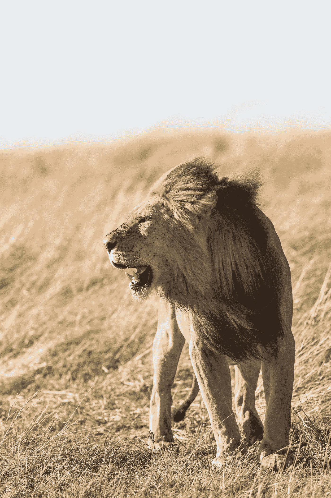

# 低效领导者的 7 个习惯

> 原文：<https://medium.com/swlh/7-habits-of-highly-ineffective-leaders-d9c4d581b820>

## 以及如何修复它们

“shallow focus photography of lion at the wildlife” by [jean wimmerlin](https://unsplash.com/@jwimmerli?utm_source=medium&utm_medium=referral) on [Unsplash](https://unsplash.com?utm_source=medium&utm_medium=referral)

我曾是一名运动队长，通过做一些小事来发挥领导作用。不管是什么运动，我都提着水壶在令人生畏的山上爬上爬下，为了练习，我们不得不走上走下。我把所有的袋子都排好了，所以对球迷和教练来说它们看起来很完美。训练结束后，当没有人愿意的时候，我捡起了所有的甜筒。我的举止总是一样的。我关心我们正在做的事情，我非常努力地工作，我坚持做我认为别人不会做的事情。然而，那只是 95%的情况。

另外 5%的时间是我们团队面临困境的时候。缺乏活力，连败，一系列不幸的事件。当生活变得艰难时，我变得疏远了。我会跳过一些通常由我接手的琐碎任务，我会保持自我，我不会支持团队的最佳整体利益。

领导者有各种形状、形式、颜色和大小。我无法在艰难时期重整旗鼓，这只是我作为一名领导者无数不理想的习惯之一。幸运的是，有许多战术可供领导者用来指挥先锋团队。

但是，也有太多的无效策略，就像我自己的一样，导致团队脱节，产生不健康的冲突，并导致缺乏纪律，这在短期和长期内都可能证明是非常昂贵的。这 7 个无效的领导习惯只是领导者在试图建立和发展他们的团队和公司时可能拥有的一些最危险的风格。

# **1。** **领导公开批评**

我在成长过程中为两个不同的足球队效力。同样的球员，同样的场地，同样的目标。这两个队之间的一个不同因素是教练。

迪克斯山雷霆队的教练是一个叫伯特的家伙，我们赢得了 4 个州冠军，2 个地区冠军和一个国家铜牌。

另一个队的教练是一个叫亚历克斯的家伙，我们什么也没赢。没有冠军，没有奖牌，没有奖杯。

教练有机会在每场比赛之前、之后和中场休息时与球员交谈。赛前演讲几乎总是激励球员在比赛前进入正确的状态。然后，根据教练的不同，中场休息和赛后讲话要么是突出优异表现的机会，要么是批评低于标准的个人的机会。

走进亚历克斯的半场演讲就像等待你知道自己犯下的罪行被定罪。他会诋毁，贬低和谈论我们没有达到他的期望的具体戏剧。对他来说，这些攻击是针对个人的、激烈的和骄傲的。

伯特·拉瑟会在中场休息时表扬关键球员。在球场上，大家聚在一起，微笑着谈论我们刚刚上演的节目，这是一种享受。更重要的是，如果有一个球员在那里挣扎，我会永远记得伯特搂着他，进行私下交谈，而不是在整个团队面前攻击他。

不用说，伯特执教的球队是我有幸效力过的最有胜算的球队，而亚历克斯不是。

当向你的团队提供反馈时，使用公共论坛进行表扬，然后私下交谈进行批评。

# **2。** **领导把不属于自己的工作归功于自己**

你知道那些画中眼睛异常大的人吗？好吧，那个因那些画而获得荣誉的人实际上并没有创作任何一幅画。真正的画家是他的妻子玛格丽特·基恩。

在 1986 年的一起法庭诽谤案中，法官命令他们两人画一幅公众熟悉的大眼睛的图像。该男子引用肩膀酸痛作为不参与这一愚蠢特技的理由，但就在他抱怨的时候，玛格丽特在 53 分钟内创作出了一幅美丽的大眼睛肖像。她获得了 400 万美元，她的丈夫因不诚实和缺乏诚信而公开蒙羞。

该表扬的时候就要表扬。如果你做出了伟大的工作，为你的 *工作感到自豪。但是，如果人家产生了伟大的作品，以自己的***作品为荣。**

# ***3。**领导拒不承认错误*

**

*2010 年 4 月 20 日，墨西哥湾的一个石油钻井平台发生爆炸，造成 11 人死亡，造成美国历史上最严重的石油泄漏。引用英国石油公司首席执行官托尼·海沃德的话说，*

> *“我认为这场灾难对环境的影响可能非常非常小”，*

*但当被问及此事时，他决定归咎于他人，而不是承担责任。*

> *“钻井平台的安全责任由越洋公司承担。这是他们的钻机，他们的设备，他们的人，他们的系统，他们的安全流程。我们将在适当的时候处理这些问题。今天我们关注的是回应。但正如我所说，钻机上的系统流程是钻机公司的责任。"*

*顺便说一句，这一回应与他对该事件的道歉无关，也与他对在他的石油钻井平台上遇难者的家人和亲人的良好祝愿无关，但却受到了媒体的谴责，并导致了更糟糕的问题。但是，这不是我们最后一次听到托尼的消息…*

*当你的组织或团队中发生一些事情时，掌握主动权。错误可以归咎于许多不同的因素，但是你越快、越有效地承认事故，你在重建过程中就能越快、越好。*

# ***4。** **领导者把自己的需求看得比团队的需求更重要***

**

> *“我只想要回我的生活。”*

*这是托尼·海沃德对多个新闻来源的真实陈述！*

*很明显，在这个公司紧急、恐慌和即将毁灭的时刻，托尼更感兴趣的是这件事对他个人的影响，而不是他所领导的那些人。同样，没有关注解决方案，没有关注所有权，最重要的是，没有关注那些被这一事件永远改变了生活的人们。*

*这不是也永远不会是关于你的。*

# ***5。** **领导者对自己的信念坚定不移***

*不愿改变是一个领导者可能具有的最令人虚弱的特征之一。在斯坦利·麦克里斯特尔将军的新书《领袖:神话与现实》中，他谈到了有史以来最具创造力、想象力和革命性的领袖之一:华特·迪士尼。*

*麦克克里斯托解释说，当商业世界开始转变，公司更多的资金重点可以通过许可、合作、收购和消费品版税来发展时，华特·迪士尼不会让步。他继续追求公司的创造性，创造新的故事情节和想法来激励数百万人，但他放弃了商业方面。沃尔特的哥哥实际上接管了该公司的业务领导，将它建设成今天的发电站。*

*迪斯尼兄弟组合有一个伟大的领导风格，沃尔特承认自己缺乏商业头脑，并将公司控制权交给他的兄弟，这是有益和有效的。但是，作为一个领导者，因为他不能调整和适应新的方式，沃尔特将注定失败。*

*永远不要满足于一成不变。世界在变，我们也要变，我们的团队也要变。*

# ***6。** **领导者的首要战术是恐惧***

*我不想谈论他太久，因为光是这个名字就让我火冒三丈，但早在性虐待、强奸和不当行为这些不足为奇的指控出现之前，哈维·韦恩斯坦不仅虐待他的员工，而且虐待他遇到的所有人。有一次，他在把一名记者赶出一个聚会之前，用手铐铐住了他，纽约杂志形容他“对员工难以置信的苛刻”正如最近出现的关于他的新闻中所看到的那样，他利用威胁和对事业上没有进展的恐惧来引诱女性与他上床，他对自己的员工也采用了许多相同的策略。*

*恐惧不是一种领导策略。恐惧是隐藏自己不安全感的安全机制。*

# ***7。** **领导者对成功的定义有限***

*让我们再来看看伯特和亚历克斯。当在两个队打球时，总的目标是赢得全国冠军。在亚历克斯的团队中，胜利是最重要的，所以当我们赢了，事情是愉快的，但当我们输了，一切都乱套了。*

*我们可以打我们一生中最糟糕的比赛，行为不端，打架，让最差的球队进球，但只要我们赢了，一切都被忘记了。亚历克斯的成功来自胜利，因为我们没有赢得全国冠军，我们认为我们是不成功的。*

*但是对伯特来说，仅仅因为赢得全国冠军是他的总目标，并不意味着这是成功的唯一定义。当我们在伯特的球队打球时，如果我们输了一场比赛，但我们竭尽全力，不幸击中了门柱，球弹错了方向，他把我们带到赛后的人群中，给了我们每个人一个拥抱，因为他为我们感到骄傲。*

*伯特知道成功不仅仅来自胜利。伯特知道，我们在争取胜利的过程中培养的职业道德、友情和生活技能才是真正重要的。*

*清楚地定义团队的成功非常重要。但是，不要让这个定义成为驱动性能的唯一标志。*

# ***最终想法***

*如果我能再次担任我高中球队的队长，我不会改变我所做的事情，因为那样我就不会像今天这样倾向于学习积极的、**变革型领导。***

***但是，如果我明天有机会再次领导我的团队，在压力和逆境的时候，我会把袋子排得更整齐，更快地把水冷却器带下山，我会捡起锥筒，好像我再也没有机会玩这个游戏了。***

*****更多关于爱情和幸福的美丽故事，请看**[**https://www.journeytocloudnine.com/**](https://www.journeytocloudnine.com/)***

******

## ***这篇文章发表在 [The Startup](https://medium.com/swlh) 上，这是 Medium 最大的创业刊物，拥有+386，607 读者。***

## ***在这里订阅接收[我们的头条新闻](http://growthsupply.com/the-startup-newsletter/)。***

******