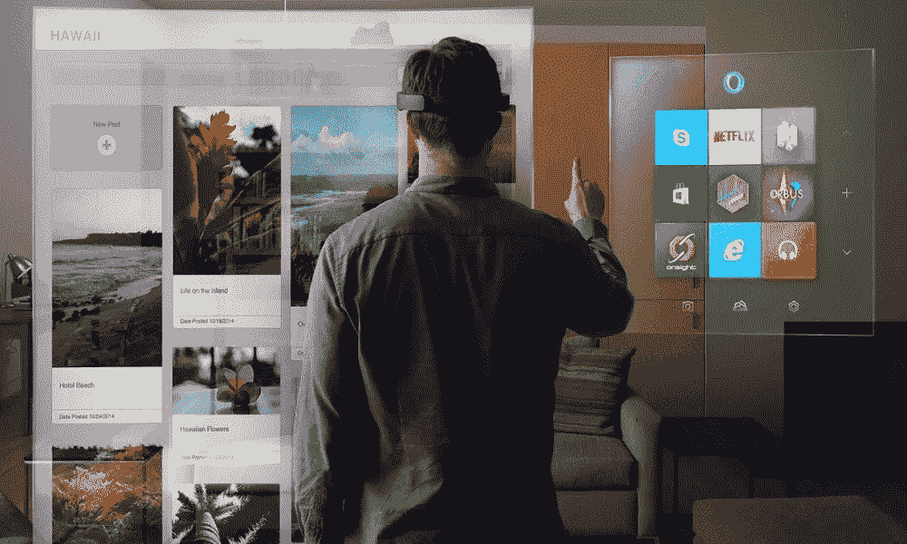

# 本周精选的 7 款增强现实应用#2

> 原文：<https://medium.com/swlh/7-handpicked-augmented-reality-apps-of-the-week-2-f4a70ddbed23>

波士顿咨询集团的一项新研究显示，美国每月有超过 8000 万人参与增强现实。

这就是为什么我为你收集了本周精选的 7 款增强现实应用。

尽情享受吧！

# 世界上首款用于自闭症的增强现实眼镜

“Empower Me”是自闭症儿童(和成人)喜爱的电子生活教练！由来自麻省理工学院和哈佛大学的神经科学家和医生开发的这项技术已经通过了临床测试，现在已经可以资助[了。](https://www.indiegogo.com/projects/world-s-first-augmented-reality-glasses-for-autism#/)

# 阿姆在科切拉拥抱增强现实

阿姆在科切拉的布景向粉丝展示了将在说唱歌手美国和欧洲巡演期间展示的视觉效果。

阿姆增强应用程序可以从[苹果应用商店](https://itunes.apple.com/us/app/eminem-augmented/id1367766444?mt=8)免费下载。有关音乐如何与 AR 配合使用的进一步消息，请继续观看 [**VRFocus**](https://www.vrfocus.com/) 。

# 增强现实沙盒

增强现实沙盒允许学生实时创建和改变地形。

当他们将沙子移动到不同的地层时，Xbox Kinect 雷达扫描沙子的顶部表面，然后将数据输入计算机，计算机进而将地形图投影到沙子上。通过颜色和线条，地图显示海拔。

# 谷歌的增强现实显微镜快速突出了癌细胞

Google Research [本周发布了](https://research.googleblog.com/2018/04/an-augmented-reality-microscope.html)一种 AR 显微镜(ARM ),能够在机器学习的帮助下实时检测癌细胞。用标准显微镜定位癌症是一个困难而耗时的过程，有大量的信息供医生研究和调查。

然而，有了这种新的解决方案，显微镜能够快速定位癌细胞，然后在医生窥视内部时突出显示它们。

# 战神 AR App(游戏)

索尼推出了一款名为“米伊美的视觉”的增强现实应用，以配合 4 月 20 日在 PlayStation 4 上发布的《战神》。

在《战神》中，米伊美被砍下的头颅成为克瑞托斯和他的儿子阿特柔斯穿越斯堪的纳维亚之旅中智慧和知识的源泉。

点击[MobileSyrup.com](https://mobilesyrup.com/):[索尼发布战神伴侣增强现实应用](https://mobilesyrup.com/2018/04/18/sony-god-of-war-mimirs-vision-ar-app/)

# 历史上著名的阿拉莫战役在新的 AR 应用中重现

体验真实历史:阿拉莫版增强现实应用于上周二首次亮相。

创作者表示，该应用程序将使用照片逼真的 3-D 技术将用户带回 1836 年的阿拉莫大院。

用户将能够看到这个建筑群的历史细节，并听到许多生活在阿拉莫或死在那里的人的故事。

# 苹果用户现在可以免费在增强现实中玩“星球大战”全息游戏

迪士尼和联想去年合作制作了*星球大战:绝地挑战*，这是*星球大战*游戏的样本，可与联想智能手机驱动的[幻影 ar 耳机和无线光剑](https://www.roadtovr.com/lenovo-mirage-ar-headset-gimmick-star-wars-jedi-challenges/)配合使用。

虽然该应用程序支持 Android 和 iOS 智能手机，但现在最新的 iPads 和 iPhones 用户根本不需要耳机来玩最具标志性的游戏之一:全息游戏。而且是免费的。

在这里 下载*星球大战:绝地挑战* for iOS [**。**](https://itunes.apple.com/gb/app/star-wars-jedi-challenges/id1228407758?mt=8)

# 今天到此为止！

**在这里看系列的第一部分** — [7 款精选的增强现实应用#1](/swlh/top-7-augmented-reality-apps-april-2018-678b7fe5961d)

如果这篇文章对你有帮助，请分享，这样其他人也能喜欢，**别忘了关注** [**尤瓦尔·凯什彻**](https://medium.com/u/9e16c0b9e56f?source=post_page-----f4a70ddbed23--------------------------------) 获取更多好东西👏👏👏。

## 这个故事发表在 [The Startup](https://medium.com/swlh) 上，这是 Medium 最大的创业刊物，拥有 318，583+人关注。

## 在这里订阅接收[我们的头条新闻](http://growthsupply.com/the-startup-newsletter/)。

