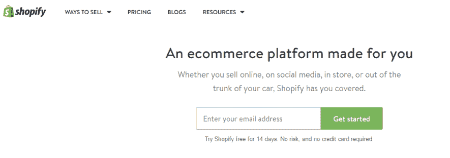
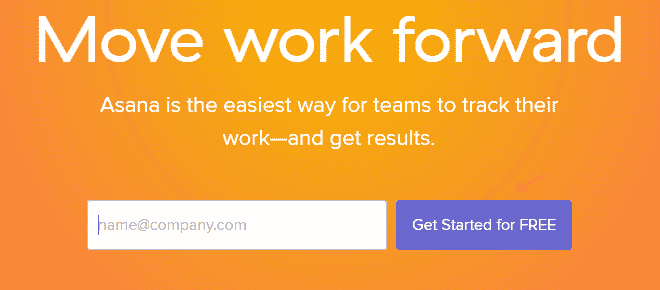
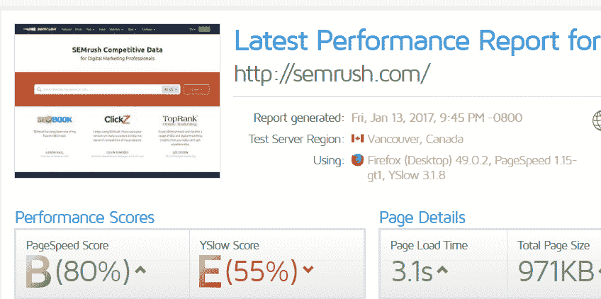
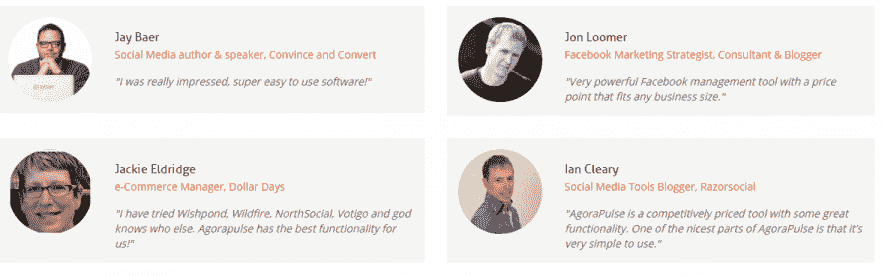
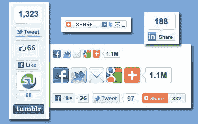

# 改善网站营销策略的 7 个方法

> 原文：<https://medium.com/swlh/7-ideas-to-improve-your-marketing-strategies-with-your-website-776d5ea78824>

营销是千变万化的策略，必须深思熟虑。为了带来更多的创新，带来更多的客户，获得更好的利润，必须对网站进行适当的分析。

由于营销过程是一个不断变化的领域，营销的各个方面都会随着时间的推移而过时，而某些方面和创新方式会随着时间的推移而成为营销策略的一部分。

我们今天所做的工作可能在几年后就完全无关紧要了，因此，为了取得成功，我们必须随着时代的变化改变营销策略，并且必须采用新的和创新的技术。

这里有 7 个想法来改善你的网站营销策略。

# 1.在线营销是商业的未来

随着时代的变化和快节奏的技术革命，互联网连接，以闪电般的速度蔓延，整个世界正在成为一个小地方。

在网站和许多相关功能的现代时代，接触更多受众的过程不再是一项繁重的任务。

一个网站可以让企业以最少的努力接触到更多的受众，而整个故事最精彩的部分是，这种与更多受众进行互动的过程可以在最短的时间内实现。

网站为企业提供了时间来设计更好的营销战略计划，包括精心设计的方面，以达到更大的目标，包括地理位置、浏览行为、热图等。

对网站进行适当的分析和跟踪有助于人们了解企业的需求，并据此制定更好的营销策略。

你可以通过使用一些不同的技巧来提高网站的销售效率。

# 2.重新定位您的选择加入服务

通过对选择加入服务的轻微重新定位，您可以取得巨大的成效！

一个常见或最佳的做法是**提供一些激励来收集电子邮件地址。**

请记住，选择加入服务是收集客户电子邮件地址和[建立您的电子邮件列表](https://blog.kissmetrics.com/quick-email-marketing-lists/)的重要工具，有助于未来更好的营销策略。

网站上出现的选择加入服务也会对订户数量产生巨大影响。

有一些选项可以将您的选择加入表格放在网站上:

*   补充报道
*   页眉
*   页脚
*   内容中间
*   内容底部
*   突然出现
*   欢迎页面

例如，看看 [Shopify](https://www.shopify.com/) 放置选择加入表单的方式:

# 3.为您的客户创造价值

为了取得丰硕的成果，对网站进行调整是营销人员容易采用的策略之一。为你的企业网站提供价值。

为你的观众提供更多的价值。始终相信，你的客户越觉得有价值，他们就越有可能向他们的亲密朋友推荐你的品牌。

始终遵循以下规则:

> 联系客户和扩大人脉的最佳方式是给予或增加价值。

它为你提供了一个与顾客建立真诚关系的机会。

# 4.清晰可行的行动号召

永远记住:你可以对用户或访问者接触到的任何东西发出清晰的行动号召。

你是否为时事通讯提供注册选项？

邀请他们关注你的社交媒体页面？

下载任何与您的业务相关的重要文档？

或者顾客有什么购买选择？

你可以将它们中的每一个都包含在你的网站中，这样可以更好地实现你的营销目标。

为了达到最初的效果，请始终研究最佳实践，将最有利可图的想法整合到您的网站上，并为您的受众提供一个令人信服的理由来完成您的行动号召。

不要使用“点击这里”这样的术语。

CTA 是一种鼓励行动的指令。

在 CTA 中使用可操作的、清晰的语言。例如，“立即购物”、“预订座位”、“立即下载指南”等。

看看[体式](https://asana.com)如何在 CTA 中使用“免费”这个词，让它更有说服力。

# 5.提高你的网站速度

[谷歌](https://webmasters.googleblog.com/2010/04/using-site-speed-in-web-search-ranking.html)曾声明“**页面速度用作排名信号。”**

如果你的网站加载速度很慢，你的潜在访问者会转向你的竞争对手的网站，你可能会有失去潜在客户的风险。

改善你的网站页面加载时间，这使得用户可以非常快速地加载页面，并保持连接和对你的网站感兴趣。

[MunchWeb](http://munchweb.com/effect-of-website-speed) 发现:

> 75%的人不会返回一个加载时间超过 4 秒的网站。

[GTMetrix](https://gtmetrix.com) 可以帮助您检查您站点的速度:

# 6.在网站上提供证明

网站确实有一个非常强大的选项，可以借助推荐来突出你的成功故事。

89%和 88%的 B2B 营销人员认为客户评价和案例研究是最有效的内容营销策略。(**)**

*是否[提供一个推荐页来提高你在客户眼中的可信度](https://www.markethub.io/use-social-proof-build-trust-prospects-examples/)。*

*给他们一个相信你的理由，给他们一个信任你的机会。*

*了解 [Agorapulse](https://www.agorapulse.com/) 如何在其网站上使用用户评价:*

**

# *7.使用社交分享按钮*

*通过放置易于访问的共享按钮，使您的内容易于共享。*

*研究显示，当很难分享时，人们会不愿意分享*

*[BrightEdge](https://www.brightedge.com/resources/research-reports/facebook-social-seo) 发现突出的社交分享按钮可以让社交分享提升 700%。*

*布莱恩的( [Backlinko](http://backlinko.com/) )负责社交分享，*

> *“社交信号不是谷歌算法的重要组成部分。但脸书、Twitter 和 Google+等网站上的社交分享可能会间接提升你的排名。”*

**

# *行动起来！*

*谢谢你听了这个故事。如果你喜欢这个故事，点击👏按钮，并与他人分享！*

## *你想从成功作家那里得到可操作的写作建议吗？获得你的免费拷贝。*

**本文最初发表于* [*塞姆拉什*](https://www.semrush.com/blog/business-beginner-tips-improve-your-marketing-strategy-with-a-website/)*

**

## *这个故事发表在 [The Startup](https://medium.com/swlh) 上，这是 Medium 最大的创业刊物，拥有 312，822+人关注。*

## *在这里订阅接收[我们的头条新闻](http://growthsupply.com/the-startup-newsletter/)。*

**