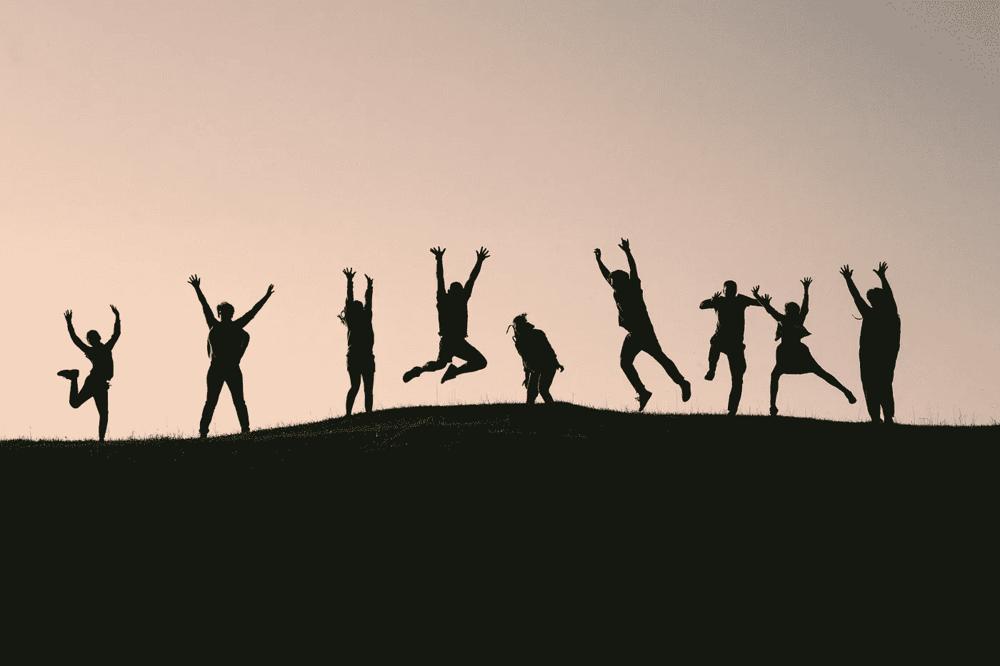

# 改变我生活的 7 个心理转变

> 原文：<https://medium.com/swlh/7-mental-shifts-that-changed-my-life-25af61c4abaf>

我对你未来道路的顿悟时刻。

Photo by Val Vesa

当我还是个孩子的时候，在南印度长大，我在我妈妈巨大的餐桌上学到了一些东西。她的声音里有一种清晰的记忆。

吃你的 vendakai(秋葵或泰米尔语的女士手指)，你会在数学上脱颖而出

我总觉得她把这个想法和蔬菜一起煮了。