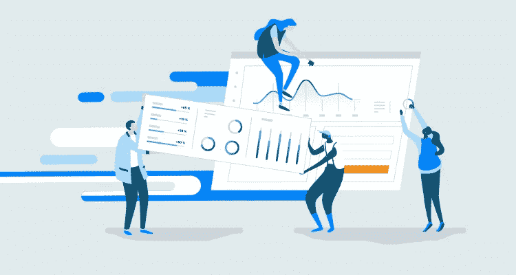

# 每个营销人员都应该知道的 7 页速度统计

> 原文：<https://medium.com/swlh/7-page-speed-stats-every-marketer-should-know-1fe17be9d147>

由 Unbounce 的内容创作营销经理 Jennifer Pepper 撰写

如果我们让你描述一个有效的数字营销活动，你可能会吹捧强大的设计，广告定位的价值，或转换优化的好处。但是，即使你的网页和登陆页面在美学上是正确的，如果你没有考虑页面速度，它也没有任何意义。举个例子，如果一个页面的加载时间超过三秒钟，[超过一半的访问者会离开它](https://www.thinkwithgoogle.com/marketing-resources/data-measurement/mobile-page-speed-new-industry-benchmarks/)。换句话说，**每一秒钟你给访客带来的不耐烦的痛苦和缓慢的加载时间，你都在损失转化率和利润。**

除了你的底线，页面速度*也会*影响你的内容在谷歌的排名。今年 7 月，搜索引擎宣布[速度将对移动搜索的排名产生更突出的影响](https://webmasters.googleblog.com/2018/01/using-page-speed-in-mobile-search.html)。所以如果你想让你的登陆页面和网页出现在 SERP(付费搜索)中，你需要它们快如闪电。

为了描绘出[为什么加载时间如此重要](https://unbounce.com/landing-pages/2019-is-the-year-of-page-speed/?utm_medium=referral&utm_source=medium&utm_campaign=blog-post-page-speed-stats&utm_content=manifesto-blog-post)的画面，我们收集了关于页面速度的七个统计数据。我们目前正在做一些自己的原创研究，但现在，请继续阅读，了解为什么缓慢和稳定不能赢得数字营销竞赛，并使用这些快速的事实来证明加快您的登录页面。

# 1. [46%的人表示，他们最不喜欢在手机上浏览网页时等待页面加载](https://webmasters.googleblog.com/2015/04/mobilemadness-campaign-to-help-you-go.html)

创建登录页面时，您需要考虑几个因素(布局、内容层次、视觉效果、CTA 等)。但是正如谷歌鼓励的那样，页面速度也需要优先考虑。你的访问者不喜欢等待——自上面链接的 2015 年调查以来，他们的挫折感有增无减——所以始终像考虑传统设计元素一样考虑加载时间(不管设备如何)。注意你的图像尺寸，压缩任何过重的图像。任何超过 800kb 的东西都会让你在速度方面碰运气。

# 2.[平均来说，加载一个手机登陆页面需要 15.3 秒](https://www.thinkwithgoogle.com/intl/en-ca/advertising-channels/mobile/mobile-shopping-ecosystem/)

(而且是在模拟 4G 什么的上面！)但这还只是考虑了移动设备——一般来说，页面在桌面上的加载速度要快得多。例如，根据来自 Pingdom 的最新消息，[大多数网页加载仅需 3.21 秒](https://royal.pingdom.com/2018/01/18/page-load-time-really-affect-bounce-rate/)。至少，你应该**把加载时间定在三秒或更少**——尤其是如果你想提高转化率的话。

当 Akamai 研究移动加载时间如何影响客户的转化率时，他们发现 [2.4 秒是最佳时机](https://developer.akamai.com/blog/2015/09/01/mobile-web-performance-monitoring-conversion-rate)，在 30 天的时间跨度内，平均峰值移动转化率为 1.9%。另一方面，当他们客户的网站在 4.2 秒内加载时，平均转化率下降到 1%以下。

最终，在移动和桌面上实现 2.4 到 3 秒的目标是明智之举。

# 3.[在 5 秒钟内加载的网站(相比那些在 19 秒内加载的网站)平均会话时间延长了 70%](https://www.thinkwithgoogle.com/intl/en-154/insights-inspiration/research-data/need-mobile-speed-how-mobile-latency-impacts-publisher-revenue/)

虽然你肯定可以争取快于 5 秒，但这里的要点是，人们在你的页面上花的时间越长，他们就有越多的时间来消费你的内容并真正转化。你努力构建有说服力的报价——所以[通过确保访问者加载速度足够快，让他们能够真正看到(并理解),让他们停留在你的登录页面上](https://unbounce.com/features/page-speed/?utm_medium=referral&utm_source=medium&utm_campaign=blog-post-page-speed-stats&utm_content=lp-features-page-speed)!)你的关键信息。

# 4.[加载时间延迟 100 毫秒会导致转换率下降 7%](https://www.akamai.com/uk/en/about/news/press/2017-press/akamai-releases-spring-2017-state-of-online-retail-performance-report.jsp)

类似于谷歌关于每秒加载时间转化率下降 12%的统计，Akamai 提出了另一个时间就是金钱的数字。根据他们 2017 年的研究，**整整一秒可以降低 70%的转化率！**因此，除了失去访客，页面速度还直接关系到失去大量潜在收入——这是 Mobify 在决定研究主页加载时间的影响时发现的。在其 2016 年 [Q2 移动洞察报告](http://resources.mobify.com/2016-Q2-mobile-insights-benchmark-report.html)中，这家在线购物平台透露，加载时间每减少 100 毫秒，基于会话的转化率就会增加 1.11%。

但是请记住，**页面速度不仅仅影响销售产品和/或服务的组织**，Pinterest 决定重建页面以提高性能就是明证。通过减少 40%的等待时间，这个共享平台增加了 15%的搜索引擎流量和注册人数。

# 5. [73%的移动用户遇到过网站加载时间过长的情况](https://neilpatel.com/blog/loading-time/)

嘿，我们都经历过。即使不断向访问者提供更快的速度(通过电信广告、互联网提供商等)。)，许多网站的加载速度仍然不够快。这对访问者来说是个坏消息，但对你来说却是个好消息，因为如果你加快速度，就有机会脱颖而出。SEMrush 报告说"[如果你的网站在 1.7 秒内加载，这比大约 75%的网站都要快。](https://www.semrush.com/blog/how-fast-is-fast-enough-page-load-time-and-your-bottom-line/)“利用这个机会，让你的品牌在网站和登录页面的加载速度上比大多数网站和登录页面更快。是时候把速度放在首位了。

# 6. [79%遇到网站性能问题的网上购物者表示，他们不会再次返回网站购物](https://neilpatel.com/blog/loading-time/)

网上购物体验不仅仅是网站美学或客户服务；它是关于整体性能的，包括页面速度和响应度。这个统计数据表明，像**这样一个缓慢加载的网站可以很容易地拒绝访问者——有时是永久拒绝。**

# 7.[两秒内加载的页面平均跳出率为 9%，而五秒内加载的页面平均跳出率为 38%](https://royal.pingdom.com/2018/01/18/page-load-time-really-affect-bounce-rate/)

高跳出率表明访问者不会在你的网站上停留很长时间——我的意思是，他们肯定会停留在那里，但他们不会消费比他们当时所在页面更多的内容。谁知道有多少呢？！这可能意味着他们不会点击您的 CTA 进入下一步，更不用说了解您的关键价值主张了。

很难确定为什么有人会离开你的登录页面——受众定位不佳？无趣的内容？多媒体不够？**如果页面速度影响了跳出率，你可能会开始怀疑你的内容。**通过加速移动页面(AMP)等解决方案，优先考虑页面速度，为自己节省一些时间(和困惑)。

> 缓慢加载的页面会影响你的数字营销活动吗？[加入我们的 AMP beta](https://unbounce.com/try-amp/?utm_medium=referral&utm_source=medium&utm_campaign=blog-post-page-speed-stats&utm_content=lp-try-amp) ，成为首批为您的访客提供近乎即时的移动体验的人之一。

现在，回到我们的问题，设计数字营销活动时最重要的考虑因素是什么？希望记住所有这些数据，你会有一个新的视角。当访问者到达你的网站或登录页面时，页面速度是他们首先体验到的事情之一，随着加载时间继续成为优先考虑的问题(对于移动和桌面环境)，它只会对你的在线战略的成功更加不可或缺——所以你必须抓紧时间！

*原载于 2018 年 12 月 10 日*[*unbounce.com*](https://unbounce.com/landing-pages/7-page-speed-stats-for-marketers/?utm_medium=referral&utm_source=medium&utm_campaign=blog-post-page-speed-stats)*。*

## 这篇文章发表在 [The Startup](https://medium.com/swlh) 上，这是 Medium 最大的创业刊物，拥有+398，714 名读者。

## 在这里订阅接收[我们的头条新闻](http://growthsupply.com/the-startup-newsletter/)。

