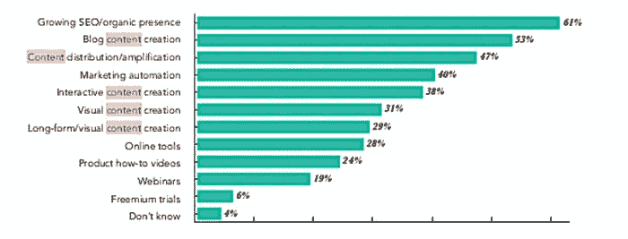
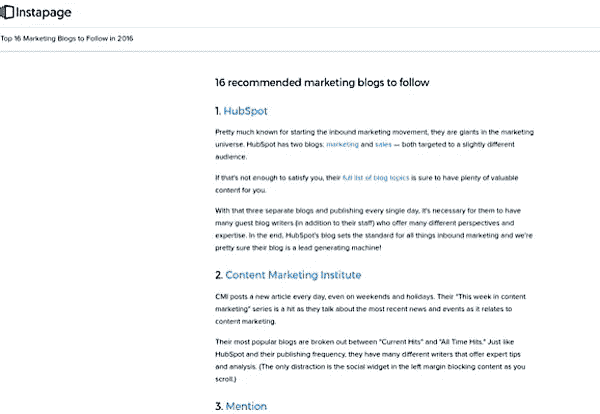
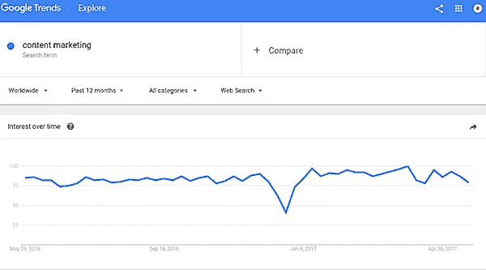
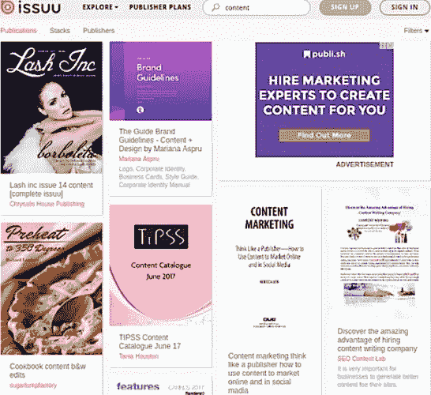
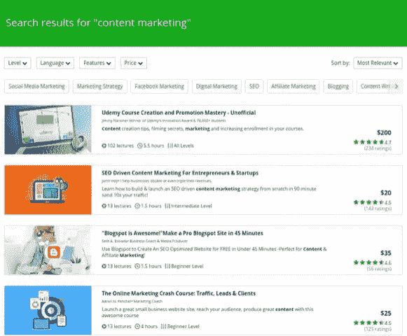
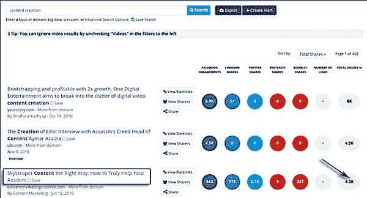
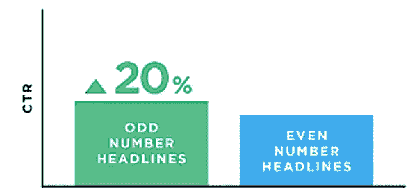
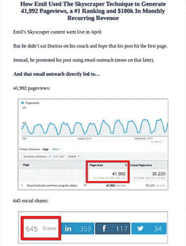
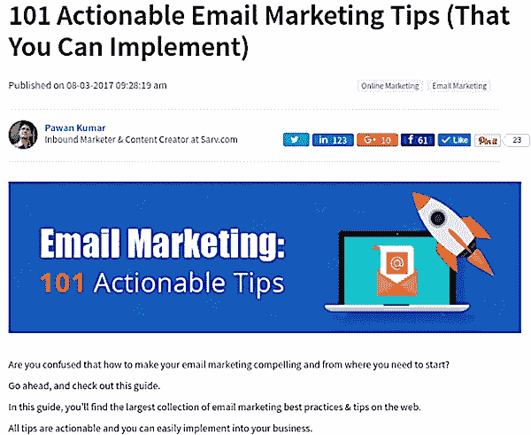
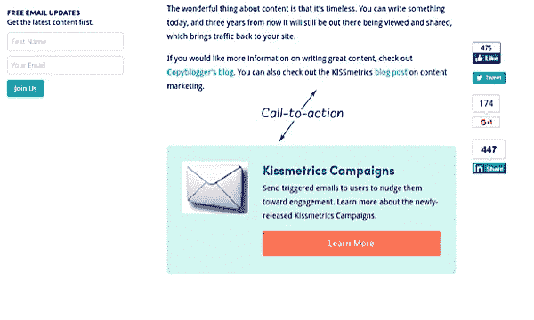

# 创造内容和吸引读者的 7 个实用想法

> 原文：<https://medium.com/swlh/7-practical-ideas-to-create-content-and-keep-the-readers-coming-979c3f72803>

有吸引力的内容是任何成功博客的核心。但是如何做到这一点并不总是显而易见的。

> 内容是给读者的生活增加价值的任何东西。—阿维纳什·考希克

你是内容营销者、博客作者还是作家？

你想创造一个人们想阅读的内容吗？

我听到你喊“见鬼，耶！”

这是每个作家的梦想。

我最近在 Quora 上偶然发现了一个问题:

“创造人们有兴趣阅读的内容的关键是什么？”

立刻，我开始思考创造有价值的内容是一种选择。你可以选择投入你的时间和资源来为你的读者制作好的内容。

想知道为什么内容如此重要？

# 内容对您的重要性

当你读到或听到“内容”这个词时，你会想到什么？

我打赌你开始考虑文章、博客、图片、信息图、视频、电子邮件、社交媒体帖子等等。

对吗？

内容有能力与你的观众建立联系。没有它你无法和他们交流。这是一个沟通渠道。

这有助于与你的读者建立更好的关系。你所需要做的就是传递一个清晰的信息，这个信息对他们来说是有价值的。

有一些互动的方式来传递你的信息:

博客帖子。

电子邮件。

登录页面。

信息图表。

视频。

社交媒体帖子。

以下是一些统计数据:

> " 53%的营销人员表示，内容创作是他们的首要任务之一."— [入境状态](http://www.stateofinbound.com/)

创造引人注目的内容是一门艺术，你需要用心去做。

72%的营销人员表示，相关内容创作是最有效的 SEO 策略。

70%的[消费者](https://www.entrepreneur.com/article/227379)更喜欢通过内容了解一家公司。太好了！但是还有更多！

据 Forrester 称，“87%的 B2B 营销人员努力创造吸引人的内容。”

你知道吗，平均 60 秒内就有 1388 篇博文发表？

你一定想知道如何让你的内容在人群中脱颖而出，吸引眼球。

此外，在这个故事中，**你会发现 7 个可行的技巧**，你可以马上运用它们来创造有吸引力的内容！

我还列举了一些例子来启发你。

尽情享受吧！

# 1.策划内容并征求意见

灵光一现的想法？

大多数内容创作者都会遇到这种情况。

最精彩的部分？

尽管如此，你还是可以写作。

有一些简单的方法:

**策划内容。**列出你最喜欢的十个(或二十个)博客/网站、博主或帖子。现在发布一个列表，解释你为什么喜欢它们。

参见 Instapage 的这篇博文:

**求教。**联系你的销售主管，询问他们的客户在说些什么。那就写写吧。此外，问问你的读者他们在社交媒体上最喜欢的话题。

**重新规划你的旧帖子。**进入你的分析系统，找出产生了大量浏览量、点赞、分享和线索的帖子。通过更改帖子的格式或更新帖子，然后发布，充分利用这些帖子。

比方说，你有一个文本帖子，它为你做了一件很棒的工作。您可以将其转换为信息图表形式、幻灯片演示或视频。简单！

# 2.了解流行趋势

想要更多资源作为你的内容灵感？

**谷歌趋势。**

它可以帮助你发现什么话题是流行的。或者，您可以简单地在框中键入您的特定查询并查看结果。

在过去的 12 个月里，我搜索了“内容营销”这个词。

Issuu.com 可以帮助你获得伟大的内容的想法。只要进入主页，输入你的查询，你就会得到许多在线出版物和杂志。

Udemy 是我最喜欢的获取想法的平台之一。这是一个在线课程平台。只要去网站，输入你的主题，然后砰！

你会看到许多在线课程，这些课程会给你很多想法。

如你所见，你不需要创造性就能得到好主意。

# 3.精心设计一个醒目的标题

> "一个糟糕的标题会使你的文章看不见."布莱恩·克拉克

标题是你给读者的第一印象。平均来说，10 个人中有 8 个人会阅读标题，但只有 2 个人会阅读其余部分。

撰写引人注目的强有力的标题是一项关键技能。

想知道如何创建一个强大的和引人注目的标题？

去 Buzzsumo 输入你的关键词。找出哪些头条拥有最多的社交媒体份额。你看到我为了找到这篇文章的标题做了什么吗？我搜索了关键词“内容创作”

从结果中选一个帖子，添加一个吸引注意力的关键词(“磁性”)。

**原标题:**摩天大楼内容正确的方式:如何真正帮助你的读者

**新鲜头条:**如何创造有吸引力的内容来帮助你的读者【7 个可行的技巧】

如你所见，我在这篇文章的标题中也使用了奇数。据[内容营销院](http://contentmarketinginstitute.com/2011/06/headline-click-through-rate/)统计，奇数增加点击率 20%。

# 4.做一个讲故事的人

想被人记住？

**做一个讲故事的人。**

人们会记住故事，并在情感上与它们联系起来。

一个吸引人的故事有三个要素:

**人物**、**冲突**、**解决**。

当人们阅读你的内容时，他们希望得到问题的答案。你的工作就是通过你的内容提供解决方案。

# 5.像说话一样写作

> “用你说话的方式来写。” [—塞思·戈丁](http://www.sethgodin.com/)

如果你想成为一名更好的作家，你必须让阅读成为一种习惯。句号。

使用“你”这个词，你的读者就会理解你的信息。

添加故事使你的信息更加清晰。

布莱恩·迪恩是在他的内容中讲述故事的大师，这使其引人入胜。

# 6.创建有深度的内容

内容长度很重要！

发布长篇内容(1000+字)。对排名有帮助。

Backlinko 分析了 100 万个谷歌搜索结果，发现一个谷歌首页结果的平均字数是 1890 个单词。

## 你如何创作长的、有深度的内容？

让我与你分享我的经验:就在几个月前，我出版了一个庞大的指南:101 个可行的电子邮件营销技巧。我需要把行业专家的建议放到这个指南中。所以，我联系了一些专家(大约 90 名),请他们贡献他们最好的建议。

29 位专家给了我一些惊人的想法。我终于有了 101 条实用的建议。

# 7.告诉你的读者下一步该做什么

读者更有可能分享可操作的、实用的内容。

让你的内容具有可操作性，它应该向读者展示如何实施你的建议。

在你的内容中加入行动号召，鼓励订阅者采取行动。

看看 Kissmetrics 是如何做到的:

# 总结…

您刚刚获得了 7 个改善内容以吸引读者的最佳创意:

1.  总是想办法找出点子。
2.  Google trends、ISSUU 和 Udemy 是获得灵感的绝佳平台。
3.  引人注目的标题会对读者产生积极的影响。
4.  展示你讲故事的技巧来传达你的信息。
5.  在你的写作中使用“你”这个词。
6.  创建相关的、有深度的内容来帮助你的读者。
7.  清楚地告诉你的读者如何实施你的建议。

你使用过这些技巧来创建内容吗？您想在此列表中添加任何方法吗？

# 行动起来！

## 你想从成功作家那里得到可操作的写作建议吗？[获取您的免费副本](https://mailchi.mp/d0442b655c31/get-your-ebook)。

*本文最初发表于* [*数字品牌学院*](https://digitalbrandinginstitute.com/magnetic-content/)

## 这个故事发表在 [The Startup](https://medium.com/swlh) 上，这是 Medium 最大的企业家出版物，拥有 305，398+人。

## 在这里订阅接收[我们的头条新闻](http://growthsupply.com/the-startup-newsletter/)。

