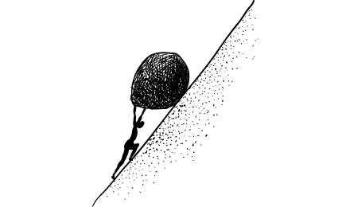
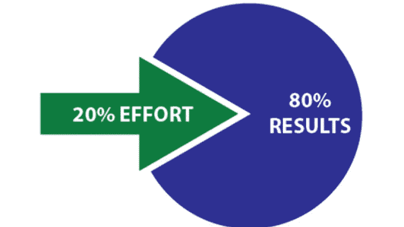
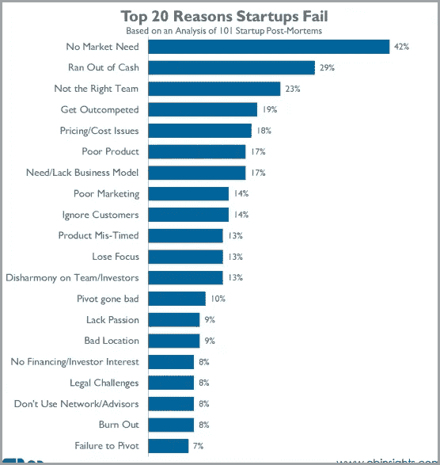
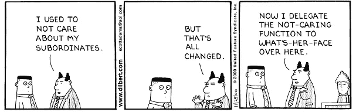

# 聪明的企业家避免失败的 7 个有效步骤

> 原文：<https://medium.com/swlh/7-proven-steps-smart-entrepreneurs-take-to-avoid-failure-a4511035313e>

## 作为企业家或领导者，你如何公正地对待你的公司。

Photo by [Annie Spratt](https://unsplash.com/photos/QckxruozjRg?utm_source=unsplash&utm_medium=referral&utm_content=creditCopyText) on [Unsplash](https://unsplash.com/search/photos/startup?utm_source=unsplash&utm_medium=referral&utm_content=creditCopyText)

这听起来像另一个 clickbait 标题吗？

成千上万的文章宣扬企业家应该做什么。他们对埃隆·马斯克、沃伦·巴菲特、杰夫·贝索斯和史蒂夫·乔布斯的天才刮目相看。

你喜欢阅读这些智慧。他们给你希望。总有一天，你会让你的企业按照同样的原则运作。

但是今天，当你回到工作岗位时，你会陷入无尽的混乱之中。

你会继续灭火，[解决日常问题](http://aryatra.com/problem-solving-skills/)(你暗暗知道这些问题会再次发生)，等待新的问题出现。就像流沙一样。你越是努力想摆脱自己，它就越是把你深深地吸进去。

[credit](/personal-growth/is-it-worth-the-trouble-9792513b9bfa)

你还要这样生活多久？你会失眠多久，担心能让你支撑下去的资金何时(何地)到来？

这是你报名的吗？难道你不应该为自己和家人休假吗？

更重要的是，有没有出路？

是的，有。

# 进入帕累托定律

1896 年，意大利经济学家维尔弗雷多·帕累托提出了一条适用于生活方方面面的定律。

> 在大多数情况下，80%的结果来自 20%的原因。

例如，20%的问题导致了你 80%的问题。在体育锻炼中，大约 20%的锻炼会产生 80%的效果。

大约 20%的客户贡献了将近 80%的企业收入。[微软指出](https://www.crn.com/news/security/18821726/microsofts-ceo-80-20-rule-applies-to-bugs-not-just-features.htm)在一个给定的系统中，修复 20%被报告最多的错误就修复了 80%的错误和崩溃。

我已经和初创公司、中小企业和跨国公司合作了六年多。在这个时期，我发现某些行为(20%)会给每个领导者和企业家带来丰厚的回报。我想和你们分享。

这 7 项行动将使你成为领导者，在不影响质量和价值观的情况下，使你的业务标准化并扩大规模。

## 1.知道他们需要什么

根据[CB Insights](http://fortune.com/2014/09/25/why-startups-fail-according-to-their-founders/)、*的一份报告，没有市场需求*是超过 42%的企业失败的原因。

[credit](http://fortune.com/2014/09/25/why-startups-fail-according-to-their-founders/)

你如何避免成为这个不值得羡慕的群体的一员？通过与你最重要的客户接触:占你收入 80%的 20%的客户。

我问一位客户，他的业务正在增长，为什么客户会从他那里购买。答案是陈词滥调——有竞争力的(读“便宜”)价格，即使这意味着低质量的商品。

但是和他的前 15%的顾客交谈时，却呈现出截然不同的景象。他的主要客户优先考虑交货速度，其次是质量。专业性排第三，定制排第四。普莱斯远远排在第五位。

有了这些见解，我们回到绘图板，完善客户的商业模式。结果是一年内销售额猛增了 63%。

努力寻找愿意为你的产品买单的顾客，以及他们期望的回报。然后通过提供你的竞争对手没有的东西来取悦他们。

**要点:** *接近你的优质客户，问他们期望什么，为什么。因此，开发你的最低可行产品(MVP)来取悦他们。*

## 2.不要过早授权

授权是每个企业家追逐的闪亮目标。这让她觉得她控制了自己的公司，好像她已经到了。

但仔细观察公司的混乱，你会发现授权是其根源。

在最初阶段，作为领导者，你必须[了解你的业务的来龙去脉](https://www.linkedin.com/pulse/1-trap-so-many-new-entrepreneurs-fall-how-avoid-ryan-holmes/)。弄脏你的手。避免授权。

当你的创业成长为一个小企业时，设计流程来简化每个功能。你的手脏在这里将被证明是有用的，因为你将知道每个功能如何最佳地工作。您可以委托文档和报告，但不能委托决策。

当企业变成一个自我运行的组织时，你可以委派任何任务，只要你跟踪处理它的个人的表现。

**外卖** : *作为一个领导者，先稳定你的组织，再扩大规模。早点动手，以后你会享受非凡的成功。*

但是你怎么会有时间这样做呢？通过[设定正确的目标](http://aryatra.com/achieve-goals/)。

## 3.设定正确的目标

想象一下，八个人划着一条船，每个人都朝着自己选择的方向行驶。划手们会竭尽全力，但船将无处可去。

这正是大多数公司发生的事情，也是他们失去动力的原因。

今天，知识工作者缺乏量化他们生产力的指标。因此，他们求助于工业时代的一个指标:“可见的”工作。

回复邮件、参加会议、24/7 在线以及其他“可见工作”都很容易。但这些任务让企业家们忙于一场永无止境的打地鼠游戏。这只会让他们筋疲力尽。

相反，在关键领域设定非常重要的目标(假发),这会让你的公司成长。这些可能包括:

a.)客户满意度和保留率，
b.) [修复你的 MVP 的缺陷](https://blog.ycombinator.com/minimum-viable-product-process/)，
c .)减少交付周转时间，
d .)获得牵引力，

…等等。

为每一件假发设定雄心勃勃的标准，并为它们设定雄心勃勃的期限。

当你的团队也这样做的时候，当每个人都朝着同一个方向划的时候，船会更快更省力的到达目的地。

***外卖*** *:识别你的公司成功的重要行动。戴上假发，朝着它们努力。*

你将如何识别决定你的组织成功的重要因素？花点时间去思考它们。

## 4.抽出一部分时间

2006 年，荷兰心理学家 Ap Dijksterhuis [带领一个团队进行了一项实验](http://journals.sagepub.com/doi/abs/10.1111/j.1745-6916.2006.00007.x)。目的是检测积极解决一个复杂问题是否会产生更好的结果，或者转移到其他行动是否会让潜意识思考这个问题。

该小组给受试者提供了解决复杂购车问题所需的信息。一半的受试者必须浏览信息并做出最佳决定。其他人在阅读信息后必须解决简单的谜题。然后，他们被安排当场做出决定，没有时间思考。分心组表现更好。

[David Lezcano](https://unsplash.com/photos/mNCFOaaLu5o?utm_source=unsplash&utm_medium=referral&utm_content=creditCopyText)

著名音乐作曲家史蒂夫·里奇发现，花点时间解决一个问题有助于他更好地理解这个问题:

> “如果我能在几个小时内完成工作，那么我就必须喝杯茶，我必须办点事来稍微休息一下。然后我回来了。但是这些停顿是非常有成效的，尤其是当出现小问题的时候。最好的办法是把它放在一边，把你的思想放到别的地方，解决问题的方法会自然而然地出现，虽然不总是这样，但经常是这样。”

但是休假并不意味着同时处理多项任务或者上社交媒体。而是和家人朋友一起度过，或者追求一个爱好。变得无聊。

***外卖*** *:让你的头脑休息一下。让你的潜意识理清你最复杂的挑战。*

## 5.解决正确的问题

企业家经常关注错误的问题。所以那些问题才会一次又一次的抬起丑陋的头。

一个问题是预期水平和当前水平之间的差异。

下面是我们如何识别和解决一个问题。

一家贸易公司的老板每两周花两个小时检查退货。他不会委派这项任务，因为员工会做出糟糕的决定，工作会马上回到他的办公桌上。

但是他一直在看错误的问题。问题不在于他浪费时间检查退货。是:*为什么会退货？*

我们发现了诸如次品、客户无法转售、订单不正确等问题。

我们从根本上解决了这些问题。我们改进了质量检查。我们培训销售团队教育他们的客户，并在接受退货之前检查某些参数。

结果呢？退货率下降了 60%。

**外卖:**从根源上解决正确的问题。解决影响它们的因素，你将减少返工。

*(注:这里有一篇理查德·赖斯* *的* [*精彩帖子，帮助你理解如何更好地解决问题。)*](https://medium.freecodecamp.org/how-to-think-like-a-programmer-lessons-in-problem-solving-d1d8bf1de7d2)

## 6.不断学习

> “我们学习智慧有三种方法:首先是反思，这是最高尚的；其次是模仿，这是最容易的；第三，凭经验，这是最苦的。”—孔子。

Giada Di Stefano、Francesca Gino、Gary Pisano 和 Bradley Staats 在他们关于学习在改善体验中的作用的开创性论文中，将学习定义为“由经验产生的知识的持久变化”

作为一名企业家，不要做一块石头——不可移动，不可穿透。不要相信你什么都知道。做一块海绵。

成功的企业家不断从失败中学习。他们不会责怪糟糕的市场环境或缺乏投资和人才，而是知道自己哪里出了问题，并加以解决。

但问题是。

成功的企业家也从他们的成功中学习。他们反思自己做得对的地方和本可以做得更好的地方，并应用所有这些知识来享受长期的积极成果。

**收获**:从你的成功和失败中学习。两者都不是永久的。

## 7.解释 W 的含义

[rawpixel.com](https://unsplash.com/photos/Qp8mmuK27MI?utm_source=unsplash&utm_medium=referral&utm_content=creditCopyText)

在 CF 布劳恩工程公司，卡尔·布劳恩有一个沟通规则。他称之为五个 W。你必须告诉谁要做什么，在哪里，什么时候和为什么。如果一个人写了一封信，指示某人做某事，但没有说明原因，他可能会被解雇。如果他做两次，他肯定会被解雇。

如果你向他人解释一项活动背后的原因，他们会更好地理解。根据畅销书作家罗伯特·恰尔迪尼的说法，人们喜欢为自己的所作所为找理由。给人们这些理由可以让他们的依从性提高 93%。

**要点**:把“为什么”和“什么”一起交流成一条规则，即使这很明显。这不仅能改善交流。这也会让你的想法和决定更加清晰。

# 总结

作为一名企业家，你永远不会“完蛋”，除非你死了。这永远是一个“你变暖了，你变冷了”的游戏。

你的产品不是你的创业公司所能提供的。是你的创业本身。

你的角色是培养一种学习和发展的文化，并加强你自己的学习。这是为了让你的员工按照你创业公司的价值观行事。

让你的初创公司不断取悦你的客户，尽量减少你的参与。

专注于重要的事情。看似紧急的事情会自己解决。你会建立一个让你和你的员工感到自豪的公司。

*本文的一个版本最初出现在*[*LinkedIn*](https://www.linkedin.com/pulse/7-proven-steps-smart-entrepreneurs-take-avoid-failure-vishal-kataria/)*。*

## 这篇文章发表在 [The Startup](https://medium.com/swlh) 上，这是 Medium 最大的创业刊物，有 320，131+人关注。

## 在此订阅接收[我们的头条新闻](http://growthsupply.com/the-startup-newsletter/)。

