# 对未来工作感到兴奋的 7 个理由

> 原文：<https://medium.com/swlh/7-reasons-to-be-excited-about-the-future-of-work-e8c9fbb61e52>

## 这取决于我们——人类——确保我们看到这些可能性实现。

到 2030 年，千禧一代将占劳动力的 75%。因为他们的工作[不同](https://hbr.org/2013/06/tours-of-duty-the-new-employer-employee-compact)，他们会改变工作现状。这一代人将推动我们从未见过的更多创新和变革。

许多激动人心的新技术将继续改变我们工作、学习和获得机会的方式。以下是其中的一些。

## **1。无聊之死，例行公事**

在人工智能的世界里，创意才是王道。最难复制的东西——概念工作——将成为新经济中最有价值的东西。概念工作的价值将会增加，而日常工作将会自动化。

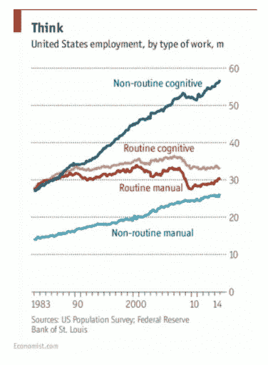

Source: [Economist](http://www.economist.com/news/special-report/21700758-will-smarter-machines-cause-mass-unemployment-automation-and-anxiety)

这已经开始发生了。

中国一家[工厂](http://www.zmescience.com/other/economics/china-factory-robots-03022017/)用机器人取代了 90%的人类工人。结果是:产量增加了 250%，缺陷减少了 80%。

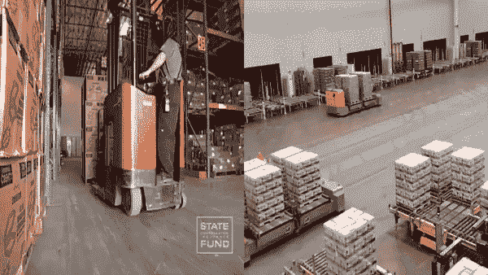

Source: [HumanVsMachine](https://twitter.com/HumanVsMachine/status/832284935578861568)

这不仅仅发生在工厂工作中。任何工作是常规的职业都会发生这种情况。

牛津大学的研究人员表示，未来 20 年内，美国 45%的工作岗位将实现自动化。

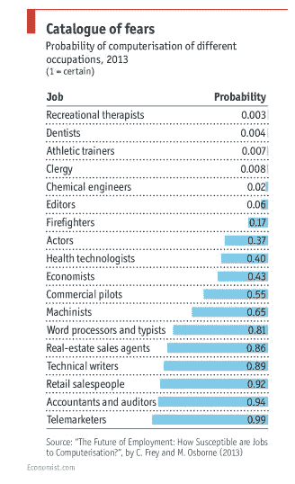

Source: [Economist](http://www.economist.com/news/special-report/21700758-will-smarter-machines-cause-mass-unemployment-automation-and-anxiety)

纵观历史，人们总是不断创新。汽车取代了马。自动驾驶汽车将取代汽车。[自动驾驶直升机无人机出租车](http://www.wsj.com/video/flying-drone-taxis-could-take-off-in-dubai/F329FEAC-2366-4796-9205-72C0344F17D0.html)将取代自动驾驶汽车。这个循环会一直持续下去。

[Tesla driver caught sleeping](http://www.businessinsider.com/tesla-autopilot-driver-caught-sleeping-2016-5)

## **2。作为选项工作**

当自动化取代日常工作时，政府将不得不寻找一种方法来弥补工资损失。

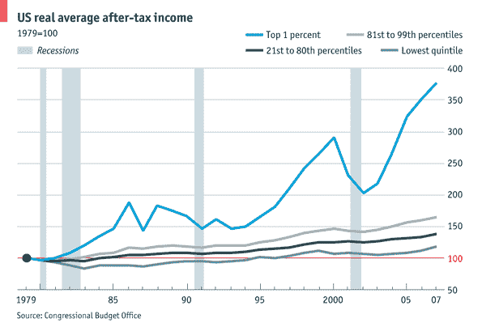

Source: [Economist](http://www.economist.com/blogs/dailychart/2011/10/income-inequality-america)

不断扩大的不平等差距是我们仍在贫困中挣扎的原因之一。

如果每个人的食物、水和安全等基本需求都得到满足，那不是很好吗？想象一下，如果人们可以从事他们热爱的事情——无论是艺术、创业还是无所事事。

普遍基本收入允许通过津贴来支持需求，而不是为了谋生而工作。它给每个人一定数量的钱，即使职业被自动化取代。这就把基本需求和就业分开了。

在未来，我相信基本收入可以消除全球贫困。

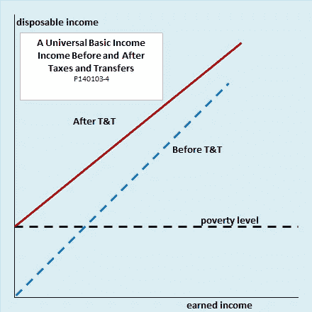

Source: [EconoMonitor](http://www.economonitor.com/dolanecon/2014/01/03/the-economic-case-for-a-universal-basic-income/)

Y Combinator 在奥克兰推出了一项基本收入计划。几十名奥克兰居民每月将获得 2000 美元，为期一年，没有任何附加条件。

[芬兰](http://www.demoshelsinki.fi/en/2016/08/30/thousands-to-receive-basic-income-in-finland-a-trial-that-could-lead-to-the-greatest-societal-transformation-of-our-time/)已经在试验基本收入是否会减少贫困、社会排斥和官僚主义，同时提高就业率。

印度正在考虑用全民基本收入来对抗贫困。

## 3.无(补偿)上限

到 2020 年，50%的美国劳动力将成为自由职业者。今天，这些自由职业者在许多不同的场合按需工作。

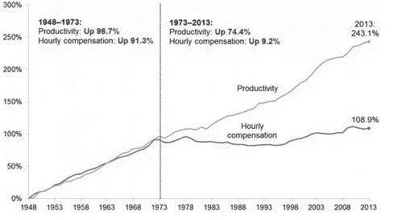

Source: [Atlantic](https://www.theatlantic.com/business/archive/2015/02/why-the-gap-between-worker-pay-and-productivity-is-so-problematic/385931/)

工资没有跟上生产力的增长。将来，你可以根据你的工作成果获得报酬。

这种灵活多变的工作模式将改变传统的职业定义。朝九晚五的小隔间将不再是员工的原型。

随着概念工作价值的增加，这些服务的报酬也将增加。这将创造一个更稳定的零工经济，新的灵活的服务可以浮出水面，如全民医疗保健。

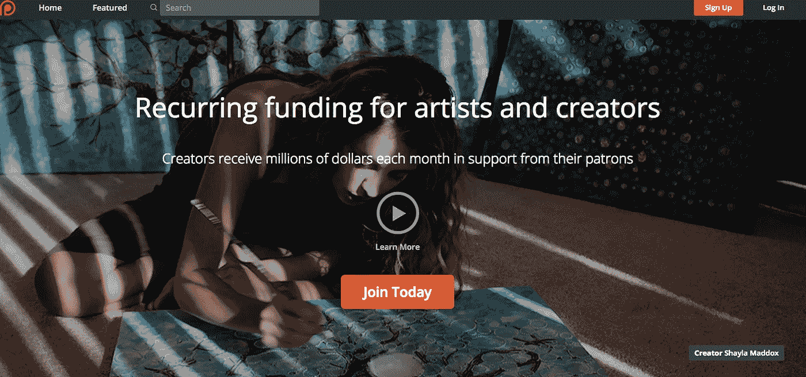

Patreon 允许创作者从他们的粉丝那里获得赞助。大多数创作者每年创作视频、写故事和制作播客的收入为 2.5 万美元。

将来，每个人都可以想赚多少就赚多少。薪资和薪酬上限将会降低。

## 4.负担得起的个性化教育

随着高质量的在线教育变得越来越便宜和容易获得，我们将看到大学债务的死亡。我们已经看到大学入学人数下降。

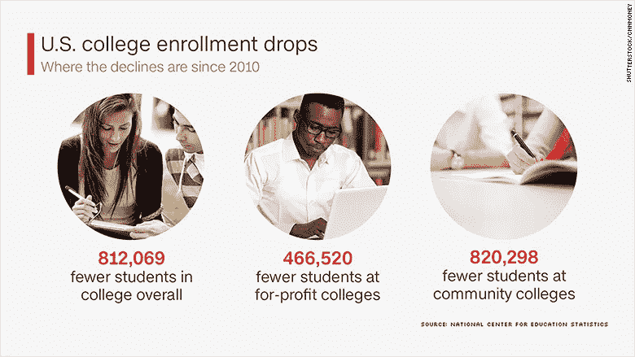

Source: [CNN](http://money.cnn.com/2016/05/20/news/economy/college-enrollment-down/)

大学学位是你成功的通行证的日子已经一去不复返了。低质量的教育体系正在申请破产，取而代之的是负担得起的高质量的教育体系。

凤凰城大学的注册人数下降了 54%。他们以高薪工作的许诺来欺骗下层阶级。

如今，诸如 [Skillshare](http://www.skillshare.com) (我的公司)、Udacity、Codecademy 和 [Byju](https://byjus.com/) 等平台正在崛起。这些平台价格低廉、质量上乘，可供全球数百万学生使用。

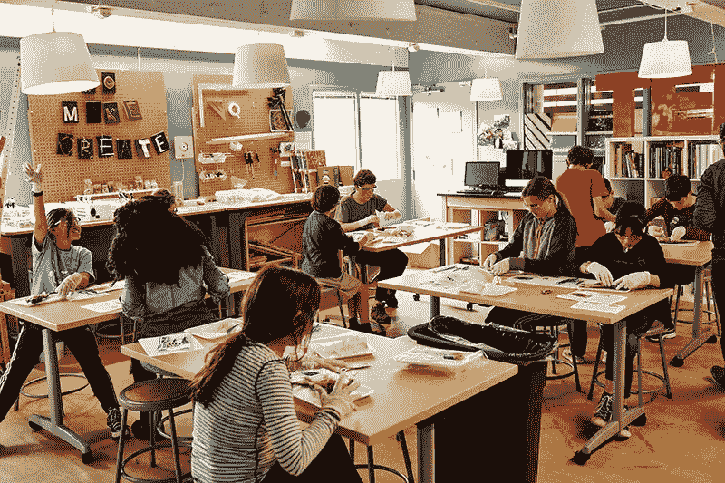

Alt School: [Smithsonian Magazine](http://www.smithsonianmag.com/innovation/how-altschool-personalizing-education-by-collecting-hordes-data-on-students-180960463/)

教育也变得个性化。AltSchool 利用技术为学生创造个性化的学习体验。每个学生都有一个高度个性化的“播放列表”，这是一个个性化的教学计划，不仅基于他或她的兴趣，还基于他或她最有动力学习的方式和条件。

今后，学生将以“一刀切”的模式学习。它将是高质量的，可承受的，个性化的。起跑线将是平等的，教育将成为每个人的基本人权。

## 5.来自任何地方的分布式工作

传统的办公室结构正在瓦解。公司将变得更加灵活、更有权力、更加分散。这为许多人提供了更多的自由、灵活性和向上流动的机会。

> “未来的工作不是围绕着组织结构图，而是围绕着网络结构。组织不是一个给定的层级，而是一个不断反应的组织过程。”— [埃斯科·基尔皮](https://shift.newco.co/the-future-of-work-four-trends-to-watch-30265922e04d#.nf9zxk7g2)

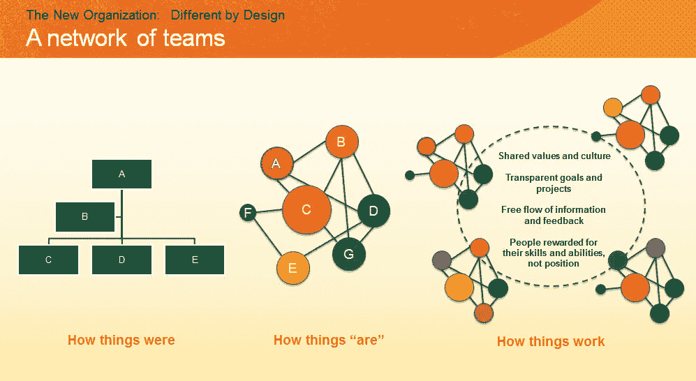

Source: [JoshBersin](http://joshbersin.com/2016/03/the-new-organization-different-by-design/)

网络将取代组织结构图，从而改变公司运营、竞争和战略的方式。

我们将不再受地理位置的限制。未来的网络将允许最优秀的人才为世界任何地方的任何公司工作。

## 6.全球互联网接入

超过世界人口的⅔还没有互联网接入。这是全世界近 40 亿！

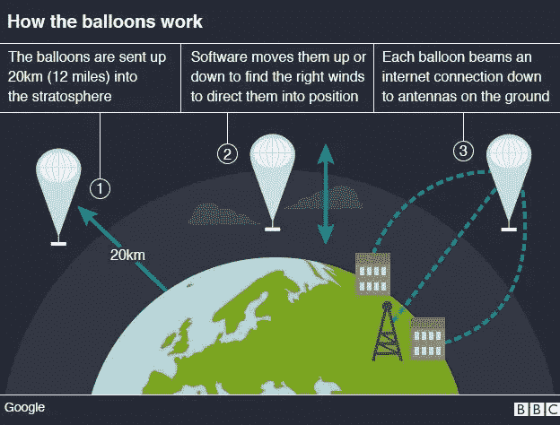

Source: [BBC](http://www.bbc.com/news/technology-34660205)

[Project Loon](https://www.recode.net/2017/2/16/14640470/alphabets-balloon-based-internet-loon-might-actually-work-algorithm) (来自 Google X)是一个在太空边缘旅行的气球网络，旨在连接农村和偏远地区的人们，帮助填补覆盖缺口，并在灾难发生后让人们重新上线。

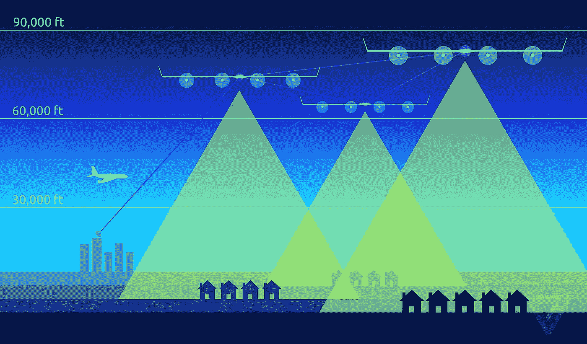

Source: [theverge](http://www.theverge.com/a/mark-zuckerberg-future-of-facebook/aquila-drone-internet)

脸书正在测试一架太阳能飞机，旨在为世界偏远地区提供互联网接入。

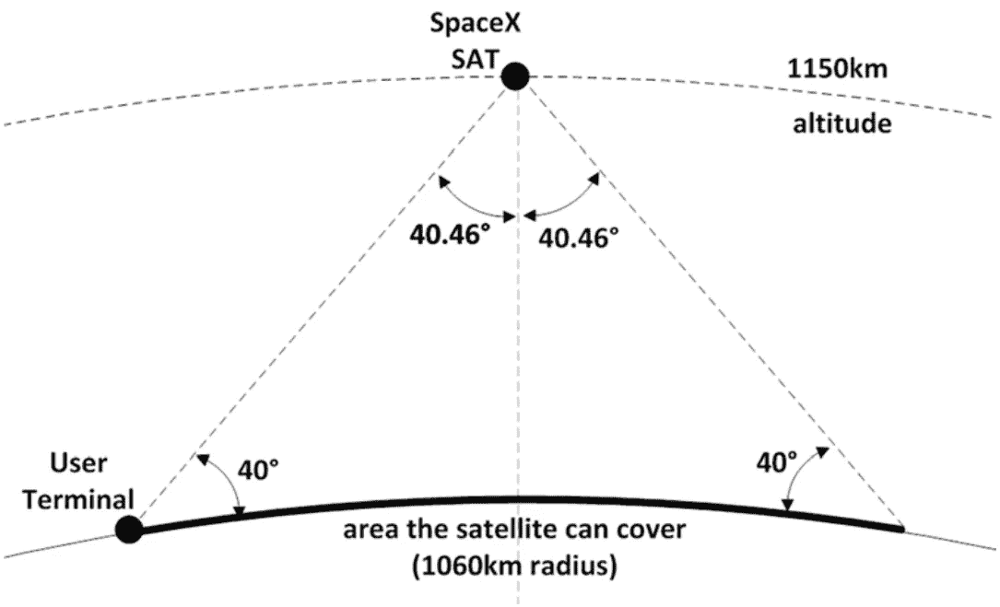

Source: [BusinessInsisder](http://www.businessinsider.com/spacex-internet-satellite-constellation-2016-11)

[SpaceX](https://www.google.com/webhp?sourceid=chrome-instant&rlz=1C5CHFA_enUS677US677&ion=1&espv=2&ie=UTF-8#q=spacex+universal+internet) 计划发射 4425 颗互联网卫星，以高速互联网卫星环绕地球。这大约是目前环绕地球运行的卫星数量的三倍。

通过让每个人都能访问互联网，我们将继续使信息民主化，赋予大众权力，并释放每个人的全部潜力。

## 7.所有人的向上流动

在未来，人们会发现基于天赋和努力的机会。这是朝着社会流动性的正确方向迈出的一大步。

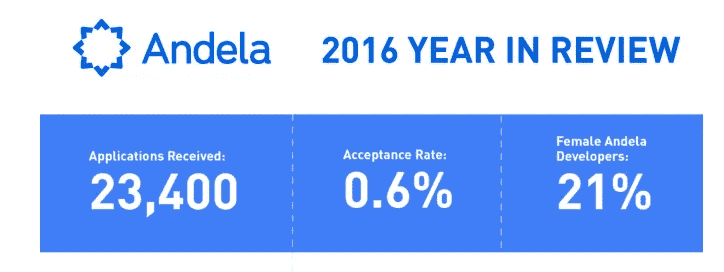

Source: [Andela](https://andela.com/blog/year-look-past-12-months/)

[安德拉](http://andela.com/)从世界上最大的未开发人才库——非洲大陆中挑选出 1%的顶尖科技人才。

他们的座右铭是，“被 CNN 称为比哈佛还难进的创业公司，我们从成千上万的申请者中筛选，所以你不必这么做。"

> “想象一下，90 亿人拥有干净的水、营养丰富的食物、负担得起的住房、个性化的教育、顶级的医疗保健和无污染、无处不在的能源。建设这个更美好的世界是人类最大的挑战。”——彼得·迪亚曼蒂斯

全球互联网接入将为每个人创造公平的竞争环境——在这种新经济中创造精英管理，同时提供普遍的学习和机会。

这取决于我们——人类——确保我们看到这些可能性实现。以创造人人平等、为员工提供安全性和灵活性、创造令人兴奋和满足的工作机会的方式来构建事物。

*我是 Skillshare 的首席执行官/创始人。我们的使命是通过提供普遍的学习和机会，在新经济中创造精英管理。以后想收到我的消息，订阅我的* [*每月简讯。*](http://newsletter.mikekarnj.com/)