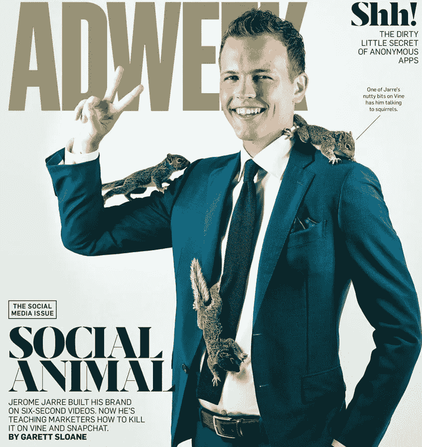
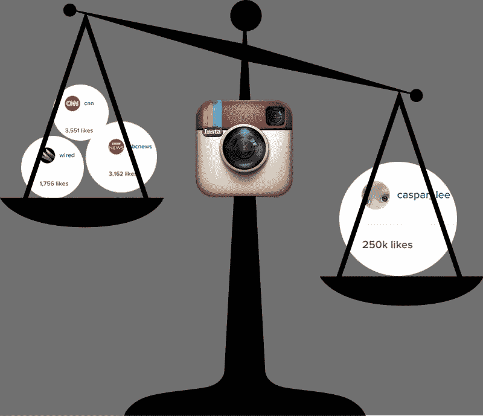

# 社交媒体艺术家颠覆广告业的 7 个原因

> 原文：<https://medium.com/swlh/7-reasons-why-social-media-artists-are-disrupting-the-advertising-industry-355043aaba67>

想要以经济高效的方式向数百万年轻的千禧一代提供精彩的内容吗？联系社交媒体艺术家，向他们简要介绍，让他们做自己的事情，他们将震撼你的世界。

社交媒体艺术家是年轻的有创造力的人，他们仅仅使用社交媒体网络就成功地获得了大量的追随者(从 1 万到 800 多万)。

他们对社交网络算法如何运作的了解，以及开发精彩社交故事的能力，是他们成功的主要原因。将这些技能用于为品牌或小企业创造职位，迄今为止效果显著。

Jerome Jarre a top social media artist featured on adweek cover page

如果这种趋势继续下去，社交媒体艺术家设法继续为品牌提供伟大的微内容，同时让他们的追随者参与进来，广告业应该准备好迎接一场大变革。以下是 7 个原因:

# **1。**

## **媒体预算减少**

与社交媒体艺术家合作的成本将取决于不同的变量，如粉丝数量、他的所在地或他与其他品牌的合作经验。目前还没有像传统网络媒体广告那样的固定费率卡。

然而，根据我的经验，社交媒体艺术家帖子的 CPM(每千次展示的成本)通常比你从在线广告投放中获得的要低得多。

除此之外，这些艺术家中的许多人在千禧一代花费大部分时间的社交媒体渠道中的影响力远远高于成熟的全球大众媒体网络。

To give a feeling of how powerful social media artists are, I took screen shots of how many likes BBC, CNN and Wired get on one Instagram post versus one post by a famous social media artist. Caspar_Lee

# **2。**

## **他们的触角是有机的不付费的**

有机意味着人们看到影响者的内容，因为他们在关注他们，他们喜欢他们在自己的网络上发布的内容。付费意味着你将在你的渠道中看到这一点，因为例如，脸书认为你符合品牌目标受众的描述。

品牌不应该只关注他们获得了多少浏览量，还应该关注他们是如何获得这些浏览量的。对一个品牌来说，有机印象或观点应该比付费印象更有价值。

# 3.

## 你不需要创造性的团队时间

影响者是你的创意团队，事实上他们是如此的有创造力，以至于几乎每天都有数百万人与他们互动。当你与社交媒体艺术家合作时，品牌在传统广告活动中为创意总监支付的昂贵时间是包含在内的。

# 4.

## 更低的生产成本

你不需要花钱让制作公司租用昂贵的设备，飞到异国他乡为你制作昂贵的广告。社交媒体艺术家只需使用他们的手机就可以制作出令人惊叹的微内容。

# 5.

## 他们为你提供许多额外服务

我与许多不同的机构合作过，喜欢与创意团队和客户经理一起工作。但归根结底，广告公司的员工是一个大组织的一部分，他们面临着实现收入目标的压力。

直接接触到的有影响力的人是他们自己的老板，如果他们喜欢你，通常会额外增加一些。他们也是很棒的顾问，会当面告诉你，你自己的社交媒体网络做错了什么。

# 6.

## 他们努力做到真实可信

对于社交媒体艺术家来说，要在这个领域生存，他们知道他们需要真实，因为如果他们不真实，他们会立即看到大量的追随者和负面评论。

# 7.

## 你可以接触到不同的部落

在社交媒体上经常可以看到部落。或者专注并有兴趣发布和参与特定类型内容的人。有时尚达人、美食家、喜剧演员、魔术师、富家子弟、极限运动、迷因等等。

不管你卖什么或者你想在哪里定位你的品牌，你会发现一个专业的社交媒体艺术家正在影响这些部落，并能帮助你为你的品牌做同样的事情。

在《福布斯》杂志提到的一项新颖的研究中，“五分之四的消费者表示，品牌并不表现得好像他们真的了解他们”。影响者营销可能是帮助营销人员以更有效的方式做广告的方法。社交媒体艺术家当然知道他们的追随者想看什么。

你和社交媒体影响者合作过吗？你对影响者营销有什么想法？

*发表于* **创业、旅游癖和生活黑客**

-