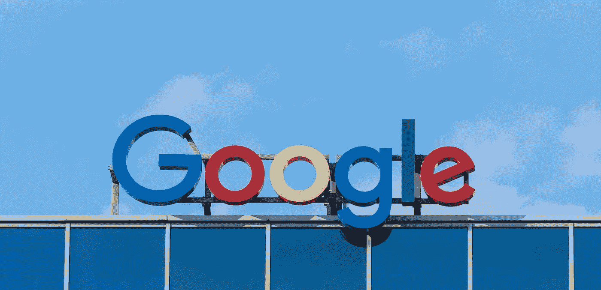

# 你的企业应该使用谷歌广告的 7 个理由

> 原文：<https://medium.com/swlh/7-reasons-why-your-business-should-use-google-ads-ad7ecaea1033>

为了庆祝 Google Adwords 更名为 Google Ads(2018 年 7 月 24 日发布),我们认为现在是考虑您的企业应该使用 Google Ads 的 7 个理由的好时机。

谷歌大约在 18 年前推出了他们的在线广告平台。该平台是一种点击付费(PPC)模式，允许广告商为产品供应、服务列表、视频应用等付费。

当想到谷歌广告时，除了底部的广告，我们会立即想到搜索引擎结果页面顶部的四个广告。(直到今年早些时候，以前都位于侧面)。然而，谷歌广告是如此之多。提供的活动类型包括各种搜索和显示网络、购物、视频和通用应用程序。

谷歌广告，如果执行得当，可以为企业创造奇迹。谷歌广告带来了超过 950 亿美元的收入，并在 2017 年成为谷歌[最大的收入来源，这是有充分理由的。数以百万计的广告商和企业使用 PPC 平台。对许多企业来说，不管正确与否，这是他们用来推销自己的唯一营销方式。为什么谷歌广告如此受欢迎，它是否适合你的组织？以下是你的企业应该使用谷歌广告的 7 个理由。](https://transpera.ca/marketing/blog/google-adwords-rebrand/)

# 1.巨大的延伸

谷歌广告的最大优势之一是平台的巨大影响力。作为市场内的垄断者，谷歌控制着 [90%的搜索市场](http://www.businessinsider.com/how-google-retains-more-than-90-of-market-share-2018-4/?r=AU&IR=T)和[每天处理超过 35 亿次搜索](https://www.forbes.com/sites/bernardmarr/2018/05/21/how-much-data-do-we-create-every-day-the-mind-blowing-stats-everyone-should-read/#6789fbee60ba)。

这些搜索中的大部分不会与你的业务相关，然而，它们中的许多会。根据谷歌、益普索 MediaCT 和 Purchase 的数据，每 5 个消费者中有 4 个使用搜索引擎来查找关于产品和服务的本地信息。无论与您的业务相关的每日搜索是 100 万次还是 12 次，谷歌的覆盖范围始终为您的业务提供充足的机会来建立品牌意识和认知度。

# 2.针尖瞄准

如前所述，并不是所有的搜索都与你的业务相关。此外，你可能不想把你的网撒得太宽，把所有相关的搜索都作为目标，而是选择其中的一部分。这也是为什么你应该使用谷歌广告的另一个原因，他们的特定目标。

除其他外，PPC 平台允许同时针对多个关键词，按照年龄、性别、父母身份和家庭收入水平以及具体设备使用情况(无论是移动设备、平板电脑还是电脑)对人口统计数据进行细分。如果你是一个当地的小企业，想要专注于一个特定的州或州内的一个或多个地区，谷歌广告可以让你相应地定位目标，没有任何限制。此外，用户甚至可以将他们的目标安排在一天中的不同时间和一周中的不同日子。完全意识到不同的因素如何影响决策，谷歌最近甚至引入了生活事件定位，包括受众细分，包括大学毕业、结婚和搬家。

谷歌广告并不满足于简单的文本广告，它提供了一种更加综合的再营销服务，允许用户重新定位那些通过访问他们的网站或他们的竞争对手的网站而对他们的产品表示兴趣的受众。再营销活动在将潜在客户从销售漏斗的一个阶段转移到另一个阶段方面如此有影响力，它应该有自己的位置。

当设置和建立正确时，谷歌广告可以确保你的业务在正确的时间、正确的地点瞄准正确的人。没有比这更强大的了！

# 3.瞄准感兴趣的人

与前面的观点相一致，谷歌广告的重点是锁定那些对你的产品有一定渴望的受众。

传统的广告和促销方法，如广播和报纸广告以及实体横幅广告，是一种“全面喷洒”的营销方式，更有可能接触到对你的产品或服务不感兴趣的人。相反，谷歌广告关注的是那些根据他们的行为暗示他们对你的业务有兴趣的受众。这种行为可能包括搜索相关产品或以前访问过您的网站。

# 4.真正快速的结果

我们想先强调一下搜索引擎优化(SEO)和有机流量的重要性。我们强烈警告企业不要认为谷歌广告应该取代搜索引擎优化。这两种策略既没有可比性，也不相似。SEO 是一个企业生存的重要组成部分，无论是否使用谷歌广告，都应该受到高度重视。然而，最好的数字战略将涉及搜索引擎优化和谷歌广告。

谷歌广告比搜索引擎优化更快产生结果。鉴于 SEO 是一项长期战略，重点是建立有机交通，往往需要几个月才能看到结果。然而，谷歌广告可以在一小时内为你的企业带来显著的效果。根据活动预算、关键词、定位和优化，谷歌广告可以带来即时效果。

# 5.弹性预算

使用谷歌广告的另一个原因是预算的灵活性。谷歌广告允许用户随心所欲地消费，无论是 1 美元还是 1000 澳元。

此外，PPC 平台提供了更大的灵活性，通过什么可以做的预算。用户可以设置并不断更改预算。此外，用户还可以设置其他预算因素，如加速支出，重点是通过你的预算燃烧。此外，谷歌的竞价因素给人们的预算带来了更大的灵活性。例如，如果一个人的战略侧重于点击，那么你只需为点击付费，所有的品牌意识和认知建设印象都是免费的。

通过优化，任何谷歌广告预算都可以非常有效，不管它是大是小。

# 6.非常简单的报告

基于谷歌提供的关于广告活动的所有信息，报告应该是复杂的。但事实并非如此。这是最简单不过的了。

在登录你的谷歌广告账户并选择一个广告活动后，用户就会进入他们的仪表板。这提供了关于活动的基本见解，可以很容易地定制。可用的指标包括展示次数、点击次数、平均点击费用和成本、选择的关键词、人口统计、设备、位置以及日期和时间。谷歌甚至提供建议来帮助提高你的活动的有效性。

进一步的报告可以通过报告部分获得(有趣的是！).报告允许以表格、线条、条形图、饼图或散点图的形式显示大量信息。只需点击并拖动您想要分析的指标。报告洞察力可以基于细节层次，包括活动、广告组、特定广告、关键字、最终 URL 等，绩效包括点击、点击率、浏览量和参与度等指标，以及侧重于活动属性的属性，如预算、开始和结束日期、出价策略、标题、扩展和设备偏好。其他洞察主题包括竞争指标、质量得分、投标模拟器、组合广告和有机统计等。

谷歌报道的另一个好处是，该系统尽可能贴近生活。在某些情况下，实时发生的事情和报道的事情之间只有几分钟的时间差。此外，将一个人的谷歌广告账户与[谷歌分析](https://www.google.com/analytics/#?modal_active=none)连接起来，可以进行更深层次的报告。这样做可以证明非常有效，并使用户能够做出明智的决定，不仅是关于营销，而且是关于未来的商业计划。

没有一个平台像谷歌广告那样让洞察和报道变得如此简单。

# 7.广告排名的使用

[广告排名](https://support.google.com/adwords/answer/1752122?hl=en-AU)是你的企业应该使用谷歌广告的另一个原因。广告排名是谷歌使用的一种算法，用于确定广告在搜索引擎结果页面上的顺序。具有较高排名的广告将显示在更高、更有效的位置。

专注于你的最高出价和质量得分，广告排名公正地决定了一个人的排名和点击费。通过广告排名，公平竞争，因为最高出价者不一定获得最高的广告排名。除非他们的质量分数也是最高的。如果你的网站有一个高质量的分数(通过 SEO 获得)，你的广告很有可能比那些把你的预算打得落花流水的人排名更高！

现在你知道了为什么你的企业应该使用谷歌广告的 7 个理由，是时候注册一个账户了！本文原载于[起点数码网站](https://startdigital.com.au/7-reasons-why-google-ads/)。

## 这篇文章发表在《T4》杂志《创业》(The Startup)上，这是 Medium 最大的创业刊物，有 351，974 人关注。

## 在这里订阅接收[我们的头条新闻](http://growthsupply.com/the-startup-newsletter/)。

