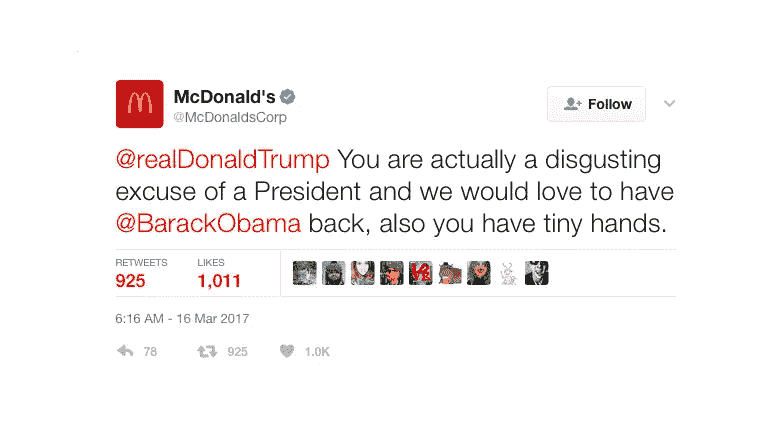

# 为什么你的网络声誉很重要的 7 个原因

> 原文：<https://medium.com/swlh/7-reasons-why-your-online-reputation-is-important-56227d399a51>

你已经有了一个稳固的网站和一个脸书主页。太好了。很容易认为你现在控制着自己的网络命运。在这里或那里发一篇博客，在脸书发几篇帖子，你的在线个人资料就能搞定了。

保持这种想法。你曾经谷歌过你自己或者你的公司吗？事实是，我们大多数人都经历过。当我们单独寻找自己时，我们可能会发现另一个版本的格拉斯哥地毯装配工。这比你想象的更常见。然而，搜索你的业务和结果可以相当惊人。

虽然你可以控制你的网站和脸书页面，但你很可能会发现大量的“其他”信息，这些信息是你无法控制的，也不是你提供的。企业名录，评论和你的企业形象似乎从无到有。

潜在的损害可能是相当令人生畏的。你的商业声誉可能会受到威胁，你很容易觉得自己无法控制别人在说什么。

# **什么是信誉监控？**

你的在线个人资料可能是一件好事，也可能是一件坏事。重要的是，只要有可能，你的商业信誉是清白的。

搜索引擎显示一切。无处可藏，你可以打赌，潜在的和现有的客户会谷歌你，以确保他们与一个有信誉的，受人尊敬的公司打交道。事实上，研究表明 [**90%的顾客**](https://www.brightlocal.com/learn/local-consumer-review-survey/) 在访问一家企业之前会阅读在线评论。你在网上的评论对你的成功至关重要。

# **你需要监控自己网络声誉的 7 个理由**

从 [**脸书假新闻**](https://startdigital.com.au/facebooks-fake-news-killer/) 到差评，网络信息瞬息万变——你的声誉也不例外。

我们总结了 9 个你应该保持声誉的理由。你现在要做的就是把那些互联网前的照片和情书藏起来。让我们开始吧。

# **1。您的在线状态无处不在**

脸书，Instagram，Twitter，Quora，Reddit，谷歌评论，Tripadvisor。这个名单还可以继续下去。

你和你的客户可以在网上找到很多不同的平台来了解一家公司的信息。

博客和社交媒体为你提供了一个与受众分享积极反馈的绝佳平台。挑战在于跟踪客户对你的业务的评论、对话、想法和感受。这并不意味着你应该躲起来；意味着你应该拥抱它。

加入对话。以积极、专业的方式回应每一条评论。即使是糟糕的，彻头彻尾的负面的，来自客户的周一早晨的评论，也可能没有一个好的体验。你的回应很能说明你的业务，并向其他客户展示你的关心。我们自然希望与关心我们的人做生意，这将导致…

# **2。回复评论至关重要**

[**84%的人**](https://www.forbes.com/sites/ryanerskine/2017/09/19/20-online-reputation-statistics-that-every-business-owner-needs-to-know/%2329a3ad34cc5c) 相信网上评论，就像相信面对面的口头推荐一样。这意味着你的在线评论可以成就你的事业，也可以毁掉你的事业。

回应积极的建议、提及甚至是负面的评论将有助于提高参与度，并表明你在乎。以正确的方式回应负面评论，可以让你公开纠正有可能恶化的情况，从而最大限度地降低对你声誉的损害。

# **3。未知网站列表**

有大量不同的在线目录。Yelp 和 Trip Advisor 就是一些明显的例子。珀斯地图 是我们最喜欢的一张地图，但是网上还有很多其他的地图人们不知道。

有些可能是无辜的。也许你的 [**SEO 代理**](https://startseo.com.au/) 将你的业务添加到一个目录中来帮助建立反向链接。如果目录本身有良好的声誉，这是好的。我们建议您或您的代理机构跟踪“流氓”的目录，这些目录的链接会对您的网站产生负面影响。这些可能需要在谷歌的搜索控制台平台上否认。

同样值得一提的是，可能有相同或相似的企业名称。确保你尽快在尽可能多的知名企业名录上宣称你的企业名称。不确定哪些目录应该命中，哪些应该避免？给我们写封短信，我们会指导你的。

# **4。取回物品可能需要一段时间**

任何人都可以在网上列出你的业务。是的，任何人。

就像我们可以购买我们的商业域名，在脸书、Twitter 和 Instagram 上注册我们的企业一样，任何人都可以做同样的事情。快速搜索开始数字节目:

开始数字化

开始数字出版

点击开始数码

数字启动

而且也没什么能阻止有人注册****。它是可用的，如果有人愿意，他们可以创建一个网站，着手瓦解我们的小帝国。但是不要有任何想法。****

**在一个捕风捉影的世界里，人们被模仿，企业成为目标并不罕见，个人也一样。好消息是，如果有人将你的公司上市，你可以采取措施收回控制权。**

**虽然谷歌和脸书等平台在纠正这一点上表现出色，但遗憾的是，这一过程并不是瞬间完成的。您可能需要演示各种形式的认证和验证。在此期间，你无法控制网上发生的事情。**

**您可以在此 处索回您的谷歌列表或申请现有列表的所有权 [**。在脸书有许多可变因素，但是“**](https://support.google.com/business/answer/4566671?hl=en) **[**报告侵犯你的权利**](https://www.facebook.com/help/contact/634636770043106/?ref=u2u)**”**页面可能是最好的起点。****

# ****5。人们信任人们****

**网上评论很强大。很明显，就像在现实生活中一样，人们在网上信任他人。**

**时间正迅速成为一种稀缺商品，人们很少进行任何事实核查——因此出现了唐纳德·特朗普(Donald Trump)。只要在你的网站上放上 5 颗金星，就能不知不觉地把一个普通访客变成客户。类似地，负面评价会对你的企业造成巨大的伤害——回头参考第二点。**

**我们推荐 [**社交校对你的网站**](https://startdigital.com.au/the-5-critical-social-proofs-your-website-needs/)**——这是展示你的客户名单和证明你的业务值得信赖的一种快速简单的方法。突出客户标志、证明和直接从你的网站链接到其他评论平台有助于建立信任。****

# ******6。口碑快速移动******

****近年来,“口碑”的概念已经发生了变化。社交媒体不再保留给街头八卦，而是让口碑和用户体验以光速传播。我们有多少次看到大企业[**#在社交媒体**](https://www.cbinsights.com/research/corporate-social-media-fails/) 上失败，这对它们的声誉产生了巨大影响？从麦当劳到凯马特和大型企业，很容易看出事情是如何变得一团糟的。我们知道互联网可能会原谅，但它永远不会忘记#截图。****

****重要的是，首先要确保你发布的内容是相关的，并且不与你的商业理想冲突——这不难，对吧？其次，密切关注你的社交媒体渠道也很重要。不仅仅是流氓员工会影响你的帖子，每个平台上的每个帖子的评论都可能是不适当的垃圾邮件，甚至是诽谤。****

********

****(Don’t worry McDonalds — it’s not your hands we’re laughing at…)****

# ******7。自动化工具=废话内容******

****随着时间成为新的黄金，我们看到越来越多的企业依赖工具来自动化他们的社交媒体账户。我们将承认自己在 Twitter 上使用它们。我们需要删除我们的 Twitter 帐户并重新开始是有原因的。越来越多的企业和企业目录正在推送和拉取内容，这些内容可能看似与算法相关，但并没有真正的业务相关性。内容可能仍然是王道，但它需要真实和相关。****

****如果您的企业使用这些工具中的任何一种，那么监控推送至您帐户的内容是至关重要的。“智能”自动化给我们带来的麻烦比我们愿意提及的次数还要多。社交用户是精明的，知道什么时候一个企业正在自动化他们的内容，这取决于你的观点，可能会稀释你的品牌和声誉。****

# ******结论******

****就像现实生活一样，你的网上声誉很难追踪。然而在现实生活中，很容易摆脱流言蜚语，继续前进。不那么在线。无论是来自心怀不满的客户、前雇员、狡猾的竞争对手还是垃圾内容，你的商业档案都有可能不断受到攻击。这有点危言耸听，但忽略它，后果自负。****

****当然也不全是负面的。有可能你会发现一些对你的业务的深刻见解，并发现你不知道存在的评论。当你这样做的时候，一定要更新你的网站，向世界展示你的客户对你的看法，并传播这个消息。查看我们关于 [**社会证明如何工作**](https://startdigital.com.au/what-is-social-proof/) 的帖子，了解更多信息。****

****如果你想要更多的帮助来管理你的网上声誉，今天就联系 **。******

****本文原载于 [Start Digital 网站。](https://startdigital.com.au/7-reasons-why-your-online-reputation-is-important/)****

********

## ****这篇文章发表在 [The Startup](https://medium.com/swlh) 上，这是 Medium 最大的创业刊物，有 329，974+人关注。****

## ****在这里订阅接收[我们的头条新闻](http://growthsupply.com/the-startup-newsletter/)。****

********