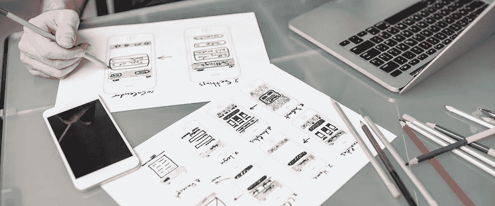
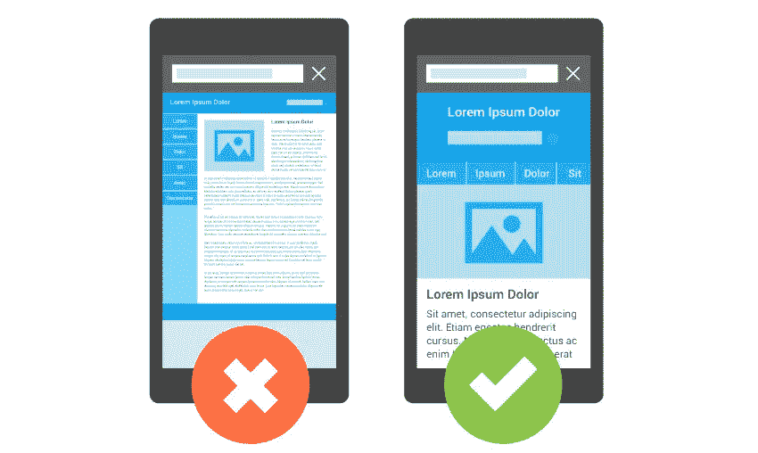
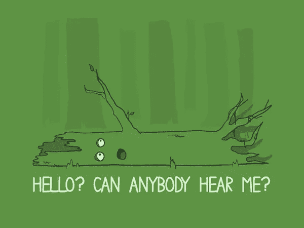

# 你的网站需要重新设计的 7 个原因

> 原文：<https://medium.com/swlh/7-reasons-why-your-website-needs-a-redesign-d8afc52f1ac8>

好吧，这是一个很大的要求，但你的网站确实是你的数字战略中最重要的元素。是的，也许比你在 Instagram 和 Linkedin 上的资料更重要。我们也可以说网站是你生意中最重要的组成部分之一。它不仅展示了关于你的产品、你的团队和商业故事的重要信息，也是你的潜在客户真正了解你如何向世界展示你的业务，并最终决定与你联系(或不联系，视情况而定)的地方。

虽然许多公司都有网站，但在与潜在客户进行有效沟通时，许多公司已经过时了。正如汽车会过时，时尚会改变，家居风格会进化，网站和我们对如何最好地在线交流的理解也会进化。事实上，公平地说，网站和技术的变化速度是周围一切事物的 10 倍。如果你的网站过时了，你使用过时的传播策略，那么你很有可能会失去客户。为什么？因为我们更信任那些明显受到关注和喜爱的网站，而不是那些看起来几周/几个月/几年都没有被访问或更新的网站。就像我奶奶常说的，“如果你看到灰尘，你不能相信。”*

在这篇文章中，我们揭示了你应该留意的 7 个明显迹象，以确定是否是时候给你的网站一个专业的检修和一个新的像素外套了。

# 1.它对用户不友好

[88%的在线客户在经历了糟糕的体验后不太可能再回到网站，原因很容易理解。](https://www.invisionapp.com/blog/statistics-on-user-experience/)

现在是 2018 年，你的潜在客户可能已经看到了成千上万个网站。他们习惯于快速的加载速度，直观的导航和圆滑的设计，清楚地传达您的业务提供。

大多数企业拥有大量多样的产品/服务，并希望与“每个人”交流。尝试和展示你所做的“一切”非常容易，这可能会让访问者不知所措，冲淡你的核心产品。如果你的网站让你的用户很难发现内容，也很难理解你的产品，你不仅留下了一个糟糕的第一印象，你的潜在客户很可能会离开你的网站，永远不再回来！

就像 Kanye 说的‘不要为了引起共鸣而复杂化’。**

# 2.它看起来过时了/普通了/糟透了

如果你的网站已经超过 4 年了，你很可能在设计趋势上落后了。是的，在网络世界里，4 年是一段很长很长的时间，当你的网站继续运行时，很容易把重新设计放在一边。

当我们从实体店买东西时，值得考虑我们的想法和我们采取的行动。

商店 A 的灯亮着，门开着。地板很干净，架子堆放整齐。服务员很有帮助，他们有很多相关的产品。

商店 B 只有一盏灯亮着，门是关着的。我们不确定它是开着还是关着。当我们决定进去时，货架几乎空了，我们找不到店员。

每个商店的价格和产品保修都是一样的——但是我们从哪个商店购买会感觉更舒服呢？

如果你说的是 B 店，那我显然不知道我在说什么。

精彩的网络世界不断进步，吸引潜在客户注意力的竞争也越来越激烈！从手工制作的插图和页面运动动画到动态渐变和响应性标志，商业网站需要新鲜、难忘，如果可能的话，还要有抱负。不管他们告诉你什么，大多数购买者/客户会做出感性的决定，而不是理性的决定，所以视觉上吸引人是很重要的。

一个更新和现代的设计不仅仅是为了展示，它是你的客户购买决定的关键因素之一。

# 3.您的网站没有响应

这是官方的，与桌面用户相比，更多的用户使用手机和平板电脑浏览互联网。

没有什么比浏览一个你需要用手指放大每一页来阅读文本的网站或者让你的拇指不停地点击错误的链接更烦人的了！

拥有一个适合移动设备和平板电脑的网站对于获取和转化大量的移动访问流量非常重要。

# 4.它不能准确反映你的品牌

也许你经营公司已经有几年了，你的商业模式和客户群已经得到了完善。

你的品牌价值发生了变化，但这在你当前的网站上是否明显？

或者也许你现有的网站从未真正传达过你的品牌价值，你只是“忍着”。

无论你的受众是否发生了变化，或者你的网站是否“完全正确”，对于知名企业来说，重要的是要有一个与品牌相一致的在线形象，如果适用的话，还要与现实世界中的形象相一致。

你的网站有潜力将你的品牌提升到一个全新的水平，但你只有在以下情况下才能推广它并引导人们走向它:

a.它与你的品牌一致 b .清楚地展示你所做的工作
c .你为此感到自豪

2018 年，网络用户是精明的。我们都已经使用互联网 20 年了(或多或少)，我们知道什么时候一个企业不真实。确保你的网站符合你的品牌和你是谁是证明真实性最有效的方法之一。

# 5.与您当前的营销策略不一致

五年前，你的策略可能是通过现场联系表获得尽可能多的询盘。今天，你试图通过博客和电子邮件订阅来建立权威。我们能理解。

但是你的网站准备好改变你的方法了吗？

无论是过时的内容管理系统(CMS)还是设计糟糕的行动号召区，缺乏关键的网站功能都会阻碍你的营销努力。你可以到处“安装”一个插件，但很有可能它看起来和感觉上都像是一个插件，而且可能不是最有效的方法。

如果你今天的战略与你创业时大相径庭，那么你的网站自然会随着你的目标而发展。

# 6.它的转化率很低

你的商业网站的目标应该是帮助产生线索、询价或直接销售——这取决于你的业务性质。

如果你的营销活动一直在进行，但是你发现你的在线销售或销售线索在减少，这可能是你的网站没有与你的受众建立联系的信号。

当然，如果是这种情况，我们建议刷新您的网站。然而，重新设计不应该发生，直到你明白为什么你现有的网站不再赢得线索。这可能会回到你的行动号召上来，也可能是网站没有[将销售和转化率最大化](https://startdigital.com.au/how-to-structure-your-website-content-for-maximum-sales-conversions/)。不管什么原因，分析原因是值得的。

谷歌分析提供了一些令人难以置信的见解，正如研究你的竞争空间以了解你的竞争对手正在做什么不同。也许改变行动号召和测量反应(A/B 测试)会有帮助？

最终，糟糕的转化率是你的网站需要更新的最明显的信号之一，但是，和任何网页设计项目一样，在开始之前做出一些明智的决定是很重要的。

# 7.它没有在谷歌上列出

If a tree falls in the woods and no one is around to hear it does it make a sound…..?

任何企业要想在网上成功并赢得商机，未来和现有的客户能够在网上找到他们是至关重要的。想象一下，寻找一个你知道存在但却找不到的企业。业余的对吗？试试黄页😉

互联网在不断扩张，竞争也在快速升级。

如果网络用户不能发现你的网站，新客户如何找到你？口碑很好，但是当人们听说你的生意时，他们会做的第一件事就是谷歌你。

今天的网页设计平台允许设计机构将搜索引擎优化(SEO)整合到一个新网站中，确保新网站在搜索引擎上获得最好的启动。发现为什么 [SEO 对你的商业生存如此重要](https://startdigital.com.au/why-seo-is-important-to-your-business-survival/)。

如果你的旧网站没有设置搜索引擎优化，或者使用过时的技术和策略，如 flash 图形、隐藏文本或糟糕的网站架构，谷歌会发现很难索引，因此，它不会理解你的网站应该列在哪里。这些都是困扰老网站的问题，会阻碍你发挥潜力。

当然，这些都是可能影响糟糕的新网站的因素(让我们谈谈，我们可以帮助)，但在旧平台上更普遍，这些旧平台没有得到保持相关性所需的爱和关怀。

# 结论

拥有一个现代的、新鲜的、直观的网站是网上商业成功的关键。

虽然没有必要每年都重新设计你的网站，但是客观地看一看对于理解你当前的设计是否有助于实现你的商业目标是至关重要的。

在 Start Digital，我们不仅帮助客户从零开始建立他们的网络形象，我们还积极地帮助企业利用现有的网络形象，用现代的、行之有效的策略更新和更新他们当前的网站，这不仅能提升他们的品牌，还能带来真正的业务成果！

给我们发电子邮件或打电话，让我们今天就开始您的数字更新！

*免责声明，这是我编的。奶奶的房子是澳大利亚最脏的。

**免责声明。这也是我编的。

## 这篇文章发表在《创业公司》杂志上，这是 Medium 最大的创业刊物，有 303，461 人关注。

## 订阅接收[我们的头条新闻](http://growthsupply.com/the-startup-newsletter/)。

