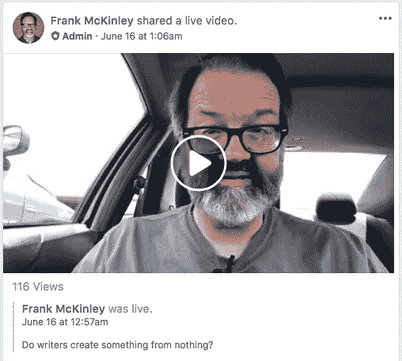
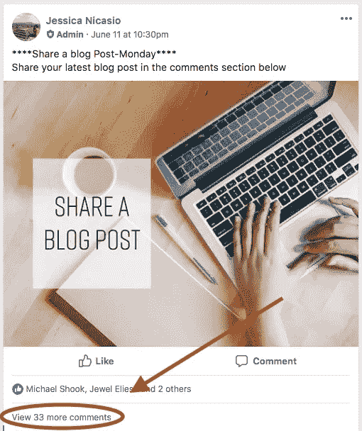
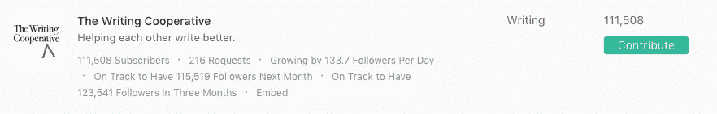
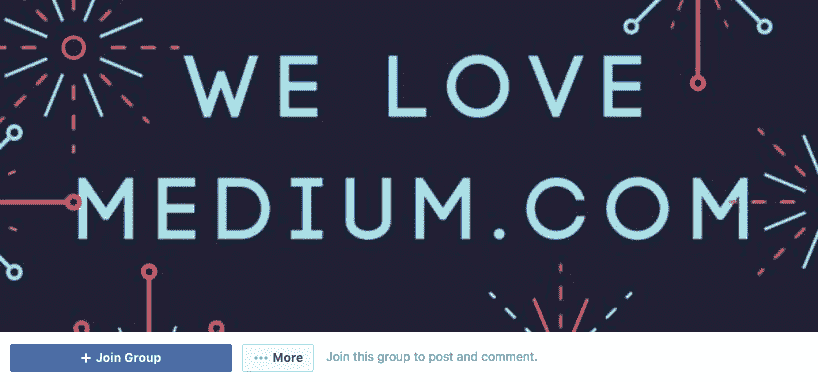

# 想在媒体上获得更多观点的博客作者的 7 个资源

> 原文：<https://medium.com/swlh/7-resources-for-bloggers-who-want-to-get-more-views-on-medium-d5368255a4f7>

“A woman taking notes in a large notebook next to a laptop” by [J. Kelly Brito](https://unsplash.com/@kellybrito?utm_source=medium&utm_medium=referral) on [Unsplash](https://unsplash.com?utm_source=medium&utm_medium=referral)

我已经有一分钟没有在媒体上发表博客文章了。

你不介意我再做一次吧？

你确定吗？

如果你放下烂番茄，我会继续下去。

# 1.弗兰克·麦金利的今日提示

弗兰克是我的好朋友。

> 除了在亚马逊上卖了成千上万的电子书，在 Medium 上也非常成功，Frank 还经营一个很酷的 FB Live show。

事实上，当年我出现在他的另一个节目《欣欣向荣的作家秀》上，几个月后他出现在我的虚拟峰会上..

那就是我！😄

弗兰克的 FB 秀旨在每天给人们一个新的写作技巧。

短。太好了。切中要害。

如果你[加入他主持的脸书小组](https://www.facebook.com/groups/tribebuildersnetwork)，你马上就能得到这些令人敬畏的建议。

如你所见，他最新的一条建议已经被浏览了 116 次。人们喜欢他和他的建议，这是一个和一个在亚马逊上卖了成千上万本电子书的人互动的机会。

如果我是你，我会利用那个机会！

# 2.[每周三中部时间晚上 8 点，妮可·埃克斯和其他作家都会在 Twitter 上参与#Pubchat。

这是一个长达一小时的聊天，他们谈论写作，博客，出版，通常只是有创意。

三周前，我去酒吧聊天，那真是一次很酷的经历。](https://medium.com/u/bf07fdb21040#推特上的 Pubchat</h1>

 *更新*下周(2018 年 6 月 27 日)我会上 [#Pubchat](https://twitter.com/hashtag/pubchat) 专题。我希望你能来玩！

在 Medium 上看到这么多更好的统计数据，很大程度上是因为遇到了其他优秀的作家来学习和支持。

这是一次你不想错过的聊天！

# 3.杰西卡·尼卡西奥的“发展你的博客”运动

情节扭曲..事实上，我自己成立了这个脸书小组…

但后来我把它交给了杰西卡·尼卡西奥来管理，到目前为止她做得非常出色。

“发展你的博客运动”是一个拥有 770 名成员的脸书组织，旨在让作家们分享他们最新的媒体报道并相互交流。

如你所见，参与度通常很高。我们也有一些主持人在 [Fernando Ribeiro Aguilar](https://medium.com/u/1548e8e54639?source=post_page-----d5368255a4f7--------------------------------) 、 [Greg Fultz](https://medium.com/u/e557dfbeb7a2?source=post_page-----d5368255a4f7--------------------------------) 、 [Kyle Lasalita](https://medium.com/u/eb4475f33ee6?source=post_page-----d5368255a4f7--------------------------------) 和 [Jordan Ebert](https://medium.com/u/e52e38f9db6c?source=post_page-----d5368255a4f7--------------------------------) ！

加入分享一些博客文章和网络与其他真棒博客。😃

# 4.[布莱克·鲍威尔](https://medium.com/u/d0feb9cb177b?source=post_page-----d5368255a4f7--------------------------------)的防弹编剧

Blake 的防弹作家群在脸书有超过 430 名成员，是作家们分享文章和认识其他优秀作家的另一个地方。

> 布莱克本人是一位多产作家，所以你不应该错过和他一起工作的机会。

所有这些团体和人背后的共同线索是，他们优先在媒体上发表文章。

[现在就加入他的脸书小组](https://www.facebook.com/groups/bulletproofwriters/)！

# 5.林肯·W·丹尼尔·Smedian.com

Smedian 已经存在了一段时间，它是目前为止进入媒体出版物的最佳去处。

> 他们有“请求投稿”按钮，可以立即通知编辑你想为某些出版物撰稿，我认为可能没有其他工具/资源像 Smedian 一样对我的媒体生涯产生如此大的影响。

创建个人资料后，您可以在此处看到[前 100 名出版物](https://toppubs.smedian.com/)，并轻松地向您喜欢的出版物“请求投稿”!

说够了。

# 6.[弗兰克·麦金利](https://medium.com/u/60369bf112de?source=post_page-----d5368255a4f7--------------------------------)的媒介掌握小组

> 我知道我一直在提到弗兰克，但我需要强调他的另一个团队,[media mastering](https://www.facebook.com/groups/mediummastery)，专门帮助 media 上的作家，而不是一般的博客/写作。

加入他的 277+团队，与其他出色的作家如[艾米·托雷斯](https://medium.com/u/ea1484dbb056?source=post_page-----d5368255a4f7--------------------------------)和[妮可·阿克斯](https://medium.com/u/bf07fdb21040?source=post_page-----d5368255a4f7--------------------------------)一起拍摄关于 Medium 的故事。

# 我的 YouTube 频道

我真的没有看到有多少人制作关于如何在 Medium 上增加观众的视频。

为了解决这个问题，几个月前我开始了自己的 YouTube 频道，并开始上传关于博客/media/甚至旅行的视频。

我正在努力填补这个空白，所以如果你想获得关于如何在 Medium 上增加观众的视频内容，请考虑订阅我的频道！

这些都是网络的最佳资源，可以在 Medium 上获得更多的视图，并且可以更好地了解这个伟大的平台。

> 我希望你加入这些小组，看看弗兰克、妮可、杰西卡、布莱克和林肯令人敬畏的作品。

他们真的很努力，让这个平台变得更好！

> 想在 Medium 上建立自己的观众群吗？我有一个为期 5 天的免费电子邮件课程，叫做“你的第一个 1000 个关注者”将会教你我是如何做到的！[在此签名](https://app.convertkit.com/landing_pages/290945)。

## 这个故事发表在《创业》(Startup)杂志上，这是 Medium 最大的创业刊物，有 337，320 多人关注。

## 订阅在这里[接收我们的头条新闻](http://growthsupply.com/the-startup-newsletter/)。

