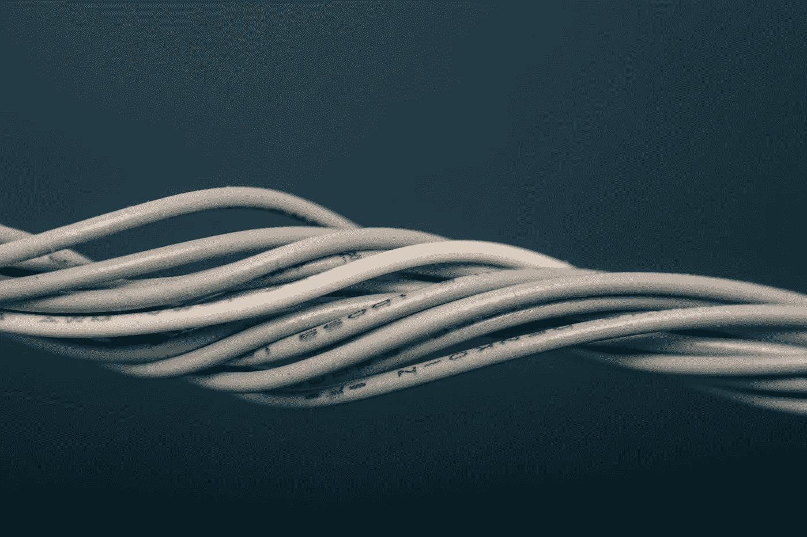

# 摆脱坏习惯的 7 个简单步骤

> 原文：<https://medium.com/swlh/7-simple-steps-to-breaking-free-from-bad-habits-949ca22a5b27>

> 吸烟。咬指甲。看太多电视。在社交媒体上花费过多。

每个人都有一些想要摆脱的习惯，我猜你可能已经尝试过了…但是失败了。

这不是你的错。是你的大脑。

你的大脑在暗中破坏你改变那些你一直想打破的坏习惯的努力。

# 你的大脑喜欢你的坏习惯

*是的。你知道咬指甲会让你的手指看起来像是在和割草机打架。*

*是的*。你知道，每晚狂看 4 个小时的《权力的游戏》可能不是促进你个人或职业生涯的最佳主意。

*是的。你意识到花太多时间在社交媒体上会让你变得更加自我。*

事实是你的大脑不想让你改变。它爱你本来的样子。

多甜蜜啊…

你的大脑喜欢例行公事，你的大脑越是参与某个例行公事、习惯或活动，大脑就越是铺设线路，让你下次更容易完成这个过程。

大脑在这些重复的路径中找到安慰。它是可靠和稳定的，而新的活动对你的大脑来说是陌生和不自然的。

试着想想这个。

想象一下，我让你要么**刷牙**要么**试着骑独轮车**。除非你以前有骑独轮车的经验，我的猜测是试图骑独轮车的想法让你的手出汗。

> 我们的习惯有助于在我们的大脑中形成平坦的道路，使我们的大脑感到轻松和安全，而新的活动形成粗糙的道路，使我们的大脑感到不舒服和抗拒 T21。

# 你的坏习惯是“固有的”

> 你的大脑不想让你成功。你的大脑想让你活下来。

打造一条新的道路，也就是所谓的新习惯就像是你的大脑开始了一次未知的旅程。

就像想洗个热水澡。你知道为了开始你的一天，你必须走出去，但是回到浴室感觉真好。也许再等几分钟

这就是为什么你的大脑似乎几乎抗拒改变。你的大脑实际上已经通过重复使用为自己设定了线路，使你的坏习惯 ***容易做到*** 却 ***难以打破*** 。

你的大脑喜欢可知和可预测的舒适和安全。因此，如果我们想改变我们的坏习惯，我们需要做一些事情来使这种改变持续下去。

# 如何摆脱你的坏习惯

# 1)停止做它们(*显然是*)

当然，如果你想把坏习惯换成生活中更有用、更有帮助的东西，你应该**戒掉坏习惯**是有道理的。对你没有帮助也没有帮助。

**我们马上就来讨论意志力。*

# 2)用你想要的东西代替

如果你想摆脱你的坏习惯，你必须为你的大脑铺平一条新的道路。你必须设定一个新的方向。

**你想不想不要再看那么多电视了？用阅读、锻炼或冥想来代替这段时间。**

也许你可以开始多做些你梦寐以求的副业。

# 3)在你的改变背后附加一个更大的目标

很多时候，人们试图改掉一个坏习惯，只是因为他们认为这只是一个他们应该改掉的“坏习惯”。

如果你真的想改掉这个习惯，把你的**应该**变成**必须**。

弄清楚为什么你需要打破这个习惯。为什么要改掉这个习惯？为什么这对你很重要？这对你的生活有什么影响？

如果你没有这个习惯，你的生活会变得更好吗？

也许花太多时间在社交媒体上已经开始影响你的人际关系，甚至你的精神健康。

也许你的部分目的是要在世界上产生重大影响。你认为你能做到每晚看 4 个小时的《网飞》吗？

> 如果这个坏习惯对你或你更大的人生目标没有帮助，弄清楚“为什么”给你的生活火上浇油。

如果没有一个更大的目标来解释你为什么要改掉这个习惯，你会发现把坏习惯换成好习惯是很有挑战性的。

# 4)避免意志力

现在让我们实际一点。

打破坏习惯很难，意志力似乎是许多人的限制因素，它将决定你是否能够走向胜利或回到旧习惯。

诀窍是尽可能避免意志力。

你必须做出的每一个决定，每一次你想回到过去的冲动，以及每一次你必须展现意志力的时候，都会耗尽你的“意志力”一旦失去，你就没有更多的东西可以给予，并且很容易退回到以前的方式。

关键是避免一开始就不得不做出那些艰难的决定和选择。我们来看一个个人的例子。

我想早起，在早上锻炼。这意味着我必须在凌晨 4:30 起床。哎哟。

## 凌晨 4:30 会给我温暖的床通电吗？

意志力不会持续太久。

所以我是这么做的。

1.  我打算提前一小时睡觉。我设定了一个时间，在这个时间里，我承诺要在。
2.  我把手机从怀里拿出来，强迫自己起床去接闹钟。
3.  **我前一天晚上就把衣服拿出来了，所以我不用考虑穿什么。**
4.  **前一天晚上，我把水和耳机预先打包好，放在柜台上，这样我就可以出门了。**

当然，仍然需要一些意志力，但是通过避免使用意志力去做一些可能会让我偏离轨道的选择和决定，我成功了，并且养成了新习惯。

# 5)每天划掉清单(多巴胺)

在这个过程中，你如何保持动力？

我最喜欢的方法之一是通过**侵入你大脑的神经化学**，特别是 ***多巴胺(自然是*******)。*** 多巴胺是你的奖赏和动机神经递质，参与感受快感、动机、记忆和奖赏。*

*研究表明，大脑中多巴胺水平较高有助于你变得更有动力去采取行动。[ [R](https://www.sciencedaily.com/releases/2013/01/130110094415.htm)*

*一个简单的自然增加多巴胺水平的方法是创建一个待办事项清单，用一个大大的红色“X”划掉你已经完成的任务。*

> *当你完成一项任务或目标时，你的大脑在视觉上看到了这种成就，它会触发大脑释放更多的多巴胺，这让你感觉很好，但也会增强你继续前进的动力。*

# *6)保持一致*

*坏习惯在你的大脑中扎根并固化需要时间，这意味着你的大脑需要时间来忘记坏习惯并接受新习惯。*

*关键是确保你与新习惯保持一致。你越想让你的大脑适应新习惯，大脑就会越快地放下线路，让你的大脑做起来更容易、更舒服。*

> *如果你想减掉 10 磅，你认为每周一次还是每周 4-5 次会达到最好的效果？*

*你的大脑需要一致性来创造更深的“凹槽”,以开始向一个新的积极方向布线。*

# *7)冲洗并重复*

*一旦你打破了一个坏习惯，冲洗一下，然后再换一个。*

*也许你已经发现了你生活中想要提升的其他方面。你可以用不同的步骤用同样的策略来帮助你克服任何你想改掉的坏习惯。*

# *参加 Udemy 上的[黑客神经可塑性课程](https://www.udemy.com/hackyourneuroplasticity)！*

*   *30 个视频讲座，将为你提供饮食、运动和思维的策略，以自然地增强你的脑力。*
*   **包括* **间歇禁食入门指南** | **20 种免费锻炼** | **睡眠黑客指南** | **补充指南** | &更多。*
*   *学习如何创造一种持续不断的生活方式。*

## *[点击这里释放你的超级大脑！](https://www.udemy.com/hackyourneuroplasticity)*

**跟随布雷迪·萨尔西多博士上* [***脸书***](https://www.facebook.com/drbradysalcido/) *和*[****insta gram****](http://instagram.com/drbradysalcido/)*

****

## **这篇文章发表在 [The Startup](https://medium.com/swlh) 上，这是 Medium 最大的创业刊物，拥有 336，210 多名读者。**

## **在这里订阅接收[我们的头条新闻](http://growthsupply.com/the-startup-newsletter/)。**

****