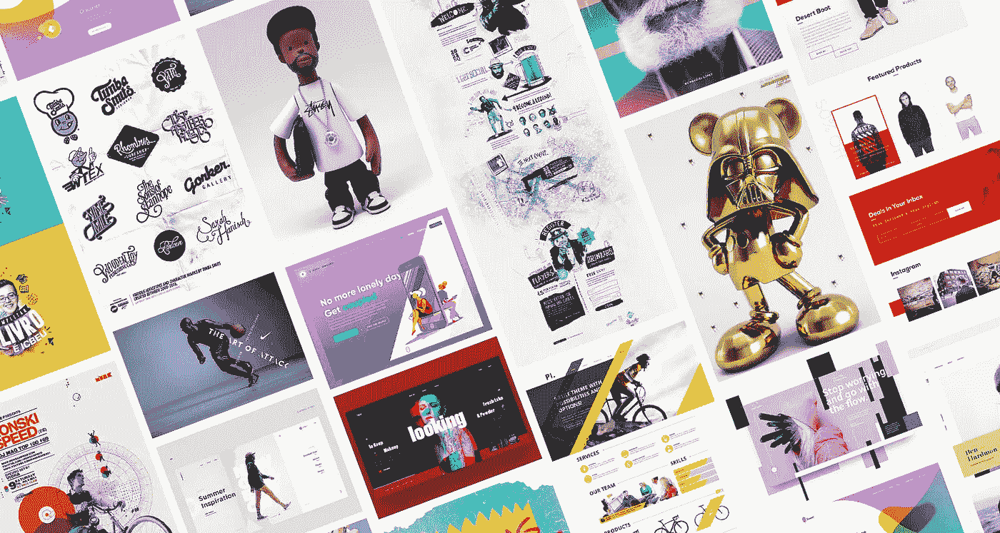
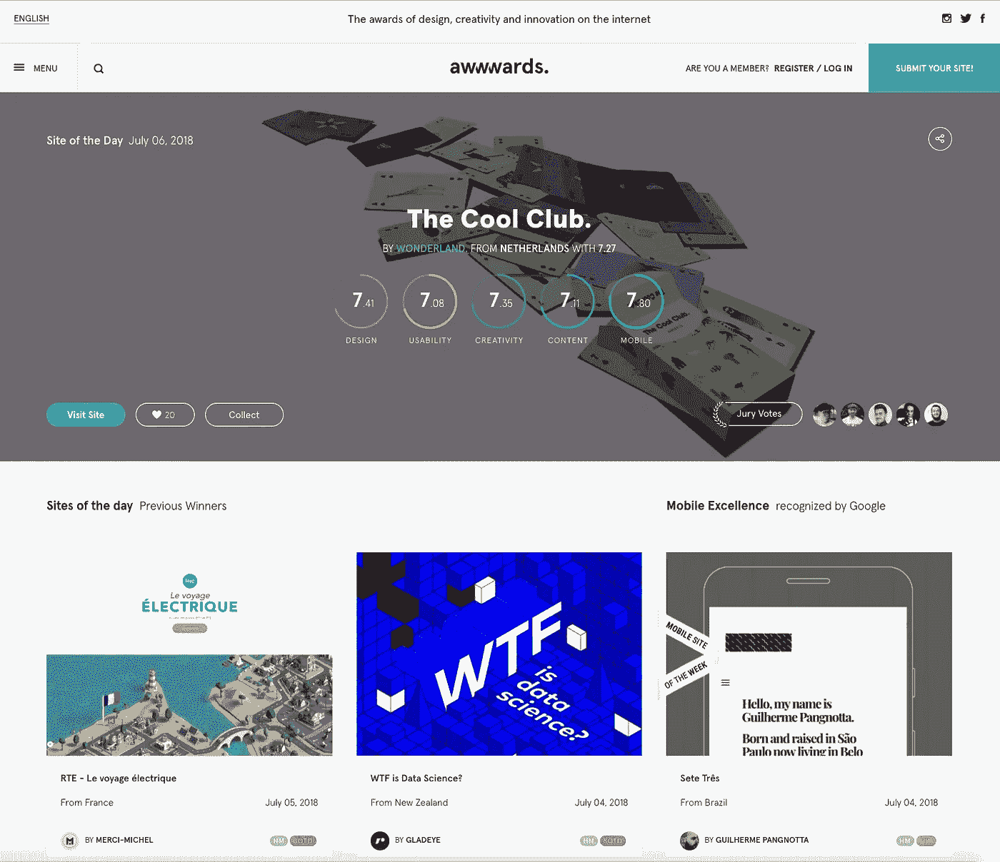
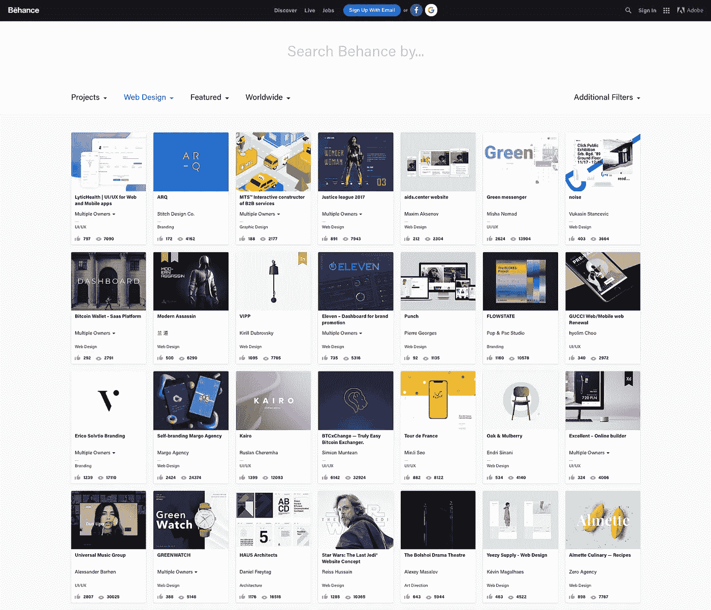
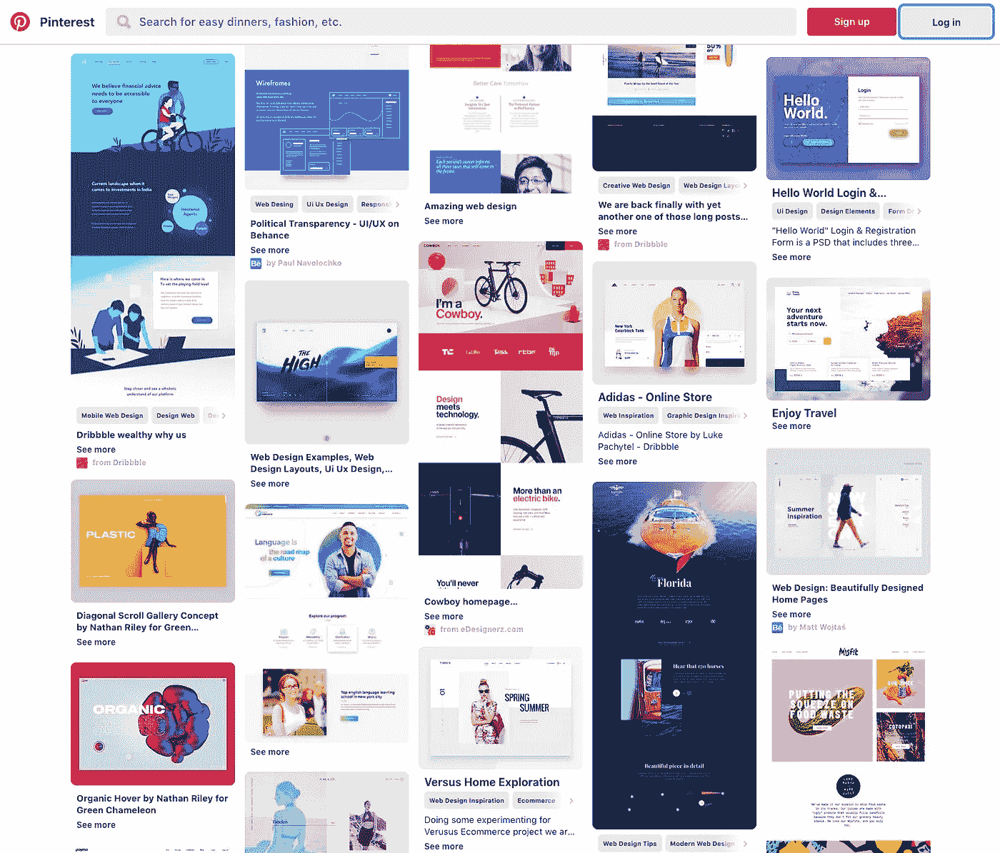

# 启发你的网页设计项目的 7 个网站

> 原文：<https://medium.com/swlh/7-sites-to-inspire-your-web-design-project-ac2fb5b60f1d>

无论你是艺术家、设计师、音乐家还是家具制造商，一张空白的画布既令人兴奋又令人恐惧。你正在从无到有地创造一些东西，所以重要的是你感觉到合适的灵感。然而，灵感不是一个可以随意开关的水龙头。保罗·麦卡特尼在睡梦中创作了《昨天》。文森特·梵高搬到巴黎，受到巴黎后印象派运动的影响。苹果的产品设计受到了博朗设计师迪特·拉姆斯作品的巨大影响。所有的想法和设计都有一个起点，似乎即使是最好的也能以不同的方式找到灵感。

无论你是一个正在考虑新网站的小企业主，一个需要时尚重新设计的网络老手，一个想要把他们的网站提升到一个新水平的数字营销机构，还是一个对网页设计感兴趣的学生，你都很可能会寻求一些灵感来启动你的网页设计项目。

在 Start Digital，我们一直在寻找新的、鼓舞人心的方式来提供客户网站。虽然有些网站只需要很少的“褶边材料”(这是我们的一个客户实际使用的术语)，但我们喜欢尽可能地突破界限。这可能是像独特的字体或浮动图像框一样简单的东西，但我们相信，除了为我们的客户提供最好的产品，我们自己的团队也应该为他们所做的工作感到自豪，这一点很重要。骄傲不是来自于千篇一律的网页设计，而是来自于尝试新的想法、布局和设计技巧。

虽然我们喜欢尽可能地独一无二，但我们从一些收集了全球最佳网页设计的优秀网站中获得灵感。以下是我们用来启发网页设计项目的 7 个网站。(警告:这些网站是时间真空。变得舒适！).

# 1.帕拉。忍者

[帕拉。Ninja](https://www.lapa.ninja/) 展示了最好的登陆页面设计，其设计倾向于数字插图和大粗体标题设计。该平台由 Tinh Nguyen 创建，旨在帮助人们寻找灵感并鼓励他们提高设计技能。作为帕拉的崇拜者和常客。忍者，我们可以证明该网站肯定是这样做的！

通过 37 个不同的类别，包括机构，书籍，即将推出，电子商务，金融，食品饮料，插图和房地产，1300+登陆页面展示可以过滤更具体的检查和灵感。此外，网站还可以根据 18 种不同的颜色进行过滤，如黑色、粉色、蓝绿色和紫外线。

帕拉。忍者还提供优质的主题，不仅可以激发灵感，还可以购买和使用。另外，帕拉。Ninja 足智多谋，提供了一个免费模板、用户界面(UI)套件和主题的精选集合，可以与免费电子书一起使用。

只要看一眼你就知道为什么了，帕拉。忍者是办公室的最爱。

Lapa.Ninja showcasing featured landing pages.

# 2.Awwwards

(没有，我们的 W 键没有卡住。三个 W 是对万维网的引用。)

作为一个网页设计和开发竞赛机构， [Awwwards](https://www.awwwards.com/) 致力于奖励“互联网上的设计创意和创新”每天，Awwwards 和它的用户都会根据一个新网站的设计、可用性、创造性和内容，把它评为今日网站。

在确定 SoTD 的背后有一个相当的过程，但它确保只有最好的网站被展示。

其他可能获得的奖项包括移动卓越奖(Mobile Excellence ),表彰高度符合谷歌移动网站标准的移动网站；荣誉奖(Honourable 提名奖),表彰获得首席专业评审团 6.5 分以上评分的网站；开发者奖(Developer Award ),表彰获得开发者评审团 7 分以上评分的网站。Awwwards 还庆祝每月网站和最负盛名的年度网站。

这么多鼓舞人心的网站没有赢得任何奖项，因此值得关注的不仅仅是获奖者。所有提交的网站都可以通过关键词、类别、标签、技术、颜色甚至国家进行过滤，使您的搜索更容易！

你永远不会不被 Awwwards 所激发。

Awwwards showcasing their Site of The Day for July 6th, *The Cool Club*.

# 3.滴水不漏

[Dribbble](https://dribbble.com/) 是一个在线社区，允许创作者与世界 ***分享他们的工作、过程和当前项目(称为镜头)。*** Dribble 展示了动画、品牌、书籍设计、平面设计、插图、网页设计和用户体验等多种内容。

所有镜头都可以根据行业或业务类型等关键词进行搜索和筛选。搜索**、**后，所有相关的镜头都会按照热门程度呈现。运球的一个特别好的地方是受欢迎的投篮通常是最近的，在一天到一周之前。Dribbble 不仅仅是推广那些多年来积累了最多赞和浏览量的照片，它还会自动推广那些符合最新网页设计实践和趋势的设计。

Dribbble 上的镜头会比金州的飞溅兄弟斯蒂芬库里和克莱·汤普森更有创意。真相。

# 4.行为

创立于 2006 年的 [Behance](https://www.behance.net/) 旨在展示和发现创造性作品，同时消除天赋和机会之间的常见障碍。与 Dribbble 类似，Behance 展示了一系列内容。然而，Adobe 收购的平台并不像其他公司那样仅仅停留在预期的创意领域。甚至包括建筑、编辑设计、时尚、室内设计、摄影。

快速点击搜索图标会将您重定向到搜索页面，在该页面中，将创意领域更改为网页设计，将为您提供各种不同网页项目的特色设计。

Behance showcasing featured web design projects.

# 5.穆兹利

[Muzli](https://muz.li/) 由 InVision 创建，这是一个旨在增强客户体验的数字产品设计平台，它不断带来网页设计灵感。从前面提到的来源挖掘内容，如 Awwwards 和 Dribble，但其他激发创造力的网站，如 CSS Design Awards，Design Sponge，Design You Trust and It's Nice That，Muzli 不断发现一些最鼓舞人心的网页和图形设计。

虽然是一个网站，但最好通过 Chrome 扩展来使用 Muzli，Chrome 扩展可以免费下载[这里](https://chrome.google.com/webstore/detail/muzli-2-stay-inspired/glcipcfhmopcgidicgdociohdoicpdfc)。(虽然与网页设计无关，但值得一提的是，在下载 Chrome 扩展后，Muzli 将在你的谷歌标签中提供来自 Fast Company、Lifehacker、Mashable、Product Crunch 和 ted 等公司的内容。Muzli 不仅能确保你站在网页设计的最前沿，还能让你的兴趣、技术和整个世界受益。)此外，Muzli 还提供电子邮件订阅。这意味着与设计相关的内容，经过精心策划以激发灵感，可以每周免费发送到你的邮箱里。Muzli 能让你瞬间、持续、毫无争议地获得灵感。

# 6.拼趣

Pinterest 不需要介绍，仍然是我们每天访问的网站——通过他们的定期电子邮件来表达我们可能喜欢的想法(我们总是喜欢他们！).Pinterest 是另一个对创意进行超级收费的平台。仅仅一个简单的“网页设计”搜索就会呈现出比我们需要的更多的图钉和想法。因为网页设计搜索下的内容非常多，所以最好进行具体细化的搜索，比如关注行业和业务类型。

在用 Pinterest 做账号的时候，你可以制作自己喜欢的灵感板和图钉设计**。**举个例子，这里有一个[网页设计图钉板](https://www.pinterest.com.au/startdigital09/web-design/)，这个图钉曾在某个时刻给我们 Start Digital 带来灵感。此外，通过创建一个帐户和保存图钉，Pinterest 将为你做艰苦的工作——他们将积极寻找和策划你可能会喜欢的新图钉汇编。我们每周都会在 Pinterest 上损失几个小时。

Pinterest web design pins.

# 7.你的竞争对手

什么？对吗？我打赌你没想到他们会在我们的名单上。

在 Start Digital，创造力和创新让我们的世界运转。我们完全反对剽窃和非原创，我们不提倡你抄袭竞争对手的网站(或者任何人的内容)。但是我们强烈建议你去看看你竞争对手的网站。

一个快速的评估会激发出做什么和不做什么的想法，提供你希望你的网站是什么样子的更深入的见解。如果你所在的行业竞争激烈，有很多竞争对手，如果他们的网站比其他列出的网站提供了更多的实际灵感，不要感到惊讶！

所以，现在你有了 7 个网站来激发你的网页设计项目。我们很确定，只要看其中一个网站，你就会有足够的灵感来重新设计。

本文原载于[起点数码网站](https://startdigital.com.au/7-sites-inspire-web-design/)。

## 这篇文章发表在 [The Startup](https://medium.com/swlh) 上，这是 Medium 最大的创业刊物，有 340，876 人关注。

## 订阅接收[我们的头条新闻](http://growthsupply.com/the-startup-newsletter/)。

