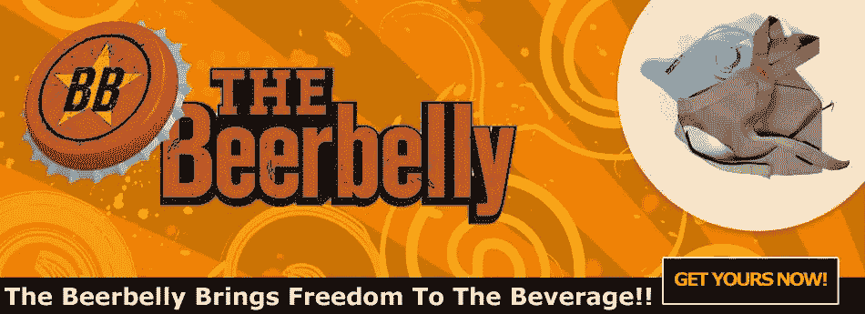
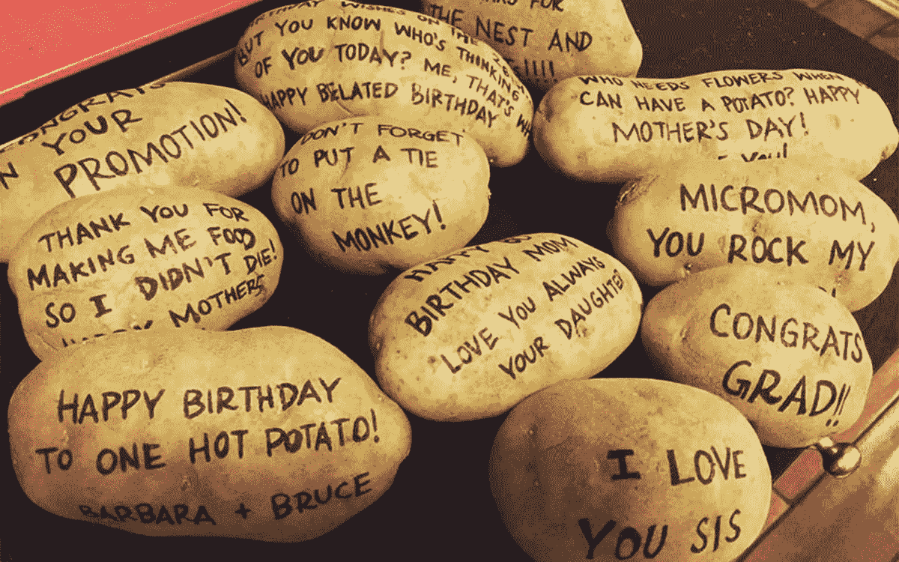

# 7 个本该出现的奇怪商家

> 原文：<https://medium.com/swlh/7-strange-businesses-that-should-have-appeared-1cee944e1de2>

你永远不知道什么随机或非常规的商业想法会起飞。

这里列出了一些值得一提的创业公司

# [The BeerBally](http://thebeerbelly.com)

公司出售帮助你创造性隐藏酒精饮料的产品。这些家伙绝对知道如何举办派对。

# [拥抱派对](http://cuddleparty.com)

拥抱在一起。如果你独自一人，并不意味着你不值得拥抱。

# [租丧者](http://www.rentamourner.co.uk/)

这家公司允许你雇佣专业送葬者参加葬礼和守灵。让你的亲戚认为你有一个英雄的秘密生活，那些熟悉它的人会哀悼。

# [预定天堂的位置](http://reserveaspotinheaven.com)

给你奶奶的好礼物。你认为他们为什么没有成功？

## 关系建议:

你可以从

# [虚拟约会助手](https://www.virtualdatingassistants.com/)

应用程序为您创建在线约会档案，与潜在的日期进行对话，并计划和组织日期。只有一个问题:“嘿伙计们，搞什么鬼？为什么只对男人开放？你们是性别歧视者吗？”

并赋予

# [肮脏腐烂的花朵](http://dirtyrottenflowers.com/)

初创公司会送上一束束枯萎腐烂的鲜花。如果猪头对你来说太激进。

# [土豆包裹](https://potatoparcel.com/)

这些人把信息写在土豆上，然后送到你的收件人那里。OMG！有什么更好的方式对女朋友说“嫁给我吧”，“滚开”。我不干了。”对你的老板说“你欠我钱，婊子”，对你的朋友说“生日快乐”，对你的妈妈说“生日快乐”。

记住，想法就在空中。

Natalia Kukushkina 写的

## 这个故事发表在 [The Startup](https://medium.com/swlh) 上，这是 Medium 最大的创业刊物，拥有 332，253+人关注。

## 在这里订阅接收[我们的头条新闻](http://growthsupply.com/the-startup-newsletter/)。

