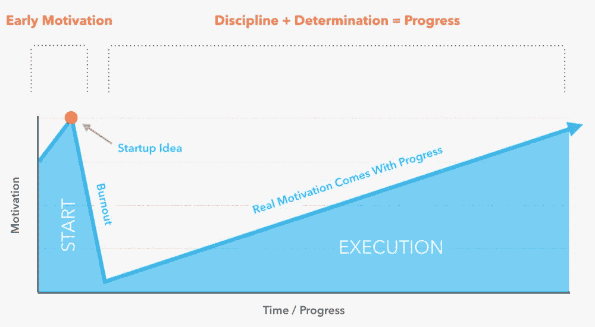
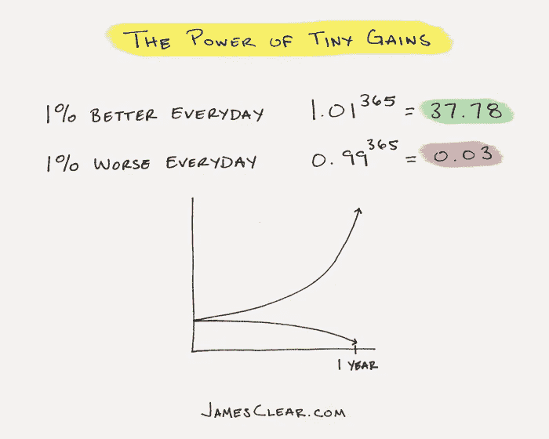
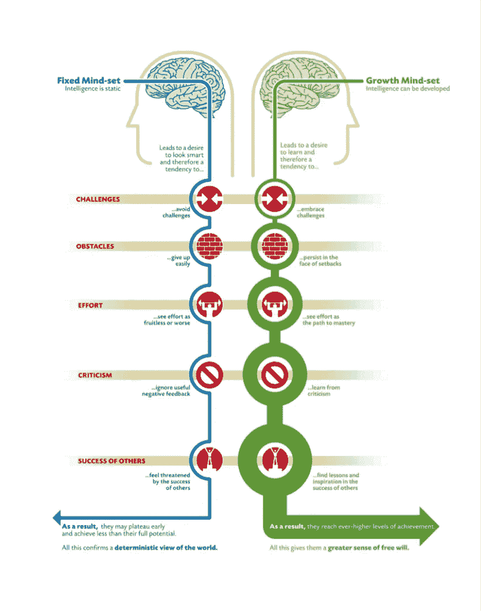
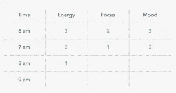
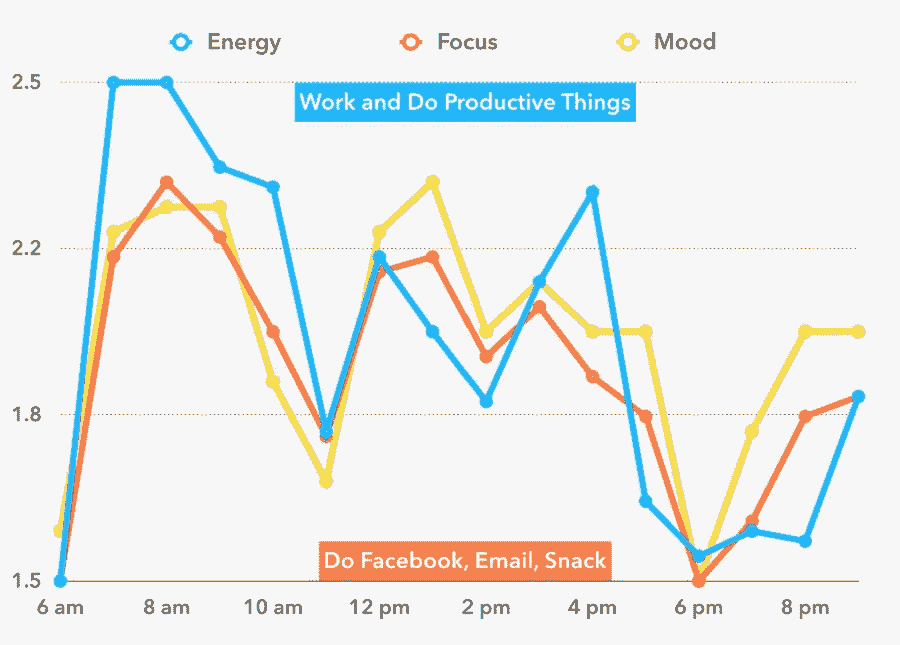

# 企业家可以用来加强纪律和有效执行的 7 个策略

> 原文：<https://medium.com/swlh/7-strategies-entrepreneurs-can-use-to-boost-discipline-and-execute-effectively-7d03ef69c87e>

Originally published on [http://www.appsterhq.com](http://www.appsterhq.com/?utm_source=CP&utm_medium=Medium)

## 以及如何避免自助行业的神奇提示，但仍然富有成效

创业企业家喜欢引用托马斯·爱迪生的名言，“成功是 1%的动力和 99%的汗水”。

虽然任何人都可能被暂时激励去建立下一个伟大的公司，但只有那些真正有毅力、决心和 T2 纪律的人才能实现它。

在这篇文章中，我将讨论 7 个具体的策略，你可以用它们来最大化你的纪律，更有效率，更有效地执行你最重要的想法。

# 关于动机的一句话

“动机”是一个相当奇怪的概念，尤其是考虑到我们在当今世界中与它的典型联系。

一方面，它是一种心理结构，意在解释人们做他们所做的事情的原因。

正如肯德拉·切里[所说](https://www.verywell.com/theories-of-motivation-2795720):

> *“动机是发起、引导和维持目标导向行为的力量。这是促使我们采取行动的原因，无论是吃点零食来减少饥饿，还是去上大学来获得学位。动机背后的力量本质上可以是生物的、社会的、情感的或认知的。*

除了这个基本定义，还有一些主要的动机理论，每一个都有不同的支持者和不同程度的证实证据。

另一方面，在今天的流行文化中，似乎有一种对动机的不健康的迷恋，或者说过分强调动机。

自助行业的很大一部分完全致力于所谓的增加动力的技术。

人们经常在他们的脸书墙上张贴激励人心的名言。

当某人未能取得显著成就时，通常会被归结为“缺乏动力”——例如，“她只是不够渴望！”

在这方面，动机被视为某种神奇的力量，不可避免地带来成功和各种各样的解决问题的办法。

显然，这让人们每周工作 100 小时，并在不到一年的时间里建立一个盈利的创业公司…

如果你真的想变得更有效率，增加你的动力不是你应该关注的关键因素。

毕竟，动力是能量、热情、承诺、动力等等的暂时增加。

M otivation 自然有涨有跌；一方面，因为我们的大脑必须与阻力、拖延、逃避和恐惧(包括失败和成功)的动力作斗争，这阻止了我们不断地对我们的生活方式进行实质性的改变。

没有永远有动力的人。

动力必须一次又一次地被重新激活和重新建立。

让你开始*很重要*，但它不会带你到达目标的终点。

开始一件事相对容易；通过具体的计划来完成事情是困难的。

说到创业，把事情做好——也就是说，*执行*你的想法——需要**纪律**和**决心**，还有动力。

如下图所示，**当你第一次提出创业想法时，动力是很高的，一旦最初的魅力消退，真正的工作开始，动力就会大幅下降，随着时间的推移，随着你执行自己的想法并取得有纪律的进展，动力会逐渐恢复**。

纪律和决心，而不是动机，最终支撑着我们追求目标的能力，因为最初的火花已经燃尽，但随着时间的推移，火会越烧越旺。

那么，关键问题就变成了:我们应该采用什么样的实践和思维习惯来加强我们的纪律，变得更有成效？

我们具体来看 7 个战术。

# 1.战略性地培养微小的新习惯

和一般生活一样，创业不可避免地要做很多你不想做的事情。

例如，你可能喜欢编码，讨厌写东西和处理数字，但是如果你致力于启动一个有希望成功的创业公司，那么你肯定要写东西(博客帖子、文章等)。)了解你的公司，并成功管理你的企业的财务。

那么，你如何教自己开始以不那么令人兴奋或愉快的方式表演呢？你慢慢地、战略性地形成新习惯。

企业家和行为科学专家 James Clear[概述了成功养成新习惯的 5 个关键步骤](http://jamesclear.com/habit-guide)。

## 1.从一个难以置信的小习惯开始

*   动机会随着时间的推移而起伏不定(也就是说，它会变得“疲劳”)。
*   因此，试图完全依靠意志力来建立一个新习惯是失败的。
*   相反，选择一个非常小的，容易完成的习惯，需要很少的动力来完成。
*   例子:每天早上做 5 个俯卧撑(而不是 50 个)

## 2.用非常小的方法来增加你的习惯

*   所谓“贪多嚼不烂”，注定会导致失败和失望。
*   相反，拥抱**微小的收获** **方法**，通过它你每天/每周/每月都有 1%的进步，以便随着时间的推移积累巨大的成功。

(image [source](http://jamesclear.com/wp-content/uploads/2014/07/tiny-gains.jpg?x25662))

*   例如:每周多写一篇博文，一年之内就会多写 50 多篇。

## 3.随着你的积累，打破习惯

*   当你开始获得动力时，你会发现你每天都在做更多的事情。
*   为了避免变得不知所措，把你的习惯分成小块，以保持它们的合理性。
*   例如:早上在跑步机上跑 25 分钟，晚上再跑 25 分钟，而不是一次跑完 50 分钟。

## 4.当你滑倒时，迅速回到正轨

*   “错过你的习惯一次，无论它何时发生，对你的长期进步没有可测量的影响。詹姆斯补充道:“与其努力追求完美，不如放弃你那种要么全有要么全无的心态。”
*   认识到你经常会失败，但同时，要致力于立即回到正轨。
*   危险不是来自一次失败，而是来自连续两次失败*。*

## 5.耐心点。坚持你能维持的配速

*   在懒惰/放弃和筋疲力尽/过分热心之间找到“甜蜜点”。
*   长期保持习惯的唯一方法是专注而耐心(一种“冰冻三尺，非一日之寒”的方法)。
*   例如:设定一个目标，在社交媒体上获得比你认为在给定时间内可以获得的略少的新粉丝，而不是瞄准一个不切实际的目标。

# 2.培养“成长心态”

[卡罗尔·德韦克](https://mindsetonline.com/abouttheauthor/)，斯坦福大学心理学教授，也是颇具影响力的《心态 [*:新成功心理学*](https://www.amazon.com/Mindset-Psychology-Carol-S-Dweck/dp/0345472322/) 的作者，她认为在人群中可以识别出两种基本的心理“心态”——即“固定心态”和“成长心态”。

德韦克解释道:

> 在一种固定的思维模式中，人们相信他们的基本能力，他们的智力，他们的天赋，只是固定的特质。他们有一定的数量，仅此而已，然后他们的目标是一直看起来很聪明，永远不会看起来很笨。
> 
> *在成长思维中，人们明白他们的天赋和能力可以通过努力、良好的教学和坚持不懈来培养。他们不一定认为每个人都是一样的，或者任何人都可以成为爱因斯坦，但他们相信如果努力，每个人都可以变得更聪明。”*

当接受批评和执行他们可能会失败的挑战性任务时，个人通常会感到忧虑。

他们通常害怕别人的成功，认为这不利于他们自己的成功。

另外，成长型思维的人认为批评和失败是学习、自我完善和改变的机会。他们更愿意追求困难的项目，而不是归因于[零和游戏](http://www.investopedia.com/terms/z/zero-sumgame.asp)的心态。

下面的信息图概括了这两种定义思维模式的主要区别:

(image [source](http://alumni.stanford.edu/content/magazine/artfiles/dweck_2007_2.pdf))

作为一名企业家，尤其重要的是你要致力于培养一种成长的心态。

如果在改变事物、做出改进、从错误中吸取教训、建设性地采纳他人的反馈方面几乎无能为力，这种生活不仅是失败主义和令人沮丧的，而且与创业、成长和扩大规模的过程完全不相容。

成功的企业家需要一种特定的心态，这种心态的前提是，几乎任何事情都有可能发生，错误不可避免地会犯，在此过程中需要调整和调整。

幸运的是，对于那些目前陷入固定思维模式的人来说，有可能过渡到成长思维模式。

[Dweck 列出了制作开关的 3 个步骤](https://mindsetonline.com/changeyourmindset/firststeps/):

## 1.学会倾听你固定思维模式的内在声音:

*   注意你在不同情况下对自己说的话，意识到你在使用失败主义语言。
*   例子:“如果你不尝试，至少没有人会取笑你”，“你不够好，不能这样做”，“你为什么把自己置于这种境地？你知道你没有足够的技能！”

## 2.意识到*你*决定如何回应这些想法:

*   如何应对来自你固定思维模式的建议是你的选择。
*   你可以选择接受它们，认为它们显然是真实的，表明你不值得甚至没有能力改进，或者改变你对当前情况的看法，认识到你有机会走出舒适区，提高你的能力，从他人的见解中改进。

## 3.用强烈的成长心态和怀疑自己的自己对话:

*   不要说“如果你有天赋，你会很容易做到”，而是对自己说，“任何值得做好的事情都需要努力和毅力；许多成功人士一路跌跌撞撞”
*   而不是，“他们怎么能指望我做得更好呢？这就是我的方式”，对自己说，“我在这里展示了力量和勇气:比以前做得更多，说得更多，表明我可以改进”

练习“[心理对比](https://positivepsychologyprogram.com/mental-contrasting/)”也很有帮助，这是一种技巧，你可以详细想象你希望实现什么，你计划如何实现它，在你实现目标的道路上可能会遇到的各种障碍，以及如果/当障碍出现时你将采取什么步骤。

当你真正面对挫折时，在挫折出现之前做好计划通常对克服挫折很有帮助。

# 3.“侵入”你的社会和物理环境

这是一个相对简单而有效的增强纪律性和注意力的策略。

本质上，它包括有目的地改变你的社会和物理环境，以减少分心和/或对必须完成的工作无动于衷的机会。

这里有 3 个简单的技巧，你可以很容易地实现:

1.  **使用专门为消除杂念而设计的应用** : [FocusBooster](https://www.focusboosterapp.com/) 、 [FocusWriter](https://gottcode.org/focuswriter/) 、[Forest:Stay focus](https://play.google.com/store/apps/details?id=cc.forestapp&hl=en)、 [K9 Security](http://www1.k9webprotection.com/) 和 [Self Control](https://selfcontrolapp.com/) 都是值得一试的有效程序/应用。
2.  招募其他人加入到你的自律努力中来:明确地让其他人参与到你培养新习惯的计划中，从统计数据来看，这会让你更有可能致力于你的新行为方式(例如: [1](https://experiencelife.com/article/strength-in-numbers-the-importance-of-fitness-buddies/) 、 [2](https://www.entrepreneur.com/article/228077) 、 [3](https://uponly.co/2015/01/08/how-to-increase-the-odds-of-reaching-your-goals-by-85-2/) )。换句话说，社会压力可以用来带来积极的变化。明确地与朋友或同事分享你的目标，如果你开始偏离正确的道路，请他们让你负责(例如，强迫你做一些令人尴尬或不受欢迎的事情，如向你最喜欢的政党捐款或在酒吧当着几十个陌生人的面唱卡拉 ok)。你也可以在网上找到责任伙伴，使用 Reddit 上的[r/productivitepenpals](http://www.reddit.com/r/ProductivePenPals/)和 [r/GetMotivatedBuddies](http://www.reddit.com/r/GetMotivatedBuddies) 等网站以及为此目的设计的[应用](http://appcrawlr.com/ios-apps/best-apps-accountability-partner)。
3.  对你的工作空间做一些小而有意义的改变:把你的手机和其他分散注意力的技术放在不同于你工作的房间里。在你的电脑周围和墙上贴上写有积极信息的便利贴。试着在早晨或一天快结束时，用激励海报给你额外的“激励”。将爱人和其他重要人物的照片放在身边。

# 4.参加体育锻炼

从瑜伽、运动和重量训练到跑步、游泳和平衡训练，定期参加体育锻炼对健康有很多好处，其中许多可以直接或间接促进你的纪律、奉献精神和生产力水平。

除了其他好处之外，定期锻炼还有可能:

*   提高能量水平(短期和长期)；
*   减少压力、焦虑和抑郁；
*   提升情绪；
*   鼓励更多宁静的睡眠；
*   提高记忆力和其他认知技能；
*   增强创造力，提高注意力；和
*   积极影响大脑的神经可塑性(即其改变和发展的能力)(来源: [1](https://www.psychologytoday.com/blog/the-athletes-way/201404/physical-activity-improves-cognitive-function) 、 [2](https://www.theguardian.com/education/2016/jun/18/how-physical-exercise-makes-your-brain-work-better) 、 [3](http://www.health.harvard.edu/blog/regular-exercise-changes-brain-improve-memory-thinking-skills-201404097110) 、 [4](http://www.mayoclinic.org/healthy-lifestyle/stress-management/in-depth/exercise-and-stress/art-20044469) 、 [5](http://www.health.harvard.edu/press_releases/benefits-of-exercisereduces-stress-anxiety-and-helps-fight-depression) 、 [6](https://sharpbrains.com/resources/2-the-4-pillars-of-brain-maintenance/physical-exercise-why-aerobic-exercise-enhances-neurogenesis-and-neuroplasticity/) 、 [7](https://www.psychologytoday.com/blog/the-athletes-way/201409/why-is-physical-activity-so-good-your-brain) )

本质上，严格的锻炼会让你在身体和情绪上感觉更好，从而增加你对自己能学到什么和能完成什么的感觉。

谈到什么时候应该锻炼，没有对错之分。

一些人喜欢在去办公室之前进行锻炼或运动，而另一些人喜欢在白天辛苦工作后放松(或“燃烧蒸汽”)，然后在晚上去健身房或球场。

选择最适合你的。关键是要始终如一。

# 5.尝试冥想

对一些人来说，冥想是一种精神或宗教体验。

对于其他人来说，它被纳入深呼吸练习，旨在促进放松和冷静。

无论你个人对冥想的看法如何，重要的是要认识到，像体育锻炼一样，冥想对生理健康和心理健康有许多积极的影响。

每日冥想练习带来的许多好处可以提高你的注意力和努力工作的能力，同时保持冷静，活在当下，不被对未来的担忧所干扰。

其中，这里有一些冥想可以提高你生活质量的方法:

*   它可以减少焦虑、压力、抑郁和孤独感；
*   它可以提高情商、联系感和自控力；
*   它可以通过增加灰质和扩大与情绪调节和积极情绪相关的大脑区域的体积来积极影响大脑的结构；和
*   它可以提高注意力、创造力、记忆力和多任务处理能力(来源: [1](https://www.forbes.com/sites/alicegwalton/2015/02/09/7-ways-meditation-can-actually-change-the-brain/#16543f041465) 、 [2](https://www.psychologytoday.com/blog/feeling-it/201309/20-scientific-reasons-start-meditating-today) 、 [3](http://www.emmaseppala.com/10-science-based-reasons-start-meditating-today-infographic/#.WW9y79MrKRs) )

编辑教你如何随着时间的推移变得不那么分心，专注于当下，允许你的每一个想法到来、通过和离开。

这项练习刺激大脑的前额叶皮层，让你在短暂分心后更容易集中注意力。

定期冥想带来的正念能力的增强也能积极地影响你在创业时处理压力情况的能力，因为它促进了对当下重要性的认识，超越了对未来的焦虑。

# 6.获得足够高质量的睡眠

适当的睡眠——也就是深度的、不间断的、持续时间足够长的睡眠——对人类健康和幸福至关重要。

糟糕的睡眠会导致各种生理和心理并发症，包括高血压、糖尿病、体重增加、心脏病、偏执狂、情绪波动、抑郁和焦虑(来源 [1](http://www.healthline.com/health/sleep-deprivation/effects-on-body) 、 [2](http://www.webmd.com/sleep-disorders/features/10-results-sleep-loss#3) )。

睡眠不足也是生产力、纪律和动力的杀手。

毫无疑问，与休息良好的人相比，普通人在睡眠不足时表现更差，更缺乏努力工作和做好工作的动力，更难以集中注意力(来源: [1](http://healthysleep.med.harvard.edu/healthy/matters/consequences/sleep-performance-and-public-safety) 、 [2](http://www.ctvnews.ca/business/lack-of-sleep-costs-canada-billions-of-dollars-in-productivity-report-1.3185117) 、 [3](http://fortune.com/2016/11/30/sleep-productivity-rand-corp-411-billion/) 、 [4](https://www.forbes.com/sites/larryalton/2016/09/07/heres-how-sleep-affects-your-day-at-the-office/#2ecb84d37820) )。

因此，高质量的睡眠对于发挥你的最佳水平至关重要。

这里有 5 个技巧可以改善你每晚的睡眠状况并延长睡眠时间:

1.  目标是每天在相同的时间睡觉和起床，因为这将有助于促进自然和可靠的睡眠周期。
2.  睡前留出 30-60 分钟的“休息时间”,放下所有的电子产品，从事一项平静、放松的活动，比如轻松阅读。
3.  在稍微凉爽(大约 65 华氏度)和黑暗的房间里，睡在运动隔离床垫上，创造一个舒适的睡眠环境。
4.  使用[睡眠周期](https://play.google.com/store/apps/details?id=com.northcube.sleepcycle&hl=en)等应用程序和/或 [Fitbit](http://fitbit.com/) 或 [JawBone Up](https://jawbone.com/up) 等可穿戴技术来跟踪你的睡眠周期。
5.  每当你昏昏欲睡，感觉注意力“下滑”时，白天小睡 10-30 分钟；所谓的“小睡”通过提高认知技能、记忆力和注意力，对提高你的工作效率非常有帮助(来源[1](https://www.forbes.com/sites/larryalton/2016/09/07/heres-how-sleep-affects-your-day-at-the-office/#8d03f707820b)[2](https://www.forbes.com/sites/daviddisalvo/2012/07/24/why-you-should-take-a-10-minute-nap-every-day/#2363c2721b0f)[3](http://www.businessinsider.com/how-to-master-the-power-nap-2016-6)[4](http://www.webmd.com/balance/features/the-secret-and-surprising-power-of-naps#1))。

此外，花点时间了解并围绕“昼夜节律”和“超昼夜节律”设计你的工作时间表也是值得的:

*   **昼夜节律**:你的 24 小时(每日)生物节律，支配着你的身体对昼夜的探测和反应能力；它极大地影响着你何时进入深度睡眠，以及深度睡眠的时间长短，因为它调节着你身体的自然觉醒
*   **超日节律**:你 90-120 分钟的脑电波频率循环，在此期间你逐渐从警觉和专注转向昏昏欲睡和注意力分散([来源](https://www.polyphasicsociety.com/polyphasic-sleep/science/rhythms/))

不适当的睡眠会对你的生物节律产生负面影响。

例如，当你持续睡眠不足时，你的生理节奏很容易变得不可预测，导致你实际进入深度睡眠的时间差异很大。

从企业家的角度来看，理解和利用你身体的自然生物节律是很重要的，因为事实上，你在某些时候比其他时候更能集中精力，更有效率。

例如，研究表明，天生倾向于成为“夜猫子”的人容易患抑郁症，当被迫接受标准的上午 9 点至下午 5 点的日常生活时，他们大脑中的白质(由加速神经信号的脂肪绝缘物质组成的组织)数量明显减少。

你如何追踪你的生物节律？

一个简单的方法是使用一个基本的电子表格来评估一周或两周内每天每小时的注意力、精力和情绪水平(例如，从 1 到 3):

然后，计算每小时的平均值，并使用这些数据创建一个如下所示的图表:

在这个假设的例子中，我会试着重新安排我每天的时间表，这样我就可以在早上 6 点到 9 点和下午 3 点到 4 点半之间处理最困难或要求最高的工作，因为在这些时间段我感觉最有动力，也能完成最多的工作。

# 7.使用自我肯定

作为一名企业家，你很可能有相当多的自我怀疑、恐惧、焦虑和对未来的担忧。

毕竟，初创公司的创始人必须不断努力，不仅要说服他们自己，还要说服他们周围的很多人——同事、投资者、家庭成员——他们的公司是建立在坚实的基础上的，是一个会带来巨大成功的成功产品。

事实上，建立一个新的企业往往是一个非常紧张的努力。

然而，你可以采用某些策略来帮助减轻你可能正在进行的一些消极的自我对话。

为什么这很重要？因为你展示的消极的自我对话越少，你就越有效率。

除了尝试将你的心态从固定转变为成长(见上面的第二条)，你还可以通过将**自我肯定**(或积极的自我对话)融入日常习惯，来克服你告诉自己“我做不到”、“我会失败”、“我不够好”等事情的倾向。

自我肯定因具体情况的性质不同而不同。不过，一般来说，它们[可以包含像](http://www.theemotionmachine.com/the-science-of-self-affirmations/)这样的语句:

*   几个星期以来，我一直在为此努力准备和工作；我会成功的！
*   我健康、强壮、能干！
*   过去我总是设法解决困难的情况；我会挺过去的！
*   无论如何，我的同事都会支持我！
*   这是一个从我的错误中学习和成长的机会；我会改进的，下次会变得更强！

自我肯定有助于减少回避挑战性情况的倾向，并依靠防御机制来原谅我们的不作为。

将自我肯定融入日常工作生活的一个有效方法是花一两个小时明确地写下你为什么试图创建一家新公司，你希望通过这样做获得什么，你迄今为止已经完成了什么，以及一旦你成功了，你潜在的未来会是什么样子。

随时将这张纸/海报放在身边(例如，贴在办公室的墙上)。

然后，当你感到动力不足或缺乏灵感的时候，你可以重读你写的东西，从而反思你追求的主要目标和目的及其原因。

这个策略可以作为一种有效的方式来提醒你自己为什么每天早上起床。

//

## 感谢阅读！

我希望这 7 个具体的策略能帮助你最大化你的纪律，更有效率，更有效地执行你最重要的想法。

# 如果你喜欢这篇文章，请随意点击❤下面的心形按钮，这样其他人也可以发现这篇文章。

> 最初发表于[http://www.appsterhq.com/](http://www.appsterhq.com/?utm_source=CP&utm_medium=Medium)

