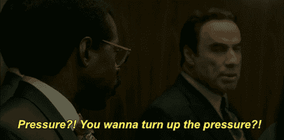

# 在商业中完美运用压力的 7 个策略

> 原文：<https://medium.com/swlh/7-strategies-to-perfectly-apply-pressure-in-business-9ffd47dd6e5e>

压力可以制造钻石，如果运用得当，可以在商业上创造巨大的成功。

施加压力是一种复杂的艺术形式。我总是说完成一笔生意就像徒手抓一只蝴蝶。如果你施加太大的压力，你会压倒你的客户，粉碎任何达成交易的希望。另一方面，如果你没有施加足够的压力，这笔交易肯定会溜走。在这篇文章中，我会给你一些有效的方法来完美地施加压力。要记住的最重要的一点是，无论如何都需要压力。

任何拒绝在商业中使用压力的人永远不会成功。记住，制造钻石需要压力，同样的想法也适用于商业。当压力以正确的方式使用时，你将提升你的客户体验，飙升的结果，并开始赚更多的钱。

掌握压力的运用会让你开始看到巨大的成功。不仅如此，当压力被正确地施加时，对你的客户来说，压力似乎并不高。我的客户告诉我，我非常容易相处，他们喜欢我没有高压。他们不知道我在他们的整个客户体验中施加压力。他们只是不知道。

# 为什么人们不愿意施加压力

在我讨论施加压力之前，重要的是要理解为什么人们首先要避免它。压力肯定有负面的含义。造成这种情况的主要原因是由于销售的陈旧。沿着这条线的某个地方，人们认为他们需要撒谎，欺骗，欺骗顾客，等等。在销售上取得成功。这击中了人们身体里不道德的骨头，理所当然地如此。随着新的销售时代的到来，情况不再是这样了( [***这里有我的整篇文章***](https://codycameron.com/the-new-age-of-sales/) )。互联网和竞争市场彻底改变了我们做生意的方式。那些不道德的商业伎俩在今天这个时代已经不起作用了。

当你的产品、服务或职业没有被推销时，你不可能施加压力。如果你讨厌销售，那就是脱节的原因。如果你不能在销售中推销自己，那么你可能进入了错误的行业。如果你的产品或服务不被接受，你将永远无法提出异议。你不会去克服异议，而是会想“是的，我也不会这么做。”所以你需要尽快卖出去！100%销售你的产品、服务、公司、职业、原因和价格会让你卖出更多。

我发现，人们不喜欢施加压力的最终原因是因为他们不知道如何使用它。他们可能在过去已经尝试过，并且有一个交互在他们面前完全爆发。也许有人从来没有尝试过，因为他们认为这是坏的或不道德的。我经常看到人们想要使用它，但是他们不知道使用它的最佳方式或者时机。此外，有时人们认为他们在施加压力，而实际上并没有。

不管是什么情况，只要知道不能掌握压力的使用会阻碍你获得你应得的成功。或者至少是你能取得的成功。

# 施加压力的最佳方式

> *“像蝴蝶一样飘浮。像蜜蜂一样蜇人。”——穆罕默德·阿里*

在任何商业情况下，施加压力的最佳方式是在你的客户感觉不到的时候。想想看，没有人喜欢被强迫做事情。它剥夺了决策的乐趣，让客户感到焦虑。相反，客户喜欢做决定。记住这一点对你的成功至关重要。

目标应该是专注于如何让你的客户处于 100%被销售的位置。以至于他们知道不与你做生意将是一个可怕的决定，他们会永远后悔。你可以通过以下 7 种策略来施加压力，但我也建议你有一个 [***坚实的销售周期***](https://codycameron.com/how-to-be-a-selling-machine/) 和 [***了解人们为什么购买***](https://codycameron.com/why-people-buy-and-how-to-close-more-sales/) 。

# 7:坦诚

从不隐瞒任何事。事实上，你应该 100%诚实。你必须开始了解客户的需求和愿望，并提出销售建议。如果你知道某样东西不太适合你的客户，那么就说出来，即使这意味着失去销售。这种诚实可能会阻止轻松销售的发生，但会赢得客户对你建议的完全信任。

有一项研究是在暗示销售和不暗示销售的男女服务员之间进行的。暗示性卖家会对某些通常收到负面反馈的菜肴直言不讳，会推荐一个超级受欢迎的项目或一个有很好评论的项目。这项研究表明，建议卖家得到的小费会比没有建议的卖家高出 30%以上。

客户认为这种销售方式是你在为他们着想，是他们的最大利益。他们更尊重这一点，有更好的体验，互惠将发挥作用，这就是为什么他们赚更多的小费。你知道这整个抓我的背，我会抓你的概念？

# 6:让你的客户控制局面，但自己掌舵

停止争夺控制权。谁在乎你的委托人是否在掌控之中？如果你的客户想要控制权，那就交给他们，然后专注于驾驶这艘船。有些客户喜欢导游，有些喜欢做自己的事。接受这一点，你就已经领先于大多数竞争对手。不仅如此，你的客户也会因此而更加尊重你，因为他们会看到你尊重他们的意愿，并超越他们。

现在，你可以通过暗示销售来做到这一点。对事情给予反馈、建议和指点是引导你的客户回到正轨的一种方式。做到这一点的最佳方法是提出正确的问题，以全面了解什么最适合您的客户。最后，你必须与你的客户沟通，为他们提供最好的客户体验。你基本上必须证明客户想要所有的控制，你是一个专家需要咨询他们的最佳决策。但是如果你一直在为控制之类的小事而争斗，你永远不会赢。

# 5:设定期望值

这可能是你最有用的策略之一。尽快设定你对客户的期望。设定期望值可以是这样的，“谢谢你(客户的名字)，在百忙之中抽出宝贵的时间来见我。既然这段时间如此宝贵，我不想浪费一秒钟。今天，我会先问你一些问题，以了解你的需求和愿望，然后我会向你展示我们能提供什么，我们的竞争优势，我会告诉你我会为这笔交易带来什么。最后，我想总结一下大家可能有的任何问题，并以签署一项协议结束会议。这听起来公平吗？”

像这样设定期望有几个好处。你对他们的时间表示感谢，同时补充他们时间的价值，让他们知道时间表的顺序，并最终表明你希望签署一项商业协议。这几乎就像你和房间里的大象说话，同时要求销售。显然，你需要多次询问销售情况，但这显示了 100%的透明度。客户也喜欢它！

# 4:问一些尖锐的问题

有时，当事情变得棘手时，你需要问一些棘手的问题，以了解是哪里或什么在破坏交易。这就像撕掉创可贴，但你必须这样做。

棘手的问题是那些你想问却又害怕问的问题。这些问题是必要的，否则永远不会赢得业务。

通常情况下，客户端会有一些困惑。很多时候，客户不想承认这一点，因为他们不想觉得自己很笨。回想一下你在学校的时候，你想问一个问题，但没有问，因为怕这是一个愚蠢的问题。为了克服这一点，你需要克服内心的恐惧，问一些尖锐的问题。

赢得业务的唯一方法是充分沟通。你是促进交流的人。只有这样，你才能发现客户的犹豫和恐惧。

# 3:发挥创造力

对你的客户要有创造性，确保无论如何你都要克服所有的异议。这将需要你比以前更有创造力…疯狂科学家的创造力。

只是没有毛骨悚然…你明白了。

你必须解决问题并承担大部分的重量。永远不要让你的客户难以购买！如果你的客户不知道怎么做或者需要帮助，那就超越他们。几乎每次都会导致生意失败。即使不是这样，知道你帮助了别人也很好。 [***我在这里有一整篇关于这个概念的文章和例子***](https://codycameron.com/sales-the-mental-chess-game/) 。

# 2:激励行动

保证行动是最终目标。你想赢得生意。有不同的方式和原因促使人们采取行动。如果你把稀缺性、紧迫性、社会证明、互惠、兴奋等因素考虑进去。你会点燃行动。

有 25 种认知偏见会影响人们做决定的方式。所有这些人类的情感都是不可避免的，如果你知道它们是什么，你可以用它们来冷静地施加压力。我目前正在打破所有的认知偏见，所以如果你订阅我的博客或访问我的网站，你会深入了解它们如何工作以及何时使用它们。你不会想错过其中任何一个的！刚刚在你身上用了一个，叫做损失厌恶。)

# 1:运用幽默

幽默是我在任何商业交易中最有效的策略。人爱笑，笑不够。记住，人们从他们喜欢的人那里买东西。幽默让你的客户更喜欢你，同时减少紧张感，如果有的话。更重要的是，这表明你是一个正常人。

记住，不能强求幽默。如果对你来说不自然，那就一点一点地练习，直到它变得自然。那会帮助你适应环境。

我一直开玩笑说我是客户的推销员。如果有人对我说“我想考虑一下”我会这样回答，“(客户的名字)，这通常是我压力变得非常大的部分，所以你会购买……”然后我们通常会大笑起来，然后我会接着说“我只是在逗你，但我有点好奇是什么阻止了你继续下去？”我已经把这个策略运用到了很多交易中。就好像客户知道他们可以在事情发生后对我更真实。

请记住，如果你想在结束时使用幽默，你必须在整个经历中使用幽默。如果你不这样做，很可能会被误解。当玩笑开得很糟糕的时候，从来都不是好事…

最终，这 7 个策略将帮助你成为施加压力的专家。当你整合了所有的策略，成功就会到来。你会从他们个人那里获得一些成功，但是巨大的成功来自于他们一起使用。这些策略将帮助你在不知不觉中施加压力，创造性地提出销售要求，克服异议，赢得更多业务。

如果你喜欢这篇文章，可以看看我的一些最佳作品，看看我从商业 中学到的 [***5 个改变人生的教训。***](https://codycameron.com/5-life-changing-lessons-i-learned-from-business/)

订阅我的博客，这样你就可以得到我所有的独家内容。你不会想错过任何东西的！:)[www.codycameron.com](http://www.codycameron.com)

很棒，

[科迪·卡梅伦](https://twitter.com/realcodycameron)

## 这篇文章发表在 [The Startup](https://medium.com/swlh) 上，这是 Medium 最大的创业刊物，拥有+ 372，020 名读者。

## 在此订阅接收[我们的头条新闻](http://growthsupply.com/the-startup-newsletter/)。

