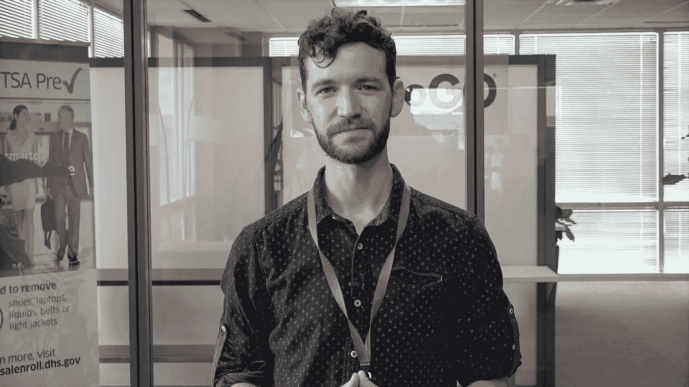
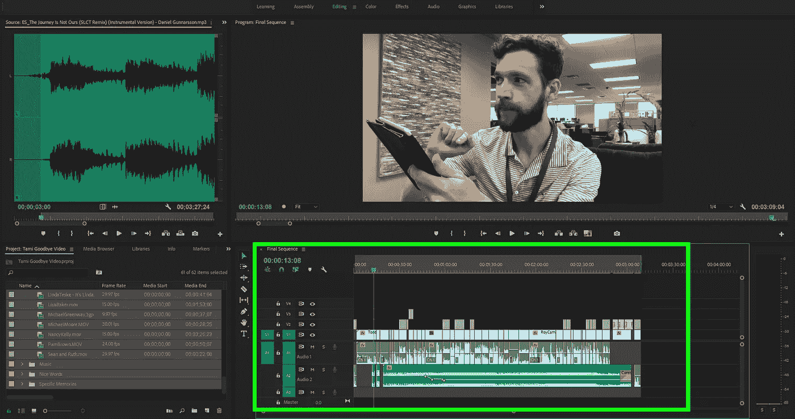
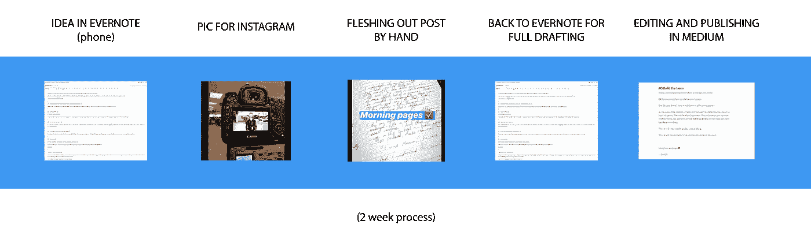

# 我从自我编辑中学到的 7 个惊人的教训

> 原文：<https://medium.com/swlh/7-surprising-lessons-ive-learned-from-editing-myself-b3ca18c57855>

引用伟大哲学家巴斯光年的话:

> "这些(翅膀)是一种镅碳合金，我能飞."

当我无意中成为一名全职视频编辑，没有任何经验、知识、技能、设备或权力时，我成了巴兹傲慢的原始化身:

> “我会飞了！”

你还记得巴斯发生了什么，对吧？

他试了又倒，试了又倒，最后失去了一只胳膊，然后失去了理智(“我是内斯比特小姐！”)在最终弄清楚这一点之前，他不能飞，但有了一点胶带，几个朋友的帮助，来自外部来源的火力，以及大量的烟雾和镜子，他*可以*，事实上在树上翱翔一会儿。

他叫它什么来着？

哦耶:

> “这不是飞行。它在时尚中坠落”

当你创作任何形式的艺术时，你是在跳下悬崖。

当你剪辑的时候，你可以让所有人*相信*你在飞。

(哪怕只是一小会儿)。

# #1 **没有人是天生的**

这是我忍不住要说的。昨天有人对我说:

> “托德，你在镜头前真是天生一对。”

好的。

这是我录制的第一批东西中的一个片段:

这是 Snapchat 的一个名为“周一激励”的片段的结尾。我真的觉得兜帽很酷。

几年后，我又发现了一些事情:

虽然我仍然不知道如何拿着相机，但至少我可以直线说话了。

在过去的一年里，继续做一些事情…

那些视频之间发生了什么？七年的经验、实践和学习。

**提醒:没有人在任何事情上都是“天生的”。**

*(*还有更好的档位。但是不要吼我，那是另一个时间的另一个帖子)。*

# 在开始任何新的努力时，你都会讨厌自己

让我们选择音频，因为许多人会拒绝开始播客，因为他们认为它们听起来很蠢。

尽管许多人因为不喜欢自己的长相而感到悲伤，但我发现自我憎恨的声音更加普遍。让我花两秒钟来指出这是为什么:

> 无论何时你听到自己的声音，你都是通过声带的振动和耳朵听到的。(这就是为什么你在谈话中听起来像个神，但在录音中却像个精灵)。

大多数人，在第一次发现他们真正的声音时，会对从扬声器里偷出来的声音感到厌恶。

但诀窍在于:多年来，其他人都一直在听你的声音。还没有人抱怨过。

每当你开始定期听到自己的声音时，你只是在听你生命中的每一个人自从认识你以来一直在听和喜欢的东西。

简而言之——战胜自己。开始吧。

# **#3 每一个编辑都是谎言**

好吧，我现在要冒个险，可能会把你赶走。当我*差不多*完成的时候，这里有一段非常温和的视频剪辑

All the footage in the bottom right corner

这是 30 多分钟的镜头，我不得不想办法把它压缩到 3 分钟左右。如何实现这一点？

撒谎。

谎言，谎言，谎言。

把句子拼接在一起。切换到反应镜头，同时随意删除 7 分钟的废话漫谈。从 take 4 中挑出 12 个单词，注入到 6 个好单词中。当该说的都说了，该做的都做了，结果就是天衣无缝。

这是一个有趣的小技巧，可以让这个概念变得切实可行——下次你读博客时，记得带一个计时器。完成了吗？很好，现在把你读这篇文章的时间乘以 50。那是写作时间。现在加倍。那是作者为了确保它值得你看而花在编辑上的时间。

代表我们所有人，不客气。

# **#4 每一个编辑都是真理**

你不想看到艾德·赫尔姆斯在办公室的场景中站 10 分钟说“测试，测试”

你不会想看一本约翰·格林小说的初稿，里面有着笨拙的行文和无力的隐喻。

你不会想在泰勒·斯威夫特正式演出前听她试音 6 个小时。(我是说，我会的。但这不是重点)

每次我编辑一些东西，我就离我想说的更近了。不，不是我说的，而是我想说的。

以下是这篇三分钟文章的生命周期:

在最好的情况下，编辑的反复过程会制造出一个纯净而清晰的信息——一个想法的灵魂，或者尽可能接近它。

你的初稿可能非常好。但是它们永远不会像你的第二稿那么好。

# **#5 您可以同时编辑和创建**

我认为这是我们这个时代最大的神话之一。在写这篇文章的时候，我可能已经按了 42 次退格键了。实际上，我在前面的句子中已经做到了。还有下一个。现在我在思考这个问题，很明显，如果不这样做，我根本无法拼写或写出一个完整的句子。

这又回到了体验上。你认为谁的小说初稿会更好？斯蒂芬·金的还是那个 22 岁从未写过小说的威斯康星大学毕业生的？

很可能是斯蒂芬*。

> “但是你不应该删除你的作品，托德！你永远不知道会有什么结果！”

是的，我知道。垃圾。

编辑过程，而不是创作过程，会给你一种什么可行，什么不可行的微妙感觉。你越了解什么是有效的，就越容易写出更清晰的“初稿”

*(*声明一下，如果我是万能的，我会把王者之名里柔和的“ph”换成更暴力恐怖的“v”，更贴切。每次拼写他的名字，我都会想到这个*)*

# **#6)成为团队**

我们喜欢在办公室里挂一个假标题:

> *【专家默认】*

这意味着，如果没有其他人在做需要做的事情，而你有 10%的能力胜任这个角色，那么恭喜你！你是默认的专家！

*   在我有音响师之前，我是音响师。
*   在我有人设置设备之前，我设置了设备。
*   在我让人创造下三分之一之前，我创造了它们。
*   在我拥有一个内容库之前，我在网上搜寻免费的股票素材。

你认为:

> *“但是我比不上 _ _ _ _”*

停下来。这是互联网的一个诡计。

1000 年前，约翰·史密斯不担心他是否能像街上的约翰·布朗一样种胡萝卜。他只想养活他的家人。就像只有一个人可以拥有一项技能。不对。你渴望成为的那个人也从别人那里偷了她的技能。

> 只有供给和需求。如果你发现了需求，那就成为供给。

# **#7)打造团队**

今天，詹姆斯·帕特森不必编辑自己的书。

伊夫·里维拉不需要编辑自己的镜头。

埃里克·托马斯不必编辑自己的幻灯片演示文稿。

随着你提升到“默认专家”的位置，移交权力将变得必要。这将是一个艰难的转变。你将不得不放弃一些控制权。更糟糕的是，最终产品 ***将不会像你处理所有事情时那样好*** 。

然后就会回归到你喜欢的品质。

然后它会变得比你曾经梦想的更好。

一如既往地爱你，❤

托德·B

# 无限的想法

如果说我在某个领域是精英，那是因为我的想法，质量上的*和数量上的*。**

**我终于在一本电子书中记下了我产生想法的过程:*无限想法的终极指南，我要用一个电子邮件地址的价格把它送给大家。***

***点击此处获取您的副本。***

******

## ***这篇文章发表在 [The Startup](https://medium.com/swlh) 上，这是 Medium 最大的创业刊物，拥有+391，714 名读者。***

## ***在这里订阅接收[我们的头条新闻](http://growthsupply.com/the-startup-newsletter/)。***

******