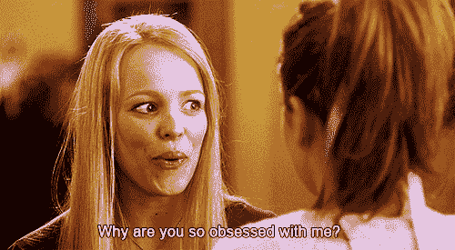
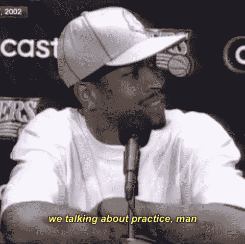

# 7 个令人惊讶的迹象表明你正走在创造性突破的道路上

> 原文：<https://medium.com/swlh/7-surprising-signs-youre-on-the-path-to-a-creative-breakthrough-adf93a51c0f4>

## **很容易想象别人的道路比你的更平坦……**

Photo by [Tony Ross](https://unsplash.com/photos/I9c0oa048iM?utm_source=unsplash&utm_medium=referral&utm_content=creditCopyText)

很容易想象别人的道路比你的更平坦…

**如果你是名副其实的作家和创意人，你一定有过这样的想法。**

你周围的每个人都有一些“捷径”或诀窍，推动他们在这个创造性和创业的旅程中走得比你更远，这种想法是你突然发现的:

*   向前两步，向后一步…
*   停下来闻闻玫瑰的香味…
*   意识到你已经原地行走了几个月，而你却以为自己在向前冲刺…

将你的创意之旅与你周围的数百名创意者进行比较，会让你晕头转向。

我真的相信成功的顶点并不仅仅取决于“直接的、深思熟虑的和谨慎的”决定。

许多创造性的追求需要“边走边想”和“即兴发挥”。

我喜欢用例子来说明创意人员的不同心态:

> ***还有*制图员 *:***
> 
> 他们在企划室。他们绘制地图，预测，并试图使任何努力的完美发射。
> 
> ***还有*探索者 *:***
> 
> 他们处于创造性追求的底层。他们正在使用他们的大砍刀，不断创造工作——不管结果如何。他们了解这片土地，经历作为一名创意者的艰难困苦。

有时候，为了实现我们想象中的成功，考验和磨难正是我们所需要的。

为了提醒我们，朝着一个目标努力通常是笨拙多于优雅的，这里有七个看起来令人不快的进展迹象。

# 1.有人告诉你“不”

Photo by [Isaiah Rustad](https://unsplash.com/photos/HBABoZYH0yI?utm_source=unsplash&utm_medium=referral&utm_content=creditCopyText)

可能是内容创建者不回应你的协作请求，也可能是网站拒绝了你的客座博文。

*第一次给***[*写作合作社*](https://medium.com/u/bdae83c7b0da?source=post_page-----adf93a51c0f4--------------------------------)*[*登高*](https://medium.com/u/a997ab11f334?source=post_page-----adf93a51c0f4--------------------------------) 发了一个客座博文，没有收到团队的回复(没有恶意，fam)。***

**但是那个“不”是一个信号，表明我正在尝试一些新的东西，它帮助我专注于做一些严肃而有意义的工作。**

**我不得不向内看，检查我的工作的*价值*到底是什么。这种自我检查要求我进入新的创造性空间，并提高我的工作质量。**

**过了一段时间，提交了修改后的作品，我现在为所有这些出版物写作。**

**那些最初的“不”都是创造性成长的一部分。**

# **2.有人不喜欢你的工作**

**有时候，当有人对你说“不”并不一定意味着他们不喜欢你。**

**也许时机不对，或者内容不符合整体使命。**

> **你不能把“不”看成是针对你个人的。**

****

**[So fetch](https://media.giphy.com/media/szPZ2NXIGCMcE/giphy.gif)..**

**然而，其他时候，人们实际上不喜欢你的工作——你也不能认为这是针对你个人的。**

**如果你的观众中的每个人都持有相同的观点，那么他可能不是一个富有的观众。**

**事实上，当你收到听众的一些反对意见时，你应该庆祝一下——你可能刚刚发现了一些东西。**

**我第一次收到对我工作的负面反馈时，我崩溃了。我想， ***“这个杰布罗尼到底是谁？他们对此了解多少？”我向他们还击，结果浪费了时间和精力。*****

**这将会发生——毕竟这是互联网…**

**当你惹怒一些人时，要知道你即将取得突破。**

# **3.你拒绝了一个客户**

**一开始可能会觉得不舒服，但是你也可以用“不”来回报。**

**有时候和你一起工作的人从你身上拿走的可能比你得到的更多。**

*   **花在让客户沮丧上的精力不值得。**
*   **你的客户没有付给你你认为你的价值或工作的价值。**
*   **在接纳更有价值的客户后，你就没有可用的带宽了。**

**同样，随着你作为专业人士的名声越来越大，客户也会越来越多。**

**如果你担心财务责任，许多作家在写作的同时还有其他与写作无关的工作。**

> **在你的生活中保持这种平衡会让你内心平静。你的金钱义务将会得到满足，你的写作和营销会议将会有重点和激情。**

**明智的做法是评估你想如何花费你的精力，这样你就能充分利用你的时间。**

**拒绝一个不适合你的客户是你职业生涯的转折点。**

# **4.你在客户身上“浪费了时间”**

****

**Photo by [Elena Koycheva](https://unsplash.com/photos/VmcIMhuWCac?utm_source=unsplash&utm_medium=referral&utm_content=creditCopyText)**

**当你超越了一个客户，结束了与他们的合同，你可能会觉得你在做不满意的工作上浪费了时间。**

**这不过是另一个试图蒙蔽你判断的谬论。**

**还记得你甚至没有客户的时候吗(对于正在阅读这篇文章的一些人来说，现在是——当你能够纯粹为了爱而写作的时候，记住这一点),这一切都是为了获得经验？然后你获得了经验，锁定了你的第一笔佣金。然后你从他们那里学到了东西——他们也帮助你积累了经验。**

**现在他们不像其他客户那样有价值了——这是浪费时间，对吧？**

**过去的客户不是浪费时间；他们是建立你的企业的一部分。他们是把你培养成专业人士的一部分。**

# **5.你浪费时间在研究上**

**花时间研究你自己的营销努力可能并不总是会立即产生回报，但它永远不会是免费的。**

> ***优先考虑自身继续教育的作家对客户很有吸引力。***

**学习和发现新领域的需求永远会比*万事通带你走得更远。***

**我记得我的第一个付费客户是一家房地产网络公司。他们向房地产经纪人出售一种产品。**

**我负责开发他们的博客内容。他们的速度太惊人了，这种接触——太棒了。唯一的问题是…**

**我对房地产一窍不通！**

**但这并不能阻止我…**

**坚持不懈的学习和研究让我对一个我一无所知的行业有了新的理解，并帮助我提高了写作技巧和信心。**

**研究还可以帮助你在未来的工作中领先一步。**

**专业人士对此感到很舒服。他们更喜欢做出决定并获得动力，而不是等待他们的想法或行动变得完美**

# **6.你在草稿上“浪费了时间”**

**你知道什么能帮我早上起床吗？**

**对尝试新事物的追求。**

**我知道…这听起来可能有点俗气，但这是真的。**

****

**We're all not born [Allen Iverson](https://media.giphy.com/media/3oEjI105rmEC22CJFK/giphy.gif)…**

**每当我能够打开笔记本电脑开始打字的时候——即使是在我经历可怕的文思枯竭的日子里——我都会充满活力，看看我的大脑和手指的协同作用能产生什么。**

**每天都是练习你所关心的事情的机会。它可以是感激、倾听、清晰的交流或写作。**

**你写草稿的任何时间都是很好的练习时间。**

# **7.你不舒服**

****

**Photo by [Rebecca Oliver](https://unsplash.com/photos/So2SBwAl0j4?utm_source=unsplash&utm_medium=referral&utm_content=creditCopyText)**

**这可能是最不可取的进步迹象，但却是最深刻的。**

**想一想*舒适区***

**当你舒服的时候，你可能在那个竞技场上是强壮的。此外，当你感到舒适的时候，你会展示你的优势。**

**当你不舒服的时候，你在陌生的水域。在不熟悉的水域，你有以指数速度学习的深刻能力。**

> **如果一个大联盟的投手只练习他的力量——他的快速球，他的对手很快就会比他的投手更聪明。当然，指关节球是一种难以捉摸的技能，即使是最熟练的投手也要掌握，当练习和努力时，它可以使所说的投手不可阻挡。**

*   **与第一个付费客户打交道是不舒服的——赶紧抓住机会吧！**
*   **写一个新的利基市场是不舒服的——在这个新的领域里开始自我教育吧。**
*   **与世界分享你的作品是令人难以置信的不舒服——看着魔鬼的眼睛，勇往直前！对你作品的接受远远超过了不确定性。**

**所有这些迹象，虽然有时令人沮丧，但总是有助于通向造物主的“应许之地”**

> **“永远不要仅仅因为你无法应对一时的压力，就放弃一些具有巨大长期潜力的事情。”
> ― **塞思·戈丁****

**这很难，这是事实。**

**即使没有成千上万的人，也有成百上千的人在尝试做你正在做的事情——这也是事实。**

**当他们到达上述 7 个标志中的任何一个时，大多数人都会放弃。**

**如果你不是那种半途而废的人，竞争领域就会缩小。**

**随着下一个障碍的出现，它会进一步收缩。**

**永远不要成为那些半途而废的人，成功终将到来…**

**这也是事实。**

# **👋🏻你好，我是乔恩**

**想建一个赚钱的博客？你必须知道如何利用你的激情，并将其与人们想要的东西融合在一起。加入 **1，200 名其他人**的行列，参加我为期 6 天的免费**“创业博客”**课程，你将学会如何在经济上实现你的激情。**

****🚨** [**> >世卫组织还想自己当老板吗？< <**](https://mailchi.mp/4b982beed325/free-6-step-course) **🚨****

**(你还会得到一份免费的 ***“如何写出终极博文”*** )**

****

## **这篇文章发表在[的《创业》(The Startup](https://medium.com/swlh) )上，这是 Medium 最大的创业刊物，拥有+ 373，071 读者。**

## **在这里订阅接收[我们的头条新闻](http://growthsupply.com/the-startup-newsletter/)。**

****