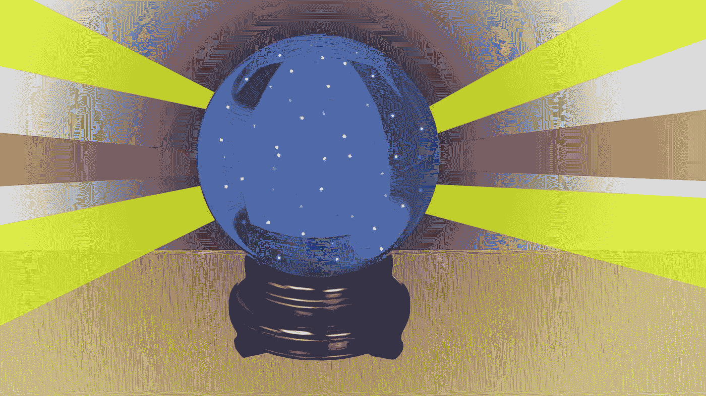

# 2018 年值得关注的 7 项技术

> 原文：<https://medium.com/swlh/7-technologies-to-watch-in-2018-e7e365ebd00>

很容易说，2018 年唯一重要的技术是比特币。在 2017 年即将过去的日子里，它占据了我们的集体意识，并将在明年发挥重要作用，但 2018 年自然会有许多其他同样重要甚至更重要的技术故事。

# 5G

如果你还记得近十年前 4G LTE 的推出是什么样的，请准备好在 2018 年开始重温 5G 的美好时光。

就像之前的 4G 一样，5G 是一个稍微有点模糊的概念。没有人同意 5G 到底有多快，但它可能比最好的 LTE 快 10 到 12 倍。不幸的是，网络部署还没有开始(我们所得到的只是承诺在家里使用一点 5G 技术(T1 )),而且没有消费者硬件准备好支持它。

所有这一切都应该在 2018 年开始改变。首先，我们将从所有主要运营商那里获得更多 5G 移动网络的公告。很可能我们也会得到不同风格和不同速度的 5G，就像我们对早期 4G 所做的那样。

许多下一代手机应该支持一种或多种 5G 技术。到今年年底，一些幸运的消费者可能会过上 5G 的生活，但 2019 年可能会是该技术的突破年。

# 人工智能

人工智能、机器学习和神经网络是 2017 年的重大科技故事，它们将在 2018 年继续占据中心位置。

这一次的不同将是从个人语音助手中的人工智能到工作场所中的[人工智能的转变。我们已经看到 Slack 等工作场所通信平台中的简单机器人，但随着神经网络变得越来越强大，机器学习在企业中传播，并向下传播到桌面和工作场所移动技术，](https://www.cio.com/article/3237529/artificial-intelligence/5-use-cases-for-ai-in-the-workplace.html)[越来越多的](https://www.salesforce.com/form/pdf/ai-for-crm.jsp)简单、重复的文书和办公室任务可能会交给人工智能。

与此同时，[呼吁加强控制人工智能自由传播的声音](http://mashable.com/2017/09/05/elon-musk-wrong-about-ai-wwiii/#L6pV1EUDtqqS)将会增长，为帮助确定人工智能在社会中的适当角色而成立的[组织](http://mashable.com/2016/09/30/watching-ai/#.AYDfsBV0PqN)将开始提供更有条理的指导。

# 无人驾驶汽车

可以说，自动驾驶技术已经好到足以让我们现在完成大部分的驾驶工作。大劫案吗？立法。 [21 个州](http://www.ncsl.org/research/transportation/autonomous-vehicles-self-driving-vehicles-enacted-legislation.aspx)，到目前为止，已经有了与自动驾驶相关的法律。2018 年，预计将有十几个州在 2017 年引入自动驾驶立法，使其成为法律。联邦政府也在考虑在全国范围内进行一些改变，以适应自动驾驶汽车，这一举措应该有助于那些考虑从纽约州到加利福尼亚州自动驾驶的人，以及预计将于 2018 年底或 2019 年加入道路的[自动半车队](http://mashable.com/2017/11/16/tesla-semi-first-look/#hVM6g4RA0Gqz)。

# 机器人学

每年，我都预测机器人技术将迎来重要的一年，但每到年底，我总是有点失望。没有 R2-D2，没有 C-3PO。这一年的大部分时间我都有这种感觉，直到我看到这个，一个没有束缚的，人类大小的机器人在做后空翻。

明年，在人工智能和神经网络发展的帮助下，人形机器人的发展步伐将会加快。我不指望机器人看起来和行为像我们，但我们会看到更大、更敏捷的机器人，也许还有一两只更好的机器人宠物。

# 网络安全

俄罗斯对 2016 年大选的成功黑客攻击激发了网络安全界的活力。今年晚些时候，哈佛大学肯尼迪学院贝尔弗科学和国际事务中心的一个两党小组公布了他们的[网络安全竞选手册](https://www.belfercenter.org/cyberplaybook)，为在政治竞选和随后的选举中维护网络安全提供了一些非常明显的指导。尽管如此，这表明一些人现在对来自众多外部来源的明确而现实的黑客威胁有多么重视。

# 动力和能源

波多黎各正在进行的飓风后危机激发了一个难得的机会，几乎是从零开始建立一个由埃隆·马斯克的[特斯拉(和许多其他太阳能公司)](https://www.vox.com/energy-and-environment/2017/10/19/16431312/elon-musk-richard-branson-clean-energy-puerto-rico-solar-batteries-microgrid)提供的太阳能和电池储能相结合的电网。这一现实世界的概念证明(以及澳大利亚的另一个[电力存储项目](http://mashable.com/2017/11/30/tesla-battery-powerpack-south-australia/#A.Tleq3hWOq0))将在 2018 年为消费者、企业和市政当局引发一场电力收集和存储的革命。

# 零售改革

抛开吞噬了所有零售业务的亚马逊不谈，实体公司将改变人们购物、支付的方式，以及他们接受的支付方式。

亚马逊的零售测试实验室 [Amazon Go](https://www.amazon.com/b?node=16008589011) 将扩大并激励其他零售商建立小型测试商店，让顾客走进去，拿起他们想买的东西就走，所有这些都不需要与销售人员或收银台打交道。

比特币将继续崛起，但更重要的是，它将变得如此受人尊敬，以至于更多的传统零售商将开始接受它作为支付手段。我们还将看到人们通过包括 Samsung Pay 和 Apple Pay 在内的移动支付系统访问比特币商店。

其他值得关注的技术:

**增强现实**

虚拟现实将在 2018 年统治游戏领域，但增强现实最终将产生更大的影响。

**量子计算**

科学家们已经非常接近弥合传统计算系统和量子计算机之间的鸿沟。到 2018 年底，我们将看到量子计算在工作。

**性技术**

虚拟现实、增强现实和机器人技术将使我们离西部世界更近一步。

## 这篇文章发表在 [The Startup](https://medium.com/swlh) 上，这是 Medium 最大的创业刊物，拥有 277，050 多名读者。

## 在这里订阅接收[我们的头条新闻](http://growthsupply.com/the-startup-newsletter/)。

