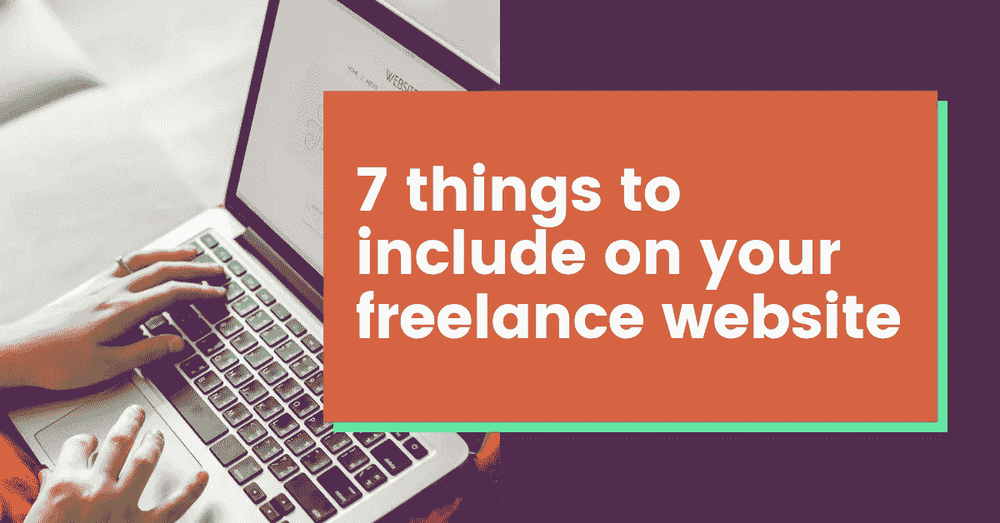

# 你的自由职业者网站应该包含的 7 件事

> 原文：<https://medium.com/swlh/7-things-to-include-on-your-freelance-website-7e58299dffff>

拼凑起来的网络形象是不够的

如果你从事自由职业已经很长时间了，你可能已经知道拥有一个正常运行的网站是多么重要。在 Wix 或 Squarespace 上建立一个免费网站可能是你决定开始做自由职业者的第一件事。