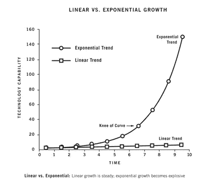

# 辞职前了解这 7 件事，确保你的生意成功

> 原文：<https://medium.com/swlh/7-things-to-know-to-quit-your-job-and-start-a-successful-business-18ed8accb4c2>

Photo by [Felix Russell-Saw](https://unsplash.com/photos/N-X3TCHj5Jk?utm_source=unsplash&utm_medium=referral&utm_content=creditCopyText) on [Unsplash](https://unsplash.com/search/photos/laptop?utm_source=unsplash&utm_medium=referral&utm_content=creditCopyText)

从全职工作到全职创业是一个巨大的转变。

大多数在职人士都低估了这一转变——我知道五年前我实现这一飞跃时，我确实低估了这一转变。

竞争所需的意志。

思考的深度[不会像在工作中那样涉及个人隐私。](/swlh/if-you-do-these-7-things-youll-be-able-to-achieve-any-goal-you-set-ebe50250647b)

创业是个人的，首先是关于你和你的生活。每天出现的都是你。他们是你的顾客和员工。

然后是关于其他男性或女性的需求和欲望，它们构成了你的市场。[你试图赢得一块市场，并与其他人竞争](/swlh/8-principles-to-become-1-in-a-crowded-field-of-competitors-ebb6eb7f9989)，那些喜欢你的人就在那里与你竞争。

这是一件需要被欣赏的事情，通常直到你第十次与客户打交道时才意识到你输给了客户的其他选择——也就是竞争对手。

那你是做什么的？你变得更好。这是唯一的方法。

与此同时[不得不感激这是一个富足的世界](/swlh/how-to-have-what-you-want-before-you-need-it-f943372debf3)，市场每天都在增长——因为[吸引富足从你开始](/@ARTaghavi/the-secret-to-getting-what-you-want-9a3448d5490)。

**人们需要并想要更多的东西和更好的版本——来不断完善自己和提高。**

这就是了解人类状况的切入点。

了解顾客购买的动机至关重要。

不仅仅是购买你的服务或产品，而是真正让他们夜不能寐的东西。什么会促使他们选择你而不是其他人？

你需要比他们自己更了解他们，既要有效地向他们推销产品，又要有效地为他们打造产品。

商业就是在一天结束时解决人们的问题。每当有人做某事时，他们都是在满足需求或解决问题。越痛苦越好。

好消息是，人类的欲望是无止境的，而且只会在我们升级到其他事物时增加。

当一个人渴望一件东西时，他会让那件东西成为他想象中的自我的一部分。那个日日夜夜都在努力打造并做到最好的自己。

所以当一个人习惯了那件事，它就变成了新的更高的标准。一个新的更高的标准，只想继续升级它的标准，以创建消耗越来越多的新标准。

这没有好坏之分——这只是[我们是如何被连接的，是什么驱使我们进化并赢得](/swlh/the-surprising-secret-to-changing-the-world-dd4d2519f940)。我们世界观的好坏导致我们优雅或贪婪地消费。

**这些与日俱增的需求和欲望构成了市场。**

这就是市场不断发展壮大的原因。此外，人口也在增长，市场潜力很大。

例如，我有幸生活在纽约市，这个城市拥有一些最好、最高效的便利设施。我现在习惯了一个辉煌的小按摩院，收费 35 美元，为我做过最好的按摩。街对面是摩根斯坦斯，这是我去过的最好的冰淇淋店之一，还有黑种子，一个百吉饼店，世界一流的香肠鸡蛋和奶酪百吉饼要价 15 美元。

两个街区外有一家米其林星级的布恩叔叔餐厅——这是我吃过的最好的泰国菜。在那里很难找到一张桌子，所以他们在几个街区外开了另一家店——而且他们把它变成了快餐版。想想看——他们做得如此之好，以更低的价格提供了更多！

我现在已经习惯了这些便利，并期望它们成为我的标准。现在，当我回到我长大的马里兰郊区看望我的父母时，情况有了明显的不同。我当然欣赏这些人性的事实，并且尽可能优雅地生活，因为我知道我可以在任何时间任何地点快乐和满足。

> 然而，这是关于像这样的深刻认识，关于人性，市场如何运作，我们为什么购买以及我们卖给谁，这些在向企业家转型时都没有得到重视。

我辞职太早，以至于无法创办我的第一家公司，我花了很大的代价才知道，我们应该在辞职前创办自己的公司——这不仅是因为这比以往任何时候都容易，但仍然很难，需要一个学习曲线。

我们需要知道什么时候退出——当我们已经成功地只在全职工作的时候把脚放在地板上。

在辞职创业之前，真正的考验是——要有纪律和毅力，在一定水平上完成工作，克服兼职者的限制。

自从五年前我开始创业以来，我看到很多人全职创业，却不知道如何利用他们的时间和资源，这可能是一种缓慢而痛苦的方式来了解我在这里将要谈到的严峻事实。

随着世界朝着需要创业的方向发展，大而慢的公司正以越来越快的速度消失——以下是在考虑投身创业时要认识到的残酷事实和要避免的错误。

最重要的是，这是你在工作时创办公司的途径。

# 我是如何吸取这些教训的

我是第一个被卖到 5000 万美元的媒体公司的员工。

我在那里工作了六年，发展了它的销售组织。

几年后，我们经历了一次大规模的快速增长，当我进入平台期时，我开始有了创业的渴望。

我太天真、太自信了，急于辞职去开创自己的事业。

因为我的工作赚钱很容易，所以我认为为自己工作赚钱会很容易——而且创造一个市场如此渴望的产品比实际上更容易。

没有[我不知道我需要的深刻理解和彻底的自力更生](/swlh/the-surprising-secret-to-changing-the-world-dd4d2519f940)，这是一个巨大的错误。在没有正确的知识和客户基础的情况下，我决定辞职创业。

虽然我知道我可以创办什么样的企业，甚至成功地创办了企业，但我不知道为什么我要创办这样的企业。

我刚开始的时候就知道我想开始做点什么，为自己工作。这是非常自我驱动的，背后没有其他意图。

现在我已经在过去的五年里建立了两家自己的公司，我已经意识到了这个游戏的秘密。

当你应用了所有正确的原则并看到它们起作用时，这是多么简单，但是如果你自己不应用它们，学习它们会很难，甚至更难在早期坚持下去——这就是为什么我现在是边工作边开始的超级粉丝。

现在我做我喜欢的事情，从我喜欢的地方开始，并且赚钱，我意识到如果我再做一次来节省时间、金钱和压力，我会用这 7 条原则来做。

# 1.如果你不能兼职创业——你还不应该辞职

辞职应该发生在你达到“辞职里程碑”的时候——这是一个安全的目标，给你时间和跑道辞职，全职做生意(现在就为自己创造一个吧！).

这有几个原因:

这显然是你的财务跑道和收入要求的安全网。它还允许你慢慢来，四处玩耍和实验。你希望能够在你带着某样东西走向市场的时候学习，并且拥有迭代和旋转的空间，因为这是不可避免的。

在有限的时间和约束的创业游戏中，做到时间和金钱不被烧掉是无价的。

你需要成为一个高效的顶级执行者，并且毫不留情地把时间花在正确的事情上。这可能意味着被迫提前两个小时起床，或者牺牲夜晚和周末来爱上你的工作。

你会发现，当事情进展顺利时，你会很容易“爱上工作”，并实际上享受它——我称之为贪婪的热情——[世界上最优秀的人所拥有的](/swlh/the-surprising-secret-to-changing-the-world-dd4d2519f940)。

[你一定非常喜欢自己的工作，以至于什么都不想做](/swlh/the-surprising-secret-to-changing-the-world-dd4d2519f940)(尽管你当然会做其他活动来休息和恢复，包括爱好和娱乐)。

[**这是最重要的部分——心态**](/swlh/8-principles-to-become-1-in-a-crowded-field-of-competitors-ebb6eb7f9989) **。**

如果你没有，你就会失败。或者你会随着时间的推移从错误中学习，这很好，但会花费你大量的时间和金钱。

因此，当你有一份全职工作时，创办一家公司就成了检验你是否能在全职创业的竞争中生存下来的最佳测试。

如果你做不到，你要么没有心态和/或技能去完成它。这两者都需要，所以你不应该放弃。

所以如果你[不能做兼职，你还不配辞职](/swlh/if-you-arent-doing-these-7-things-you-re-on-your-way-to-mediocrity-91e97b0a9ffa)。

# 2.如果你不能 100%确定你可以定期付费获得可预测的客户，你不要放弃

一个很好的思考方式是简单的“加速器效应”。

比如，如果你踩下汽车的油门，汽车就会加速前进。如果你辞掉工作，每一次你踩下油门，它会向前移动吗？或者有不确定性，因为你只指望有机外联或不知道你的付费客户收购看起来像什么？

这只有在你达到一定的经常性收入后才能实现，而不需要你每天都去寻找潜在客户来追逐业务。

这并不是说你不会对你的网络进行有机推广，而是商业需要(至少对本文的目的来说应该是这样)在一个地方，你可以预见地投资 X 金额的广告，以获得 2-5 倍的回报。

这需要市场领先的知识和经验，这可能需要时间来获取(甚至几年)和建立，以及每月的营销预算投资，这也需要时间来增长和建立收入。

除非你自信地实现了“加速器效应”，否则你还没准备好辞职去开公司。

# 3.在一件事情上做到最好

如果你不相信或者没有证据表明你有能力在一件事情上做到最好，那么你还没有准备好创业。如果你没有在这件事上成为最优秀的计划，你就是在为平庸做打算。

例如，我正在执行一项计划，要成为思维训练和商业/创业技能的最佳作家和培训师。

我设定了写作目标和销售目标，并逆向设计了实现这些目标的活动路径，具体到日期、金额、电话和电子邮件。

我的写作目标是[在今年年底达到 15 万电子邮件订户](https://betreatedhowyouwanttobetreated.com/optin-main)。这意味着计划每天在 Medium 和 Linkedin 上发布文章，为其他流量更大的博客写稿，在其他渠道建立自己的博客，以建立影响力和其他媒体，我需要接触数百万人，才能达到那个订户数。

迄今为止，我在 Medium 上有大约 3600 名粉丝，在 Linkedin 上有大约 1500 名粉丝。大约 8 个月前，我的电子邮件订户已经超过 3000 人，并开始定期写信。

我有一篇《福布斯》的文章要发表了，我请了一位公关人员帮我登上了国家级刊物。我每天都看着我的数字，我知道我正在一点点地削减[我的指数增长曲线](/swlh/8-principles-to-become-1-in-a-crowded-field-of-competitors-ebb6eb7f9989)，它将越来越快，最终我的最后 80%的增长发生在最后 20%的增长期间(快！).

我已经成为 Medium 上 7 个类别的“顶级作家”，包括#企业家精神、#创业、#生活课程、#商业、#自我提升和#生产力。

对于我几周前才开始的新培训业务，我已经带来了我的第一批四个教练客户，并将从那里迅速扩展，提供类似海豹突击队的培训，帮助人们在就业期间从 A 到 Z 或从 0 到 1 创业。

# 4.理解市场，人类状况，自然选择

这在一定程度上是“成为最佳”的延续，因为在某方面成为最佳的需求是由市场、人类条件和自然选择决定的。

市场是人类需求和欲望的外在表现。因为他们的存在是因为需要和欲望用金钱来满足。

所以，如果你卖东西是为了满足某人的需求或愿望，他们会去市场，将你的产品与替代产品或服务进行比较。这就是为什么成为最好的和/或将自己定位为某个细分市场中最好的是如此重要。

非常了解人类的状况对于营销和销售来说至关重要。最优秀的销售人员、营销人员和产品开发人员最了解人们的心理——他们的动机、恐惧和欲望。作为一名高水平的兼职商人或企业家，这对于你每天的自我保护和恢复能力也非常有帮助。

理解自然选择如何适用于工作和人，对于人类状况和市场也是至关重要的。因为市场是由人类的需求和欲望驱动的，人类本身是游戏中的玩家，也是你吸引的人，你需要理解他们是如何被驱动的，他们是由自然选择驱动的。

这个有趣的视频是成长和自然选择法则的一个很好的例子:它开始于一个人在拥挤的场地上独自跳舞，看起来格格不入。过了一会儿，他吸引了一个同伴，然后第二个追随者来了，三个人跳了一会儿。然后一个 3 人左右的小组加入，然后 5 个人越来越快。两分钟后，你会看到一个舞者变成了 100 岁，这是因为通过自然选择的 80/20 增长法则。

开始时，增长缓慢，然后慢慢增长。然后，随着它慢慢增长，增长，并在一路上取得了一些大的突破，它倾斜了，最后 80%的增长出现在最后 20%的时间里。这是所有这些因素的结合，市场，人类条件和自然选择的力量产生了这个经典的指数增长曲线:

最终，如果你不加入舞蹈团，你就会被“排除在外”。

这就是现在企业家运动的情况。

# 5.发现你的市场并为他们服务——找到适合市场的产品

人们过度思考市场调查和产品市场匹配。你所做的只是找到某人的问题，并创造一个解决方案来交付一个结果。

让一个人来做这件事，用一个更大的样本集来测试它，看看会有什么反馈。

确保你不会过早退出或转向。我看到人们每天都很快气馁，认为人们不喜欢他们所拥有的，而事实上他们所要做的就是用更好的信息更好地表达问题，或者将问题转移到更深层次或不同的问题。

例如，作为一项研究工作，我正在测试不同的问题和解决方案，通过辅导和培训帮助投资银行家达到巅峰。我选择这个细分市场只是因为我的室友是一名银行家，而我住在纽约，所以有很多这样的市场。

在与我的室友交谈并询问了他在工作中面临的问题后，我列出了一份银行家名单，并开始给他们发电子邮件，传达不同的信息和提议。

我发出的前两百封电子邮件没有得到任何回应。我并不感到惊讶，但这正是人们经常感到气馁的地方。

当你向冷漠的人传递信息的时候，当你表达一个深刻的问题(人类的状况)的时候，你真的需要触动他们的神经。

如果你能得到一个像这样的冷名单，以购买 3%的时间，你有一个企业。

那么你认识什么样的人，你能向他们推销什么呢？他们是人，所以他们买。你所要做的就是迭代并诉诸他们的痛点，你就会得到回应。

我只给这个小组发了一些测试，但是我会向他们汇报我的小研究的进展。

你会意识到，特定角色和个人资料中的人有重复出现的模式，你可以将他们放入不同的类别。

微妙之处在于传达的信息——什么吸引了他们？银行家有五个不同的头衔——分析师、助理、副总裁、董事和总经理。同样的工作，但不同的年龄演示。那么你们各自传递了什么信息呢？

你或许可以向年轻的分析师发送思维训练或生产力应用产品，但向年长的董事总经理发送健康和长寿服务。

继续尝试，看看会有什么回报——记住，一点点参与和 3%购买你现在拥有的，你就能成功扩展。

# 6.发现和解决当下存在深层次的痛苦是简单的，虽然需要时间，但却是强有力的

就像淘金一样。

发现市场正在经历的深层次痛点是一个简单的过程，需要在前端投入知识工作和发现。

但是当你做对了，你已经挖到了金子，剩下的就变得容易了。

这就是为什么它非常适合你工作的时候。你可以花所有你需要的时间去做深入的工作，去真正了解和创造市场现在想要的东西。

这需要以下步骤:

了解一个细分市场(会计师、瑜伽教练等。)非常好(这可能是你，但肯定不是必需的)。

这一过程的常见错误有:

*   不是从冷门前景开始，而是从你的朋友开始。
*   在和朋友一起工作和选择一起工作的人时要非常有选择性。我建议在开始时，只向可以做推荐人的密友提供免费服务。

否则，你想从冷淡的市场得到反馈。这是最难的，但这是事实，这是最好的。

去找那些不想伤害你的感情或让你泄气的朋友不会给你想要的反馈。理想的情况是，你有了一些客户，有了一些信誉之后，你想去找朋友。这将最大限度地利用你拥有的关系。当你为别人取得成果时，他们怎么能说不呢？

# 7.精心制作报价和信息

信息需要完美地传达给信息的感知者，以触动他们的神经，从而促使他们做出回应。

那么你的客户担心什么让他们夜不能寐呢？你能为他们做些什么？你怎样才能传达一个信息，清楚地表明你是解决他们问题的人？

因此，以我的银行家为例，我一开始提供“最佳表现辅导”，似乎并没有触动神经。也许他们不太理解所提供的内容，或者这个群体对这种语言没有共鸣。

然后，我把它磨练成“接受评估，在那里我们评估你的个人和职业目标，并制定一个新的行动计划和长期战略”。我们将看看这是如何做到的，因为我刚刚发出了那个通知，并将报告回来。

这可能需要我对“压力训练”这样的事情有更具体的了解。非常清楚和直接的问题，简单地向一个小组说明。

说到底，这与我们为一部分人发现问题是一回事，但这是找到真正触动神经的东西，并找到解决问题的方法，从简单的咨询开始，既了解问题又了解客户，同时积累专业知识和经验，以此扩大规模。

# 结论

让我们回顾一下:

要在创业中取得成功，你需要的心态和表现习惯将允许你在就业的同时创业。

你需要在你的业务中走得更远，这样你才能轻松地获得客户并为他们服务。这是你能够辞掉工作加速前进的时刻。

正是这一点，你需要研究、发现并包装一个解决方案，来解决你确信存在于你的市场中的一个深层次的难题。

然后制作营销信息并为他们提供服务就变得容易了。

一开始，就从你自己做的咨询服务开始。

你从那里开始，获得顾客。这是你最了解你的市场和顾客的地方，当你真正为他们服务的时候。在那之前，一切都只是理论，你不会得到真正的市场反馈。

然后，你起草一份报价和信息，开始测试潜在冷淡客户的名单，看看会有什么反馈。

请记住，你正在努力争取 3%的市场份额，现在就准备购买，所以每 100 人中，可能有 12 人回复，3 人购买。那是你的转向架。

继续测试，直到你达到目标，瞧，你有你的生意了。

做到这一点，获得足够多的你没有时间工作的顾客——然后辞职去全职工作就变得不需要动脑筋了。

## 每周一次点击接收我承诺的改变游戏规则的文章，这是你在互联网上其他地方找不到的。你还会收到我的 36 条原则指南，指导你如何掌控他人，以你希望被对待的方式被对待——并在你所做的事情上成为世界上最好的。我保证你不会后悔的。

## 这篇文章发表在《初创企业》杂志上，这是 Medium 最大的创业刊物，有 314，601 人关注。

## 订阅接收[我们的头条](http://growthsupply.com/the-startup-newsletter/)。

