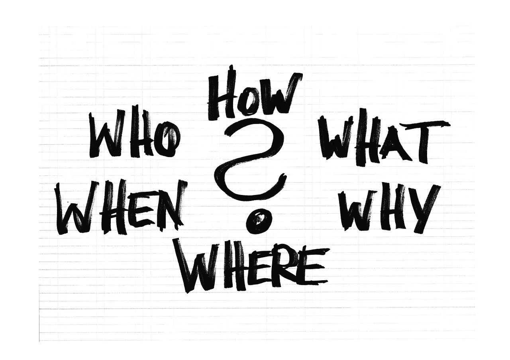

# 当你领导第一次重大组织变革时，要尝试的 7 件事

> 原文：<https://medium.com/swlh/7-things-to-try-when-youre-leading-that-first-big-organizational-change-bf6b1c9b9690>

## 而且都是以字母 C 开头，看起来挺酷的。

我知道大约有 10 亿篇关于变化的文章和书籍。我读过很多。下面的列表是我用来领导一些大型组织、流程和文化变革的材料，这些变革涉及到 60-1200 人的团队，大部分都很成功。它们以人为本。因为变革是以人为本的。

根据您想要进行的变更的规模和复杂程度，您可以使用其中的一个、两个或全部。我不是给你一步一步的，只是你可以建立的一般主题。一如既往，拿走你喜欢的，剩下的留下。

**编造故事**

改变是一个故事。它有情节，情节曲折，危机，戏剧，有惊无险，跌宕起伏。谈论一个故事比谈论一个项目有趣得多。那么为什么不用这个作为你的框架呢？

在一个我们都参与其中的更大的故事背景下描述这个变化。将商业或社会背景融入故事中。请记住，虽然变革的目标通常与*的事情*有关，但变革的体验与*的人*(员工、客户、供应商等)有关。).

我建议给你的变革故事起一个有趣的标题，不要包含流程、重新设计、项目、重组或任何其他令人厌倦的公司术语。然后开始分享一些故事，提炼并测试它，直到你准备好邀请其他人加入你。

**捕捉图像**

几年前，我帮助一个组织经历了一场相当激进的文化变革。在启动会议结束时，我请领导团队和我一起进行一次可视化之旅，在此期间，我们试图以非常具体的方式想象一旦变革到位并取得成果，组织中的生活将会是什么样子。

换句话说，*故事的结尾发生了什么*。*会是什么感觉*？人们将会做什么？我们的客户会说什么？我让他们写下他们想象的东西，然后我们一起分享这些想象的时刻，就好像它们已经在发生一样。这些独立的图像一起描绘了一个我们都能理解的引人入胜的故事。

这种类型的练习会激发情感联系，帮助团队成员从个人角度构建故事。这可能需要一些努力，因为人们经常被设定为在工作中断开他们的想象力和情感。此外，还要考虑团队的成熟度和动态。这对一个刚刚开始合作的团队来说可能太多了。使用任何对你有用的东西，但关键是要帮助人们从牢记目标开始。

**挑战核心**

从一小群对信息感到兴奋的人开始，邀请他们帮助你改变。这个核心小组对于分享故事和增加组织的信心至关重要。我用“信仰”这个词是因为任何时候你要求人们走出他们的舒适区，进入一个你不能保证会有好结局的故事，其中就包含了信仰的元素。

我通常会在核心部分投入大量时间和精力，因为我知道它们很关键。如果他们没有准备好进行这一飞跃，那么组织中的其他人很可能会止步不前。

这个核心小组将帮助你把故事传达给那些你联系不到的人，或者那些你和他们没有牢固关系的人。至关重要的是，他们要相信变化，并准备好在言行上先行一步。我建议在你全力以赴把这个故事带给组织的其他人之前，先发展这个小组。

**交流故事**

当然，你可以召开公司会议，浏览一堆幻灯片，但这有什么意思呢？小品、自制视频或者感言怎么样？找到一种方法来构建一个令人难忘的故事。你不必起立鼓掌，只要超越正常的变革管理销售宣传就能让他们大吃一惊。

把它变成对话。必要时重复，澄清，收集反馈，继续工作，直到你有足够的证据证明信息被有效地传递了，(即使此时陪审团仍然不知道他们是否认为你疯了)。

保持简单。将信息集中在你希望人们*感受到的*，你希望他们*记住的*以及你希望他们*做的*上。帮助人们了解如何为我们的故事做出贡献，也将有益于他们的故事。这不是你对他们做的改变，而是你和他们一起创造的故事。如果你谈论的唯一结果出现在电子表格中，这将是一个非常艰难的推销。

**换布景**

要让这个故事对人们变得真实，你可以采取的第一步就是对工作环境做出可见的改变。这不仅仅意味着把鼓舞人心的海报贴在墙上或者移动座位。变化越大，可能需要的环境变化就越大。

有时，这可能意味着推倒墙壁、改变团队位置、开放部分工作空间或以不同方式摆放家具。这也可能意味着对环境的虚拟改变，比如会议如何在哪里举行，团队名称或新的职位名称更好地适应这种变化。

你也可以通过实地考察来改变一下环境。让他们走出*同样的四面墙*，看看有什么是可能的。我曾经带着一个 20 人的团队去拉斯维加斯参观 Zappos，这样他们就可以直观地亲身体验其他组织是如何运作的，不同的文化是如何运作的。在另一个实验中，我带着我的打印操作团队去了一家生产空气压缩机的工厂。当人们可以看到 3D 的变化时，它是如此强大。

**声张声势**

这个很简单。当你看到人们以支持故事的方式行动时，分享他们的故事！如果你听到公司外部的积极反馈，大声喊出来！使用一个社交平台，人们可以在那里发布成功故事，创建人们可以在上面写字和装饰的故事墙，以故事开始每次会议，在办公室里煽动随机的故事分享行为，等等。

你捕捉故事如何变成现实的方式越多，人们就越想成为冒险的一部分。

这里的关键是要专注于每一个变化正在发生的信号，并有意识地庆祝进步。故事往往以大张旗鼓开始，中途夭折，因为势头丧失，障碍使进展停顿。

**将点点滴滴串联起来**

最后，随着故事的展开，一定要跟踪进展并向组织报告结果。虽然旅程是你体验长期收益的地方，但你开始旅程时预想的目的地(结果)仍然非常重要。

人们需要知道努力、奋斗和耐心是有回报的。他们想感觉到故事正朝着解决的方向发展。同样，这可以通过多种渠道进行管理，如时事通讯、状态板、市政厅会议、休息室张贴、滚动电子字幕、随机聚会或任何有意义的方式。

所以你有它。你会注意到我没有花任何时间在制定战术策略、细节、计划、目标或其他管理活动上。我想你已经解决了这个问题，否则你不会考虑改变。

此外，我的经验是，当你有一群对旅程感到兴奋的人时，你不需要准确地知道如何到达那里。有一点是肯定的，你的改变计划将会改变。

你可能会到达一个你从未预料到的地方，也可能会到达一个比你预料的更好的地方。如果变革的人的一面管理得好，每一个连续的故事将更容易写。享受旅程。

## 这篇文章发表在 [The Startup](https://medium.com/swlh) 上，这是 Medium 最大的创业刊物，拥有+368，366 名读者。

## 在这里订阅接收[我们的头条新闻](http://growthsupply.com/the-startup-newsletter/)。

