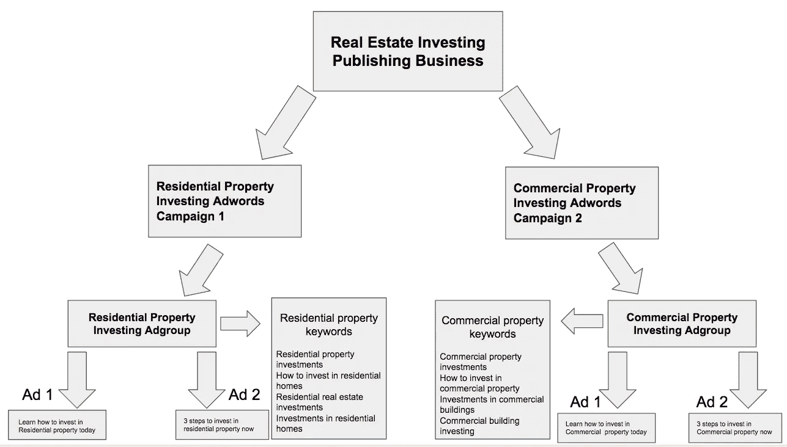
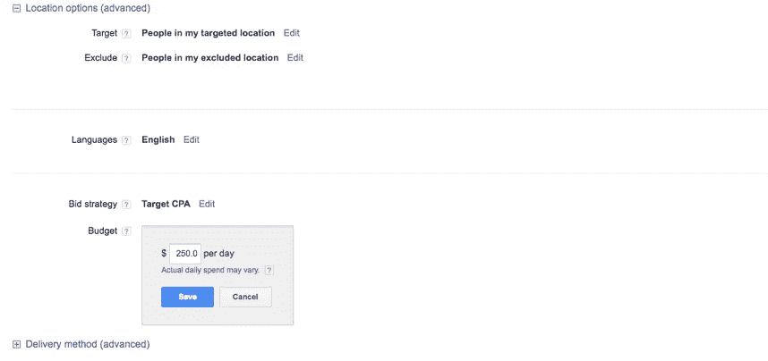
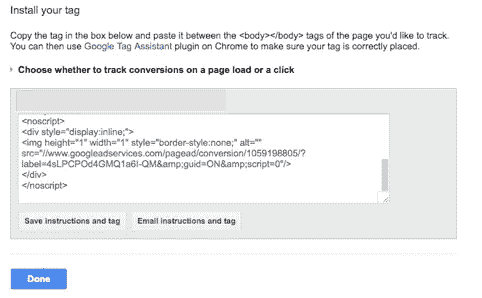

# 在 2018 年成功发起 Google AdWords 活动的 7 个技巧

> 原文：<https://medium.com/swlh/7-tips-to-launch-a-successful-google-adwords-campaign-in-2018-945ca7ccfdea>

[Google AdWords](https://readyfireaim.eu/services/paid-search/) 是最先进的广告平台之一，它可以让大企业和小企业在几个小时内将他们的产品和服务广告展示在潜在客户面前！

如果你一直在使用该平台，你会知道有许多针对不同类型的企业的选择和设置。在发起新的营销活动时，这些数不清的选项和设置往往令人不知所措，难以理解，这很容易消耗掉你的一大块营销预算，却无法实现你的营销目标。我已经看到这转化为数千美元的广告支出浪费。

在这篇文章中，我将分享我的 7 大技巧，以确保在 2018 年及以后，你在 AdWords 上花的每一美元都能获得健康的投资回报(ROI)。

# 技巧 1:优秀的账户结构

如果你想让你的广告支出盈利，一个结构良好的 AdWords 账户是必不可少的。一个结构良好的客户的基础就是相关性。我们已经看到，仅仅通过改善 AdWords 账户的结构，每笔收购成本(CPAs)就下降了 60%。每个活动中的关键词、广告和广告组应该紧密相关。反过来，谷歌会通过降低广告成本来回报你。这是一个结构良好的 AdWords 帐户的示例，其中包含两个不同的按利基细分的活动。注意每个活动的广告组、关键词和广告是如何有一个一致的主题的。

# 技巧 2:从搜索网络活动开始

当涉及到为你的产品和服务锁定最热门的潜在客户时，搜索网络就是靶心。因此，毫无疑问，搜索网络运动应该是你的第一个停靠港。不像展示网络上的营销会打断你的潜在客户浏览网页，搜索网络上的潜在客户实际上已经采取了行动，搜索他们问题的解决方案——已经使他们有资格成为销售线索。他们更接近你营销漏斗的底部，使他们最有可能转化为线索或客户。在搜索网络上启动也给你一个上下文关键词的好主意，可以带到展示网络上。

# 技巧 3:低每日预算和点击成本(CPCs)

当推出新的 AdWords 活动时，很难确定你的广告会获得多少流量，以及你会以多快的速度花掉你的预算。你最不想做的事情就是在最初的几个小时或几天内花掉几千美元，却没有多少转化来显示你的广告支出。我已经看到它发生了！为了避免这种情况，我建议将你的每日预算设定为你心中实际每日预算的一半甚至四分之一，尤其是当你是游戏新手的时候。这将允许您轻松地进入活动，同时根据您的目标监控流量表现。对于选择手动竞价的活动，我也建议从较低的每次点击费用开始，并根据关键词产生的结果按需增加竞价。

# 提示 4:广告文案和图片很重要

可以说，广告文案是 AdWords 活动中最重要的部分。它负责吸引合适的潜在客户，同时排斥那些不愿转化为客户的人。在 Agora，我们相信复制是王道。我建议在你的广告文案中分开测试两个非常不同的大创意。你的目标受众总是会对这两个大创意中的一个做出更好的反应。我还建议以一种可以比较每个广告的销售结果的方式来跟踪你的结果。然后，您可以在整个营销漏斗中使用获胜的广告文案，并扩大它的成功。对于在展示网络上运行的广告，图像和广告文案一样重要。你为广告选择的图片需要抓住潜在客户的注意力，让他们想点击你的广告。一句话:你的广告形象必须让你从数百万广告活动中脱颖而出。我建议用从图片网站上获取的图片来测试自然的图片。不测试是不可能知道什么图像表现会更好的。下面的截图显示了一个黑板图像，与展示网络活动中的自然图像进行了对比测试。

# 技巧 5:精确的测试和跟踪

如果你的 AdWords 活动想要成功，测试和跟踪不是一个选项。在大多数情况下，当发起一个活动时，你的初始 CPAs 会比你期望的 CPAs 高。测试不同的关键词、广告和投标策略将帮助你找到满足你 CPA 目标的最佳选择。为了让 Google 正确地跟踪转化，AdWords 转化标签必须正确地放置在你的潜在客户在你的网站上采取所需的转化行动后登陆的感谢页面上。这里有一个 AdWords 跟踪代码的例子，放在感谢页面上。

谷歌标签管理器(GTM)是一个帮助管理跟踪标签的好方法。其用户友好的界面有助于跟踪谷歌标签以及第三方跟踪和测试。我喜欢把 GTM 想象成一个存储所有 JavaScript 代码片段的盒子，供 Google 和第三方跟踪应用程序使用。

GTM 由三部分组成:

> 1)添加到您想要收集信息的每个页面的主标签。
> 2)确定标签何时执行的触发器。
> 3)变量用来接收和存储标签和触发器所使用的信息。

您还可以跟踪非网络活动的转化率，包括应用程序、电话和离线活动

# 提示 6:按设备类型设置活动

随着移动使用的增加，你的 AdWords 流量很有可能很大一部分来自移动设备。假设桌面和移动流量产生相同的结果并不是一个好主意。我建议按设备类型对活动进行分类。通过按设备类型组织活动，您可以独立于移动流量处理桌面流量。这将允许您单独设置出价，创建不同的漏斗，并轻松地按设备跟踪结果，确保无论设备类型如何，您都可以完全控制您的投资回报。

# 技巧 7:在搜索网上建立负面关键词列表

搜索网络上的关键字匹配类型限制越少(广义和广义匹配修饰符)，您的广告被与您的产品和服务无关的搜索短语触发的几率就越高。这是一个好主意，以确保您不会在您的活动中收到来自无关搜索的点击。“关键词搜索词”标签是一个很好的工具，可以从你的活动中剔除这些不需要的关键词。您可以将这些短语添加为负面关键词，当这些短语在搜索中使用时，将会阻止您的广告在未来显示。在 AdWords 中，您可以在广告组或活动级别设置负面关键词。在一个活动级别设置一个主要的负面关键词列表将会覆盖每个活动中的所有广告组。要设置负面关键词列表，请单击特定活动中的“关键词”选项卡，然后单击“负面关键词”选项卡。您可以点击相应的红色“关键词”按钮，在广告组级别或活动级别添加关键词。请记住，负面关键词也可以使用广泛的，广泛的匹配修饰语，短语和精确匹配类型来控制触发您的广告的流量。

遵循以上 7 条建议，不仅能为你节省大量时间，还能帮助你避免浪费 2018 年的营销预算！

谢谢，

tye Binuyo
Agora 整合营销客户经理

附言:如果你有兴趣利用专业直复营销团队数十年的知识、测试和专业技能，请立即订阅我们的每周简讯。[你可以在这里报名](https://readyfireaim.eu/free-ready-fire-aim-eletter/)。

## 这篇文章发表在[《创业](https://medium.com/swlh)》上，这是 Medium 最大的创业刊物，有 285，454+人关注。

## 订阅接收[我们的头条新闻](http://growthsupply.com/the-startup-newsletter/)。

