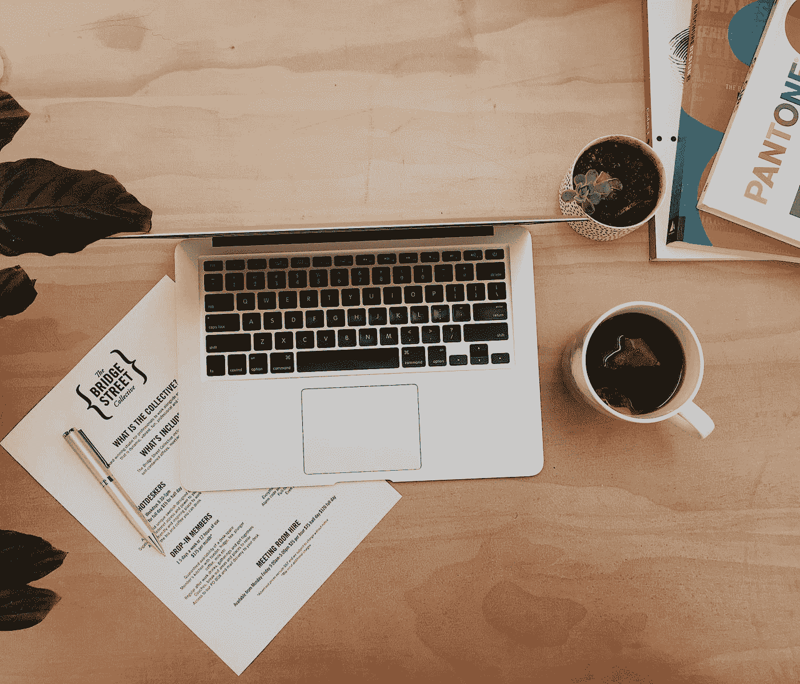

# 开始在正确的事情上高效工作的 7 个技巧

> 原文：<https://medium.com/swlh/7-tips-to-start-being-productive-on-the-right-things-3e34e9a0ae8d>

“flat-lay photo of laptop near mug with liquid” by [Christine Donaldson](https://unsplash.com/@californiawait?utm_source=medium&utm_medium=referral) on [Unsplash](https://unsplash.com?utm_source=medium&utm_medium=referral)

你知道这些时刻吗？因为你已经在办公桌前坐了几个小时，所以你感觉非常有效率。

或者你知道这种感觉吗？你感到筋疲力尽，觉得自己很有效率，但实际上大部分时间你只是在笔记本电脑上切换标签，查看东西，而不是真正地创造东西。