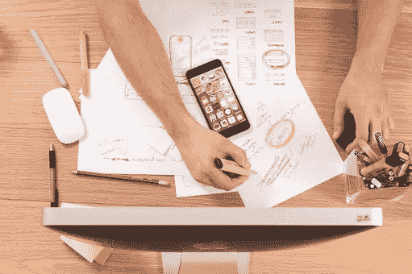
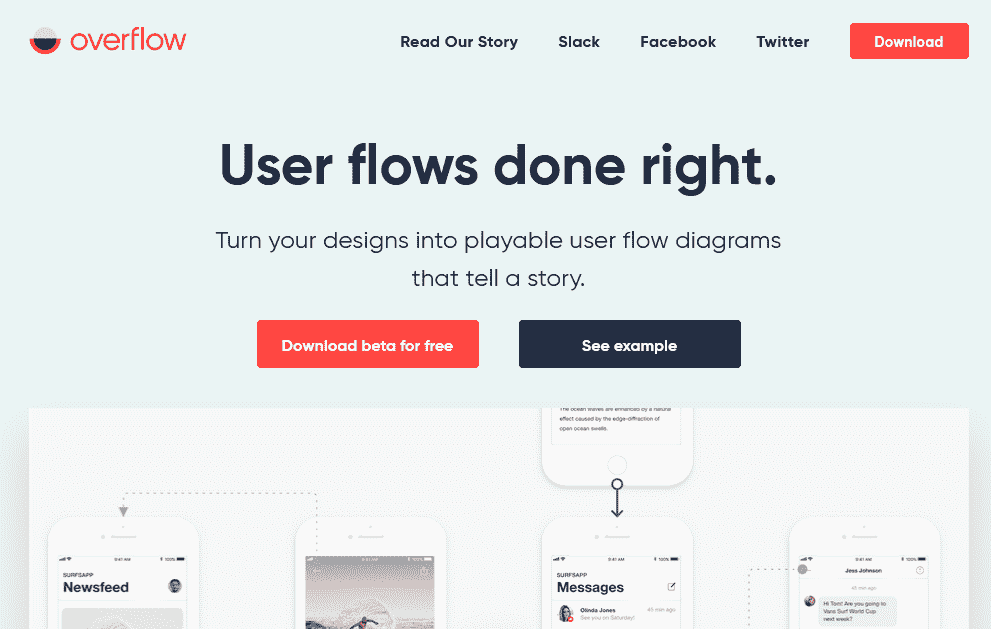
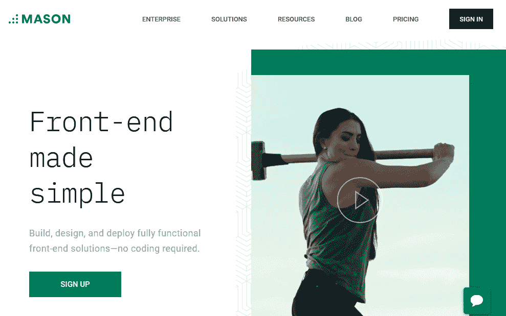
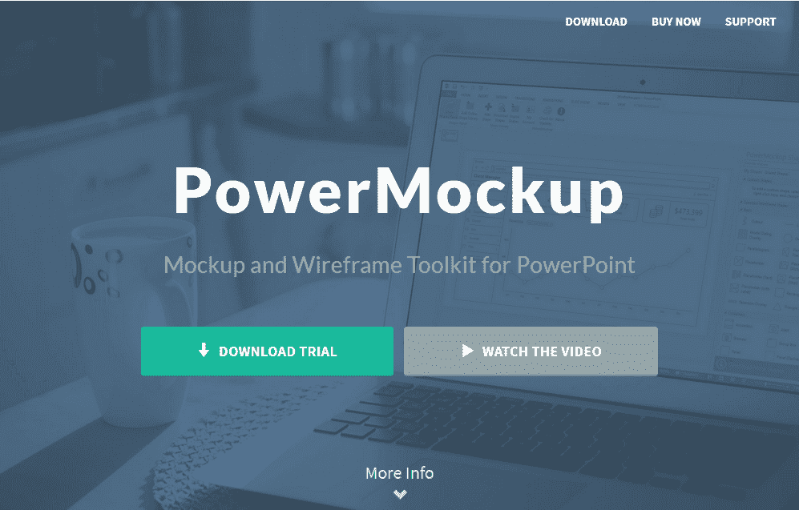
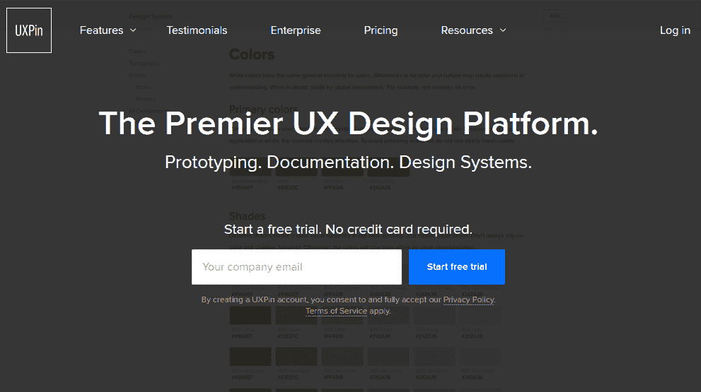
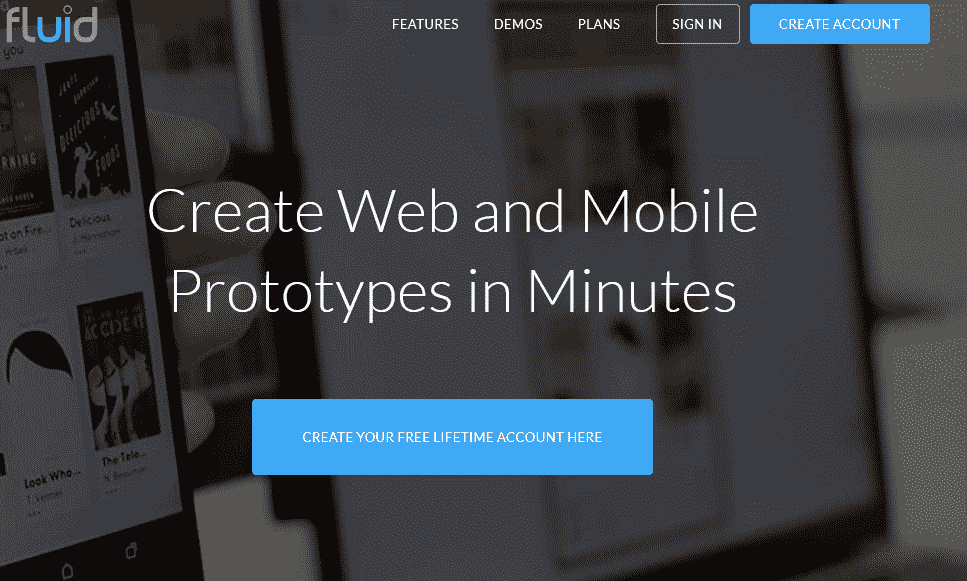
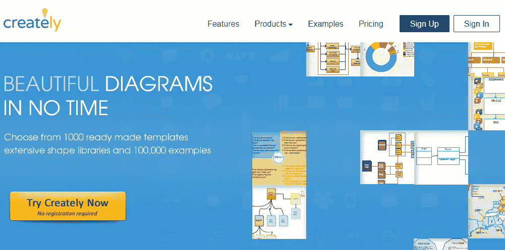

# 7 个顶级 UX/用户界面工具来增强您的设计

> 原文：<https://medium.com/swlh/7-top-ux-ui-tools-to-enhance-your-designs-571c44414729>

创意设计因其在数字产品设计的成功中发挥的关键作用而受到称赞，因为吸引访客需要的不仅仅是美学或结构化布局。

乌克兰的 UX/UI 设计师 Leila 强调“一个网站设计元素的有效性在巩固其成功中扮演着重要的角色”

UX(用户界面)设计抓住了用户体验，这是基于用户在一个网站或应用程序中导航的便利性。它指的是用户可以轻松自如地浏览数字产品，而不会感到困惑或沮丧。

UX(用户体验)关注“*”用户是否轻松实现了他们的意图，他们是否愿意回到网站或光顾该数码产品。*“简而言之，UX 帮助用户从数字产品中获得终极满足感。

为了实现理想的 UX，设计师需要关注用户界面设计。一个结构良好的用户界面，以用户为中心，吸引眼球，通过激活用户对产品的潜意识来吸引用户。

这里列出了 7 大 UX/用户界面工具，它们将有助于增强你的设计，并给用户带来他们所寻求的非凡体验。

# **1。溢出**

一个好的设计是通过一个高效的工作流程将最终用户的整个旅程从头到尾连接起来，从而与最终用户产生共鸣。

设计师应该知道一个有效的 UX/用户界面不会包含太多会导致用户失望的零散的过程。

为了使任何设计变更与设计流程保持同步，设计师必须将用户流程图放在手边。

为了实现这一过程， [Overflow](https://overflow.io) 是一款专为设计师打造的工具，有助于确保无缝的用户流程图，可以方便地集成到任何设计中。

# **2。梅森**

应用程序和网站等数字产品的设计者通常在开始开发实际产品之前，利用原型和模型来感受最终的设计。

尽管有这种原型制作过程，但模型可能会导致延迟并产生开销，从而减慢设计过程。

为了解决这些问题， [Mason](https://www.trymason.com/) 提供了一个简单的可视化界面，设计师可以依靠它来提供一个简单的数字设计方法。

Mason 还允许设计师在 builder 中轻松访问他们的设计。凭借其卓越的设计精度功能，无需一行代码即可轻松将设计部署到生产中。

由于原型有时会导致设计师在实际设计中错过目标，梅森因其允许设计师实时构建应用程序或设计网站的有效性而受到称赞。

梅森还使过程更容易和更快，因为与原型相关的不必要的质量保证检查被取消。

这减少了时间和管理费用，使设计过程负担得起和可及。

有了 Mason，团队项目变得易于管理。

# **3。动力模型**

[PowerMockup](https://www.powermockup.com) 允许你为网站和应用程序创建交互式和可共享的设计模型。其广泛的设计元素与 PowerPoint 的演示构建功能相结合，可以开发出有效的原型。

PowerPoint 和 PowerMockup 携手构建令人惊叹的原型，因为它们利用了各自库中的图像和设计元素。

# 4. **UXPin**

当设计者为开发就绪的设计创建原型时，他们通常被迫拿出手动文档。

UXPin 是一个自动化原型制作过程和获得有效反馈的伟大工具。

UXPin 允许设计团队在开发最终产品之前设计、协作和评估原型。

它的工作原理是生成开发人员在设计各种项目时使用的必要数据，并确保原型与项目的设计元素同步。

# **5。视觉检查员**

对于 UI 设计师来说，运行一个实时网站是一个很好的方法，可以确保在应用程序的设计和开发过程中出现的任何界面问题都在部署之前得到解决。

[视觉检查器](https://www.canvasflip.com/visual-inspector/)工具帮助设计人员快速轻松地实现这一目标。让软件运行不需要编码或复杂的技术技能。

可视检查器可以处理任何网站模板— HTML、WordPress 和其他模板。

# **6。流体界面**

凭借其针对 web 和移动应用的大量设计功能， [Fluid UI](https://www.fluidui.com) 让 UX/UI 设计团队的合作成果丰硕。

它结合了实体模型、线框和原型来构建高质量的设计。

Fluid UI 利用实时聊天和交互式视频演示来促进团队协作，从而加快原型和设计流程。

UI 设计者也可以共享为他们的产品设计构建更好的原型所必需的注释和注解。

# **7。创造性地**

[Creately](https://creately.com) 是一款可以让你自信地创建图表和流程图的软件。您可以轻松地实时构建流程图、网站地图、线框和更多设计。

借助 Creately，UX 的设计师们可以在使用该软件的内置协作机制实时管理设计时，共同设想一个完整的设计流程。

这使得设计团队可以不受地理位置的限制，在项目上进行协作。

**最终拍板**

虽然你可以单独使用上面的 UX/UI 工具来提供一个动态的方法来增强你的[设计过程](https://www.liveedu.tv/guides/design/)，但是使用多个工具可能会产生更好的结果。

此外，由于每种工具都是独一无二的，所以您应该选择最适合您的设计需求的工具。

以上 UX/UI 设计工具中，你喜欢用哪一个？

有没有其他工具漏掉了这个列表？

请在下面分享你的评论。

## 这篇文章发表在 [The Startup](https://medium.com/swlh) 上，这是 Medium 最大的创业刊物，有+ 375，985 人关注。

## 订阅接收[我们的头条新闻](http://growthsupply.com/the-startup-newsletter/)。

