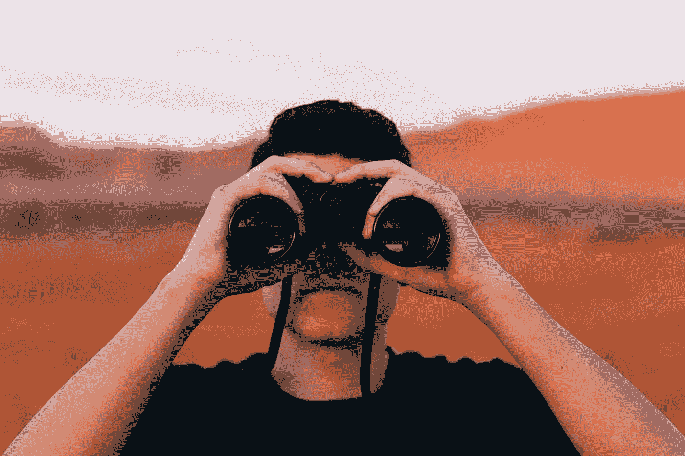
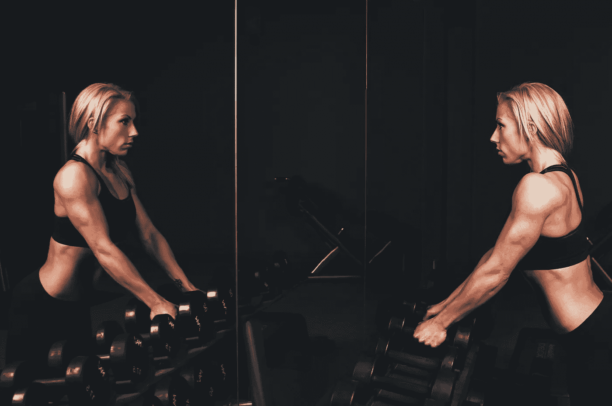

# 加速你人生目标的 7 条独特规则

> 原文：<https://medium.com/swlh/7-unique-rules-for-accelerating-your-lifes-purpose-6f9e59884>

Photo by [Nicolas Hoizey](https://unsplash.com/photos/-4trKf0Kbow?utm_source=unsplash&utm_medium=referral&utm_content=creditCopyText) on [Unsplash](https://unsplash.com/search/photos/accelerate?utm_source=unsplash&utm_medium=referral&utm_content=creditCopyText)

我被解雇了。

我被骗过(两次)。

我带着我能装进车里的财产和几百美元的银行存款(又一次，两次)穿越了整个国家。

我工作的地方一夜之间就被烧毁了。

在我的生活中，无论是否在我的控制范围内，我都有很多次不得不按下“重启键”，重新开始我的生活。有时候，当我重新开始时，我有很多资源可以自由支配。很多时候，我都处于许多人认为的起步资源的劣势。

随着时间的推移，有一件事始终如一。

> 我坚持下来了。

通过这种保存和恢复，我发现了一些让我在错综复杂的生活障碍中前进的东西。

以下是我的改变你生活的 7 条规则(尽管我确信，随着生活的发展，会有更多的规则)。

# **明白你是孤独的。**

Photo by [Evan Kirby](https://unsplash.com/photos/TFATaOllUC8?utm_source=unsplash&utm_medium=referral&utm_content=creditCopyText) on [Unsplash](https://unsplash.com/search/photos/explorer?utm_source=unsplash&utm_medium=referral&utm_content=creditCopyText)

这个一开始对我来说很难。

我不想接受这个事实。

当我 23 岁，第一次穿越这个国家(从芝加哥到波士顿)时。我和父亲一起旅行。

> 我父亲是个聪明的人。

他高中勉强毕业，一毕业就被迫在父亲的工厂工作。

**总结他的一生，他没有太多的选择，却为自己和家人充分利用了这一切。**

在我们开车的过程中，他不断提供宝贵的建议。有一件事让我印象深刻，并且我一直保持着密切的联系

> “你在这个地球上是孤独的。你妈妈和我会比任何人都更支持你。然后是你的兄弟姐妹，也许有一天你会有一个爱人和自己的家庭。不过，也许值得注意的是，你的脑袋里只有你一个人。你知道你的梦想，你知道你的渴望，你知道你的恐惧。要知道你是真正孤独的，让这让你自由。”

一开始还挺吓人的。然而，一旦我沉浸其中，它就真的让我自由了。不是虚无主义的。我

仍然保持生命的神圣和它所有的奇迹，以及它是多么珍贵的礼物。这有助于让人们认识到，被他人的想法和观点左右是多么愚蠢，以及作为一个人你应该做些什么(即成功的定义)。

# **弟子等于自由。**

Photo by [Scott Webb](https://unsplash.com/photos/Vn39uEkX00s?utm_source=unsplash&utm_medium=referral&utm_content=creditCopyText) on [Unsplash](https://unsplash.com/search/photos/lifting-weights?utm_source=unsplash&utm_medium=referral&utm_content=creditCopyText)

这是我从乔科·威灵克那里借来的。

让我们打开它一点。

什么是*自由？*

一般人都知道。

可能是财务自由，也可能是自由时间。

到那里需要做些什么？

*   当你想要财务自由的时候，你必须做出决定，这通常需要高度的自律(比如，注意开销，努力工作，建造东西等等)。
*   当你想要自由时间的时候，再次强调，纪律是必要的(你需要在完成工作、早起、按时睡觉等方面遵守纪律，这样你才能腾出时间)。

这似乎有悖常理:**你很死板，遵守规则，这怎么会带来自由？嗯，当你坚持一个有纪律的方法，它会在你的一天和生活中打开新的大门。**

# **在杂货店购物时，只停留在商店的外围购买。**

Photo by [William Felker](https://unsplash.com/photos/fqkrXYMosT4?utm_source=unsplash&utm_medium=referral&utm_content=creditCopyText) on [Unsplash](https://unsplash.com/search/photos/produce?utm_source=unsplash&utm_medium=referral&utm_content=creditCopyText)

有时更好的生活和建筑元素依赖于生理学方法。

在杂货店购物时，坚持外缘，你会发现除了来自动物或地球土壤的天然产品外，什么都没有。

这是人类应该吃的东西。

过道里有氢化油、加工过的垃圾食品、糖果和食物，这些通常会导致你身体的毁灭。

粘在外缘。

# **克制自己不说闲话。**

Photo by [rawpixel](https://unsplash.com/photos/pVPXeT7rIu0?utm_source=unsplash&utm_medium=referral&utm_content=creditCopyText) on [Unsplash](https://unsplash.com/search/photos/teeth?utm_source=unsplash&utm_medium=referral&utm_content=creditCopyText)

不惜一切代价。

流言蜚语和抱怨只会让你的生活陷入困境。

你谈论的事情只会延续仇恨和愤怒，而不会提供任何解决方案。

当你和别人谈论你和他们之间的问题时，你可能会陷入困难和尴尬的境地。

但是，您可能会找到解决方法。一般来说，你会从个人身上学到一些东西。你也在练习古老的正念练习，并保持自我远离。

# 承认你的弱点。

Photo by [Yoel Kamara](https://unsplash.com/photos/B3ruHb3c8jk?utm_source=unsplash&utm_medium=referral&utm_content=creditCopyText) on [Unsplash](https://unsplash.com/search/photos/small-muscles?utm_source=unsplash&utm_medium=referral&utm_content=creditCopyText)

这一条对很多人来说可能很难。

没有人想发现他们的不足之处。然而，这正是人类前进的动力。

想想所有的技术进步，如果我们不深入自己的不足之处，我们就不会发展起来。

实践这一点的一个好方法是提出问题 ***“我怎样才能在[空白]方面做得更好？”***

*   这可能属于你的工作范围。
*   可能是和你的爱人交谈，建立关系。

经常获得反馈，看着自己成长。

# **迈出第一步，行动起来。**

Photo by [Natalya Letunova](https://unsplash.com/photos/LKs42QOVRQ0?utm_source=unsplash&utm_medium=referral&utm_content=creditCopyText) on [Unsplash](https://unsplash.com/search/photos/first-step?utm_source=unsplash&utm_medium=referral&utm_content=creditCopyText)

不管那是什么。

对我来说，这就是写作。

我总是害怕把自己放在那里(现在也是)。

一旦你把一只脚放在另一只脚的前面，接下来的几步会变得更容易，而且从那时起会变得更容易。在日复一日、周复一周、月复一年的过程中，你会看到你已经从第一步走了多远，有时它可能会击倒你。

在你的内心深处，有什么是你知道自己需要开始却没有开始的？

这才是你应该倾听的声音。

# 做让你兴奋的事。

Photo by [rawpixel](https://unsplash.com/photos/cvmMRpS25LY?utm_source=unsplash&utm_medium=referral&utm_content=creditCopyText) on [Unsplash](https://unsplash.com/search/photos/smile?utm_source=unsplash&utm_medium=referral&utm_content=creditCopyText)

*   那是收集和交易*魔法的聚会*扑克牌吗？
*   它在制作宇宙手工珠宝吗？
*   正在学习成为一名宇航员吗？

坦白说，我不在乎它是什么。

找到让你早上起床兴奋的事情，并朝着这个目标努力。

> 我们中有太多的人在我们讨厌的工作上浪费时间，我们的生活因此而痛苦。

这需要时间。这需要艰苦的工作。这需要勇气和毅力，但从长远来看，如果你做出好的作品，市场会为自己说话。

做让你兴奋的事！

# 还有谁想自己当老板？

## 我提供给你一个经过测试和验证的 6 部分指南，它包含了强大的概念，可以帮助你识别、规划、成长和完成你的创造性追求。

# [> > >在这里获得免费指南< < <](https://mailchi.mp/4b982beed325/free-6-step-course)

## 学到了什么？按住👏说“谢谢！”并帮助他人找到这篇文章。还评论！

## 这篇文章发表在《T4》杂志《创业》(The Startup)上，这是 Medium 最大的创业刊物，拥有 348，974+读者。

## 在这里订阅接收[我们的头条新闻](http://growthsupply.com/the-startup-newsletter/)。

