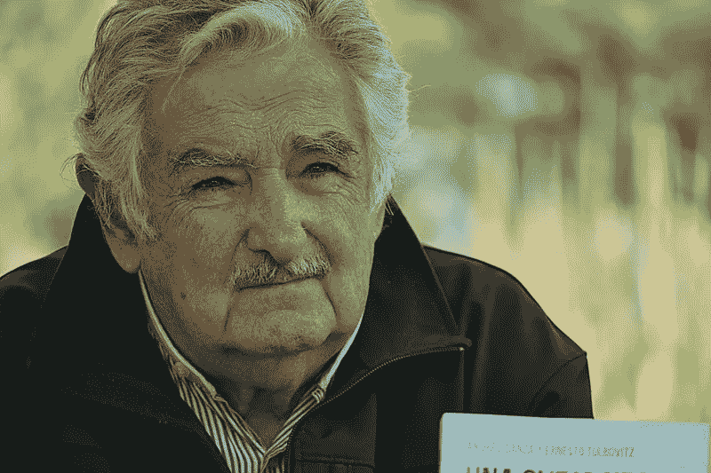
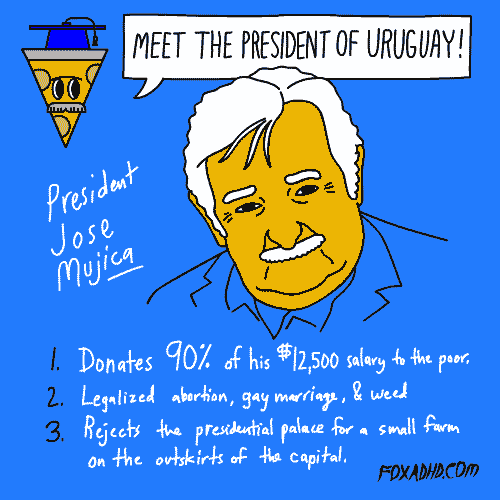

# 乌拉圭总统的 7 条宝贵人生经验

> 原文：<https://medium.com/swlh/7-valuable-life-lessons-from-the-president-of-uruguay-e91600dcd0fc>

## 以及为什么永远不会太晚

photo: ProtoplasmaKid

他从蹲了几年监狱变成了乌拉圭总统。乌拉圭前总统何塞·佩佩·穆希卡是一个非凡的人。
当选乌拉圭第 40 任总统后，何塞·穆希卡宣布他将把 90%的月薪捐给慈善机构。
他拒绝搬到总统府，而是呆在自己的两居室农舍里，和妻子住在一起。他甚至保留并驾驶着他的 1987 年大众甲壳虫。

虽然他的政治议程是有争议的，但这个人有许多宝贵的人生经验可以教给我们所有人。穆希卡的生活理念和他的个人生活方式，是当今世界罕见的景象。
话不多说，下面是我们都应该从何塞‘佩佩’穆希卡身上学到的七条宝贵的人生经验:

# 1.找到你的激情并保持激情。

> “我在田间劳作谋生，然后投身于变革的斗争，以改善我所在社会的生活。”

宇治嘉有两个主要的激情:对自然的热爱和联系，以及通过平等改善他人生活的真诚愿望。他是这片土地上的人，也是人民中的人。

1935 年出生于一个农民家庭的穆希卡几乎被认为会爱上在田间劳作。他 13 岁时成为国家党的积极分子。后来，他成为游击队组织“图帕罗斯”( Tupamaros )( T10)的领导成员，该组织在乌拉圭军政府成立前一年反对乌拉圭政府。那些年，穆希卡多次入狱，总共在监狱里度过了 13 年。乌拉圭恢复民主后，他于 1985 年获释。
穆希卡接着组建了一个左翼政党，并于 1999 年成为参议员。六年后，他成为乌拉圭的农业部长。70 岁时，穆希卡终于能够将他的两种激情结合起来，并在日常生活中付诸实践。

> “我的目标是在乌拉圭减少一点不公正。帮助最脆弱的人，并留下一种政治思维方式。”

2009 年，他赢得选举，成为乌拉圭总统。为了实现他的目标，穆希卡将乌拉圭的最低工资提高了 50%以上。他把大部分薪水捐给了慈善机构，尤其是那些支持单身母亲的慈善机构。*“对我来说，这不是牺牲。这是一种责任，”他声称。他反对不平等的斗争仍在继续。他通过法律使堕胎和同性婚姻在他的国家合法化。他实现了他一直想要的——他给了每个人以自己的方式生活的机会。*

它教导我们从小学习和培养激情的重要性。但仅此还不够。无论如何，你必须追求你的激情并坚持下去。通过追随自己的激情，尤其是在艰难时期，穆希卡得以实现自己的梦想。

# 2.用你自己的方式去做！

> “没有什么短期的。胜利就在眼前。”

ujica 可能为世界上许多人树立了一个伟大的榜样，但他多年来一直是一个武装组织的成员。他承认抢劫了银行。*“我没有为自己抢劫。我征用资源是为了斗争，”*他说。

那么，这里的教训是什么？
无论你在追求什么，无论是艺术作品还是更传统的作品，都没有正确的方法去做。所有那些给你灵感的人——他们都迈出了前无古人的第一步。他们走自己的路。
是的，他们失败了很多，但他们成功的程度超乎他们的想象！

这里举个小例子:
你想烤香蕉松饼。你寻找别人遵循和推荐的好食谱。然后你按照书上的步骤来做。你可能会得到不错的香蕉松饼，但它们会有你自己的签名吗？它们尝起来会像独特的香蕉松饼吗？大概不会。如果你发挥创造力，增加情趣，你会得到不同的结果。最初几批可能会很恶心，但最终，你的香蕉松饼会有天堂般的味道。最重要的是——松饼将真正属于你。所以，勇往直前吧——创造你自己的生活食谱。没有对错之分。

# 3.谦虚一点

> “我有一种生活方式，不会因为我是总统而改变。”

即使当他成功成为总统，穆希卡仍然保持谦逊。

> “主席是一位高级官员，被选举来履行一项职能。他不是国王。不是神。他不是一个无所不知的部落巫医。他是公务员。”

我们经常把卑微这个词和金钱联系在一起，但不仅仅是这样。“乌拉圭总统”的头衔并没有定义何塞·穆希卡。
**尊重是需要赢得的。如果你有了一个新头衔，不管是“富人”、“总裁”还是“首席执行官”，这并不会让你比以前多一点点价值。你通过拥有高质量的价值观并坚持这些价值观来赢得尊严。当你赢得真正的尊重时，那只是因为你本来就是这样的人——所以你没有理由不保持谦逊。**

# 4.如果你做你喜欢的事情，钱是无关紧要的

> “我和小不点住在一起。只是必要的。我不受物质的束缚。为什么？所以我可以有更多的空闲时间。做什么？我所爱。”

我们生活在一个金钱似乎是我们唯一能得到的回报的世界里。我们以名誉、权力和金钱来衡量成功和 T2。但事实是——当你做你真正喜欢的事情时，金钱是无关紧要的。

> “我赚的比我需要的多，即使不够别人用。”

由于 90%的薪水都捐给了慈善机构，穆希卡的月薪只有 775 美元(大约是乌拉圭的平均月薪)。
*“我可以很好地生活在我所拥有的一切中，”他谈到他的旧车和他那简朴的两居室的房子。*

几乎不可能脱离我们物质主义的生活方式。我的意思是，有一辆新的宝马肯定更好。但是，这是真的吗？
**我们内心深处有东西坏掉了**。我们每天接触到成千上万的商业广告，我们真的相信消费对我们有好处。但是如果一辆车是带你从 A 地到 B 地的工具，那你为什么要奴役自己去买一辆花里胡哨的呢？
穆希卡大半辈子都在练习自我意识，甚至在监狱里也是如此。他知道他生活方式的任何改变都只会分散注意力。

> “当你买东西时，你不是在付钱。你是在用你不得不花在挣钱上的时间来支付。”

如果你正在读这篇文章，并且在想:“嗯，但是如果有一个更大的房子或者一辆新车就好了”，那么我劝你花点时间考虑一下。这真的是你的想法吗？对真实的你有意义吗？

# 5.只有当你认为自己贫穷时，你才是贫穷的

> “穷人是那些只为保持昂贵的生活方式而工作，并且总是想要越来越多的人。”

“世界上最穷的总统。”毫不奇怪，穆希卡被全球媒体贴上了这样的标签。他的生活方式与我们理想的完全相反。在我们看来，他的生活方式既无聊又空虚。

穆希卡说:“那些这样描述我的人真可怜。”。我们狭隘的观点是:有更多的钱=更好的生活。但是这里有一个人，他拒绝接受他每月 12，000 美元的收入。
这不合逻辑。如果你中了彩票大奖，你会放弃吗？

> “我不是提倡贫穷。我在倡导清醒。”

我们对贫穷这个词的定义是…嗯，贫穷。我们让它取决于一个人拥有的钱的数量。你有很多=富有。你几乎没有=贫穷。但事实是——你可以是一个有很多钱的富人，也可以是一个有很多钱的穷人。或者正如何塞·穆希卡(Jose Mujica)明智地说:*“我对穷人的定义是那些需要太多的人，因为那些需要太多的人永远得不到满足。”*

# 6.你自由了

> “自由就是有时间生活。”

除非你自己设定，否则你的自由是无价的。
我们总是自由行动，自由说话。我们生来就有自由的精神。只有我们能放弃我们自己的自由——当我们不再珍视它的时候。

> “当我有时间花在我喜欢的事情上时，我是自由的，这些事情对你和她来说可能是不同的。这就是自由。”

如果你想担心其他人对你的看法，那很好。只是要意识到你为此付出的代价——你的自由。
**如果我们想获得真正的自由，我们就必须意识到**。意识到我们的选择。意识到我们的激情。我们必须日复一日地练习我们的觉知，并不断地检查我们是否忽略了我们的自由。

你总是有自由选择的权利。不管一个决定有多小，或者情况有多棘手，选择永远是你的。“我可能看起来是个古怪的老人……但这是自由的选择。”

# 7.少即是多

> “如果你没有很多财产，那么你就不需要像奴隶一样工作一辈子来养活他们，因此你有更多的时间留给自己。”

事实上，大多数过着极简生活的人这样做仅仅是因为他们反对物质生活。这对他们来说是行不通的，因为真正的简约生活是不能强迫的。
我们的生活建立在消费的基础上。我们这样做是因为我们不知道任何其他方法。这似乎是我们通往幸福的唯一大门。买新鞋，周末外出……
我们从未被赋予任何探索内心世界的工具。从来没有人教我们如何通过追随我们的激情和本能来获得幸福。

我们应该渴望过真实的生活。为了最少地生活，我们需要支持我们的内心世界。一方面，这可能是一个大型画廊和一系列艺术用品，另一方面，它可能是一台高端电脑。
**没有公式。我们都是独特的。**

***少花*** 时间在无意义的事情上 ***多花*** 时间专注于你的激情。

# 永远不会太晚

> 幸福的秘密在于按照自己的想法去生活。和你带进去的人说话。它是我们带进坟墓的伴侣。

现在，82 岁的穆希卡仍然是那个充满激情的人。他卸任后的愿望是在自己的农场里为年轻人建立一所农业学校。他证明了追求你的激情永远不会太迟。

何塞·穆希卡的影响和他树立的榜样在未来的岁月里不会被忘记。这无疑是他真正的遗产。

> 如果你觉得那是你想做的，就一起鼓掌👏

# **感谢阅读！更多帖子请** [**关注我**](/@saaroron) **。**

## 这篇文章发表在 [The Startup](https://medium.com/swlh) 上，这是 Medium 最大的创业刊物，有 314，551+人关注。

## 在这里订阅接收[我们的头条新闻](http://growthsupply.com/the-startup-newsletter/)。

