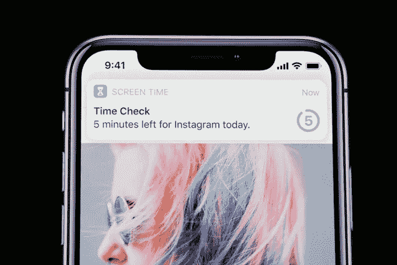
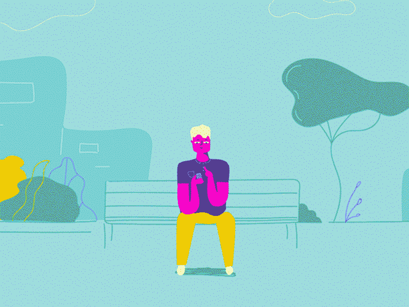
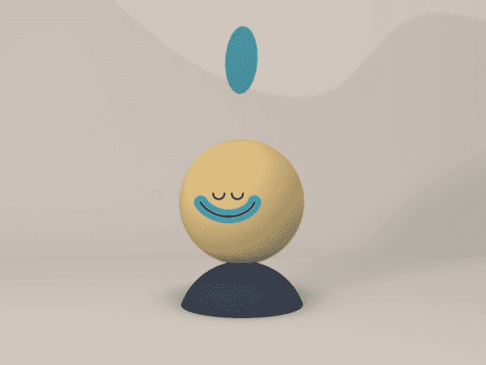
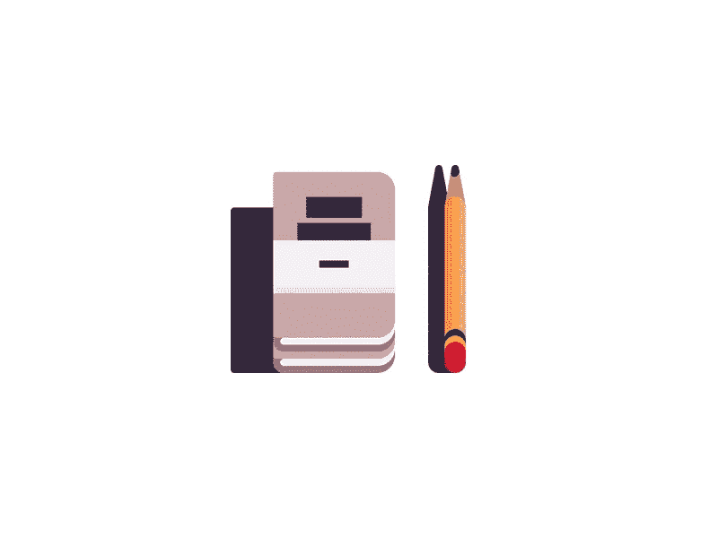
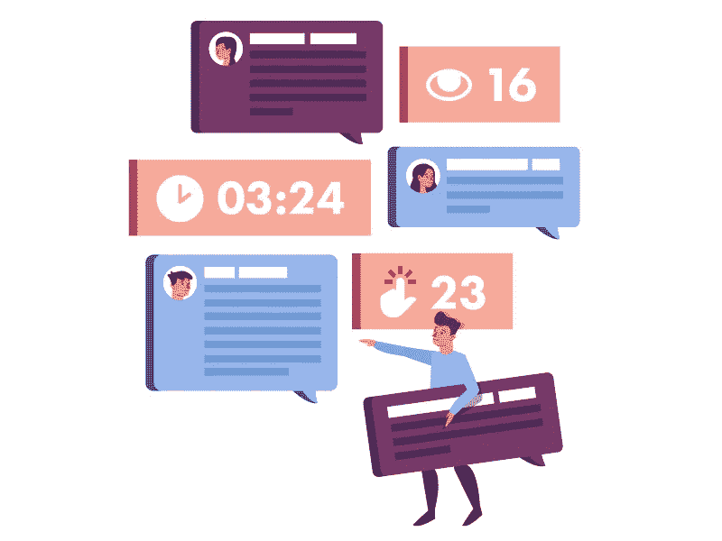
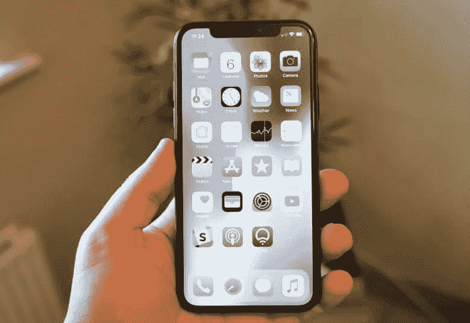

# 抑制智能手机成瘾的 7 种简单方法

> 原文：<https://medium.com/swlh/7-ways-to-curb-your-smartphone-addiction-and-increase-productivity-d295fe892fc>

Getty Images

## 说起来容易做起来难。但是试一试。

研究表明，我们过度使用 iPhones 平均每天使用 80-150 次。

尽管[91%的千禧一代](https://www.qualtrics.com/millennials/)报告称他们与自己的设备保持着健康的关系，但这是否是一个健康的习惯仍存在争议。接受调查的千禧一代表示，他们的设备创造了更好的工作生活平衡，有助于更好的沟通和建立关系。

显然，频繁使用我们的设备有很多好处，但也有不好的一面。

研究表明，随着我们越来越依赖技术，我们的智力、注意力水平和社交技能会减弱。事实上，仅仅是智能手机的存在，我们专注于一项任务和解决问题的能力就会下降。

但是不要因为过度使用智能手机而自责。事实是，你的智能手机成瘾可能不是你的错——这些设备的设计者因使用技术让你尽可能长时间地粘在屏幕上而获得奖励。

幸运的是，还有希望。如果你想改善你和手机的关系，这里有一些方法可以让你重新掌控自己的时间和注意力。

# 1.跟踪您的使用情况

沉迷于智能手机？有一个应用程序可以解决这个问题。

具有讽刺意味的是，你可以尝试用另一个应用程序来避开令人上瘾的智能手机应用程序。虽然不理想，但有像 [SPACE](https://itunes.apple.com/us/app/space-break-phone-addiction/id916126783?mt=8) 和 [Moment](https://www.google.com/url?sa=t&rct=j&q=&esrc=s&source=web&cd=2&cad=rja&uact=8&ved=0ahUKEwiZ8b-n66bbAhVNnlkKHXCkDakQFgg1MAE&url=https%3A%2F%2Fitunes.apple.com%2Fus%2Fapp%2Fmoment-screen-time-tracker%2Fid771541926%3Fmt%3D8&usg=AOvVaw2ss_A24pIpRIxjqaS5G8-f) 这样的应用程序可以通过监控智能手机的使用和设置限制来帮助你找到个人手机生活的平衡。

Oh, also, [Apple](https://www.inc.com/yazin-akkawi/apples-newest-ios-update-is-a-lame-attempt-to-help-you-use-your-iphone-less.html) and Google are making their own versions as part of OS updates.

# 2.停止滚动

许多最受欢迎的移动应用程序(脸书、Instagram、Pinterest 等)都设计了无限滚动功能，你可以在其中浏览无穷无尽的信息。

然而，无限滚动很容易忘记时间。没有什么比未知更能吸引我们的注意力了。源源不断的社交媒体帖子激励你继续寻找惊喜的元素；寻找吸引人的、引人入胜的和娱乐性的东西。我们的大脑无法预测接下来会发生什么，就像一个松散的老虎机，无限卷轴让你快速进入心理学家所说的[可变奖励](https://www.google.com/url?sa=t&rct=j&q=&esrc=s&source=web&cd=1&cad=rja&uact=8&ved=0ahUKEwiYkcbFkLDbAhXLi1QKHVm1AcAQFggnMAA&url=https%3A%2F%2Fwww.nirandfar.com%2F2012%2F03%2Fwant-to-hook-your-users-drive-them-crazy.html&usg=AOvVaw02jZAkjhJP715rq_y4d0AJ)。

虽然没有社交媒体应用程序很难生活，但尝试删除无限滚动的应用程序，看看你可以赚回多少时间。

Hilarious GIF by [Alon Sivan](https://dribbble.com/AlonSiv)

# 3.平静你的心

当你收到社交媒体通知时，会有一种非常真实的欣快感，比如有人喜欢你发布到 Instagram 或脸书的照片。这些时刻会引发大脑释放多巴胺，这是一种产生愉悦感的化学物质。这是我们大脑奖励系统的重要组成部分，这就是为什么它也被指责为上瘾的原因。

冥想、瑜伽、锻炼和其他正念活动已经被证明可以产生多巴胺的自然释放，减少对手机提供的多巴胺的渴望。

The guys at [Headspace](https://www.instagram.com/p/BU2gHPzFuFd/?taken-by=headspace) know what’s up.

# 4.使用实用应用的实体版本

是的，把所有东西都放在口袋里很方便。你的智能手机几乎完全减少了对计算器、日历、相机、笔记本、闹钟和许多其他东西的需求。

我们以前都经历过这种情况:你解锁手机查看天气或做笔记，然后你知道你已经在 Instagram 上呆了 20 分钟。为了避免这个问题，尝试用物理工具代替尽可能多的数字工具。

例如，使用一个真正的闹钟(睡觉时把手机放在够不着的地方)可以帮助你避免在睡觉前或醒来时浪费时间。携带实体笔记本和笔做笔记。阅读平装本书籍，避免电子版本。

关键是尽量避免解锁手机，防止无意中被拉入数字漩涡。

Sometimes I open my iPhone to make an Evernote and somehow end up spending 30 minutes on Instgram 🤔 | Photo by [Kevin Yang](https://dribbble.com/eatsleepvector)

# 5.在朋友的帮助下度过难关

和任何上瘾的情况一样，康复的第一步是承认你有问题。

向你周围的人承认你想减少智能手机的使用可以建立一个必要的反馈系统。

请他们追究你的责任。在家庭聚会中，当你滚动屏幕时，你可能不会注意到，但其他人会注意到。你的朋友和家人可以叫你出去，带你回到当下。

Admittedly, I need one of these.

# 6.关闭所有与真人交流无关的通知

我们的设备旨在增加我们与其他人的联系；所以保持这种状态。关闭应用程序的任何通知，除非它们提醒你同事、朋友或家人可能需要你的实时关注。

你甚至可以考虑把手机上的社交媒体应用全部删除，只通过电脑访问。不断的朋友和家人更新可以等到以后，我保证。

Notifications give me anxiety 😣 | Photo by [Maryanne](https://dribbble.com/maryannemade)

# 7。 **把你的手机变成灰度**

这是人类技术中心的联合创始人特里斯坦·哈里斯的一个受欢迎的建议。

研究表明，颜色与情绪和优先事项联系在一起——尤其是那个控制我们很久的红色小通知泡泡。把你的手机调成黑白可以减少你查看新通知的冲动，这种冲动会把你拉进无限滚动的漩涡。

Settings > General > Accessibility > Display Accommodations > Color Filters

*原载* [*此处*](https://www.inc.com/yazin-akkawi/7-ways-to-curb-your-smartphone-addiction-right-now.html) *。*

## 这篇文章发表在 [The Startup](https://medium.com/swlh) 上，这是 Medium 最大的创业刊物，拥有 338，320 多名读者。

## 在此订阅接收[我们的头条新闻](http://growthsupply.com/the-startup-newsletter/)。

