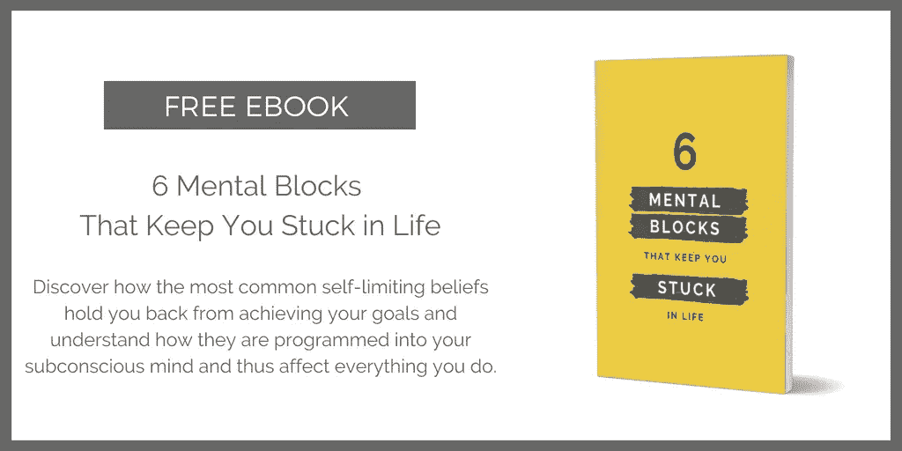

# 提升心态的 7 种方法

> 原文：<https://medium.com/swlh/7-ways-to-level-up-your-mindset-5395fd103310>

## 改变你的想法来改变你的世界。

Photo by [Max Ostrozhinskiy](https://unsplash.com/@maxon?utm_source=unsplash&utm_medium=referral&utm_content=creditCopyText) on [Unsplash](https://unsplash.com/?utm_source=unsplash&utm_medium=referral&utm_content=creditCopyText)

我坚信成功和幸福都与心态有关。你的心态和信仰体系影响着你生活中的一切，从你的想法和感受到你对周围世界的行为和反应。

为了实现你的目标，你的心态需要与你的抱负相匹配，否则，它可能会阻碍你到达你想去的地方。

## 这里有 7 种有效的方法可以提升你的心态:

# 1.改变你的自言自语

你和自己的对话是你心态的直接反映。如果你告诉自己“我不够好，无法实现我的梦想”，你的想法会创造你的现实，你的心态会阻止你拥有你想要的生活。要升级你的心态，把消极的自我对话变成一次授权演讲。听起来很老套，但是告诉自己“我能行”或者“我能行”，真的很有效。

# 2.改变你的语言

在改变你内心的思想对话和你正在给自己讲的故事之后，改变你和其他人说话的方式。避免使用“我总是这样”或“我总是这样做”这样的短语来鼓励成长心态。此外，养成谈论生活中顺利的事情的习惯，而不是抱怨和谈论你的问题。这将鼓励富足的心态，而不是恐惧和匮乏。

# 3.确定你需要的心态，并表现得好像

挑一个你想实现的目标，问自己:“我需要哪种心态来实现这个目标？”以及“成功实现这一目标的人拥有什么样的心态？”。

例如，健康的人可能会有这样的想法:“我喜欢照顾我的身体，用全天然食物滋养它，每天锻炼。”。如果你的目标是保持健康和健美，就表现得好像你已经有了一个健康和健美的人的心态。这样，你基本上是在欺骗你的大脑采用一种新的心态，并用行动来强化它。

Get it here: [http://bit.ly/mental-blocks](http://bit.ly/mental-blocks)

# 4.学习和应用

阅读伟人的著作，理解并采纳他们的思想。阅读关于思想和大脑如何工作的书籍。通过在线课程、活动和辅导向心态专家学习。

以下是我最喜欢的一些心态资源:

*   [心态](https://www.amazon.de/Mindset-Updated-Changing-Fulfil-Potential/dp/147213995X/ref=sr_1_1?ie=UTF8&qid=1526551191&sr=8-1&keywords=growth+mindset)作者卡罗尔·德韦克了解成长心态
*   从 [Gabrielle Bernstein](https://gabbybernstein.com/) 到采取富足的心态和顺应生命的流动
*   托马斯·奥蓬在《媒介》上写的关于改善你思维的金块
*   丹尼斯·德特的[在线课程](https://luckybitch.com/)提升你的金钱心态

# 5.和符合你理想心态的人在一起

想升级你的金钱和成功心态吗？开始和那些非常成功的人交往，他们似乎随时都有大量的金钱在流动。当你看到一种新的心态已经在为其他人工作时，就更容易接受这种心态。了解他们如何思考，并调整他们的日常习惯，以符合他们的心态。

# 6.创造新的习惯来支持你的心态改变

将强大的习惯融入你的日常生活，帮助你改变心态，用行动强化你的思维。如果你正从“固定的”心态升级到“成长的”心态，安排好学习的时间，开始记下你每天的学习和成就。如果你正从“目的地”心态升级到“旅程”心态，练习保持正念，享受当下，庆祝小小的成功。

在我的免费备忘单中找到更多关于你创造梦想生活所需的 7 种心态转变:【http://bit.ly/dreamlifeshifts

# 7.跳出你的舒适区

如果你把自己置身于挑战你的处境中，你别无选择，只能随机应变，提升心态。它成为生存的必需品。

所以问问你自己“我能让自己处于什么样的情况下，需要我以更高的心态来运作？”。基本上，这个想法就是设计你的环境来训练你的大脑！

# 你准备好升级心态了吗？

获取我的免费电子书“让你困在生活中的 6 个心理障碍”。【http://bit.ly/mental-blocks 

Get it here: [http://bit.ly/mental-blocks](http://bit.ly/mental-blocks)

## 更多来自 Liz Huber 的报道:

 [## 今年让你的生活提升 10 倍的 8 种方法

### 这不是毫无意义的随机习惯的集合。

medium.com](/mind-cafe/8-meta-habits-to-make-2020-your-breakthrough-year-3dd00429cf3)  [## 在两个月内将我的教练业务从 0 美元增长到 6k+美元的 8 个残酷而诚实的教训

### 只要你相信，你想收多少就收多少

entrepreneurshandbook.co](https://entrepreneurshandbook.co/8-brutally-honest-lessons-from-growing-my-coaching-business-from-0-to-6k-in-2-months-8469abe98acd) 

## 这篇文章发表在 [The Startup](https://medium.com/swlh) 上，这是 Medium 最大的创业刊物，有 325，521+人关注。

## 订阅接收[我们的头条新闻](http://growthsupply.com/the-startup-newsletter/)。

