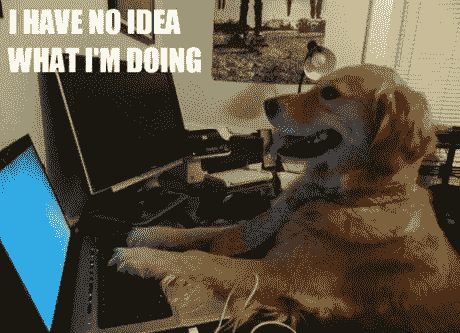
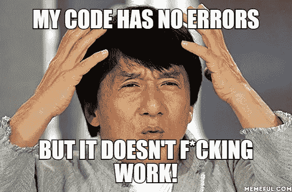
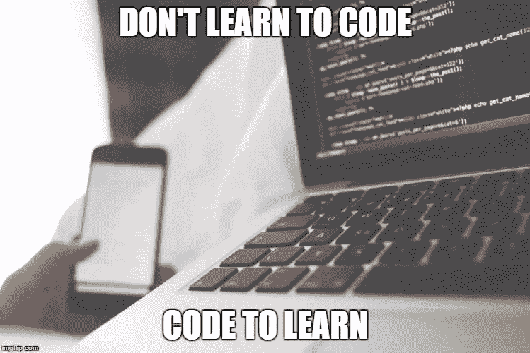
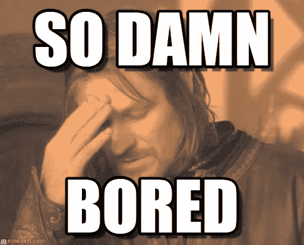

# 学习编码时保持动力的 7 种方法

> 原文：<https://medium.com/swlh/7-ways-to-stay-motivated-while-learning-to-code-536c81a0e390>

关于我你应该知道的几件事:我喜欢好的题外话，而且我很喜欢切题的比喻。哦，我的幽默感比林赛·罗韩前臂的血管还脏。在这篇博文中，我可能会无意中看到一些。我曾经试着保守秘密，但现在我接受了它会在我最意想不到的时候发生。只是微笑着点头。

学习编码？完成了，伙计。轻而易举地通过了培训，并立即得到了我的第一份开发工作。就像学骑自行车一样，不是吗？

没人说过。

当你学习编码时，这似乎是世界上最困难的事情之一。对许多人来说，这不仅仅是学习一项新技能的问题，这是一个适应全新思维方式的过程，在早期阶段，当计算机给你一个又一个错误时，你会觉得自己什么都做不好。消极的想法开始蔓延，你无疑会发现自己在质疑自己是否真的适合做这件事。

当你刚开始的时候，转变到一个新的心态的过程是非常困难的，所以这里有几个步骤可以让你的旅程变得轻松一些。他们为我工作，我希望他们也能为你工作。

# **1。品味小小的胜利。**

*‘在计算机的短暂历史中，没有人写过一个完美的软件。你不太可能是第一个。*安迪·亨特

在你开始学习编码之前，你可能想象自己是一个无所不能的编码之神，派出你的小类和方法奴才来执行你的命令，让你的程序服从你的意志。你笑着打开一瓶啤酒，观察你的劳动成果，这是一个用半个上午的工作建成的网站。通过编码训练营将是一件轻而易举的事情，在你签署你的第一个软件客户端之前，这只是一个时间问题。

粉碎这种幻想需要几分钟的时间。

从你开始写到现在已经四个小时了还弄不到这个@#！通过第一项测试。汗水顺着你的额头滴到你颤抖的手上，你的眼睛布满血丝，这可能是你的想象，但你认为你看到了月光从你的第一根白发上反弹回来。你开始编程前的记忆现在对你来说只是模糊的形状。你已经 26 岁了，你很确定在你看到这个项目完成之前，你会死在那张椅子上。

你没有主意了，所以你试着删除一个你认为有点不合适的冒号。你所有的测试都失败了，电脑着火了，你听到了远处的警报声。

抛开夸张不谈，你的大量时间将会花在从你的或别人的程序中找出错误上。所以当你解决了一个问题，庆祝一下！你在电脑上取得了成功！拍拍自己的背，犒劳一下自己，打 10 分钟乒乓球，喝杯咖啡，什么都行！这是你应得的！然后继续下一个问题，重复这个过程。

# **2。不要拿自己和别人比较**

*“永远不要拿你的糟糕表现和别人的亮点做比较。”*达纳·斯沃博达

你还记得你第一次去健身房是什么时候吗？我知道。我是一个瘦长的瘦高个，二头肌——蜷着一罐豆子，旁边是一个大光头混蛋在卧推一辆公共汽车。当我们中的一个显然已经练习多年，而另一个完全是初学者时，你认为让我们两个都参加举重比赛有多公平？

很明显，不会。由于人们的经验水平和编码知识更难衡量，你也不应该试图与他们竞争。

就个人而言，我在学校最强的科目是历史和英语。这些科目的工作内容围绕批判性思维、辩论以及如何解释和感知事物。然后我继续在大学学习历史。所以如果你想一想，我生命中的前 20 年是在学习一种完全不同于现在需要编码的思维方式。我的背景和技能不是没用，只是不是我现在需要的。这没关系。因此，如果我在学习一种全新的解决问题的思维方式上比其他可能已经拥有这种思维方式的人慢一点，我不会把它当成个人问题。

有些人的大脑更倾向于像计算机一样思考，有些人的背景迫使他们发展解决问题的技能(拥有汽车工程学位的人总是胜过拥有历史学位的人)，有些人只是练习得更多。不过没关系。他们不是你。你就是你。因此，衡量你自己的唯一标准是过去的你。如果你是一个比昨天更好的程序员，你做得很好。

# **3。请记住，您仍处于初级学习阶段**

似乎很明显，对吧？但是你会惊讶地发现，你经常会忘记自己仍然是一个完全的新手。更有经验的人正在跑马拉松，而你还处于婴儿阶段，试图学会自立。

如果你不是一个狂热的健身爱好者，想想你第一次尝试新事物的时候。你拿起一把吉他，期望成为下一个吉米·亨德里克斯，但现在，你的水平就像贝尔伦德一样，每当乐器放到他们手中时，他们就会发出惊叹声。当你第一次踏上足球场时，你想象自己是克里斯蒂亚诺罗纳尔多，在你的第一次触球击中你的脸之前，对方球员无法相信自己的运气，将球送入空门。

我们对最喜爱的运动员/音乐家的唯一记忆是他们已经练习多年的时刻。我们可以通过吉米·亨德里克斯的录音作品或 YouTube 上的旧视频听到他的天才，但从来没有人看到他在卧室里花了几个小时，俯身在吉他上，咬紧牙关试图完善他的技术。我们看到罗纳尔多在对阵任何不幸被放在他前面的球队时都以进球为乐，但我们从未看到他在训练后在球场上投入的时间，试图改善他比赛中的薄弱环节。

这个比喻现在已经很明显了。

有了编码，我们可以通过提醒自己我们仍处于早期阶段来减轻压力。这并不是说我们不如那些练习更多的人，我们只是还没有达到他们的水平。我们仍处于“卧室练习”阶段，正如我们刚刚看到的，这是成功的关键部分。

做不好某件事是做好某件事的第一步。就连罗纳尔多也不得不学习这一点。

# **4。改编小声音**

*‘我们要么让自己痛苦，要么让自己强大。工作量是一样的。*卡洛斯·卡斯塔尼达

你知道我说的是什么声音，对吧？你头脑中固执己见的质问者。坚持不懈的小混蛋，喜欢抓住每一个机会告诉你，你很愚蠢，你不够好，等等。它觉得有必要评论和过度分析你过去的所有决定。当事情进展顺利的时候，你几乎不会注意到它，但是当事情不太顺利的时候，它就会像蟑螂一样从暗处爬出来。当这个东西接管的时候，你正在经历的任何困难都会变得无法控制。播放下面的 YouTube 剪辑，如果它能引起你的共鸣，我就不需要再描述了。我们暂且称之为消极的小精灵。

The contents of my head on occasion

如果任其发展，消极的小精灵会慢慢占据你的头脑，让你因恐惧而瘫痪，充满不安全感和自我怀疑。相信我，这会严重影响你的编程能力。上次我遇到这种情况时，我花了 45 分钟解决了一个编码问题，如果我思路清晰的话，通常只需要 2 秒钟。当你不断地在自己的头脑中把自己踢得屁滚尿流时，很难完成其他的事情。

我们不能永远把消极的小精灵拒之门外，也不能像舞会之夜的婴儿一样把它拿掉扔掉。但是我们可以重新训练它。

关于消极小鬼，最重要的是要记住，它完全是主观的。这只是一个观点。观点是可以改变的。下一次，当你陷入一个编码问题或者试图解决一个你不能完全理解的复杂概念时，提醒自己你是一个学习者，而不是失败者。把消极的声音转化成增强你自信的东西。例如:

我会失败，看起来很愚蠢。‘我会成功的。但即使我没有，我仍然会有所进步。

我要奋斗了。= >*‘我要去学。’*

我失败了。=> *“我还没到那一步。”*

你才是控制消极小精灵的人。反之亦然。让它成为你的婊子。

# **4.1。认识到“冒名顶替综合症”的影响**

“冒名顶替综合征”是一种心理模式，在这种模式中，一个人怀疑自己的成就，并一直害怕被揭穿是一个“骗子”。尽管有他们能力的外部证据，那些经历这种现象的人仍然相信他们是骗子，不值得他们所取得的一切。“人们错误地将他们的成功归因于运气，或者是欺骗他人，让他们认为自己比他们想象的更聪明。”维基百科

我在获得硕士学位的前几周就经历过这种情况，在编码训练营的前几周，我经历的程度更深。如果我无耻地从维基百科上摘抄的上述摘录引起了你的共鸣，要知道不仅仅是你。远非如此！2011 年发表在*国际行为科学杂志*上的一篇评论文章估计，这可能会影响到大约 **70%** 的人！甚至像艾玛·沃森和汤姆·汉克斯这样家喻户晓的名字都公开表示，他们认为自己在职业生涯的某个阶段是骗子！

我的两次冒名顶替综合症经历都有共同点。它们都发生在我学习经历的早期，最多持续几周，现在都消失了。我自己的个人经历告诉我，这是一个短暂的现象，一旦你的大脑使你的情况正常化，这种现象很快就会过去。

冒名顶替综合征是消极小鬼的远亲。因此，同样的建议适用于踢它的屁股，也适用于这里。当你发现自己在想你是偶然还是幸运地到达了现在的位置，提醒自己你是靠自己的优点和长处到达那里的。考虑到如今对于工作和编程训练营的筛选过程是多么严格，后者更有可能是真的。

# **5。‘还没有’的力量**

上学的时候，我有一个固定的思维定势。

我理解了我所学的大多数简单的概念，这足以让我获得 b 和 c。那些会把我推到 A/A*水平的更具挑战性的概念，我像躲避瘟疫一样躲避。在我的脑海里，它们是禁区，是留给比我聪明的孩子的东西。我告诉自己，我的智力水平不足以和那些“聪明”的孩子站在一起，我太笨了，无法应对这些挑战。如果我第一次没有把事情做对，或者当我遇到任何类型的失败时，这种观点就会被强化。从某种程度上来说，挺舒服的。说服自己生来不够聪明，让我摆脱了所有的责任，也给了我一个借口，让我可以逃避学习更具挑战性的概念所带来的不适。不用说，这种方法在处理复杂的编码项目时，或者在大多数时间都处于不舒服状态的任何编码环境中，都不会让你走得很远。

增长思维是截然相反的。

成长心态并不认为困难的概念是对你智力的全面攻击。它把它们视为一种挑战，一种学习和进步的机会。

成长思维意识到努力会让你变得更强。如果你相信你可以成长和提高，你的大脑也会跟着进步。

成长型思维不再把失败视为智力问题，而是把失败视为时间问题。

因此,“还没有”的力量。

Watch at 1.5 speed and she’ll talk at a normal person’s pace

在 Carol Dweck 在上面的视频中概述的研究中，他们不是用通过或失败来给孩子评级，而是用“还没有”来给那些失败的孩子评级，而不是用通常的方法，并且在他们的成绩和态度方面得到了更积极的回应。“然而”是强大的。“然而”告诉你的大脑，你将来会克服这个挑战，而不是说这个挑战超越了你。下次遇到编码挑战时，不要想着自己已经失败了，现在是时候告诉自己还没有到那一步。这并不是提醒你缺乏智力，这只是一个需要克服的障碍和变得更好的机会。

感觉不充分或不舒服？很好。这是你被挑战的标志。拥抱它。找出它。成长。学习。提高。好起来。

还没有。

# **6。记住你的‘为什么’**

前进的道路会变得艰难，为了成为艰难的一员并真正前进，您必须进行一些自我反省，并记住最初是什么激励您开始编程之旅。许多初露头角的程序员离开其他职业道路上的高薪工作，从头开始新的工作。你为什么想从事编码工作？你的原因是什么？

如果你感兴趣，这里是我开始学习编码的一些原因。如果你喜欢的话，可以试几个。

***刺激而有趣的工作***

在我开始学习编码之前，我做过很多垃圾工作。我做过挨家挨户的推销员、韦瑟斯庞斯的酒保、达美乐的送货司机、WH Smith 的收银员、中国偏远地区的教师以及金融科技银行的实习生。这些工作有一些共同点；它们大多是基于融化心智、摧毁人格、杀死脑细胞的重复。这是一项简单的工作，但纯粹的无聊就像是一种折磨。

编码是另一回事。这很有挑战性，激发智力，每天都有一定程度的变化和挑战。我不想害怕下一个星期一的到来，我想为它为我准备的各种可能性感到兴奋。项目，而不是轮班工作，每个项目都带来新的学习机会。

***自由***

在你获得一些经验之后，成为一名程序员所需要的只是一台笔记本电脑和一个强大的互联网连接。这开启了一个充满可能性的世界，尤其是对于初创公司。完全远离另一个国家工作不仅是可能的，而且在某些情况下实际上是可取的。我知道一些科技公司的开发人员来自乌干达、阿根廷和泰国，由于时差的原因，他们对此非常高兴。当一名开发人员离开伦敦的办公室时，另一名开发人员正在阿根廷开始他们的工作，准备继续项目。

就我个人而言，我不喜欢英国或它的现状，所以在另一个国家工作的可能性令我着迷和兴奋。知道有什么其他工作能给你提供这样的选择吗？我洗耳恭听！

***你的贵重品***

我的朋友们，开发者真的很受欢迎。世界各地的公司已经意识到，没有具备这些技能的员工，他们就无法生存，而英国的教育系统在培养足够的人才以满足需求方面速度太慢，在我们以计算机为中心的未来，这种需求只会增加。对你来说，这开启了很多机会。你可以比其他职业更快地从初级开发人员晋升到高级开发人员，你可以成为自由职业者，或者你可以相当容易地开始自己的事业。你拥有稀缺的权力，因此你的职业生涯掌握在自己手中。

# 7.继续做其他的事情

我认为这是一个非常重要的因素，我这样做是因为我在按下“发布”按钮前 2 秒钟想到了这一点。我不得不重新编辑整篇博文来适应它，这就是我认为它有多重要！

对一些人来说，一天 12 个小时坐在屏幕前的诱惑是相当诱人的。任何不做编码的时间看起来都是浪费。在我看来，这是 ***错了*** 的做法。花些时间从事其他爱好对你的身心健康大有裨益，还能保持高昂的士气、健全的心智和远离倦怠。

你可能已经猜到我的爱好是拳击、足球和举重。我认为这些对于程序员来说是很好的活动，原因如下:

*   他们用你大脑的另一边来编码。你花更少的时间思考，更多的时间本能地行动和反应。这让你大脑的分析侧得到休息，本能侧有机会自由漫游。
*   它们非常简单。多文件项目的复杂性、依赖性、变量、if 语句等等都被抛到了一边，取而代之的是更简单的目标。把重物从 A 点举到 b 点。把球放进网里。别被打脸。简单的东西和美丽的治疗。
*   他们让血液流动。你的大脑需要一个稳定的氧气流，而做剧烈的体育运动无疑能提供这一点。有好几次，我的头脑被炸到了基本的人类功能都超出了我的能力的地步。在这种植物状态下和我对话只会给你咕哝和单音节答案。一个 5 人制的快速游戏让我的头脑恢复了活力，我感到精力充沛，准备好开始下一个编码项目。我做到了。非常快。

# 我现在闭嘴

如果你忘记了，或者如果你没有阅读就向下滚动到底部，这里是我在学习编码时保持动力的方法:

*   品味小小的胜利
*   不要拿自己和别人比较
*   请记住，你仍处于初级学习阶段
*   重新编程小声音
*   认识到“冒名顶替综合症”的影响
*   “还没有”的力量
*   记住你的“为什么”
*   继续做其他的事情

谢谢你坚持到最后。有什么有用的吗？觉得我满嘴胡话？无论如何，请在评论中告诉我们吧！

## 这篇文章发表在[《创业](https://medium.com/swlh)》上，这是 Medium 最大的创业刊物，有+ 379，528 人关注。

## 在这里订阅接收[我们的头条新闻](http://growthsupply.com/the-startup-newsletter/)。

