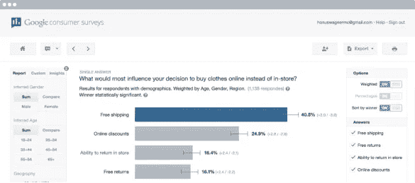
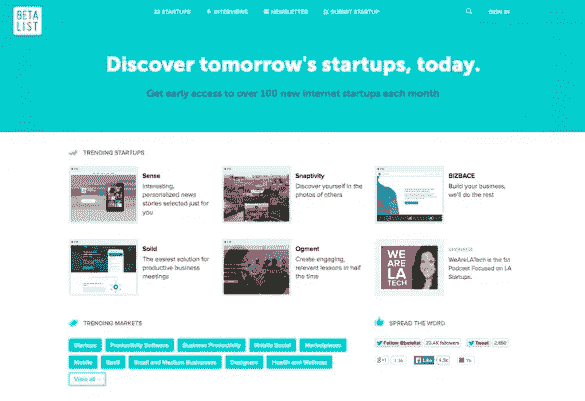

# 测试你的产品创意和收集真实反馈的 7 种方法(几乎免费)

> 原文：<https://medium.com/swlh/7-ways-to-test-your-product-idea-gather-real-world-feedback-at-little-to-no-cost-72717dc252c8>

Originally published on [http://www.appsterhq.com](http://www.appsterhq.com/?utm_source=CP&utm_medium=Medium)

在你能够有效地从潜在适销的*想法*转变为实际盈利的*产品*之前，你必须首先**通过收集真实消费者的真实反馈来测试**你的想法——否则，根本不可能确定你的想法是否能应对真正的 [*可货币化的客户痛苦*](/swlh/for-early-stage-entrepreneurs-a-5-step-mini-guide-to-launch-a-profitable-startup-def60d1c0402) 。

今天我将与你分享一些有效的策略，你可以用它们来测试市场对你的想法的反应，而不需要实际推出一个有形的产品。

我希望这些策略不仅能让你具体了解实际客户是否会将你的产品视为他们需要解决的问题的一个有吸引力的解决方案，而且还能让你几乎不花一分钱去执行。

注意:在你开始这些策略之前，确保你:

*   **可以向与你分享想法的人展示一些有形的东西**——实体模型、线框甚至是简单的草图(即，在这个阶段，你的想法可以是*主要是*，但不是*完全是*、文字——消费者需要某种视觉、听觉或物理表现，以便与你的想法联系起来)；
*   **学习如何有效地描述你的想法**并使用简单的语言解释它将解决的问题(例如，六年级学生能理解的语言)；
*   花大量的时间思考和解决你想要得到答案的确切问题(在“进入现场”之前，在其他人身上测试你的模拟问题，以确保你完全清楚在每种情况下你要问什么)；和
*   从某种意义上说，你能够以冷静和理性的方式讨论你的想法(你的目标不是推销或捍卫你的想法，而是以中立的方式展示它，从而收集调整和改进你的想法所需的客观反馈)。

这里有 7 种免费(或近乎免费)的方法，可以在投入市场和推出产品之前测试你想法的有效性:

# 1.20 美元的星巴克测试

*   从自动取款机中取出 20 美元，然后去离你最近的星巴克。
*   礼貌地一次走到一个陌生人面前，平静地解释你的情况:“对不起，你有时间帮我做点事吗？我哥哥将在周末辞职，把他一生的积蓄投入到我们对一家初创公司的构想中。如果我请你喝杯咖啡，你愿意告诉我你认为这个主意是否可行的真实想法吗？就是这样，没有陷阱，只有您的诚实反馈。”
*   客观地向对方推销你的想法。保持目光接触，缓慢清晰地说话。友好但不要过分热情。随意向他/她展示你带来的任何视觉、听觉或身体表征。
*   询问他/她对这个想法的看法。如果他/她看起来过分支持(例如，试图取悦你)，那么问:“你能给我三个你认为这个想法不可行的理由吗？”让他/她专注于这个想法，而不是你如何创造这个想法的背景故事。认真听，不要以任何方式争论。
*   感谢他/她的时间，并祝他/她过得愉快。
*   反复重复步骤 2-5，直到你的钱用完。如果你觉得到那时你还没有收集到足够的有价值的反馈，那么再拿出 20 美元，重新开始这个过程。

希望 20 美元的星巴克测试能让你收集一些以前没有意识到的批评/反对意见，这样你就能微调你未来的产品。

# 2.“敲门”的方法

上述星巴克测试是一种面对面与人交流的方式，目的是对你的想法产生真实的反馈。

互联网企业家和风险投资家谢家华通过直接给网站管理员发电子邮件招募了他的第一批客户；然后，他以 2.65 亿美元的价格将自己的公司卖给了微软，并创立了极其成功的 Zappos。

AppSumo 的创始人诺亚·卡根(Noah Kagan)开始使用类似的直接接触方法；他也强调了在创业初期亲自与人打交道的重要性。

利用互联网的力量是第二种方法:

*   就你的想法提出一系列经过深思熟虑、易于理解、清晰明了的问题(它要解决的问题，它作为解决方案的方式，等等)。
*   将问题作为在线调查上传到产品发布通知的注册链接。为参加调查的潜在参与者提供某种激励(例如，赢得亚马逊礼品卡的机会)。
*   如果你正在开发一个企业产品，那么使用谷歌搜索来找到潜在客户的名字和电子邮件；如果你计划在消费者领域经营，那么利用你的朋友网络来收集潜在的参与者。
*   在 LinkedIn、脸书、Quora 和 Reddit 等网站上找到相关的小组，并向每个成员发送一条简短的、个性化的、真实的关于你的调查的信息。
*   不要发送普通的垃圾信息或电子邮件；相反，你要表现得像一个朋友一样，要求一些快速而没有痛苦的反馈。

如果你的信息/电子邮件写得恰当，并以非垃圾邮件的方式发送出去，那么一些收件人可能会成为你未来的客户，他们中的许多人会通过在线视频聊天或亲自与你交谈，以便就你的想法给你额外的反馈。

# 3.民意测验和调查

作为上一个策略的延续，考虑利用在线调查的力量来产生关于你的想法的真实的市场反馈。

您可以使用许多免费和付费的调查工具，包括:

*   [谷歌调查](https://www.google.com/forms/about/)和[脸书广告工具](https://www.facebook.com/business/products/ads)
*   像 [PickFu](https://www.pickfu.com/) 这样的网站允许你创建简单的 [A/B 测试](https://blog.kissmetrics.com/ab-testing-introduction/)并获得市场反馈
*   [SurveyMonkey](https://www.surveymonkey.com/) 、 [Typeform](https://www.typeform.com/) (我个人最喜欢的)，以及让你创建免费调查并手动分发的相关网站

在撰写和发送调查问卷时，请谨记以下基本规则:

*   保持调查的简单性，即使用基本的语言、易于理解的问题和清楚标注的答案选项
*   向参与者提供某种激励或奖励(如折扣或赢取奖品的机会)
*   总是在邮件注册中添加链接，以确保你可以在将来直接联系回答者，从而从他们那里挖掘更多的反馈。

# 4.发出一个测试广告活动，并衡量结果

许多广告平台为新客户提供免费积分来开始使用他们的服务。

谷歌 AdWords、脸书广告、LinkedIn 广告、AdRoll、Twitter 等。，所有新账户都保持 50-150 美元的免费广告积分。使用谷歌找到对你最有吸引力的服务，注册一些免费积分，然后按照以下步骤操作:

*   创建一个简单的登陆页面，展示一个独特的价值主张(UVP)和一个注册链接(或者更好的是，一个真正的“预购”按钮，收集你未来产品的实际预购)
*   添加[谷歌分析](https://www.google.com/analytics/)跟踪代码到你的网站和[行动号召](https://www.crazyegg.com/blog/high-converting-cta-buttons/) (CTA)按钮
*   开展活动来增加你网站的流量，并检查转化率
*   对使用注册链接注册的人进行跟进，以了解他们的具体需求和要求，以及他们最初注册的原因

除了收集数据来帮助你测试你的 UVP 是否销售良好，测试广告活动方法还可以让你确定哪些流量渠道最适合你的 UVP，以及一旦你开始营销你的实际产品，你在哪里可以获得最好的投资回报(ROI)。

# 5.测试推广网站和启动目录

B 像 [betali.st](https://betalist.com/) 这样的 eta 推广网站允许你在早期采用者中分发你的简单的预发布网站，然后收集他们的注册信息以参与 beta 测试和客户反馈活动。

大部分投稿都是免费的；特别是关于 betali.st，有一个付费选项可以让你更快地发布你的站点。

按照以下步骤启动您自己的测试版促销活动:

1.  创建一个简单的登录页面，展示一个独特的价值主张(UVP)和一个注册链接(或者更好，一个真正的“预购”按钮，收集未来产品的实际预购)
2.  使用 Quora 上的列表[添加您的提交内容](http://www.quora.com/What-other-services-besides-betali-st-and-startupli-st-are-there-to-promote-startups)
3.  跟踪结果，并与响应您的活动的人一起跟进
4.  访问 Reddit、Hacker News 或特定论坛和在线社区等网站，并寻求反馈。不要试图推销或出售任何东西；只要谦虚一点，向那些有兴趣贡献的人征求一些诚实的意见，你就会得到一些反馈。

# 6.会面和活动

走出办公楼与现实世界的人交谈的最佳方式之一是通过关注特定的会面和事件来战略性地定位客户。

一个简单的方法是搜索像 meetup.com 和 eventbrite.com 这样的网站，寻找与你特定领域相关的聚会团体和活动。这是非常有益的，因为它允许你为你未来的产品找到潜在用户的目标群体。

当你亲自参加聚会或活动时，请记住你是来*参与*的:与人交谈、提问、获得反馈，并鼓励他人诚实/坦率地表达自己的观点。再次强调，不要以任何夸张、明显或令人讨厌的方式推销自己。

与人真诚相处，寻求友好的反馈，而不是咄咄逼人地推销你的想法或产品，你总能获得更好的结果。

**额外提示:**拿一堆双面名片:一面列有你的联系方式，另一面有你网站的注册网址。例如，“在 www.yoursite.com/20off".享受八折优惠

# 7.赢得与成功企业家面对面的机会

利用你的社交和职业网络——寻求帮助、为他人完成免费工作、主动组织相互介绍——这样你就有机会结识一些你认识的最成功的人(最好是一对一，如果不是在一个小团体中的话)。

如果你不能自己安排一次会面，那么礼貌地请朋友和家人介绍。

成功的企业家是不断与市场互动的个体。即使他们可能不是你真正的客户，你几乎肯定会从那些已经成功完成你现在开始的旅程的专业人士那里学到很多东西，并获得一些很好的反馈。

因此，你绝对应该努力*礼貌而谦逊地*试图抓住一个或多个创始人的耳朵，与他们讨论你的想法。

**记住:**企业家喜欢帮助其他企业家，特别是因为在自我驱动的专业人士中有一种共同的理解和尊重，他们认识到努力工作和人际关系网的重要性。

如果一个成功的企业家看到了你想法中的潜力，那么他/她很可能会在帮助你最终从*想法*转变为*产品*的过程中发挥重要作用——毕竟，这是本文概述的策略的全部要点！

> 最初发表于[http://www.appsterhq.com/](http://www.appsterhq.com/?utm_source=CP&utm_medium=Medium)

