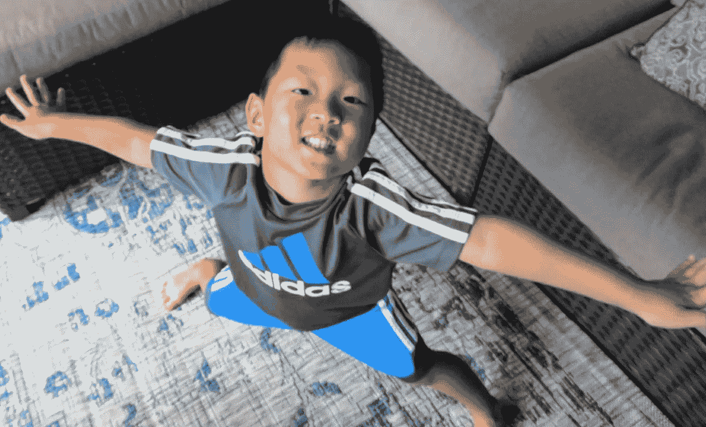
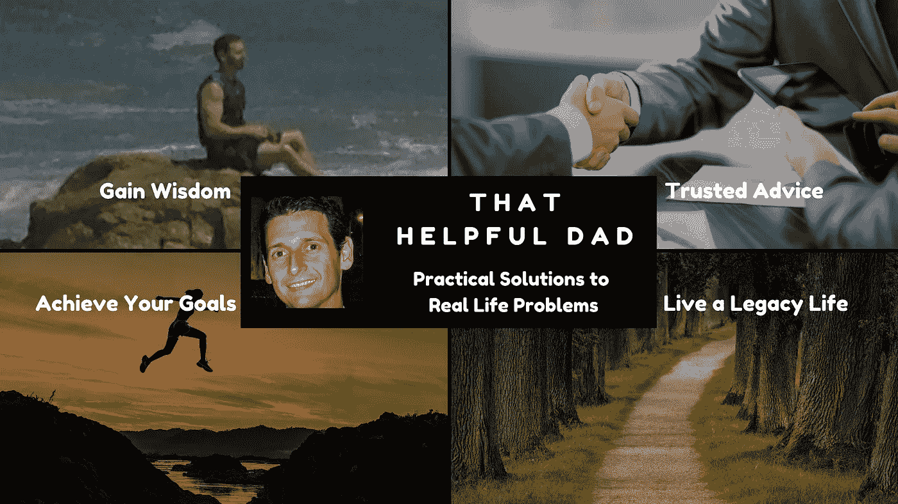

# 用这些改变生活的肯定来改变你的现实

> 原文：<https://medium.com/swlh/79-affirmations-that-will-transform-your-reality-8bf3eff4222f>

Photo by [MontyLov](https://unsplash.com/photos/UulPGkv636k?utm_source=unsplash&utm_medium=referral&utm_content=creditCopyText) on [Unsplash](https://unsplash.com/search/photos/affirmation?utm_source=unsplash&utm_medium=referral&utm_content=creditCopyText)

你现在是否将肯定作为日常生活的一部分？在我人生的前 46 年，我认为肯定是一种陈词滥调，但是去年我终于给了他们一个机会，这种情况发生了变化——哇，我真不敢相信它在我生活中产生的结果！

> 在这篇文章中，我将分享我目前用来改善生活的 79 个肯定。把它们作为改变你生活的工具。

**为什么 79？**因为如果你关注我的帖子，你会了解到我的一件事是，我只分享我*亲自验证*工作的智慧。在这种情况下，这 79 个肯定是我在 2018 年(2)自己用过的。我想与你分享它们，这样你也能从中受益！

# 什么是肯定？

冒着时光倒流到三年级的风险，让我分享几个定义吧。一个肯定是…

*   确认确认的行为或事例；**被肯定的状态。**
*   某物存在或**为**真的断言。
*   被宣布为真的陈述或命题。
*   确认先前的判断、决定等的真实性或有效性。

我把重点放在定义上是因为我想把你的注意力吸引到那些关键短语上。在我们讨论的范围内，我想向你提出…

> 肯定是一个强大的工具，你可以用它来改变你的现实。

# 你如何使用肯定？

和我分享的所有智慧一样，这不是火箭科学。我使用肯定的方式很简单——然而结果创造了巨大的个人力量。

## 简单的三步流程

1.  首先，我写下誓言，作为我“聪明”的早晨惯例的一部分。我每天早上写三份誓词，用它们来特别关注我认为能帮助我“赢得”这一天的关键领域。
2.  接下来，我将一些简单的呼吸冥想融入到这个过程中——我静静地坐着，用我的呼吸冥想，重复每一个肯定三次。我试着在脑海中想象每一个肯定——我的目标是看到自己活在肯定中。与此同时，我试图让我的思想、身体和灵魂(是的，全部三个)在我个人的 DNA 深处编码这种感觉，因为我知道当我这样做时，肯定有更大的机会成为现实。
3.  我把每一份确认书都保存在连接到我所有移动设备的谷歌文档中。一整天，当我有休息时间的时候，我会回头看医生，提醒自己这些肯定的话，并重复给自己听。

事不宜迟，让我们得到肯定！

Courtesy of Twenty20.com/Me2Marn

# 将改变你生活的 79 个承诺

(注意*全大写*是为了提醒自己应该额外注意哪些单词/短语。此外，并非所有这些说法都是正确的…目前为止。这是我在自己的生活中积极进行的转变过程的一部分。随着时间的推移和持续的行动，我知道这些都将成为我的现实。自己使用它们，你会体验到同样的好处)。

1.  我非常健康，我经常微笑，我对活着充满热情！
2.  我是一个伟大的作家，人们喜欢阅读我的书/作品，他们越来越渴望——人们采取行动寻找/阅读我的作品，这给他们带来了快乐
3.  我活在当下——我吸取生命的精华，享受每一滴。
4.  我是一个充满爱心、支持我的丈夫——我希望看到我的妻子腾飞，我会采取行动帮助她。
5.  我是一个令人敬畏的父亲——我的孩子们知道我爱他们，我会全力支持他们的希望/梦想，我相信他们可以完成任何事情。
6.  我对我的生活很满意——我不需要太多的物质财富，我只想享受每一天，珍惜我现在生活的每一刻。
7.  我与原力合一，原力也与我合一(4)。
8.  我的生活并不复杂——我随遇而安，发现我周围的美。
9.  我是一个健谈的人，喜欢和别人交谈。
10.  人们渴望阅读我的作品和建议——他们想要更多更多我的小说，我的智慧改变了他们的生活。
11.  我是一个快乐积极的人，充满活力和健康，充满爱和感激，周围充满欢乐。
12.  我的活力和积极的态度感染了其他人，改善了他们的生活——这不是假的，这是事实。
13.  我擅长明智地使用我的时间——对工作任务非常专注/高效，以尽量减少他们的时间，并花更多的时间在遗留目标上。
14.  我非常健康，强壮，充满活力！(在这里，我想到了 3 岁的儿子 JeeHo 像个婴儿一样挥舞着拳头说‘让我们开始吧。’每次都让我会心一笑——那个男孩对生活充满热情！)

My son JeeHo | All Rights Reserved

15.我正致力于实现我的遗产生活目标，并积极选择花时间在遗产目标上，而不是财务任务上。

16.我是一个快乐、积极的人，*积极*享受生活，*享受每一刻。*

17.2018 年是(插入姓氏)-我们在这里茁壮成长！

18.我对时间、金钱和机会的使用做出理性的决定——用清晰的眼光做出明智的选择，只利用那些支持我的遗产生活目标的选项。

19.我活在当下——享受我的生活——专注于现在，快乐地与我爱的人分享我的时间/注意力/精华。

20.我是一个战胜者，我非常健康和强壮，我的身体会战胜疾病，我会变得比以前更健康。

21.我最美好的时光就在我面前，我现在正步入其中，我快乐、满足，并且完全投入到我现在的生活中。

22.我与人们联系——像我这样的人，他们渴望我的写作，我的智慧分享帮助他们——我改善他们的生活。

23.我有意识地意识到我生活的焦点，我把时间花在我生活的道路上——它给我带来满足感。

24.我消除了所有与我的传统生活目标无关的任务。

25.我有有用的智慧可以分享，人们渴望听到我的声音，并且想要更多。

26.我是一个实用信息的财富，帮助人们过上更好/更容易/正确的生活。

27.我很开心——我经常微笑，对生活很满意，因为我知道我的生活专注于我的遗产目标。

28.我被上帝赐予了美好的礼物，我享受生活——吃，喝，和家人一起开心。

29.我像水一样——我沿着生命中阻力最小的路径流动，因为这是道的方式，我知道在这条路上有美好的事物在等着我。

30.我看到雨云光明的一面，知道上帝对我有一个计划——即使我还看不到，我知道它就在那里，如果我一直朝着那个方向流动，一切都会好的。

31.我在雨云中找到一线希望。

32.我很高兴，因为我知道我的家人爱我，他们也知道我爱他们。

33.我是建立关系的大师。我很快建立了信任——人们想和我做生意。

34.很明显，我是一名优秀的团队成员，拥有独特而有价值的技能——人们希望我加入他们的团队，因为他们知道他们需要我。

35.我爱我的家人，我知道他们爱我——这给我带来了满足感。

36.我已经准备好投身于我的遗产生活目标，并消除我道路上的障碍。

37.我是一个理性的决策者——我不会在不听取爱我的值得信任的人的建议的情况下做出人生决定。

38.我不怕在别人面前开心——我是家里的一盏明灯。

39.我是一个快乐的人，因为我知道我的生活很重要——我对我的家人很重要，我正在帮助他们实现个人价值。

40.我喜欢早起(早上 6 点前)，因为我可以在这段时间完成很多有意义的遗留工作。

41.我是一名畅销书作家，以与世界分享有用/实用的智慧秘诀而闻名。

42.我总是在寻找机会与他人分享智慧，当机会出现时，我会抓住它作为我遗产目标的一部分。

43.我是解决方案提供商。

44.人们想从我这里买东西，因为他们相信我。

45.这个世界充满了可能性——只要我努力，我就能实现任何目标。

46.我从导师那里获得灵感，并复制/改进他们的做法来实现我自己的成功——我很擅长改进别人已经开始的东西，我认识到改进>再创造的价值。

47.当别人为很多人提供价值时，我真的很高兴看到他们成功。(我想到了像埃隆·马斯克、蒂姆·费里斯、杰夫·贝索斯、马克·扎克伯格、托尼·罗宾斯这样的人。

48.我能够从财务任务中解脱出来，不再担心。

49.我是一个解决问题的人——障碍不会阻止我取得成功——它们可能是其他人的障碍，但我总是能找到绕过/越过/通过/低于/等的方法来达到我的目标。

50.我是一个积极的人，我相信为了实现我的遗产，一切都会好起来的——我对所有的可能性都持开放态度。

51.我很擅长消除非关键任务，专注于遗留目标。

52.我有意识地意识到我的遗产目标，并每天采取行动来完成它们。

53.我不会在重要的事情上拖延——我会完成它们！

54.在重要的事情上，我是一台生产机器。

55.我每天都写我的小说。

56.我的小说是我遗产的一部分。

57.写作对我来说很容易。

58.我相信早上的有氧运动=下午的成功。

59.我是一个有能力和自信的白手起家的商人，我相信我自己，我对我的生活很满意，对我的未来充满信心。

60.我是一个终结者。我是一个 closer。我完成了我的目标并获得了满足感。

61.我不沉迷于敛财。

62.我知道花时间在遗产目标上会让人生充实。

63.我带着感激的态度生活——我的感激是有感染力的。

64.当愤怒出现时，我专注于感恩，而不是让挫折控制我。

65.我能用智慧的建议给人们的生活带来巨大的价值。

66.我是智慧的寻求者，也是智慧的分享者。

67.人们迫切需要我的智慧和指导——我很乐意帮助他们。

68.我是一个令人信服的谈判者。我能说服人们做我想做的事。

69.我是一个创造双赢结果的关系建设者。

70.我接受现实，不需要掌控一切。

71.我控制愤怒，它控制不了我。

72.我是畅销书作家，人们想读我的作品。

73.我正在成为一个更好的厨师，人们喜欢我的食物。

74.我很会讲故事，人们喜欢听我讲。

75.我知道平衡=满足。

76.我是能量之神。我渗出活力和能量！

77.我有 32 英寸的腰围和健美的肌肉，充满活力，非常健康。(那不是很好吗？)

78.我在经济上是自由的——金钱不能控制我。

79.我只采取专注于我生活目标的行动。

## 迈克的笔记:

1.  我是在听了一些关于 BalanceInMe.com 的“旅程”冥想后被介绍给他们的——我一直看到这些肯定的音频，标题是我很健康，我很感激，我选择，等等。我想‘管他呢，让我们试试吧。’
2.  今年到目前为止，我已经用了不止 79 个，但那是因为我在不同的日子里重复了很多。我从列表中删除了重复项，结果是“79”太神奇了！
3.  Dictionary.com 的好意
4.  星球大战外传：侠盗一号——因为每一篇好的帖子都值得一个《星球大战》的参考，对吗？

# 一定要在你的生活中尝试这一课

如果你知道有人可以从中受益，请与他们分享这一课。

# 想要更多这样的智慧？

我的目标是帮助像你这样的人过上更好的生活。我通过分享实用的技巧、生活经验和行动导向的智慧来做到这一点，你今天可以用它们来过上最好的生活。没有废话，只是真实世界的解决方案，我可以亲自验证工作。如果这听起来对你有帮助，请查看我在媒体上的其他文章。

Visit ThatHelpfulDad.com for more tips like this

## 这篇文章发表在[《创业](https://medium.com/swlh)》上，这是 Medium 最大的创业刊物，有 284，454+人关注。

## 订阅接收[我们的头条新闻](http://growthsupply.com/the-startup-newsletter/)。

