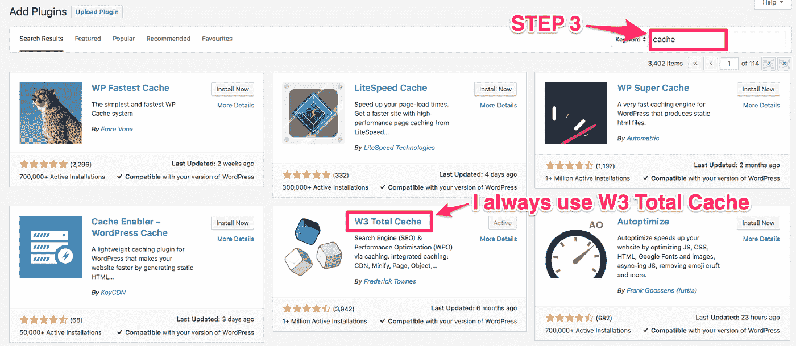

# 提高网站加载速度的 8 种可行方法(没有技术技巧或程序员术语)

> 原文：<https://medium.com/swlh/8-actionable-ways-to-improve-website-load-speed-without-tech-skills-or-programmer-jargon-cdedcb8caa42>

“time lapse photography of tunnel” by [Mathew Schwartz](https://unsplash.com/@cadop?utm_source=medium&utm_medium=referral) on [Unsplash](https://unsplash.com?utm_source=medium&utm_medium=referral)

搜索关于提高网站加载速度的信息，你经常会被你从来不知道存在的技术术语和网页元素轰炸…

…直到现在。

在本文中，**我们将把术语留在门口**。没错，没有编码，没有头文件插入，没有编程知识。只要你能使用鼠标、键盘，并拥有网站的管理权限，你就能提高网站的加载速度。

但是，在我们深入研究说明和演练之前，让我们快速浏览一下我们都在这里的原因。

# 网站加载速度慢=大问题

如果你发现了这篇文章，那么我可以对你做以下一个(或两个)假设:

1.  **你的网站速度很慢**
2.  **你知道网站加载速度有多重要，并致力于不断提高它。**

不管你是 1 分。或者 2 分。，你来对地方了。学习就是赚钱，这和这篇文章特别相关。

让我们先来看看网站加载速度和转化率之间的关系…

…人是住院病人(是的，你也是！).我们已经开始期望网站几乎可以立即加载，如果不能，我们就点击浏览器顶部的“后退”按钮，选择另一个搜索结果，或者直接访问竞争对手。

这种情况经常发生，以至于人们认为加载速度每延迟 1 秒就会损失 7%的转化率！没错，你的网站每加载一秒钟，你就可能损失 7% (或更多)的数字收入。

想想看，1 秒钟= 7%。想象一下，如果你能提高 3 秒钟的速度！

这仅仅是开始。如果你的网站很慢，你也会遇到以下情况:

*   较低的平均浏览页数(每个用户)
*   跳出率更高
*   最糟糕的是，访问者再次访问你的网站的几率越来越低(以毫秒计)。

换句话说，网站加载速度慢=大问题。

# 提高网站加载速度的 8 种方法

# #1:缓存插件

你们中的一些人可能已经读过我们的第一个技术“缓存插件”,并立即认为我所有的声明都是谎言，这确实是一个技术头脑的指南…

…但是在你得出那个结论之前，给我一个解释的机会。

我不知道缓存插件的每个特性，我不知道它们是如何制作的，或者它们对我的 JavaScript 有什么影响，坦白地说，我不在乎。

我知道他们大大提高了网站速度，让回头客几乎可以立即下载。

他们通过缩小(把大文件变小)你网站上的大元素和其他一些你或我没有时间做的无聊的技术事情来做到这一点。

缓存插件对任何有 WordPress 网站的人来说都是免费的并且非常容易安装。

只需转到 WordPress 菜单上的“插件”:

选择页面顶部的 ***【新增】*** 选项:

并搜索“缓存”:

搜索之后你会有很多选择，选择哪一个完全取决于你。个人推荐 [*W3 总缓存*](https://en-gb.wordpress.org/plugins/w3-total-cache/) 。我一直在使用它，它从来没有失败过，不管我当时在做什么网站。

如果你有一个 WordPress 网站，不要忽视这篇文章中关于提高网站加载速度的技巧 1。这是免费的，简单的，只需要 10 秒钟的努力。

对于那些不使用 WordPress 的人来说，检查一下你的 CMS(内容管理系统，例如 Drupal，Google Sites，Shopify)是否有类似的缓存插件。如果你找不到的话，你可能得去问问那些用神秘的代码语言说话的人。

# #2:安装 CDN

CDN 是一个内容交付网络。是的，我知道这听起来很无聊(这是因为它是),所以让我们尽快完成描述。

内容交付网络通过跨全球服务器网络托管您的文件来工作。这意味着访问者从他们最近的服务器加载你的页面。例如，如果我有一个来自印度的访问者和一个来自英国的访问者，我的网站将从两个不同的服务器加载。(我告诉过你很无聊)

无论如何，CDN 将极大地帮助你的加载速度，特别是当你的网站增长和接收更多的流量时。即使你关注的是本地观众，你收到的流量很低，CDN 仍然非常重要。拿一个！

同样，我不想影响你的选择，因为有很多公司提供 CDN 服务(谷歌搜索，看看你会发现什么)，但我们使用 [*CloudFlare*](http://cloudflare.com/) 。他们提供一个真正全面的免费计划，他们的产品确实如罐头上所说的那样。

# #3:使用工具

如果你的网站很慢，找出原因可能是个好主意。这八个网站加载速度提示将会改善你的网站，但是可能有一个更大的潜在问题。

这就是免费工具派上用场的地方。

有很多免费的网站速度排名，很容易在谷歌上找到。

将你的网址插入他们的工具栏，他们将分析你的网站，并返回你的网站的加载速度和时间，它的评级和细分页面上每个元素的加载时间。

**最好的工具甚至会解释如何提高你的站点加载速度**。同时，这些结果中的大部分将充满令人难以置信的技术术语，它们非常有用，尤其是如果你可以在像*这样的网站上找到一个程序员来实现这些改变。*

*我一直用 [*Google 的 PageSpeed 工具*](https://developers.google.com/speed/pagespeed/insights/) ，和 [*Pingdom 的网站速度测试工具*](https://tools.pingdom.com/?_ga=2.6690482.1832052706.1540540265-1572835526.1537797340&_gac=1.158019272.1538135572.CjwKCAjworfdBRA7EiwAKX9HeBl04RuveNERFtPfRz4SatkvGYVtTyswgnCZBDeFVf6mOjIlhXv5OxoCdZ4QAvD_BwE) ，因为我认为这些是基准。*

**

*发现降低网站速度的原因并解决它。记得经常检查你的装载速度。(在你实现这八个小技巧之前和之后都要过一遍！)*

# *#4:修复/删除断开的链接*

*断开的链接并不酷。它们会破坏你的 UX(用户体验)，影响你的搜索引擎排名，并对你的网站加载速度产生负面影响(尤其是当它们嵌入在图片中时)。*

*我把它们包括在这个列表中，因为**你必须时刻关注它们，以帮助你的网站达到最佳性能水平。***

*幸运的是，就像网站速度检查一样，有大量的免费工具可以帮助你做到这一点，它们都是通过相同的“输入你的网址进行扫描”原则来工作的。*

**

*当你找到你的链接时，访问相应的页面并删除或修复它们。*

*定期执行断开链接检查很重要，我推荐像 [*PowerMapper*](https://www.powermapper.com/) 和[*broken link check*](https://www.brokenlinkcheck.com/)这样的工具…*

**

*…但是，我也强烈推荐使用 [*谷歌的搜索控制台*](https://www.google.com/webmasters) 。这个免费的工具将执行定期的网站“抓取”，检查你网站上的所有内容。使用搜索控制台和断链检查器，这样你就不会错过任何东西。*

**

# *#5:设计/主题*

*一个简单的网站比一个复杂的网站需要更少的加载时间。听起来很简单，对吧？*

*那么，为什么大量的网站选择带有一万个花哨的主页呢？*

*事实是，**功能战胜时尚**。你不应该为了漂亮的、自私的设计而牺牲用户的体验。*

*以谷歌为例，他们的主页有一个搜索栏和两个按钮“谷歌搜索”和“我感觉很幸运”。它不仅是世界上访问量最大的网站，也是速度最快的网站之一。你认为这是巧合吗？*

**

*主题、设计和登陆页面都应该围绕他们的主要目的、**而不是美观**。问问你自己:*

1.  ***你建网站的原因是什么？***
2.  *如何使用最少的移动部件来传递信息？*

*如果你网站的主页设计/主题充斥着视频、图片、链接、文本、幻灯片，那么它会很慢。你必须首先决定哪些因素最能表达你存在的理由，并清楚地表达出来。*

*要有超快的网站加载速度，你不需要像谷歌那样删除搜索栏里的所有内容。去掉重复和不必要的加载时混乱。*

**

# *#6:压缩图像*

*图片扼杀网站速度，尤其是高质量的…*

*…但是，这并不意味着您不应该使用它们。恰恰相反，你绝对应该。图像捕捉想象力，解释，创造信任…它们的好处几乎是无止境的。*

*那么，我们如何解决这个第 22 条军规呢？*

*很简单，我们压缩图像，使它们可以快速加载，同时牺牲很少(如果有的话)的质量。*

*你可能已经注意到了，我使用 WordPress(因为它无疑是最好的),这意味着我可以很容易地安装一个免费插件来为我做所有的艰苦工作。我喜欢的插件是 [*Smush 图像压缩和优化*](https://wordpress.org/plugins/wp-smushit/) 。*

**

*安装这个插件，然后离开。Smush 会一丝不苟地扫描你上传的每一张图片，在不影响质量的情况下，剪掉所有的脂肪。所有 [*爱因斯坦营销商*](http://einsteinmarketer.com/) 上的图片都被刷过了。让我知道你的想法。*

**

*至于其他人，有很多其他的图像压缩工具。(我个人无法推荐任何一款，因为我一直用的都是 Smush！)搜索 ***图像压缩器*** 并查看可用的内容。*

**

*如果你用的是 Shopify，他们有很多自己的插件，比如 [***【迷你器】***](https://apps.shopify.com/minifier) ，只要花很少的钱就能完成任务。*

# *#7:删除不用的插件和工具*

*到目前为止，我已经推荐了几个不同的插件，这将有助于提高你的速度，但现在是时候走另一条路，告诉你删除尽可能多的插件。*

*我并不是建议你把你的工具箱弄得太满，但是定期清理是很重要的，并且真正掌握你在用的和不用的东西。*

**

*不管你用什么来建立和维护你的网站，WordPress 还是其他，你安装的插件和工具越多，你的网站就会越慢。*

*即使这些插件没有在你的网站上使用，如果它们没有被删除，它们仍然会对加载速度产生重大影响(它们用 JavaScript 等做一些无聊的技术行话)。*

*同样重要的是要意识到，有时候一个插件会比其他 10 个插件给你的网站加载速度带来更多的问题。这(主要)取决于插件的质量。总是执行通常的检查(在评论部分),不要为了安装而安装任何东西。*

# *#8:清理你的数据库*

*最后，但肯定不是最不重要的，是最重要的数据库清理。*

*这听起来很专业，但实际上非常简单。你的数据库保存的未发布的草稿、统计数据、用户数据和日志越多，你的网站就会越慢。*

***这些小块数据随着时间的推移而积累**，如果你不掌握它们，它们就会成为一个大问题，尤其是对于像 WordPress 这样使用内容管理系统的网站。*

*对于至关重要的数据库清理，您有两种选择:*

1.  ***手动检查一切***
2.  ***自动化流程***

*如果我选择第一，我将不得不至少每月一次手动浏览我网站上的所有内容(我可能没有时间给你们写这样有用的小指南！)所以你猜怎么着？*

***我把它自动化了！***

*那些发现了另一个很棒的 WordPress 插件的人有很好的直觉。这次是 [*WP-Optimize*](https://en-gb.wordpress.org/plugins/wp-optimize/) 在我推荐的众多产品中，这可能是我会带到我的数字荒岛的一款。*

**

*我对这个工具评价很高，因为它执行的任务真的很无聊和耗时，而且尽可能保持我网站上所有数据库的清晰。*

# *结论*

*所以，这就是我们的 8 个可行的方法来提高你的网站加载速度，而不需要技术技巧或程序员术语。*

*有很多其他方法可以提高你的加载速度，其中一些方法的效果会比这些方法小，而其他方法会做得更多，但是如果你打算走这条路，你可能需要去程序员学校或者雇人来帮你做这件事。*

*最重要的是你正在采取行动。这 8 个技巧将极大地提高你网站的速度，帮助你实现目标。*

***保持简单，定期检查。***

*如果有你认为适合我们列表的东西(我还没有提到)，请发表评论！分享你的知识！*

*如果你喜欢这篇文章，你可能也会喜欢[***2018 年最重要的 35 个谷歌排名因素***](https://www.einsteinmarketer.com/google-ranking-factors/) 或者了解更多…*

*…一个 [***加速移动网页(AMP):如何获得一个快如闪电的移动网站***](https://www.einsteinmarketer.com/accelerated-mobile-pages/) 。*

**

## *这篇文章发表在 [The Startup](https://medium.com/swlh) 上，这是 Medium 最大的创业刊物，拥有+383，380 名读者。*

## *在这里订阅接收[我们的头条新闻](http://growthsupply.com/the-startup-newsletter/)。*

**