# 8 个优秀的手机设计范例，激发设计师灵感

> 原文：<https://medium.com/swlh/8-excellent-mobile-first-design-examples-for-designer-inspiration-d5c90d465221>

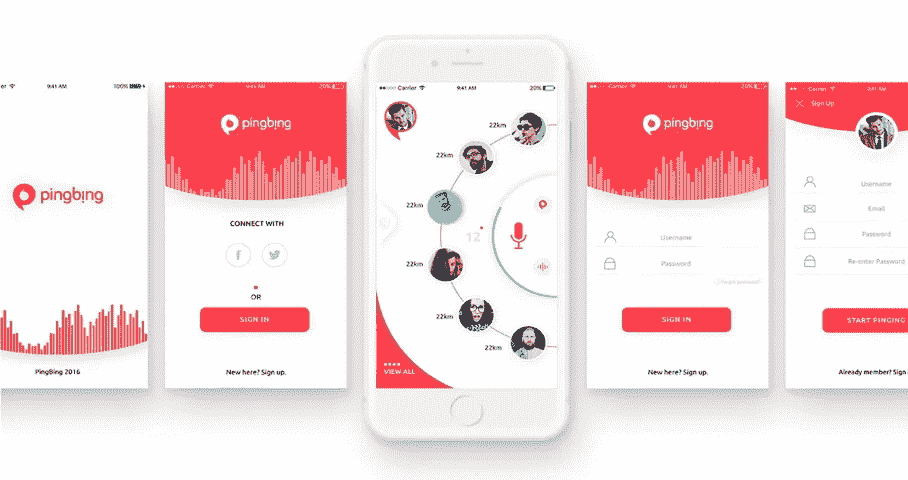

2011 年，卢克·乌鲁布莱夫斯基设计了一个手机优先设计的概念。这无疑是一个打破了当时行业惯例的新设计原则。而在现在的互联网时代，它已经被完全接受，涌现出很多优秀的**移动先行设计**案例。事实证明，遵循这一原则的人或企业，首先设计出最好的移动网站，他将是市场和机会的赢家。因此，很容易看出移动优先设计对于企业和设计师制造产品有多么重要。

**2017 年 YouTube 的改版已经体现了移动优先设计的权威性。** [材质设计](https://www.mockplus.com/blog/post/131-flat-design-vs-material-design-how-are-they-different/?r=linda)体现了“桌面版是移动版的一个下属”。这正好符合微软现任首席执行官纳德的移动第一概念。

对于当前的 PC 和移动设计，有一个最常见的解释。也就是以前的移动版是缩小的桌面页面，现在的桌面版是放大的移动 app。因此，我列出了 8 个优秀的移动优先设计示例，供您进行案例研究和启发。

# 1. [YouTube](https://www.youtube.com/)

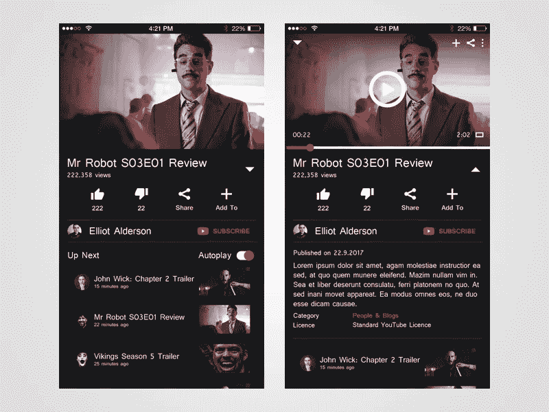

**设计上有什么吸引人的地方**:按钮和文字显示空白，夜间模式

在某种程度上，YouTube 桌面网页版的材料设计语言也反映了对移动设备的偏好。所以采用[响应式设计](https://www.mockplus.com/blog/post/responsive-web-design-guidelines/?r=linda)是合理的。所以毫无疑问，按钮和文本显示的空白是为了适应小屏幕触摸移动设备上的用户习惯。

新的夜间模式也显示了它对移动设备的屈服。桌面版的界面是白色背景。对于移动设备，最好在夜间模式下使用黄色屏幕，而不是黑白背景。所有光线都被移除，屏幕变小，所以最好的方法是降低亮度来安慰用户的眼睛。

# 2.苹果

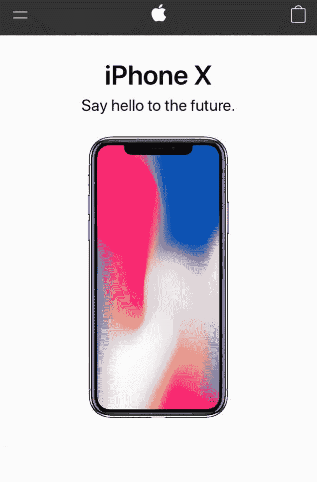

**设计上吸引人的地方:**方便的滚动导航

尼尔森/诺曼集团发布的一项用户体验调查显示，隐藏导航(像汉堡导航)会使内容可发现性降低 21%，导航平均增加 2 秒。苹果手机网站的内容布局非常好。因此，用户不需要使用导航按钮，而是向下滚动页面来访问信息，非常容易和方便。购物袋图标对于用户购物的第一眼来说通常是必要且清晰的。此外，如果浏览页面后没有想要的信息，您可以在底部导航中搜索所需的信息。

# 3.[干草叉](http://www.pitchfork.com/)

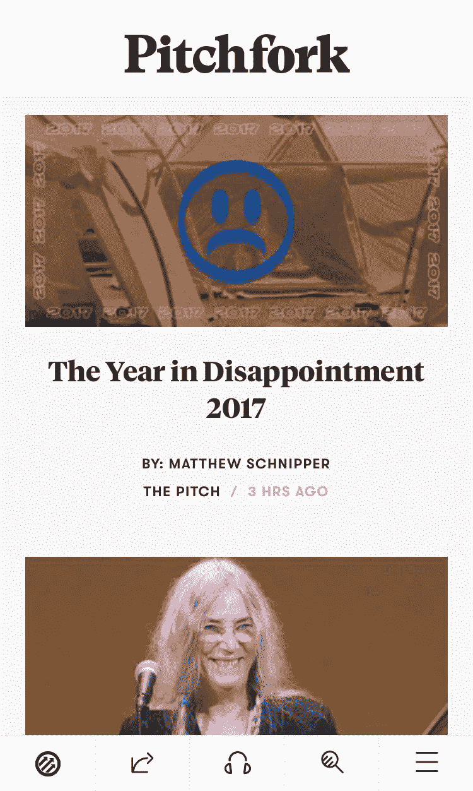

**设计上有什么吸引人的地方**:拇指设计

虽然有很多关于缩略图区域的研究，但是很多网站和应用程序都把导航放在屏幕的顶部。然而，如果你足够小心，你会注意到手机越大，用户越难访问屏幕外缘的内容。相比之下，Pitchfork 将主导航栏放在屏幕底部，也就是拇指最容易触碰的地方。随着移动设备越来越多，这种设计类型应该是未来的趋势。

# 4.[字体](https://www.typeform.com/)

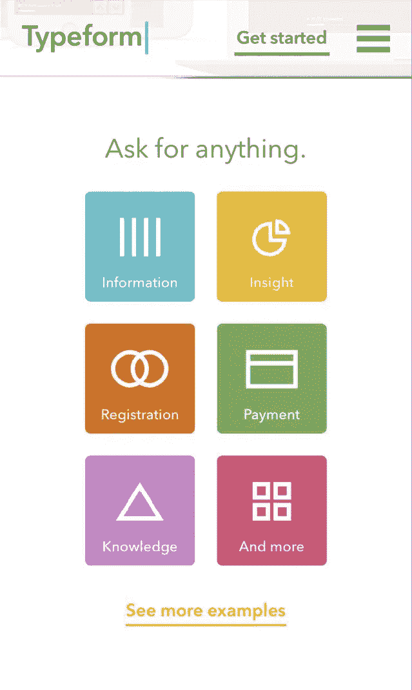

**设计中吸引人的地方:**大菜单按钮——非常适合触摸屏

Typeform 拥有漂亮的桌面设计，拥有简单的文案、高清视频、动画等设计元素。但是复杂的设计组件对移动用户来说并不友好，比如视频和动画，它们会显著影响页面加载时间。因此，他们削减了移动网站页面上许多不必要的设计元素，但保留了在移动设备上运行良好的大菜单按钮，通过简单和复杂简化了整体移动体验。

# 5. [Airbnb](https://airbnb.com/)

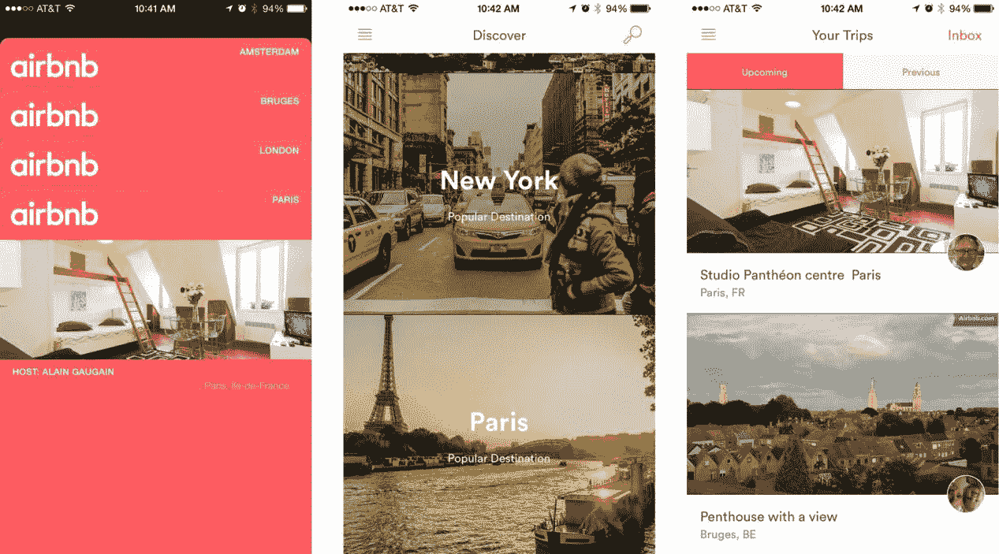

**设计上有什么吸引人的:**卡片设计

卡片设计使用户和信息在有限的时间内更容易相互联系。这也是谷歌选择卡片设计作为他们设计标准的原因。Airbnb 等其他互联网公司也逐渐接受并采用了这种方式。每张卡片的信息简洁有效，通常由标题、图片、图形或简介文本组成。这种设计给了用户足够的信息，让他们很容易决定是否要更深入了解更多。

# 6.[砸弹匣](https://www.smashingmagazine.com/)

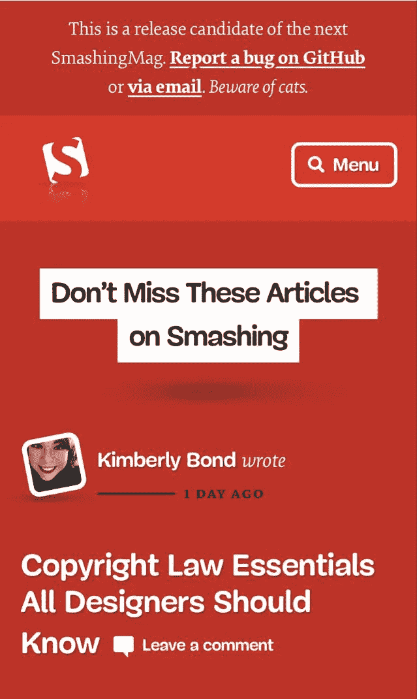

**设计中有哪些吸引人的地方:**重视用户，合理利用屏幕空间优化

数据显示，越来越多的互联网用户选择停止他们不想要的内容，尤其是近年来的移动用户。不断的导航设置，全屏广告，过多的营销用语，而这些都没有给用户很好的用户体验。如果想推送用户广告或者引导用户继续阅读，可以根据用户在看什么有选择地推送。这就是为什么内容的战略布局更容易让用户点击。如果你单纯为了盈利而破坏用户体验或者让他们跳转页面，那么你会逐渐失去用户，随着用户的流失，利润也会减少。

# 7.[脸书](http://www.facebook.com/)

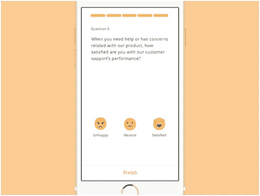

**设计上有什么吸引人的:**有效的动画

网页上的动画帮助用户生动地理解当前的图像，并且给予用户体验比娱乐大众更多的表现力和人性。例如，MailChimp 使用 Hi-five 动画作为成功邮寄后的问候，Twitter 转发或喜欢功能的迷你动画，以及像脸书一样生动的表情包。但是如果你想在页面上制作动画，请确保它优雅得体。

# 8. [Evernote](https://evernote.com/)

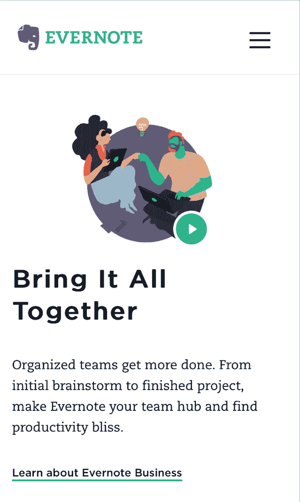

**设计上有什么吸引人的地方**:干净清新的移动 UI 界面

Evernote 主要提供笔记存储服务，允许用户在所有平台设备上访问信息。所以 Evernote 必须获得正确的移动用户体验。和桌面版的网页设计一样，Evernote 的移动网站设计也保持了同样的 UI 设计干净清新。另外，网页上的右 CTA 按钮对用户非常有用。

“先做网页设计，再移植到移动设计”，这种常规模式在今天已经不再适用。移动性必然是未来互联网行业的设计和发展趋势。所以移动第一网站设计会成为新的趋势，即使这个概念已经存在好几年了。

# 为什么移动优先设计的原则如此重要？

1.根据全球互联网报告，截至 2016 年，全球智能手机用户数量已达到 28 亿。

2.与此同时，人们每天花在移动网络上的时间越来越多。

3.早在 2012 年，全球智能手机销量就超过了个人电脑销量。

移动需求的爆发式增长，要求设计师更加关注移动版本，在产品设计中遵循移动设计优先原则。所以我相信这些理由足够让设计师和商家去研究[手机网站设计](https://www.mockplus.com/blog/post/137-mobile-web-design-adaptations-for-better-ux/?r=linda)并从中受益。

# 如何遵循移动优先的设计原则？

为了创建一个符合移动优先设计原则的移动友好网站，需要一个原型设计工具，如 [Mockplus](http://www.mockplus.com/?r=linda) 。

第一步:登录你的 Mockplus 账户。如果没有，你可以申请一个免费的 Mockplus 账户。

第二步:新建一个手机项目；

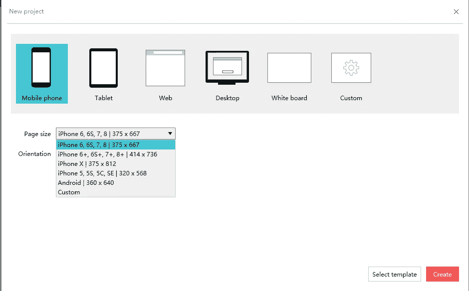

# 想想布局

移动优先的设计方法不同于桌面优先。在移动设备中，我们需要考虑在小屏幕布局中显示有效信息。然而，它并不是简单地随着页面布局的变化而减少信息。

在这个移动优先设计的例子中，我们知道一些元素是必需的，例如网站的名称和应用程序的标志应该结束。然而，并不是所有的桌面网页设计元素都适合移动设备。因此，让我们根据旅游网站的目的来设定优先级:

起始页、登录页、欢迎页、城市列表页、主页、详细页、搜索页、活动页、个人信息页等。

# 最终原型设计效果演示

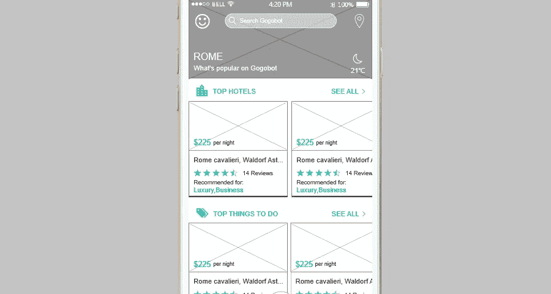

Gogobot 在线 HTML 预览:【https://www.mockplus.cn/sample/post/656 

卡片的设计和滚动内容的显示符合移动用户通过上下滚动页面获取和操作信息的要求。没有大图抢占有限的屏幕资源，信息的滚动也愿意被用户接受。因为相比汉堡菜单，用户更乐于滚动页面。

桌面显示器:Gogobot

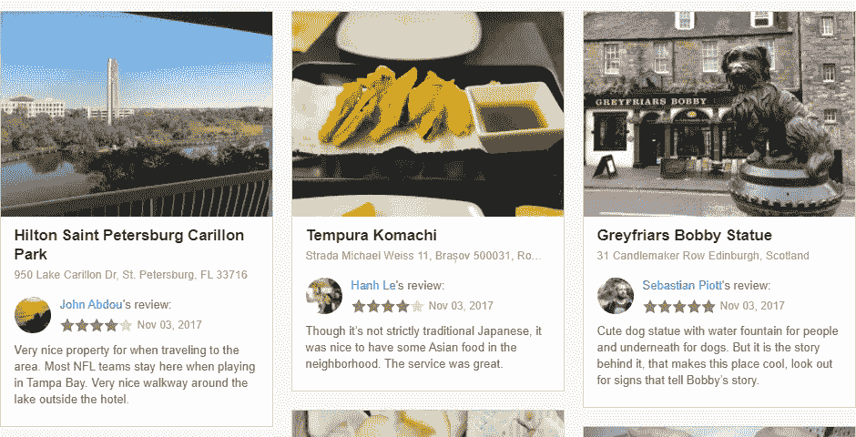

# 结论

通过 Youtube 在这一年的改版，相信会有更多的网站去关注移动先行的设计。真诚地希望上面列出的 **8 个手机首发设计实例**能对你的新产品或新网站的建设有所启发。总之一句话，由于流量有限，移动网站一定要简单粗糙，桌面网站要最好，要华丽。但“移动优先”几乎变成了一句正确的废话，因为它已经成为几乎所有硅谷主流企业的常识。

## 这篇文章发表在 [The Startup](https://medium.com/swlh) 上，这是 Medium 最大的创业刊物，拥有 277，994+读者。

## 订阅接收[我们的头条新闻](http://growthsupply.com/the-startup-newsletter/)。

