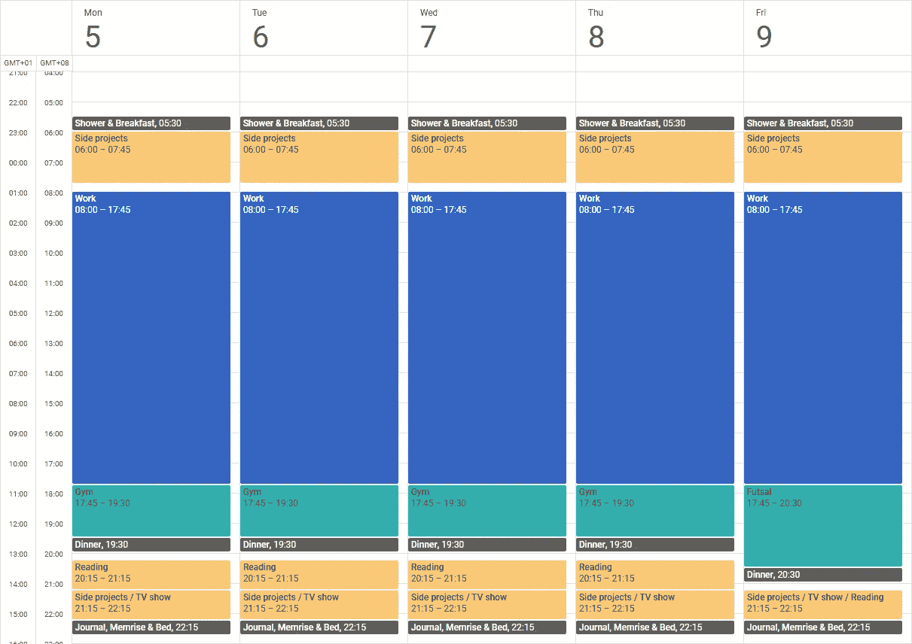

# 让上个月如此高效的 8 个黑仔习惯

> 原文：<https://medium.com/swlh/8-killer-habits-that-made-last-month-so-productive-cc4e6d64e1a4>

## 无疑是我一生中最有收获的一个月。

Photo by [Marc-Olivier Jodoin](https://unsplash.com/photos/NqOInJ-ttqM?utm_source=unsplash&utm_medium=referral&utm_content=creditCopyText) on [Unsplash](https://unsplash.com/search/photos/fast?utm_source=unsplash&utm_medium=referral&utm_content=creditCopyText)

哇哦。多好的一个月啊。

我为自己制定了很高的目标。但我设法做得更多。我几乎完成了一个小的 Android [应用程序](https://github.com/pierremtb/todoboard)，我开始练习新技能，读了两本书，继续我学习普通话的探索，完成了新版的[我的作品集](https://pierrejacquier.com)，并对一个我决定不去追求的笔记本[项目](https://paper.dropbox.com/doc/Project-Margins-WXOzm8AnXkL50z1pIRYwD?_tk=share_copylink)给予了很多想法——然而想想还是很酷的。

这听起来可能没什么，但我对此非常高兴。一如既往，最重要的不是最终结果，而是过程。多亏了我最近养成的一些新习惯，事情变得简单多了，因此我认为这些习惯值得分享。

# 排名第一的是睡眠机器

在我大学的前三年，我一直是个夜猫子。

做一个夜猫子没有问题。除非你必须早起去上班/上大学/做一些你必须做的事情。

我曾经以“我死了也能睡着”为座右铭。

在深夜写我的东西。5 个小时后几乎没有醒来，说着*“再也不会了”*。精力充沛地度过工作日。答应自己早点睡觉。晚上突然恢复*假*全警觉。重复。

> 对我的健康有好处吗？**否**。
> 这对我的工作和项目效率有好处吗？**号**
> **那我到底为什么还在做。**

还好我在 2017 年底前停了。

## 怎么会？

重要的是每天有足够的**睡眠**。**

***充足*充足*睡眠*高度取决于个人。你所能读到的关于别人所做的一切都无济于事。我发现 7h 非常适合我。我不应该那样说。找到你的。**

***每天*不是别的，就是纪律。这是最重要的部分。找个合适的时间睡觉和醒来。**重复**。**

# **#2 早起从重要的事情开始**

**我们一天中最有效率的时间是在醒来之后。这是[一个事实](https://newrepublic.com/article/120267/behavioral-scientist-your-most-productive-hours-are-morning)。**

**我觉得我总是想改变我通常的时间表，在早上上班前做我想做的事情。**

**因为我知道我会更有效率。我知道会成功的。**

**然而我总能找到不开始的理由。[直到几个月前](https://byrslf.co/how-i-became-a-morning-person-in-one-week-ffe46d9e2e05)。**

**我知道在我的一天真正开始之前，我有两个小时的时间可以用来做我想做的任何事情。这有多棒？**

## **怎么会？**

**当你成为一台睡眠机器时，没有什么能阻止你移动你创造的睡眠块。**

**只是**逐渐**改变你既定的睡眠模式。**

**15 分钟乘 15 分钟，直到你达到你的目标。**

# **#3 在你的生活中使用时间块**

**说到街区。**

**当我有时间的时候，我会做我的项目，而不是计划好的，只是当我喜欢并且可以的时候。可悲的是，人们很容易被生活分心，或者怀疑现在是否是做这件事的正确时机— *Pierre，你知道你还得完成明天的学校报告，对吧？*。我经常工作到一半，很晚才睡觉。**

**我是 Todoist 的狂热用户，Todoist 是最著名的待办事项服务之一。一年来，它帮助我组织了生活中的几乎所有事情。**

**但是它没有处理一件重要的事情:持续时间。**

**一个月前，我读过关于[时间阻塞](http://dariusforoux.com/time-blocking/)的概念。**

**大多数人在工作中使用它。但是为什么我们要限制它的力量，而不把它扩展到我们的整个生活中呢？**

> **我的新宠习语:在一个项目上扔积木。**

## **怎么会？**

**触发我这一转变的是谷歌日历网站的全新设计。如果不是新界面吸引了我的目光，我肯定不会使用这个强大的工具。但我想用它做点什么。**

****

**Disclaimer: don’t settle that kind of routine if you‘re a secret service spy, you’ll become foreseeable, therefore dead.**

**用的工具不重要，真的。**

**设置时间段时，需要记住两件重要的事情:**

*   **必要时允许休息**:你总会有这封邮件要回复，或者有其他事情要处理。15 分钟对我来说相当不错。****
*   ****需要的时候扔掉计划:**选择一个允许轻松重构的工具。让目前的复杂情况扰乱完美的日历是完全没有问题的。重要的是迅速反应和适应。**

> **“制定计划。执行计划。预计计划会偏离轨道。扔掉计划。”
> —伦纳德·斯纳特[《闪电侠](http://m.cwtv.com/shows/the-flash)**

**由于我目前只是一名实习生，我还没有为工作日制定任何详细的计划。主要是因为我只有一个项目要做，而我的待办事项清单对于我的计划需求来说已经足够了。说到待办事项，Todoist 在谷歌日历中有一个漂亮的双向集成，这将整个系统推向了一个更高的高度，允许有一个很好的概览。**

# **#4 不断在项目间跳跃**

**我想常识告诉我们，保持专注对于快速完成项目和提高生产率是最重要的。**

**然而，我开始明白这并不适合我。我发现很难知道我在某个特定的项目上什么时候会有成效。**

> **我可以肯定的是，当我进入所谓的*流*状态时，当时钟突然变成风扇，除了项目之外的一切都冻结时，我会变得非常有效率。**

## **怎么会？**

**不要束缚你的思想，专注于你想做的特定领域。**

**而是让它投入到另一个可能比前者更有价值的项目或领域。**

**引用[这可能是我上个月发现的最有趣的事情了。](https://medium.com/u/7ee29b787e9#5 在最糟糕的时候锻炼</h1>

 **你知道我的计算器程序代码...在那之后，我把函数回调到…我知道为什么它不工作了，非常感谢！**

**你的对话者甚至不需要说一句话。你自己想出来的。**

**我很确定这不仅仅是编程。通过解释、重新措辞、改编、抽象，让人们理解，你的问题的解决方案可能会出现，就像这样。**

**大多数时候，你就是找不到可以倾诉的人。然而，期刊可能正是合适的候选。**

## **怎么会？**

**从今天开始！无论是在实际的纸张上，还是在智能手机应用程序或其他任何东西上。**

**我想甚至有可能口头上大声说出来。**

**为此，我再次使用谷歌日历。我已经为它建立了一个*日志*日历，每天晚上我都会添加一整天的事件，使用一个限定性的标题，比如“本月最棒的一天！”，将内容添加到描述字段中。使用一个 IFTTT 小程序，它会自动备份到我的 Google Drive 上的一个特定文件夹中。**

# **#7 第二天回顾**

**当我开始早起的时候，我有时会花很长时间吃早餐和洗澡。主要是因为在某些时候，我真的不知道在我的早晨时段应该做些什么。**

> **问题是，当你开始拥有以前没有的时间时，很容易被*的无所事事*所淹没，而忘记真正做*的事情*。**

**正是这一点让我明白了一个简单的事实:今天始于昨天。**

## **怎么会？**

**为了迅速开始并避免浪费据说是最有效率的宝贵的早晨时间，知道从哪里开始非常重要。**

**就像在一天结束时留出 5 分钟思考第二天一样简单。**

**对我来说有用的是看一下我的日历，然后用我将要做的项目给这些区块重新命名。**

**另外，我喜欢**加一个 B 计划**。正如我们之前讨论过的，在工作时感觉更被另一个项目吸引并没有错。但是为了避免跳到其他无意义的活动，我们不得不遮住后背。为此，我把另一件事放在括号里，就在标题里。**

**例如，我的早晨*侧投影*块变成了 *Todoboard(中等故事)*。**

# **#8 允许思考时间**

**最后但同样重要的是，正如他们所说。**

**我很确定你完全明白我的意思以及该怎么做。洗澡或散步时有过天才般的洞察力吗？**

**我们的思想就像孩子一样。当他们开始做自己喜欢的事情时，他们不会放弃。大脑保持后台线程运行，在一个缓慢的时刻，它给你提供了你几个小时，甚至几天前就在寻找的答案。**

## **怎么会？**

**然而，如果我们的主线程*总是被占用，那么这种灵光一现的时刻**就不会发生。*****

**不一定要几个小时。优化你生活的每一分钟是很棒的，我能体会。要学的东西太多了，没时间浪费了。**

**但是，在回家的 5 分钟步行时间里，让你的思想开小差，可以获得比你更想听到的播客片段更多的东西。**

**只要有可能，比平时早睡 10 分钟也能得到类似的结果。**

**这正是我产生这个故事想法的原因。**

****

## **这个故事发表在 [The Startup](https://medium.com/swlh) 上，这是 Medium 最大的企业家出版物，拥有 293，189+人。**

## **在这里订阅接收[我们的头条新闻](http://growthsupply.com/the-startup-newsletter/)。**

****