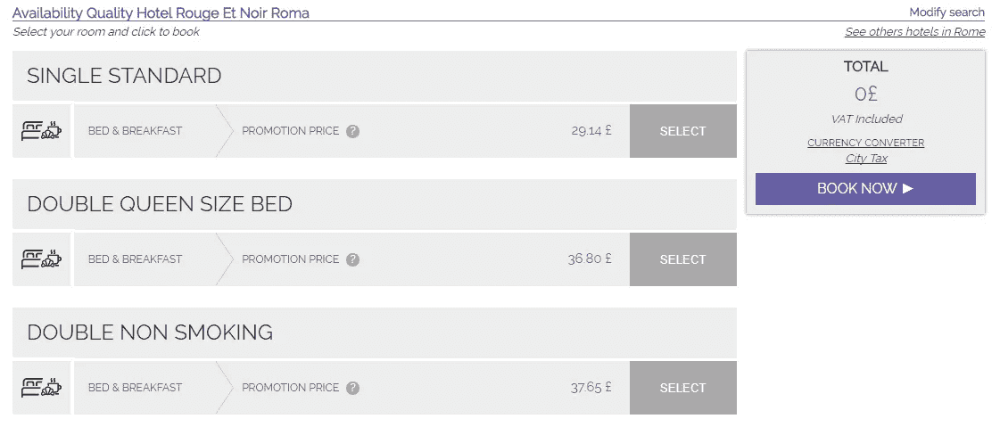

# 在线旅行社犯的 8 个错误以及如何避免它们

> 原文：<https://medium.com/swlh/8-mistakes-online-travel-agencies-make-and-how-to-avoid-them-af93d996fd9c>

2018 年的旅行技术趋势清单充满了流行语和不切实际的前景。虚拟现实、无人机、生物识别——这些概念虽然在未来并不遥远，但还不属于我们的现实，不属于旅游和酒店品牌必须运营的此时此地。

虽然关注改变行业的干扰力量很重要，但在线旅行社和其他服务提供商应该专注于现有的问题，这些问题严重影响了客户体验，使企业失去了阵地。我们已经讨论了[创建在线旅行社](https://www.altexsoft.com/blog/business/6-strategic-decisions-to-make-when-building-an-online-travel-agency/#utm_source=MediumCom&utm_medium=referral)所需的步骤，今天我们将分析现有的错误以及如何修复它们。让我们开始吧。

# 1.缺乏个性化

根据埃森哲的调查，[65%的用户更愿意从记得他们过去的购买并提供相关建议的零售商那里购买。此外，大约 40%的顾客离开网站是因为他们被众多的选择淹没了。如今，人们期待定制解决方案，就像他们期待在创纪录的时间内收到亚马逊包裹一样。没有回头路，电商品牌只有一个选择——适应。](https://www.accenture.com/t20170310T042952Z__w__/us-en/_acnmedia/PDF-45/Accenture-Genome-POV-Hotel.pdf#zoom=50)

个性化可以让你缩小关注范围，了解每一位顾客，这样你就可以针对他们的需求和兴趣提出相关的解决方案。他们的预算是多少？他们更喜欢什么酒店品牌？他们的约会灵活吗？所有这些都代表了一个机会，每次都能满足用户的期望，并简化决策。

要实现这一点，你可以使用[基于机器学习的解决方案](https://www.altexsoft.com/travel-technology/machine-learning-applications-in-travel/#utm_source=MediumCom&utm_medium=referralhttps://www.altexsoft.com/travel-technology/machine-learning-applications-in-travel/#utm_source=MediumCom&utm_medium=referral)。他们可以分析每个客户的网站操作，并通过精选的内容创建定制体验，以确保完美匹配。查看我们最近的文章，了解更多关于建立您的[旅游和酒店个性化策略](https://www.altexsoft.com/blog/datascience/customer-experience-personalization-in-travel-and-hospitality-using-behavioral-analytics-and-machine-learning/#utm_source=MediumCom&utm_medium=referral)。

*数据驱动的 Kayak 提供个性化体验*

OTA[hotel night](https://www.hoteltonight.com/)通过手机独家运营，并根据用户的偏好历史，仅提供 15 个最佳酒店选项。系统对客户之前使用该应用的了解越多，它提供的结果就越好。这样做可以确保以最少的点击次数获得满意的预订。

# 2.不提供复杂的旅游服务

消费者相当擅长寻找和预订点对点的旅行和房间。目前，他们需要一套服务来满足所有与旅行相关的需求，从酒店接送到市内旅游和餐饮场所。通过提供有限的服务，你让用户别无选择，只能继续在不同的网站上计划他们的旅行。好消息是，您不必从头开始开发这些附加组件；你可以简单地集成市场领导者的 API。

以下是如何在您的 OTA 中实现复杂服务的方法:

**提供不同的组合。**一些旅行者希望为他们准备好航班、汽车和酒店。其他人可能会有人在目的地接他们，不需要交通工具。也有住在 Airbnb 酒店的旅行者，他们不必预订酒店。例如，Kayak 尽管提供租车服务，但只提供机票+住宿套餐。Expedia 支持不同的捆绑包，并为旅行者提供折扣。

*Expedia 的捆绑和保存功能*

显示彼此相邻的住宿。根据所选择的服务组合，确保旅行者在不熟悉的城市也能轻松获得这些服务。给他们看一张地图，计算从酒店走到最近的旅游集合点需要的时间。

**为购买套餐提供折扣。**一些 API 提供商将邀请您成为他们的附属合作伙伴，并允许通过您的网站直接预订。这可以带来显著的节约，并允许您向旅行者提供折扣。

要了解更多信息，请务必阅读我们对主要旅游宣传短片的全面[回顾。](https://www.altexsoft.com/blog/engineering/travel-and-booking-apis-for-online-travel-and-tourism-service-providers/#utm_source=MediumCom&utm_medium=referral)

# 3.没有把工作和休闲分开

虽然商务和休闲相结合的旅行趋势正在增长，但研究表明，只有 37%的商务旅行者能够在商务旅行中抽出额外的时间来度假。因此，商务旅行和休闲旅行仍然是旅游和酒店业的两大细分市场，各有各的需求、要求和模式。在线旅行社应该了解这些类型的旅行者之间的区别，并相应地调整他们的内容。

那么，商务旅行者和休闲旅行者的主要区别是什么呢？

您可以使用客户行为跟踪来分析用户在您网站上的行为，并确定他们是商务旅行还是度假旅行。这将允许您为休闲旅客提供不同日期的低价机票，并为商务旅客推荐价格较高的机上 Wi-Fi 服务。你也可以像 Booking.com 一样，允许游客通过勾选“我出差”框来手动过滤选项。

# 4.信息过载

虽然用户拥有的住宿信息越多越好，但有时在线预订会因您要消耗的数据量而不堪重负。考虑到旅行者可能会在不同标签之间切换以比较结果，他或她应该能够轻松地浏览信息，以确定哪些功能最适合。

*酒店设施清单。信息难以扫描，并且包含不相关的信息*

这里有一些方法可以提供详尽的信息，而不会用文字段落轰炸用户。

**使用图标和图像。许多功能可以简化为可识别的图标，如“禁止吸烟”、“免费 WiFi”和“提供早餐”**

**仅提供相关信息。**预计上市酒店将配备移动接待处和火灾报警系统。保持简短和有意义。

**归类。**对于寻求一系列特定服务(如可访问性或关于宠物和儿童的信息)的用户，帮助他们快速找到这些信息，并选择最符合其需求的选项。

*图标、过滤器、颜色编码和信息过载的缺失使得 Skyscanner 上的简单比较成为可能*

**使用复合滤镜。**允许用户填写所有需要的设施，并只显示最适合他们的选项。您还可以使用通过客户行为跟踪获得的信息来定制每个用户的体验。

**便于比较。**帮助用户在搜索中轻松识别每个列出选项相对于其他选项的优势。根据[的《他们去哪里，为什么住在这里》](http://travelerjourney.sullivannyc.com/)报告，价格、位置和住宿类型(包括照片)是驱动旅行者决策过程的关键因素。

# 5.不吸引人的行动号召

设计行动号召就是邀请用户在最合适的时候采纳你的建议。这意味着用户在点击之前应该了解每一个 CTA 的价值。

*hotel ius 上不直观的 CTA:现在预订按钮高亮显示，但您应该首先点击选择开始预订*

我们对设计推动转化的 CTA 的建议是:

在适当的时候展示它们。当用户通过手机访问你的网站时，为他们提供一个下载应用。在他们花了一些时间浏览搜索结果后，主动发送关于最佳交易的通知。不要让旅行者在还没有查看所有酒店的时候就“现在”预订。

**精简后续动作。**无论是订阅还是结账，都要确保 CTA 之后的流程清晰、不受干扰，并引导旅行者完成每一步。

**有非常明显的 CTA。**确保 CTA 之间有明显的区别，尤其是当它们位于同一页面时。有时“选择”和“购买”按钮可能会引起混淆和误导。

# 6.忽视探险者

根据谷歌的调查，65%的休闲旅行者在决定去哪里旅行之前就开始在网上搜索。这意味着你网站的大部分流量可能来自那些还没有决定目的地和日期的人。虽然大多数在线旅行社只专注于预订功能，但对于寻求灵感和乐于发现的客户来说，这是一个市场。

例如，Skyscanner 的推荐工具做得很好。在这里，您可以随心所欲地灵活选择，系统会为您提供最便宜月份的最近地点的选项。

*Skyscanner 允许旅行者浏览最可用的选项并提前几个月进行计划*

但有时候即使是大 OTA 也无法成功执行这个操作。Booking.com 的探索功能“旅游指南”提供了关于目的地的宝贵信息，但无法通过主页访问。因此，用户从内容中获得灵感的唯一方式是在目的地字段中选择“任何地方”。

那么，如何满足那些还没有做出决定的旅行者的需求呢？

不要用交易轰炸他们。如果你说一个旅行者会喜欢你的任何一个地方，请列出在现实生活中探索这个地方的理由来支持你的说法。

*Agoda 没有提供任何关于显示地点的上下文，而是将用户直接链接到搜索*

**段。**为不同类别的旅行者提供选择——家庭度假、浪漫的蜜月目的地、极限爱好者的冒险之旅。客户希望知道你了解他们的个人梦想和愿望。

**集成过滤器。**允许用户选择他们的预算和所需的旅行时间，以消除不相关的结果。

# 7.不创建原创博客内容

当今天的在线旅行社的标语大多相同时，很难有所不同——最便宜的票价。让你的网站从众多网站中脱颖而出并增加参与度的方法之一就是创建原创内容。它帮助旅行者做出更好的旅行、住宿和目的地选择。

2013 年，旅游是第六大最受欢迎的博客类别，紧随其后的是美食、科技和 DIY 等热门话题。博客提供了巨大的 SEO 好处，带来了新的客户，并有助于创建一个强大的品牌身份。内容也很容易分享，可以引发讨论，帮助你发现目标受众的兴趣和挑战。

你能创造什么类型的内容？

**李斯蒂克尔斯。类似“马尼拉 10 大看点”或“纽约 13 大必备纪念品”的帖子总能吸引很多人分享。只要确保你列出了独特的推荐，并且雇佣了在这个主题上有经验的客座作者。**

**教育性。**旅行者总是在寻找绝妙的提示和技巧，无论是打包、文化差异还是寻找最佳价格。

*Expedia 的旅游博客提供了各种目的地、兴趣等内容*

**视频博客。人们每天都与视频互动，不仅在 YouTube 上，还在 Twitter 和 Instagram 上。视觉信息消费起来既容易又有趣，而旅行是普遍吸引人的话题之一。你可以从制作短片开始——可能长达 30 秒——为高性能帖子制作短片。随着您的成长，测试和改变风格，吸引有影响力的人，并提高视频质量。**

*LastMinute 的 Instagram 视频是视频博客的一个很好的替代选择*

# 8.糟糕的客户服务

并非所有对在线旅行社的投诉都来自酒店。即使在 Expedia 或 Travelocity 这样的领先品牌中，客户不满意也是一种普遍现象。未能提供快速的解决方案，提供清晰的指示，并建立沟通渠道，以及令人不满意的 UX 给技术不先进的旅行者带来了很多挫折。根据最新的[调查](https://skift.com/2017/05/01/ranking-customer-satisfaction-with-airlines-hotels-and-online-travel-agencies/)，自 2016 年以来，在线旅行社的客户满意度保持不变，而航空公司和酒店网站的客户满意度有所上升。

为了确保你的客户不会在社交媒体上留下失望的评论，请注意这些痛点。

**分解费用。**顾客喜欢透明，但 40%的顾客不知道在线旅行社收取的服务费。清晰、放心地传达总价的各个部分。

*Priceline 的税费&弹出窗口将所有相关信息整合到一个复杂的段落*

加快你解决问题的策略。Booking.com 在提供快速有效的帮助方面做得不好。在紧急情况下，用户首先必须点击页面最底部的客户服务帮助，然后选择一个有限的主题，并在常见问题列表中找到他们的问题。要获得个性化服务，用户必须注册，然后打电话或发电子邮件给支持人员。整个过程效率低下，尤其是在危急情况下。

实施全渠道支持战略，让您的客户不仅可以通过电子邮件联系，还可以通过实时聊天和社交媒体帐户联系。考虑使用聊天机器人来减轻你的支持代理的负担。

**提供清晰的说明。你的网站仅仅提供一些功能是不够的。如果你保证以更低的价格返还差价，提供发送退款请求的分步指导。**

*虽然 Travelocity 提供免费的航班取消和预订更改服务，但它并没有给出如何操作的说明，也没有提供用户可以找到更多信息的页面链接*

# 跟风

最大的预订和预约网站正在不断测试、优化，并密切关注最新的技术创新和当前的客户需求。因此，有时他们会犯一些错误，这些错误不仅会导致糟糕的用户体验，还会极大地影响客户是否收到他们最初想要的东西。

当酒店试图将预订带回他们的网站时，在线旅行社在旅行规划过程的每一步都在竞争最个性化、最全面和最有效的预订。如果你从预防最常见的错误开始，你将超越竞争对手。

***原载于 AltexSoft 的博客:*** [***在线旅行社犯的 8 个错误及如何避免***](https://www.altexsoft.com/blog/business/8-mistakes-online-travel-agencies-make-and-how-to-avoid-them/#utm_source=MediumCom&utm_medium=referral)

**

## *这个故事发表在 [The Startup](https://medium.com/swlh) 上，这是 Medium 最大的企业家出版物，拥有 285，454+人。*

## *在这里订阅接收[我们的头条新闻](http://growthsupply.com/the-startup-newsletter/)。*

**