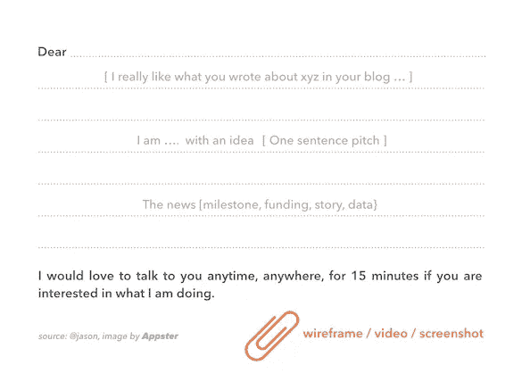
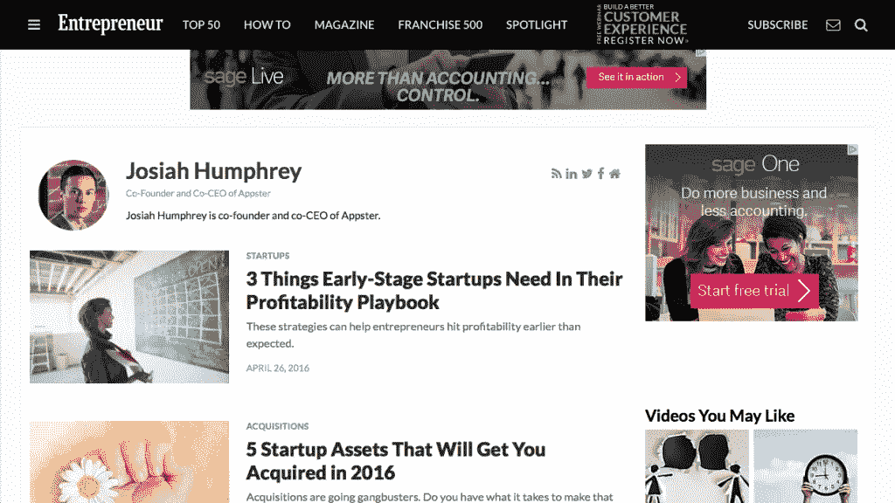
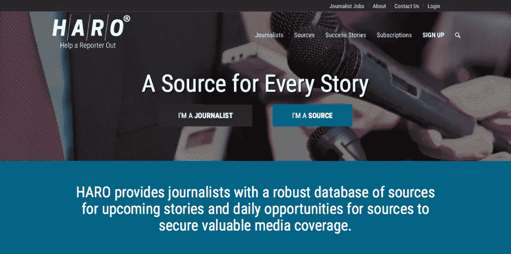

# 自举创业公司的 8 种公关策略

> 原文：<https://medium.com/swlh/8-pr-strategies-for-bootstrapped-startups-ad1e44b8d3d1>

Originally published on [http://www.appsterhq.com](http://www.appsterhq.com/?utm_source=CP&utm_medium=Medium)

公共关系(PR)是在 21 世纪建立成功企业的一个重要方面。

公关可以被定义为**战略沟通努力，旨在积极影响不同公众对你公司的看法和反应。公众的范围从客户、潜在客户、投资者到政府官员( [1](http://money.howstuffworks.com/business-communications/how-public-relations-works1.htm) 、 [2](https://www.cipr.co.uk/content/careers-advice/what-pr) 、 [3](http://apps.prsa.org/AboutPRSA/publicrelationsdefined) )。**

虽然大公司可以支付专业公关公司处理所有与公关相关的事务，但创业公司通常做不到这一点。

然而，新创公司可以使用各种策略来帮助他们建立积极的公共关系。

在这篇文章中，我将讨论 8 个这样的策略，并给出几个具体的例子，说明我们在 Appster 的初创公司如何利用公共关系。

但是让我们首先从基本要素开始:

# 你为什么要关心公关？

[贾芳·塔希尔拉马尼](https://www.fastcompany.com/3029616/5-reasons-pr-is-critical-for-your-startups-success)指出了公关影响初创公司的三种重要方式:

1.  **不积极宣传自己故事的创业公司**会成为别人讲述故事的牺牲品:“不管你的创业故事是平凡的、神奇的还是完全虚构的，如果你不坚持不懈地重申你是谁，媒体都会为你的公司编造自己的故事。”
2.  获得积极的公共关系既不容易也不能保证；这需要专注的努力，这就是为什么大公司经常雇佣全面的公关公司。
3.  **产品的成功和品牌信息的有效性之间的联系是这样的，培养一个特定的品牌需要你的明确关注，因为它不能简单地依靠直觉或偶然的、日复一日的尝试和错误。**

所以，为你的公司建立品牌意识不仅困难且耗时，而且如果你不“不畏艰险”地寻找自己的正面公关，注定会受到其他公众的影响。

此外，正如戴夫·霍奇曼所言，创业公司可以从良好的公关中获益，因为增加曝光率和权威认可可以帮助:

*   吸引新人才；
*   增加可见性，也许会增强对业务发展和经营业务的其他方面的支持；
*   提高筹款活动的曝光率；和
*   扩大客户获取和/或保留数量。

现在让我们来看看 8 个具体的策略，自筹资金的创业公司可以使用这些策略来增加获得积极公关的可能性。

# 1.设定一个具体的目标

为了制定一个成功的公关策略，新创公司创始人应该采用的第一个策略是明确决定一个或多个参与公关事务的具体目标。

换句话说，你必须问自己:

> 我想通过公司的公关计划实现什么目标？我们为什么要追求正面公关？

*   你的目标是将注意力吸引到**你的产品发布会**上吗？
*   来表示你想让**雇佣新员工**？
*   提高你的创业公司的知名度，从而鼓励更多的投资？
*   吸引人们对**在新地点**发布的关注？

这些问题的答案很重要，因为正如杰森·卡拉卡尼斯所说，

> “…你必须考虑你将推出什么类型的故事，以便确定你试图具体接触到谁。”

一旦你决定了一个或多个具体的目标，是时候开始一些实际的步骤了。

# 2.完善你的一句话营销

在你接触媒体或其他公众之前，你必须先准备好一个一句话的概述。

这个一句话的推销是故事的精髓，你可以用它来向你推销的对象“推销”你的公司。

记者和媒体的其他成员每天都会收到来自各种各样的人和组织的大量推销。

在为了从你的竞争对手制造的所有“噪音”中脱颖而出，你必须以一种清晰、简洁、有意义和令人信服的方式展示你的推销。

为了做到这一点，你必须能够用一句话总结出记者可能想要采访你和你的团队的主要原因。

避免流行词汇和不必要的技术术语。

相反，可以考虑使用如下所示的基本模板:

> 我的初创公司[insert]目前正在开发[insert]，以便通过做[insert]来帮助[insert]解决他们的[insert]，这一点很重要，因为[insert]。

无论您是否使用这个特定的推介模板，请确保您的一句话价值主张清楚地陈述了:

*   你所回应的主要问题，
*   你的目标人群(或市场的一部分)，
*   以及您提供的解决方案的独特价值。

# 3.联系媒体时的注意事项

作为前述策略的延伸，重要的是要指出，向媒体人员提交完整长度的推介时有各种注意事项。

做:

*   **个性化你的电子邮件**使用记者的名字，提及一篇或多篇你实际读过的她最近的文章，并清楚地表明你已经考虑了她是讨论你的创业的最佳人选的原因；
*   **讨论为什么**记者、她的出版物以及出版物的读者会对你的推销所涉及的问题感兴趣；
*   将你的演讲限制在不超过 5-7 句话的总长度内；
*   一次只主动追求一名记者，以显示你对她的工作足够尊重，不会把同样的广告发给她的几十名竞争对手；
*   **尝试使用不同的主题标题和不同的一句话间距**；使用分析软件确定电子邮件打开率和回复率之间的差异(如果有)；
*   **注意不同的时区**以确保您在适当的时间向媒体人员发送电子邮件；和
*   **礼貌地跟进并寻求反馈**:不要指望你的每一个推销都会自动产生一个故事；相反，与媒体人员跟进，并真诚地尝试从提供给你的反馈中学习。

不要:

*   **发出通用的推销词**，使用诸如“可能与谁有关”的语言，或者不显示任何证据表明你已经花了一些精力去考虑这个记者是最适合联系的；
*   **含蓄地或明确地暗示**该出版物将“有幸”报道你的公司；
*   写非常长、非常详细的电子邮件，充满不必要的背景信息和/或夸张的语言
*   **同时向无数期刊/编辑/出版物发送相同的广告词**，特别是因为媒体的成员经常相互认识和交谈；
*   随意发送电子邮件，不考虑时区或故事截止日期；或者
*   通过发送大量主动跟进信息和/或请求重新考虑来纠缠记者或编辑。

这里是杰森·卡拉卡尼斯的视频，提供更多关于这些重要的该做和不该做的有用信息。

有效的推介模板示例——简短、清晰，包含所有重要的关注领域:

# 4.做你的研究，战略性地寻找资源

(image [source](http://www.freepik.com/free-photo/man-reading-a-book-education-academic-learning-and-exam-concept_1211532.htm))

曾经有一段时间，在创业世界里——嗯，也许即使在今天，对大多数创始人来说也是如此——每个新公司都争相让 TechCrunch 写一篇关于它的报道。

对于许多创业公司来说，TechCrunch 上的一个故事确实可以带来显著的关注和各种好处。

然而，对 T2 和其他人来说，在 TechCrunch 上写文章即使有意义，也是微乎其微的——尤其是如果他们主要在科技行业之外的 T4 运营的话。

不要仅仅瞄准前 100 个科技博客，而是要找出你的理想用户/客户最常阅读的确切平台。

同样，不要浪费时间向错误的人推销；相反，把你的创业公司和真正合适的记者联系起来。

因此，你必须做充分的研究，以确定哪些博客、报纸、其他出版物和记者覆盖了你所经营的特定领域和市场。

Buzzsumo 是一个很受欢迎的网站，可以帮你做到这一点。

# 5.列出记者和编辑的名单

(image [source](http://www.freepik.com/free-photo/journal-student-female-writer-letter_1145781.htm))

当你开始通过了解最适合你的特定公关目标的特定出版物来缩小范围时，开始收集姓名和联系信息以备将来使用是很重要的。

你可以在一个基本的电子表格或一个简单的客户关系管理(CRM)软件中存储姓名和联系方式(最好是电子邮件地址和个人网站，但如果不是 Twitter 账户)。

[Cision](http://www.cision.com/us/) 、 [JustReachOut](https://justreachout.io/) 、 [PressFarm](https://press.farm/) 和 [PressFriendly](http://www.pressfriendly.com/) 是初创公司常用的一些工具，用于帮助企业出于公关目的与记者和其他人联系。

# 6.不要只考虑产品发布

(image [source](http://www.freepik.com/free-photo/worker-reading-news-with-tablet_934102.htm))

成功的公关营销是一个持续的过程，而不是一次性的成就。

作为一名初创公司的创始人，为了充分利用正面的媒体报道和新闻故事，你的思维必须超越产品发布。

你的公司和新产品的推出无疑是巨大的成就，你确实应该尽可能多地寻找合适的公关报道。

T 然而，创业运营的许多方面都可以成为向媒体人员推介的合适时机，包括:

*   **宣布**新一轮投资；
*   **展示**新产品功能和/或公司服务；
*   **揭露和直面**行业/市场的重要变化；和
*   **发布**关于您的客户、他们的问题和/或您的解决方案的令人兴奋的新数据。

记者和编辑喜欢数据，所以在向他们推销时一定要记住这一点。

# 7.客座博客

除了让记者写一些关于你的创业公司的故事，通过主动提出撰写客座博文，直接推销主要的商业杂志和网站，如[Forbes.com](https://www.forbes.com/)、[Inc.com](https://www.inc.com/)、[Entrepreneur.com](https://www.entrepreneur.com/)和[Fastcompany.com](https://www.fastcompany.com/)，这也是一个不错的主意。

如果你刚刚开始创业之旅，这可能有点困难，但随着你积累更多的经验，你无疑会收集越来越多的真实故事，这些故事可以成为吸引人和有趣的文章的基础。

以下是我如何将我们的一些应用程序故事带给企业家的一个例子:

# 8.反向俯仰

为你的创业公司争取正面公关的最后一个策略是，让记者找到你，而不是你自己去找他们，从而扭转整个过程。

像[帮助记者(HARO)](https://www.helpareporter.com/) 、 [ProfNet](http://www.prnewswire.com/profnet/) 和 [SourceBottle](http://www.sourcebottle.com/) 这样的网站允许记者提交来源请求。

这是 HARO 的主页:

作为初创企业的创始人/成员，你有机会回应这些请求，并与记者联系。

//

## 感谢阅读！

# 如果你喜欢这篇文章，请随意点击下面的按钮👏去帮助别人找到它！

> 最初发表于[http://www.appsterhq.com](http://www.appsterhq.com/?utm_source=CP&utm_medium=Medium)

