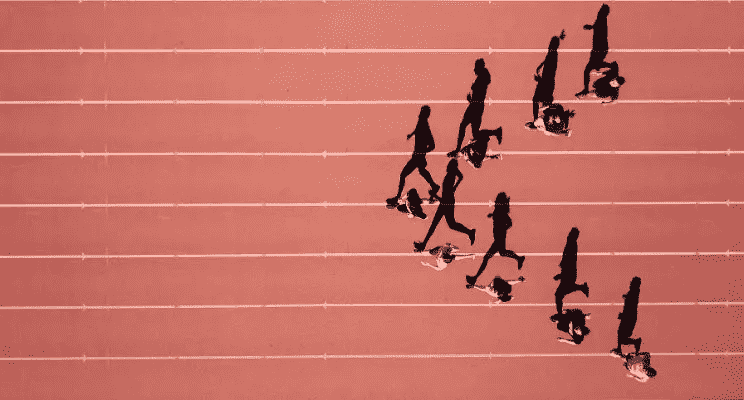
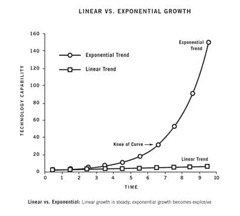

# 在竞争激烈的领域成为第一名的 8 条原则

> 原文：<https://medium.com/swlh/8-principles-to-become-1-in-a-crowded-field-of-competitors-ebb6eb7f9989>

> “战斗是人类可以沉迷其中的最壮丽的竞争。它带来了最好的一切；它去除了所有的基础。”乔治·S·巴顿将军

我意识到我需要尽我所能成为我所在领域的佼佼者。

当然，怀疑开始了。

“但他们已经是这个领域的老大了”。

“他们拥有所有的市场份额”。

“他们写得很好，已经赚了几百万了。”

“为什么其他人会去找我而不是他们”？

我的任务是(现在仍然是)令人生畏的，但是我需要知道方法。

“但他们是博士”。

“他们的工作比我的好得多”。

在通往我的领域的道路上，我必须克服的所有想法——虽然我不在外部，但我在内部，并以此行动。

这是成为你所在领域的领导者的方法——这篇文章将向你展示我的发现和超越我的市场领导者的旅程——所以你也可以。

与你所在领域的其他人竞争可能会很难，看到行业中的最佳表现也会让人望而生畏——尤其是如果你是从底层开始的话。

你在哪里符合标准？

#1 之后怎么走？

当观察一个领域的竞争对手时，有很多角度需要考虑——从你和你的心态开始，这是最重要的部分。

[计划做到最好，](/swlh/if-you-arent-doing-these-7-things-you-re-on-your-way-to-mediocrity-91e97b0a9ffa)相信这是可能的——**采取行动加入拥有 80%市场份额的 20%的竞争对手是目标**。

如果你注意到下面指数增长曲线的终点——最后 20%的时间给了你 80%的增长。

这是你需要关注的[黄金法则](https://en.wikipedia.org/wiki/Pareto_principle)。通往前 20%的道路是漫长的，但决定你想在这条路上走多快取决于你自己。

如果你想加速到 100 英里/小时，[和我预约一次辅导电话](https://calendly.com/aramtaghavi8)。

**这是大多数人的个人发展和他们设定的外部目标中最大的漏洞——无论是工作、财富、幸福还是关系——都是因为他们自己。**

你不会直接挑战第一名——你每天都在挑战他们— [专注于赢得日积月累的胜利](/swlh/if-you-arent-doing-these-7-things-you-re-on-your-way-to-mediocrity-91e97b0a9ffa)。

尤其是在早期，与竞争对手相比，是增长率和改进率，而不是总体结果。

如果他们像脸书或追随者一样以每天 2%的速度增长，你需要达到 3%。

最终，通过正确的规划和工作，你将创造一个职位，一个[“蓝海”](https://en.wikipedia.org/wiki/Blue_Ocean_Strategy)来领导一部分买家，并成为整个市场的领导者。

它最终实际上是第一、第二还是第三真的无关紧要(但那是另一个更技术性的帖子)。只要你在占有 80%市场份额的前 [20%的利基市场中占有一席之地，你就被认为是你所在领域的领导者。](https://calendly.com/aramtaghavi8)

以下是一些原则，如果付诸实践，将会让你走上你所在领域的巅峰。

# 1.与自己赛跑并设定基调(比其他人都要快)

> 你每天都有竞争，因为你为自己设定了如此高的标准，以至于你每天都必须出去并达到这个标准。”—迈克尔·乔丹

首先要坚持不懈地遵循你自己的标准，并与自己赛跑来提高它们。

监控它们，衡量它们，并对目标和结果负责。如果你真的很认真，向某人报告——最好是你付钱让你负责的人。

如果你想让我作为你的教练为你做这件事，请点击我的日历，点击这里。

最重要的是这个— **你对自己的目标有多专注，你对自己的工作有多热情******。在一起，他们是一股强大的力量。****

**你被一种成长心态所驱动，这种心态本身就在与进步赛跑。终点线永远不会正式到来，但你会知道你什么时候到达了，因为你是你所在领域的大师，再也不用担心钱或“成功”之类的事情了——因为，嗯，你知道什么是“成功”，并且已经成功了。**

**你只是在和贪婪的热情带来的富足一起工作——所以你一生中再也不用工作一天了。**

**这给你的活动制造了紧迫感，并关注和强调了你自己的成长和发展。**

**(在你心中)为你的市场设定一个新的基调。**

**他们跟得上你，你跟不上他们(尽管你会对他们进行大量的侦察)。**

**从这里开始制定你的[活动计划](/swlh/if-you-arent-doing-these-7-things-you-re-on-your-way-to-mediocrity-91e97b0a9ffa)。**

**如果你想让我帮你制定活动计划，请点击这里的[查看我的日历](https://calendly.com/aramtaghavi8)来发现你的不足之处，以及如何在我的指导下重新设定你的目标。**

# **2.不要向潜在客户销售—打破界限，吸引合适的潜在客户**

> **“狮子不会一下子追上整个兽群，他会等到看到合适的那只从兽群中分离出来——然后他会致力于杀死一只。”—山姆·奥文斯**

**做那些感觉不安全和别人不会说的事情——100 个相信和尊重它的人中有 3 个是你要找的人。**

**最重要的是，他们是现在愿意追随你并向你购买的人。**

****试着不去得罪或冒犯将会导致不太理想的前景——和合适的前景交谈是你想要的。****

**是三个喜欢你说的话，你想与之交谈，而不是十个只是喜欢。**

**要成为一名变革推动者，不要害怕违背自己的意愿——你就像一个(好的)狂热分子，在你的部落中寻找其他(好的)狂热分子。和你一样狂热的人。**

**伟大的先驱是基于一个秘密或大众不愿意看到、大声说出来或承认的东西——直到它被大多数人接受。**

**这就引出了前景。**

**如果你害怕发表某样东西，你就是在分割你的市场，寻找合适的前景——发表。**

**如果你害怕一条营销信息，你就在分割你的市场，寻找合适的前景——把它推出去。**

**在 21 世纪初至中期，美国服装公司制作了有争议的广告，其中许多被禁止。它让很多人望而却步，但喜欢它的反叛者以越来越快的速度被吸引进来，这些衣服被卖给合适的人。**

**如果你因为对一个潜在客户的大胆推销而感到害怕，你就是在分散你的市场，寻找正确的潜在客户(或者推开错误的潜在客户，而这正是你想做的)。**

**我正在为潜在客户制作一个培训视频，并利用我可以通过辅导提供的核心语言和大胆承诺，将我认为我们人类能够做到的事情推向极限[——这将使一些人却步，但我知道会吸引那些想要提高标准的大胆成功者(像我一样)。如果有兴趣，请点击这里查看我的日历——我保证它会让你大吃一惊。](/swlh/the-surprising-secret-to-changing-the-world-dd4d2519f940)**

**人们尊重说别人不会说的真话，也尊重说不受欢迎的话的人。**

**请记住，你是在试图分割市场，找到 3%的大胆的人，他们现在就准备购买，他们相信你所相信的。**

**不要试图吸引每一个顾客，而要试图迫使有积极性的顾客走出困境。**

**请记住，市场是自然选择的外在表现——人类心灵的欲望和恐惧表现为他们需求和欲望的货币价值。**

# **3.制定一个计划，成为你所在领域的第一名**

> **“如果你不打算成为最好的，你就打算成为平庸的，就这么简单。”—我**

**如果你不知道市场是如何运作的，并且盲目攻击市场——你是在为平庸做准备[。](/swlh/if-you-arent-doing-these-7-things-you-re-on-your-way-to-mediocrity-91e97b0a9ffa)**

**如果你不知道增长曲线是如何工作的，并试图盲目增长——你是在[为平庸做准备。](/swlh/if-you-arent-doing-these-7-things-you-re-on-your-way-to-mediocrity-91e97b0a9ffa)**

**如果你不知道潜在客户转变的频率——你就在为失望、沮丧和平庸做准备。**

****如果你不知道用什么标准来衡量**，你就是在[计划平庸](/swlh/if-you-arent-doing-these-7-things-you-re-on-your-way-to-mediocrity-91e97b0a9ffa)。**

**例如，许多企业家/作家等。(任何需要增长的东西都是一切)，当他们遇到一系列要销售的潜在客户或他们想订阅时事通讯的受众时，他们很快就会泄气。**

**当他们没有看到他们立即开始转变时，他们认为他们失败了，需要做一些不同的事情。**

**他们需要的是提高，而不是做一些不同的事情。**

**这通常会导致快速的沮丧和太快的转变。大多数人没有意识到，只有大约 3%的市场愿意购买你现在拥有的东西。**

**这是假设他们是完全正确的前景。这里显然有可变性，但你得到了要点。**

**所以在写作中，需要 100 个合适的人来阅读你的文章，有 3 个(或者 5 个或 10 个)订阅。**

**让 100 个人阅读需要什么？大概有 1500 次浏览或关注？我不确定，但你明白这一点。**

**你需要深入市场，接触大量合适的人，以 3%的市场份额转化销售，这些人现在就准备购买。**

**这就是为什么我决定开始在我的文章营销。**

**当我认为这可能会惹恼很多人并失去读者时，我意识到这些人是我无论如何都要赶走的，因为他们是我作品的错误消费者，更不用说买家了。**

**我想吸引那些对我的营销信息和努力欣喜若狂的大胆的少数人。如果那是你，并且你已经准备好认真对待你的目标，点击我的日历。**

# **4.比其他人成长得更快**

> **"总会有人想要打败你。"马克·库班**

**比别人成长得更快并不是要求你让成长之神降临，让它像下雨一样成长。我**

**这是关于你对市场的态度，抓住每一寸，每天增长一点——随着时间的推移而复合。**

**最重要的是，它每天产生的紧迫性和活动性。**

**随着持续的增长和一些创新性实验的集中策略，你会有增长之神每隔一段时间为你做一次，无论是为你赢得 80%订户的[病毒式文章还是你最终开发的](/the-mission/this-5-minute-daily-habit-will-get-people-to-treat-you-how-you-want-to-be-treated-be5cf1a52828)营销渠道。**

**凭借[持续如饥似渴的工作](/swlh/the-surprising-secret-to-changing-the-world-dd4d2519f940)，他们总是这样做。**

**平均增长曲线是这样的:**

**达到 10 个订阅者/用户是极其痛苦的。**

**达到 30 个订户/用户是极其痛苦的。**

**流行到 70–100 个订户/用户。**

**达到 150 个订户/用户是极其痛苦的。**

**达到 200 个订户/用户是极其痛苦的。**

**增加到 500 或 1000 名订户/用户。**

**达到 1100 个订阅者/用户是极其痛苦的。**

**达到 1200 个订阅者/用户是极其痛苦的。**

**Pop 达到 3，000 个订户/用户。**

**达到 3300 个订阅者/用户是极其痛苦的。**

**达到 3500 个订阅者/用户是极其痛苦的。**

**Pop 达到 8，000 个订户/用户。**

**无论你的目标是什么，你成长的 80%通常来自你成长曲线的最后 20%。**

**所以你的工作是设定一个目标，并坚持到你达到增长曲线的 80%,直到它弹出最后的 20%,产生最后最大的 80%的增长。**

**就我而言，我正努力在今年年底达到 150，000 名订户，我现在大约有 1，000 名订户，并以每天 2-5%的速度快速增长，因为我已经将发布量增加到每天两次。这是很难维持的，所以我们会看看它是否有意义。**

**我经历了极度的痛苦才达到 30 个用户，然后一下子达到 150 个。**

**到 200 岁时极度痛苦，然后以稳定的速度增长到我现在的位置。**

**为了更深入地挖掘你自己的目标，无论是写作、商业还是生活，请一位已经完成了你想做的事情的教练来加速你的步伐。这将是你花得最值的一笔钱。**

**如果你确信这是我的日历，那就跳上来吧。**

# **5.在增长率上击败你所在领域的领导者，而不是总体增长**

> **“没有竞争是一件坏事。竞争让你一直努力提升自己。”—舒淇**

**自从我开始全职写作和咨询，我每天都在关注我的英雄、导师和灵感来源本杰明·哈代——因为他是我所在市场的头号人物。**

**我已经很幸运得到了本的指导——他的工作和轨迹是我想要效仿的。看到理论被成功地付诸实践，对你的信念和信心是如此强大。**

**如果你想模仿我正在做的事情，除了跟随我来到这里，让我做你的教练，[跳到我的日历上](https://calendly.com/aramtaghavi8)讨论你的目标。**

****执行就是一切，知道什么都不是。****

**哈代一周出版两次，我一天出版两次。**

**如果他要休假，我正在想办法。如果他每天冥想 20 分钟，我就冥想一个小时。如果他一天发 4 条微博，我一天发 14 条。**

**我的最终目标是让我的增长率高于他。如果我拿他的 170 公里跟我的 3 公里比，我就完了。**

**因此，如果他的用户从目前的 17 万增长到大约 17.5 万(大约 2.5%)，我希望用户从 26 万增长到 27 万(大约 3%)。**

**我每天都跟着他的追随者一点点——这样他们就能跟着我回来——[抓住我能抓住的每一寸。](/swlh/if-you-arent-doing-these-7-things-you-re-on-your-way-to-mediocrity-91e97b0a9ffa)**

**这种专注程度将树立一个高标准，让其他人刮目相看，并确立你的地位——这将有助于加速你的成长，并让你处于竞争心态[中，为赢得](/the-mission/this-one-daily-reading-habit-will-make-you-who-you-want-to-become-540a6cf7632)的习惯而优化。**

**我还没有达到我的数字，但我认为我已经遥遥领先了。我已经到达了最终目标点，我只是采取行动让自己到达目的地——这是自动驾驶。**

**通过与我安排一次辅导电话来[诊断你的表现](https://calendly.com/aramtaghavi8)，了解如何加快你自己的旅程。**

# **6.通过在自己身上多下功夫来掌握你的手艺**

> **"我有太多的事情要做，我需要祈祷 3 个小时才能做完。"小马丁·路德·金博士**

**无论我在做什么，无论是在兼职写作的同时经营一家公司，还是像我现在这样全职写作和咨询，我越是赋予我的实践价值和意义，无论是什么实践，我都会做出更好的工作。**

**每天每时每刻的反馈创造了更好的注意力、更深入的工作和更好的习惯。我沉思更多，阅读更多，主动休息更多。**

**这种情况每天都在增加，并且还在继续增加，现在当我写这篇文章时，我正在以指数速度增长。**

**无论是你的日常工作、副业还是创造性工作，**重要的不是你做什么，而是你如何做。****

**本杰明·哈代不是媒体领域的头号作家，因为他是最好的心理学博士，媒体领域有成百上千的心理学博士。**

**你认为是什么？**

**这是他的习惯和每天对这些习惯的承诺，也是他赋予自己生活的[意义。](/the-mission/how-to-live-a-full-life-31e23203f265)**

**他四处传教，创造他需要的环境来加速和确保成功。**

**他拥有他所需要的一切，因此他拥有了更多，并且得到了巨大的回报。**

# **7.向你所在领域的大师们学习**

> **“教育、学习和教练之间的区别在于，教练的直接目的是在现实世界中提供更快的结果。”—我**

**我已经在教练、教育、书籍、课程和知识上花费了数万美元。**

**手把手的深入辅导，每次打 90 分钟电话，与一位已经完成的大师一起研究你的问题并提出解决方案，你想做的无疑是你能花的最有价值的钱。**

**你会学到其中的秘密、细微差别，最重要的是——避免大量的错误和陷阱。**

**当我想学东西的时候，我会去获取我能得到的最好的建议。这是我花钱买的建议。**

**当我想学习出版方面的知识时，我雇佣了 Ryan Holiday 做咨询电话，我做了几个电话来征求他的意见，我们一起写了我的书《战略》。**

**在那些电话中，我学到了我需要知道的关于出版业的全部知识(为了我当时的利益),这些知识比我花在四处挖掘和询问别人身上的还要多。**

**大多数人认为无效的“研究”。**

**实际上节省了我几年的时间，教会了我一些除了畅销书作家可能会告诉我的事情之外，我在其他任何地方都学不到的东西——尤其是他自己是罗伯特·格林(Robert Greene)的教练，罗伯特·格林是另一位大师，也是畅销书《权力与掌控的 48 条法则》(48 Laws of Power and mastership)的作者——可以说是这些主题的最佳书籍。**

**更好的是这些电话打开了大门。在 Ryan 的帮助下，我们发现了他所做的重要介绍，这些介绍让我的作品得以出版，我们现在有了一种值得信赖的工作关系。**

**每当我准备好工作，我可以点击他让我去我需要去的地方，当谈到我的书和出版目标时。**

**除了我的教练消费，我现在正在上世界上最好的咨询教练——Consulting.com 的 Sam Ovens 的咨询课程，它让我兴奋不已。**

**到目前为止，本杰明·哈迪、瑞安·哈乐迪和现在的山姆·奥文斯之间的三对三教练让我大吃一惊。**

**即使在从一个世界知名的初创实验室创办了一家公司，筹集了 7 位数的资金，建立了一个产品和 8 人的团队之后，当我决定开始一项咨询实践时，我参加了(并且仍然在参加)Consulting.com 为期六周的沉浸式项目。**

**这是我花的最值的 2000 美元。**

**除了是今天开始一项实践的绝对最好的 A 到 Z 培训之外，它让我保持敏锐，并教会我一个新的视角，而不是我过去习惯的由风投支持的硅谷初创企业。**

****大师们总会分享一些秘密，而这些秘密只有在你不断尝试和犯错达到他们的成功水平后，你才能学到——而这通常需要大量的时间、金钱和学习。****

**为什么不花几千块钱从大师手里抢呢？**

**在顶端竞争的细微差别，你不能从别人那里学到的英寸和大师们教给你的技巧和诀窍是无价的。**

**我在一次战略电话会议上告诉某人，当他们发表他们的作品时，为营销、战略和写作创建三个不同的清单。他们写的每篇文章的清单。**

**从零开始，这位新作家得到了一个专业提示，立即提高了他的表现，并节省了他开始努力“比赛”的时间。现在，他从第一天开始就努力比赛，如果他能做到那一步，他可能会在几年后开始使用清单。**

**[向大师学习，并为此付出代价](https://calendly.com/aramtaghavi8)——这是你花的最值的钱。**

# **8.不要喝酒**

> **"避免使用香烟、酒精和毒品来替代成为一个有趣的人."—玛丽莲·沃斯·莎凡特**

**酒精正在扼杀你的表演，好像你不知道。如果你认为你的周末休息时间包括出去狂饮到凌晨 3 点，甚至一周一次都不会在接下来的周三击垮你，那就是了。**

**如果你认为你名义上但经常性的饮酒不会影响你的大脑容量和集中注意力的能力，那就是影响了。这影响了对你的成功至关重要的深层工作。**

**当然，这并不妨碍你做深度工作，但是完全不喝酒的区别是惊人的。**

**是的，我们可以找到各种各样的研究来满足饮酒的任何假设，所以我不会在这里包括任何研究，因为你可以自己找到它们。**

**但是作为一个曾经喝很多酒，然后喝一点，现在完全不喝酒(过去 5 年)的人，这是我注意到的对我日常表现的最大改进。这和我的间歇性禁食饮食(每天吃一顿大餐，而不是 3 顿)是我每天 12-16 小时获得大量能量的真正秘密武器。**

**这是一个重要的竞争优势**

**我真的一直生活在快乐的日子里，感觉很好，沉思很深。每一天都感觉像是天堂，甚至写这篇文章都让我感觉自己站在世界之巅，让这个星球变得萧条。**

**我的室友每年一月都戒酒，并反复告诉我这是他一生中表现最好的一个月。试试看。**

**如果你想让我帮忙，就在这里叫我[。](https://calendly.com/aramtaghavi8)相信我的话，不喝酒。如果你想帮助克服这个习惯，我[在这里指导你](https://calendly.com/aramtaghavi8)。**

# **结论**

**竞争看似激烈，但当你掌握了正确的原则，并带着达到顶峰的意图出现时，竞争并不激烈。**

**[大部分都是平庸的](/swlh/if-you-arent-doing-these-7-things-you-re-on-your-way-to-mediocrity-91e97b0a9ffa)，没有多少达到炉火纯青。**

**如果你将正确的原则付诸实践，[带着贪婪的热情工作，](/swlh/the-surprising-secret-to-changing-the-world-dd4d2519f940)每天轻松超越竞争对手——作为一种习惯，这变得很自然，而不是很难。**

**这是大师们的秘密。本杰明·哈代不是每天都“努力工作”，他已经掌握了原则，现在对他来说很容易。**

**我不努力工作，我有[如饥似渴的热情](/swlh/the-surprising-secret-to-changing-the-world-dd4d2519f940)——**这使我走向****【1】的旅程的** [**经历充满了乐趣，而不是苦差事和典型的“竞争”——因此我从不工作。**](/the-mission/how-to-live-a-full-life-31e23203f265)**

**尽管我正在建立自己的订户群并为客户提供咨询，但我现在的经营方式就好像是我所在领域的第一名，这是因为我是在与我所在领域的第一名领导者对抗。**

**这是从底层获胜的秘密，如果你实践并执行正确的原则，你会变得容易。**

**动手吧。**

**如果你准备好投资并加速你的进步，请与我合作。不管怎样，我祝你一路顺风。**

****

## **每周一次点击接收我承诺的改变游戏规则的文章，这是你在互联网上其他地方找不到的。你还会收到我的指导，告诉你如何在你所做的事情上成为世界上最好的。你不会后悔的。**

****

## **这篇文章发表在[《创业](https://medium.com/swlh)》上，这是 Medium 最大的创业刊物，有 281，454+人关注。**

## **订阅接收[我们的头条新闻](http://growthsupply.com/the-startup-newsletter/)。**

****